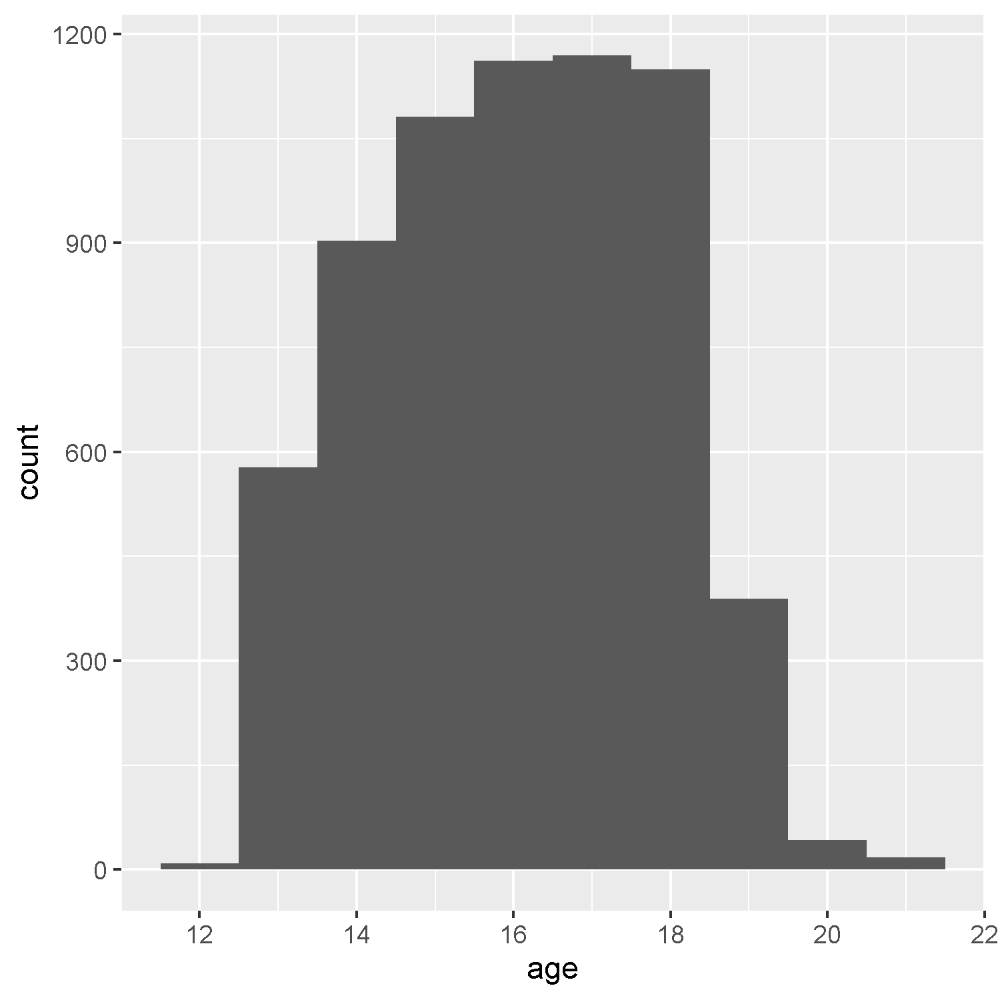
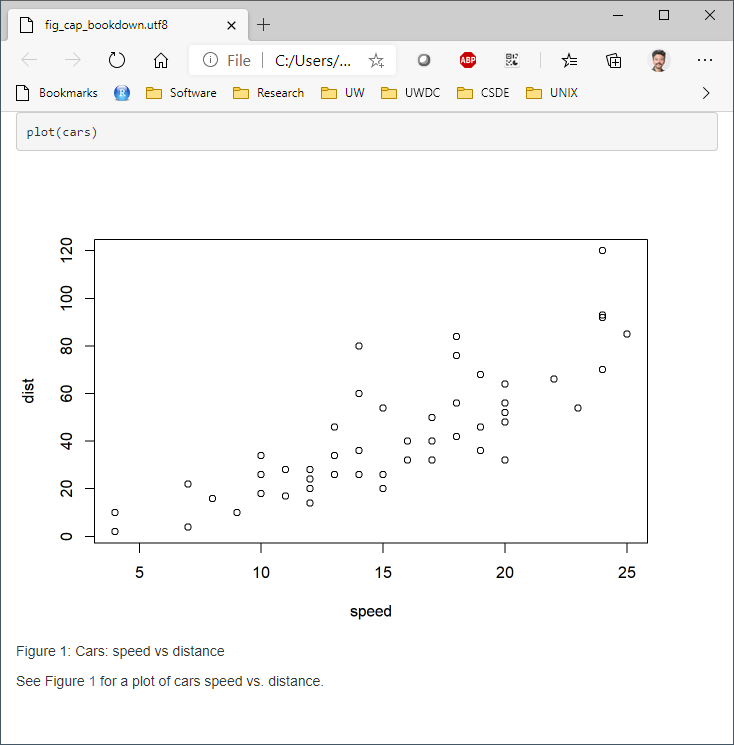
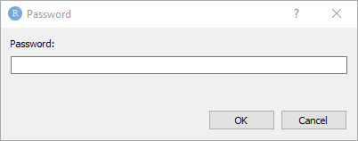

# Week 2 {#week2}

This session covers the basics of creating R Markdown documents. We will also cover the [Keyring](https://cran.r-project.org/web/packages/keyring/index.html) package for securely storing passwords and other secrets that one would not want to hard-code into R documents. Finally, we will introduce the Human Mortality and Human Fertility databases that will be used in CSDE 533.

For this class session, we will be building up an R Markdown document using various code chunks copied and pasted from this page.

Download the file [week02.Rmd](files/week02/week02.Rmd) and use that as the base. Change the second line in the YAML header so it uses your name and your web site. See [UW Students Web Server](https://students.washington.edu/) if you do not have a web site.

```{r, echo=FALSE, warning=FALSE, message=FALSE}
pacman::p_load(tidyverse, magrittr, knitr, kableExtra, readstata13, stargazer, pander, captioner, keyring, HMDHFDplus, flextable)

# captions
figure_nums <- captioner(prefix = "Figure")
table_nums <- captioner(prefix = "Table")

# path to this file name
if (!interactive()) {
    fnamepath <- current_input(dir = TRUE)
}
```

<h2>Topics:</h2>
* [Code chunks in R](#rmdcodeblocks)
* [Graphs in R Markdown](#rmdgraphics)
* [Tables in R Markdow](#rmdtables)
* [Equations in R Markdown](#rmdequations)
* [Captions and cross-references in R Markdown](#rmdcaptions)
* [Keyring for storing passwords and other secrets](#keyring)
* [Data sets:](#datasets002)
    * Data:
        * Human Mortality Database
        * Human Fertility Database


## Code to run for the in-class exercise

```{r, echo=FALSE}
# generate the R code to run in class
# O <- knitr::purl(input = "02-week02.Rmd", output = "r_code/week02.R", quiet = TRUE, documentation = 1)
```

For the exercise in class, download [week02.R](r_code/week02.R), which we will use to run the code listed in this R Markdown result.

## R Markdown 

### Code chunks {#rmdcodeblocks}
Code chunks are blocks of text that include R code. As the R Markdown file is rendered, the code is run. The code can run R routines to perform any number of tasks, including analytics, printing tables, and generating graphics. Anything you would do in a regular R file can be placed in the code chunks. Code chunks can print outputs (tables, figures), but they do not necessarily always do; for example, your code could generate a summary of a raw data set, export to a CSV file, and zip the CSV file. You could then "manually" print a hyperlink in your output.

In RStudio, a code chunk can be added to an R Markdown source file with the keystroke combination CTRL-ALT-i


#### Code chunk structure

Code chunks are designated by delimiting the code with the characters ` ```{r}` to open the block and ` ``` ` to close the block.

There are a number of additional options that can be included in the `{r}` opening delimiter, see [Chunk options and package options](https://yihui.org/knitr/options/). Many options are set by default and require being set explicitly to select any option other than the default.

For example, the code chunk can be not run with the `eval=FALSE` option. Or if the code chunk generates a graphic, the `fig.cap` option can be used to print a caption.

For example, the following code chunk creates a single element vector `a` with the value of `2`.

````
```{r, eval=TRUE}`r ''`
a <- 1 + 1
```
````

### Inline code
```{r, echo=FALSE}
# read this for later
etdata <- read.csv("https://raw.githubusercontent.com/teuschb/hr_data/master/datasets/turnover_babushkin.csv")
```

Inline code is designated using this type of syntax `` ``r ''`r R_CODE` ``, where `R_CODE` represents a statement to be evaluated and printed inline. 

For example, to get the mean age from the Babushkin data, the `R_CODE` would read

```md
mean(etdata$age) %>% round(1)
```

That is, in the document one would write:

```{md}
The mean age of the subjects in the Babushkin data was `r mean(etdata$age) %>% round(1)` years.
```

which renders to 

```
The mean age of the subjects in the Babushkin data was `r mean(etdata$age) %>% round(1)` years.
```

### Graphics in R Markdown {#rmdgraphics}
Data-driven graphics in Rmd files are typically created as base R graphics or with the `ggplot2` package. This tutorial is not intended to provide anywhere near a comprehensive treatment of creating graphics from data, but will provide instruction on some options for creating and including data-driven graphics as well as inserting graphics from image files.

See [Tips and tricks for working with images and figures in R Markdown documents](http://zevross.com/blog/2017/06/19/tips-and-tricks-for-working-with-images-and-figures-in-r-markdown-documents/) for a good explanation.

#### Base R graphics
To include base R graphics, simply place the code to generate the graphic in an R code block, e.g., using the Add Health data from last week ([AHWave1_v1.dta](data/AHwave1_v1.dta)):

```{r, comment='', echo=FALSE}
cat(readLines("files/week02/rmd_insert_text_01.txt"), sep = "\n")
```

... which will render the graph:

```{r, echo=FALSE, warning=FALSE}
# since loading the data takes awhile, only load the data if necessary -- won't load if it was done already
if (!exists("dat")) {
    dat <- read.dta13("https://csde-uw.github.io/csde502-winter-2022/data/AHwave1_v1.dta")
}
# birth year = h1gi1y
# drop "Refused" birth year
# for birth year and interview year, replace anything before white space, convert to numeric
# subtract interview year - birth year
ages <- dat %>%
    filter(!str_detect(h1gi1y, "Refused")) %>%
    select(iyear, h1gi1y) %>%
    mutate(
        yi = str_replace(iyear, ".*\\s", "") %>% as.numeric(),
        yb = str_replace(h1gi1y, ".*\\s", "") %>% as.numeric(),
        age = yi - yb
    )
hist(ages$age, xlab = "age (years)", las = 1)
```

#### `ggplot2` graphics
The `ggplot2` package creates compelling graphics that use a common syntax. The main difference between base R graphics and `ggplot2` graphics is that simply issuing the `plot()` or related command (e.g., `hist()`, `barplot()`) adds the graphic to the output, whereas with `ggplot()` it is necessary to issue a command that prints the graphic.

Following the previous example:

```{r, comment='', echo=FALSE}
cat(readLines("files/week02/geom_histogram.txt"), sep = "\n")
```

```{r, echo=FALSE}
# how many unique bins?
bins <- length(unique(ages$age))

# create the graphic
g <- ggplot(data = ages, mapping = aes(x = age)) +
    geom_histogram(bins = bins)

# print the graphic
print(g)
```

The following code generates a box plot from the Babushkin employee turnover data. Because the code chunk includes `fig.cap = "Box plot of Babushkin data, self control by profession"`, a caption is automatically placed below the figure.

```{r, comment='', echo=FALSE}
cat(readLines("files/week02/babushkin_boxplot.txt"), sep = "\n")
```

```{r, fig.cap = "Box plot of Babushkin data, self control by profession", echo=FALSE}
ggplot(data = etdata, aes(x = reorder(profession, selfcontrol), y = selfcontrol)) +
    geom_boxplot() +
    coord_flip()
```

#### Embedding graphics files
Journals frequently require graphics files to be submitted separately from the manuscript. In this case, the graphic can be created and saved as a file and then inserted in the Rmd using code, but also accessed as a a stand-alone file. Let's take the previous example, but add correlation coefficients and other embellishments, create a graphics file and add the graphics into the Rmd.

The base graphics file is created using the `pdf()` function, although `png()` also works if that is the desired output format. PDF is a vector format, so it generally renders better over different zoom levels.

```{r, message=FALSE}
pdf(file = "ah_age_hist.pdf", width = 5, height = 5)
hist(ages$age, xlab = "age (years)", las = 1)
x <- dev.off()
```

Here we create a PNG format file:

```{r, message=FALSE}
png(file = "ah_age_hist.png", width = 5, height = 5, units = "in", res = 300)
hist(ages$age, xlab = "age (years)", las = 1)
x <- dev.off()
```

`ggplot2` graphics can be saved using `ggsave()`, e.g., for both PDF and PNG outputs. The `dpi` argument is important for bitmap images because it sets the dots per inch, which controls the size of the graphics file.

```{r}
ggsave(
    filename = "ah_age_hist_ggplot.pdf",
    plot = g, device = "pdf",
    width = 5, height = 5
)
ggsave(
    filename = "ah_age_hist_ggplot.png",
    plot = g, device = "png",
    width = 5, height = 5,
    units = "in", dpi = 300
)
```

Graphics can be added using several methods.

##### `knitr`
The `knitr::include_graphics()` function can be used to insert image files, with the caution that inserted PDF files may produce unwanted results. The syntax is:

```{r, comment='', echo=FALSE}
cat(readLines("files/week02/rmd_insert_text_02.txt"), sep = "\n")
```

and the code chunk can include `out.width`, `out.height` and other options after the `r` in the first line of the chunk,
\  
Here we insert a PDF with no code chunk options, which presents the image with a scroll bar, rather than the full image:

```{r}
include_graphics("ah_age_hist.pdf")
```

Here we specify in the code chunk options `out.height = "360px", out.width='360px', fig.align='left'`, 

```{r, out.height = "360px", out.width='360px', fig.align='left'}
include_graphics("ah_age_hist.pdf")

```

\  

... and with code chunk options `out.height = "400px", out.width='100%', fig.align='left'`

```{r, out.height = "400px", out.width='100%', fig.align='left'}
include_graphics("ah_age_hist.pdf")
```

\  

It seems that embedding PDF files is not optimal.

Here we insert a PNG: with no code chunk options:

```{r}

```

and with code chunk option `out.width = "50%"`

```{r, out.width = "50%"}

```

So embedding bitmapped images appears to work better than embedding PDF files. 

##### Markdown: ``

The native Markdown syntax:

```

```

includes a graphics file with an optional caption, e.g., here, a PDF with no caption, 

``


\  

The structure `` indicates this is an inserted graphic; a caption can be specified by including text within the square brackets, e.g., displays the caption below the inserted image (but with no caption number!). 

``````


... although it seems that inserting a PDF does odd things with image scrolling, while a PNG inserts the complete image without scroll bars.

``````:


##### HTML `` tag
If the file is to be rendered as HTML, _and_ the image is a bitmap, rather than vector PDF graphics, the `` tag can be used. Different utilities can be used to convert PDF to bitmapped formats, e.g., [ImageMagick](https://imagemagick.org/index.php) and [GraphicsMagick](http://www.graphicsmagick.org/).

``````


Including a percentage of page width:

``````


### Tables in R Markdown {#rmdtables}
We will look at three methods of including tables in R Markdown documents, using the packages `knitr` (with `kableExtra`), `pander`, and `stargazer`.

For the example table, we will use the frequency table of health $\times$ White and African American from the Add Health data:

```{r}
dat <- readstata13::read.dta13("http://staff.washington.edu/phurvitz/csde502_winter_2021/data/AHwave1_v1.dta")


# ordered factor; use fct_rev to establish the correct ordering where better health ranks higher
dat %<>%
    mutate(h1gh1 = fct_rev(as.ordered(h1gh1)))

# stratify health; first we need to catch the "don't know" and "refused" as NAs
dat %<>%
    mutate(
        health =
            case_when(
                h1gh1 <= "(6) Refused" ~ as.character(NA),
                h1gh1 > "(3) Good" ~ "high",
                h1gh1 <= "(3) Good" ~ "low"
            )
    )

# tabulate by White
tabhealth_white <- dat %>%
    group_by(health, white = h1gi6a) %>%
    summarise(n = n(), .groups = "drop_last") %>%
    mutate("%" = round(n / sum(n) * 100, 2))

# tabulate by African American
tabhealth_afram <- dat %>%
    group_by(health, afram = h1gi6b) %>%
    summarise(n = n(), .groups = "drop_last") %>%
    mutate("%" = round(n / sum(n) * 100, 2))

# column-bind and remove the second "health" column
sum_health_white_afram <- cbind(tabhealth_white, tabhealth_afram) %>%
    select(-5)
```

#### `kntir` (`kable()`) and `kableExtra`
The simple table using `kable()` is not too nice to read.

```{r}
kable(sum_health_white_afram)
```

So we add some `kableExtra` options, :

```{r}
kable(sum_health_white_afram,
    col.names = c("health", "race", "n", "%", "race", "n", "%")
) %>%
    kable_styling(bootstrap_options = c("striped", "hover", "condensed", "responsive"), full_width = F, position = "left")
```

However, because some column names are duplicated, it is necessary to add some column grouping:

```{r}
kable(sum_health_white_afram,
    col.names = c("health", "race", "n", "%", "race", "n", "%")
) %>%
    kable_styling(bootstrap_options = c("striped", "hover", "condensed", "responsive"), full_width = F, position = "left") %>%
    add_header_above(c(" " = 1, "White" = 3, "African American" = 3))
```

We could also add some row groupings:

```{r}
sum_health_white_afram %>%
    select(-1) %>%
    kable(col.names = c("race", "n", "%", "race", "n", "%"), align = c(rep("r", times = 6))) %>%
    kable_styling(bootstrap_options = c("striped", "hover", "condensed", "responsive"), full_width = F, position = "left") %>%
    add_header_above(c("White" = 3, "African American" = 3)) %>%
    pack_rows("health high", 1, 4) %>%
    pack_rows("health low", 5, 8) %>%
    pack_rows("health N/A", 9, 12)
```

Another simple example using the Babushkin data; the following code: 

```{r, comment='', echo=FALSE}
cat(readLines("files/week02/etdata_kable.txt"), sep = "\n")
```

... generates the following table 
<!-- (`r table_nums(name = "babushkin", display = "cite")`) -->
:

<!-- _`r table_nums(name = "babushkin", caption = "Babushkin data, tenure by gender and age")`_ -->

```{r, echo=FALSE}
etdata <- read.csv("https://raw.githubusercontent.com/teuschb/hr_data/master/datasets/turnover_babushkin.csv")

# create 10-year age classes
etdata %<>%
    mutate(age_decade = plyr::round_any(age, 10, f = ceiling))

# summarize
etdata %>%
    # group by gender and age class
    group_by(gender, age_decade) %>%
    # mean and sd
    dplyr::summarize(
        mean_tenure_months = mean(tenure) %>% round(1),
        sd_tenure_months = sd(tenure) %>% round(1),
        .groups = "keep"
    ) %>%
    # order the output by age and gender
    arrange(gender, mean_tenure_months) %>%
    # print it nicely
    kable() %>%
    kable_styling(bootstrap_options = c("striped", "hover", "condensed"))
```

#### `stargazer`
The [`stargazer`](https://cran.r-project.org/web/packages/stargazer/vignettes/stargazer.pdf) package is especially good for PDF outputs, but is fairly limited for HTML output.

```{r results='asis'}
stargazer(sum_health_white_afram,
    type = "html",
    summary = FALSE,
    rownames = FALSE
)
```

#### `pander`
`pander` can be used to create output HTML tables as well, although also with fewer options than `knitr` with `kableExtra`.

```{r}
pander(sum_health_white_afram)
```

#### `DT::datatable`
`DT::datatable` presents tables in an interactive format, allowing filtering by free text, sorting by columns, and displaying fewer or more records. Here, the table is loaded sorted in descending order of mean anxiety per industry. The `DT::datatable` can be sorted interactively based on any of the columns.

```{r}
etdata %>% 
    group_by(industry) %>% 
    dplyr::summarize(n = n(),
                     mean_anxiety = mean(anxiety) %>% round(1)) %>% 
    arrange(desc(mean_anxiety)) %>% 
DT::datatable()
```

#### `flextable`
[`flextable`](https://ardata-fr.github.io/flextable-book/index.html) is a full-featured package for fine control over table display. You can merge cells, add header rows, add footer rows, change any format and specify how data should be displayed in cells. Tables content can also contain mixed type of content, text and images.

The example shows a fairly simple output:

```{r}
ft <- flextable(airquality[sample.int(10), ])
ft <- add_header_row(ft,
    colwidths = c(4, 2),
    values = c("Air quality", "Time")
)
ft <- theme_vanilla(ft)
ft <- add_footer_lines(ft, "Daily air quality measurements in New York, May to September 1973.")
ft <- color(ft, part = "footer", color = "#666666")
ft <- set_caption(ft, caption = "New York Air Quality Measurements")
ft
```

A more advanced application (see [Looping over columns with compose](https://ardata-fr.github.io/flextable-book/programming.html#looping-over-columns-with-compose)):

```{r, warning=FALSE}
diamond_dat <- nest(diamonds, data = -all_of(c("cut", "color"))) %>% 
  mutate(
    gg = 
      lapply(
        X = data, 
        FUN = function(subdat) {
          ggplot(subdat, aes(x = x)) + 
            geom_density(color = "white") + theme_minimal() +
            scale_x_continuous(limits = c(0, 11)) +
            scale_y_continuous(limits = c(0, 1)) +
            labs(x = "", y = "") + theme_void()
        }
      )
  ) %>% 
  select(-data) %>% 
  pivot_wider(
    id_cols = cut, 
    names_from = color, 
    values_from = gg)

diamond_dat %>% 
  flextable() %>% 
  mk_par(
    value = as_paragraph(
      gg_chunk(., width = 1, height = 1, unit = "cm")), 
    j = ~ . - cut,
    use_dot = TRUE) %>% 
  theme_tron() %>% 
  align(align = "center", part = "all") %>% 
  autofit()
```


### Captions to support tables, figures, and equations {#rmdcaptions}
There are several ways to support captions in R Markdown. The two main requirements for good captions: (1) automatic sequential numbering, and (2) ability to cross-reference.

Here are some options for adding captions:

#### Figures

##### R Markdown code chunk `fig.cap`
Code chunks can include `fig_cap` as an option, as shown below. However, in standard Rmd $\rightarrow$ HTML there does not appear to be a method for cross-referencing. The code chunk would look like

```{r, comment='', echo=FALSE}
cat(readLines("files/week02/rmd_insert_text_03.txt"), sep = "\n")
```


```{r plotcars, fig.cap="Cars: speed and distance", echo=FALSE}
plot(cars)
```

##### `bookdown` with `html_document2` output type

Using the `bookdown` package with `html_document2` output type, it is possible to cross-reference using the chunk name. For example, download and run this code [fig_cap_bookdown.Rmd](files/fig_cap_bookdown.Rmd)

Which renders a file:



There seems to be no difference in the HTML output using

```
output: 
    bookdown::html_document2:
```

versus 

```
output: 
    html_document:
````

so the former is suggested as one way to include captions that support cross-referencing.

#### Tables: `kable()` "caption"
Tables created with `kable()` can include the `caption` option. For example:

```{r}
kable(x = sum_health_white_afram, caption = "Self-reported health by race")
```

But there appears to be no direct way of cross-referencing within standard Rmd $\rightarrow$ HTML.

##### `bookdown` with `html_document2` output type

Similarly for figures, the `bookdown` package with `html_document2` output type, it is possible to cross-reference using the chunk name. For example, download and run this code [table_cap_bookdown.Rmd](files/table_cap_bookdown.Rmd)

Which renders a file:


#### Equations {#rmdequations}
Equations should be numbered in manuscripts. Using `bookdown` makes this quite easy. The equations themselves require $\LaTeX$ syntax. There are numerous web sites with examples and tutorials for creating mathematical expressions with $\LaTeX$ In this example, we include Einstein's famous equation:

<pre>
\begin{equation}
  E=mc^2
  (\#eq:emc)
\end{equation}
</pre>

and the sum of squares:

<pre>
\begin{equation}
  \sum_{i=1}^n i^2 = \frac{n(n+1)(2n+1)}{6}
  (\#eq:sumn)
\end{equation}
</pre>

The label for the equation is set with `(\#eq:emc)` and can be referenced using `\@ref(eq:emc)`. Operationalized, we see:

Einstein's equation, energy equals mass times the square of the speed of light is shown in \@ref(eq:emc).

\begin{equation}
  E=mc^2
  (\#eq:emc)
\end{equation}

To make a sum of squares of _n_ first integers, see \@ref(eq:sumn).

\begin{equation}
  \sum_{i=1}^n i^2 = \frac{n(n+1)(2n+1)}{6}
  (\#eq:sumn)
\end{equation}


### `captioner` for any captioning and cross-referencing figures and tables
The `captioner` package provides a flexible, albeit cumbersome, framework for captioning both tables and figures. 

The R code to do this:

```
library(captioner)
table_nums <- captioner(prefix = "Table")
figure_nums <- captioner(prefix = "Figure")
```

The `table_nums()` and `figure_nums()` functions are used to create captions and cross-references, and are not tied to any specific figure or table, as is the case with `kable` table captions and R code chunk `fig.cap`.

A caption is created, e.g., for a figure:

`` `r
figure_nums(name = "figname", caption = "My Caption")` ``

and referenced, e.g., 

`` `r
figure_nums(name = "figname", display = "cite")` ``

It does not matter whether the reference precedes or comes after the caption itself.

Another benefit to using `captioner` is that the output can be formatted using markdown syntax. For example, to format the caption in italics, use underscores:

`` _`r
figure_nums(name = "figname", caption = "My Caption")`_ ``

Although this method requires a bit more coding, it allows great flexibility. A complete example:

As shown in `r figure_nums(name = "ageplot", display = "cite")`, the distribution of age has a slight negative skew.

```{r, fig.width=3, fig.height=3}
# how many unique bins?
bins <- length(unique(ages$age))

# create the graphic
g <- ggplot(data = ages, mapping = aes(x = age)) +
    geom_histogram(bins = bins)

# print the graphic
print(g)
```

_`r figure_nums(name = "ageplot", caption = "Add Health age histogram")`_

Similarly, we can present the same data as a frequency table, as shown in `r table_nums(name = "agetab", display = "cite")`.

_`r table_nums(name = "agetab", caption = "Add Health age frequency table")`_

```{r}
ages %>%
    group_by(age) %>%
    summarise(n = n()) %>%
    mutate(
        cumsum = cumsum(n),
        "%" = round(n / sum(n) * 100, 1),
        "cum %" = round(cumsum(n / sum(n) * 100), 1)
    ) %>%
    kable() %>%
    kable_styling(
        bootstrap_options =
            c("striped", "hover", "condensed", "responsive"),
        full_width = F,
        position = "left"
    )
```


## Keyring {#keyring}
In preparation for some later work, go to the following web sites and create a user profile. This will require that you establish a username and password for both sites if you have not done so already. Make a note of your username and password for these sites! You will need them later. If you are not using a password manager, you should! Highly recommended: [KeePass Password Safe](https://keepass.info/). You can store the password database on DropBox or OneDrive and you will always have access to your passwords. **Make sure you record your password correctly or you will have errors later on!**

* [Human Mortality Database (HMD)](https://www.mortality.org/)
* [Human Fertility Database (HFD)](https://www.humanfertility.org/cgi-bin/main.php)

The [Keyring](https://cran.r-project.org/web/packages/keyring/index.html) package is used for accessing credentials that you would not want to store in your R code. We will use the passwords for the Human Mortality and Human Fertility databases (covered below) as the example for how to use this package.

The keyring is stored as part of your user profile on the computer. Therefore if you are using multiple computers (e.g., your own computer as well as the CSDE terminal server), you will need to repeat the steps of setting keys. The keys are stored at the operating system level, so once set, they do not need to be reset, and any R session will have access to the keys. Also once you log on to the computer, the keyring is unlocked automatically.

The main functions you are likely to use are `key_set()` to interactively store keys, `key_list()` to list the service and username for the different keys you have created, and `key_get()` to retrieve a key. If you want to delete a key, that is done with `key_delete()`.

### Setting (storing) keys

The following code will set the keys for my user. You will want to copy this code to your R Markdown document and change the username. When you run the code, if you have not already entered keys for these two sites, you will be prompted, as shown in r figure_nums(name = "keyring1", display = "cite")`.

```{r}
# get the keys
myKeys <- key_list()

# Set your password for Human Mortality Database (HMD)
# does a key exist? if not, create one
if (key_list(service = "human-mortality-database") %>% nrow() == 0) {
    keyring::key_set(
        service = "human-mortality-database",
        username = "phurvitz@uw.edu"
    )
    # Enter your HMD password in the prompt
}

# Set your password for Human Fertility Database (HFD)
if (key_list(service = "human-fertility-database") %>% nrow() == 0) {
    keyring::key_set(
        service = "human-fertility-database",
        username = "phurvitz@uw.edu"
    )
    # Enter your HFD password in the prompt
}
```



_`r figure_nums(name = "keyring1", caption = "The keyring password storage dialogue")`_

Once the keys are stored, the service and username can be shown with `key_list()`:

```{r}
key_list()
```

### Retreiving/using usernames and passwords
In the following example, I set a bogus key to demonstrate retrieving the secret. Thde dialog appears and I enter the fake password.

```{r}
# I only create the key if it does not exist
if(nrow(key_list(service = "bogus")) == 0){
    key_set_with_value(service = "bogus", 
                           username = "fake@user.tv",
                           password = "the user and password are fake.")
}
```

Now I retrieve the key:

```{r}
key_get(service = "bogus", "fake@user.tv")
```

### Deleting a key
Here I delete the bogus key:

```{r}
key_delete(service = "bogus", username = "fake@user.tv")
```

## Data sets: {#datasets002}
Here we will use the keyring to access data in the Human Mortality and Human Fertility databases.

### Using keyring in an application

Within your code, rather than storing any passwords, you can access the password, for example, to get 1 year x 1 year death rates for Israel from the Human Mortality Database:

```{r}
ISR_mx <- HMDHFDplus::readHMDweb(
    # data for Israel
    CNTRY = "ISR",
    # mortality 1 year age by 1 year interval
    item = "Mx_1x1",
    # get my username
    username = keyring::key_list("human-mortality-database") %>% pull(username),
    password = keyring::key_get(
        service = "human-mortality-database",
        username = keyring::key_list("human-mortality-database")$username
    )
)
```

Or to get the total number of live births from Japan from the Human Fertility Database:

```{r}
JPN_livebirths <- HMDHFDplus::readHFDweb(
    # data for Japan
    CNTRY = "JPN",
    # live births
    item = "totbirthsRR",
    # get my username
    username = keyring::key_list("human-mortality-database") %>% pull(username),
    password = keyring::key_get(
        service = "human-mortality-database",
        username = keyring::key_list("human-mortality-database")$username
    )
)
```

The benefit to this method is that the password is read on the fly during the data download process and is not stored in code. Also if you were to save your R session, the password would not be stored as an object.

Download Ben's example for how to access the Human Mortality data using [HMDHFplus]()
[HMDHFDplus-gist.R](https://raw.githubusercontent.com/hanowell/uwsoc533a/main/gists/HMDHFDplus-gist.R). Here is an annotated version:

```{md}
# load required packages
library(HMDHFDplus)
library(keyring)
library(tidyverse)

# note to see country codes, 
# https://www.mortality.org/cgi-bin/hmd/DataAvailability.php

# Running for a single country with item left NULL lists available series
# for that country and ask for user entry of desired item
# HMDHFDplus::readHMDweb(
#   CNTRY = "USA",
#   username = keyring::key_list("human-mortality-database")$username,
#   password = keyring::key_get(
#     service = "human-mortality-database",
#     username = keyring::key_list("human-mortality-database")$username
#   )
# )

# Function to download a specified HMD data set item for a single county
# the country code is referenced as "CNTRY"
# the "item" is the base name of the link with ".txt" removed. For example,
# https://www.mortality.org/hmd/ISR/STATS/Mx_1x1.txt
#                                         Mx_1x1       <<- this is the item for 1 year x 1 year death rates
read_hmd_country <- function(CNTRY, item) {
  HMDHFDplus::readHMDweb(
    # the country from the function call
    CNTRY = CNTRY,
    # the item to download
    item = item,
    # the username from this key's record
    username = keyring::key_list("human-mortality-database")$username,
    # the password for this key's record
    password = keyring::key_get(
      service = "human-mortality-database",
      username = keyring::key_list("human-mortality-database")$username
    )
  )
}

# Help function to list the available countries
# this generates a vector of all country abbreviations
countries <- HMDHFDplus::getHMDcountries()

# Download a data set iteratively for all countries using purrr::map()
# In this case, age-specific mortality in 1-year periods x 1-year age groups
# for all 1-year periods available
# output is a data frame named "mx_1x1"
mx_1x1 <- countries %>%
    # Returns a list of data.frames, adding a column for country code to each
    # the map() function performs a run of Ben's read_hmd_country() function for each listed country
    purrr::map_dfr(function(country) {
        # the item to read is 1 x 1 death rates
        read_hmd_country(country, "Mx_1x1") %>%
            # this adds the column "country" storing the country ISO code
            dplyr::mutate(country = country)
    }) %>%
    # Phil added this to make it a tibble
    tibble()
```

### Human Mortality Database naming conventions
#### Mortality table naming conventions
The deaths tables are named with coding `[Deaths]_[length of age interval in years]x[length of period in years].txt`, for example deaths for each one-year age class over each year would be in a table named `Deaths_1x1.txt`; deaths for each one-year age class over 5 year intervals would be named `Deaths_1x5.txt`; deaths for 5-year age classes aggregated over 5 year intervals would be named `Deaths_5x5.txt`.

####Life table naming conventions
Data in the HMD life tables are coded `[one-letter sex code]ltper_[length of age interval in years]x[length of period in years].txt`

The one-letter sex codes:

b: Both male and female
f: Female
m: Male

For example, for females listed in one-year agre classes over each year, the file would be named `fltper_1x1.txt`, whereas for males in 5-year age classes aggregated over 10-year intervals, the table would be named `mltper_5x10.txt`.

<hr>
Rendered at <tt>`r Sys.time()`</tt>

## Source code
File is at `r fnamepath`.

### Source code for this document

```{r ref.label=knitr::all_labels(), echo=TRUE, eval=FALSE}
```

### Complete Rmd code

```{r comment=''}
cat(readLines(fnamepath), sep = '\n')
```