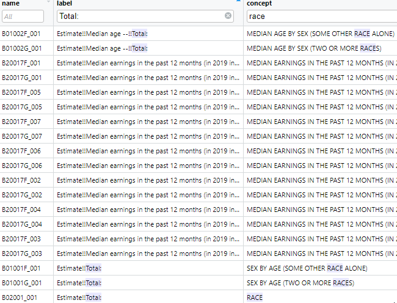
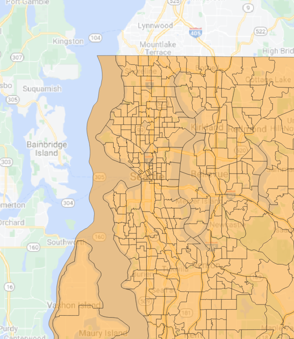
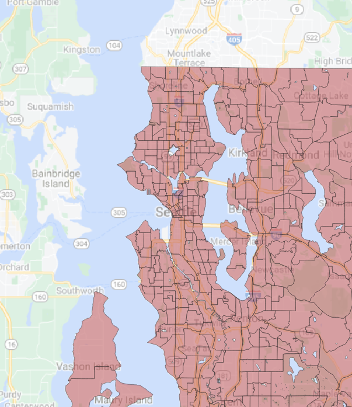

# Week 3 {#week3}

<style>
.border1 {   
    border-width: 1px;   
    border-color: black;   
    border-style: solid; } 
</style>

```{r, echo=TRUE, message=FALSE, warning=FALSE}
pacman::p_load(animation, captioner, idbr, htmltools, kableExtra, knitr, leaflet, leafem, leafpop, magrittr, mapview, pander, pander, psych, readstata13, rmapshaper, sf, stargazer, tidyverse, tidycensus, tigris)

table_nums <- captioner(prefix = "Table")
figure_nums <- captioner(prefix = "Figure")
```

This session covers two basic areas: (1) downloading census and international data using `tidycensus`, `tigris`, and `idbr`, and (2) mapping and GIS analysis with `leaflet`, `mapview`, and `sf`.

Download the file [week03.Rmd](files/week03/week03.Rmd) and use that as the base. Change the second line in the YAML header so it uses your name and your web site. See [UW Students Web Server](https://students.washington.edu/) if you do not have a web site.

<h2>Topics</h2>

* [`tidycensus`](#tidycensus): Load US Census Boundary and Attribute Data as ‘tidyverse’ and ‘sf’-Ready Data Frames
* [`tigris`](#tidycensus): Load Census TIGER/Line Shapefiles
* [`idbr`](#idbr): R Interface to the US Census Bureau International Data Base API
* [`leaflet`](#leaflet): Create Interactive Web Maps with the JavaScript ‘Leaflet’ Library
* [`mapview`](#mapview): Interactive Viewing of Spatial Data in R
* [`sf`](#sf): Simple Features for R: Simple Features (GIS) for R

## 

## Getting US Census data with `tigris`, `tidycensus` {#tidycensus}
Dealing with US Census data can be overwhelming, particularly if using the raw text-based data. The Census Bureau has an API that allows more streamlined downloads of variables (as data frames) and geographies (as simple format shapes). It is necessary to get an API key, available for free. See [tidycensus](https://walker-data.com/tidycensus/) and  [tidycensus basic usage](https://walker-data.com/tidycensus/articles/basic-usage.html), and for a complete treatment, [Analyzing US Census Data](https://walker-data.com/census-r).

`tidycensus` uses [`tigris`](https://www.rdocumentation.org/packages/tigris/versions/1.0), which downloads the geographic data portion of the census files.

A simple example will download the variables representing the count of White, Black/African American, American Indian/Native American, and Asian persons from the American Community Survey (ACS) data for King County in 2019. 

### US Census API key installation
For this example to run, you need to have your US Census API key installed. run this code, but substituting your actual API key for the asterisks.

```{r, eval=FALSE}
# set the census API key and the persistent tigris cache location
tidycensus::census_api_key("*****************", install = TRUE)
tigris::tigris_cache_dir("H:/tigris_cache")
```

<tt>
<div style='color: red;'>
Your API key has been stored in your .Renviron and can be accessed by Sys.getenv("CENSUS_API_KEY").<br>
To use now, restart R or run `readRenviron("~/.Renviron")`
</div>
</tt>

You should enable the API key:

```{r}
readRenviron("~/.Renviron")
```

The option `install = TRUE` writes a line in your `~/.Renviron` file (`~/` is shorthand for "home directory"; under Windows typically your `C:\users\username\Documents` folder; under MacOS, typically `/home/username`). Similarly, `tigris_cahce_dir()` writes to the `~/.Renviron` file. For example my `.Renviron` file (`r figure_nums(name = "apikey", display = "cite")`) shows the API key and the persistent `tigris` cache folder.


\    
_`r figure_nums(name = "apikey", caption = "Census API key stored in ~/.Renviron")`_

With the API key installed, you can simply load the `tidycensus` package and download data. When R starts, it reads this file and creates system environment variables for the R session; in this case I'm setting two variables (TIGRIS_CACHE_DIR and CENSUS_API_KEY). You could set other system environment variables to be active in R by adding them to this file.

### Census variables
First, it should be noted that not all data products and variables are available for all census geographic units. See [Geography and variables in tidycensus](https://walker-data.com/census-r/an-introduction-to-tidycensus.html#geography-and-variables-in-tidycensus) for a list of which geographic units are available for different data products using `tidycensus`.

`tidycensus` has a helper function for obtaining the lists of variables and their descriptions. This is necessary because the list of variables is quite long and the variable names are codes that are functionally unintelligible.

Census variable lists are obtained using the `load_variables()` function, which is used to specify the year, data set, and whether or not to cache results. Because the variable lists are large, it may make sense to cache the lists.

Here we will list the variables for the 2019 ACS 5-year average data:

```{r}
v2019 <- load_variables(year = 2019, dataset = "acs5", cache = TRUE)
```

The table, which has `r nrow(v2019)` records, can then be browsed using the function `View(v2019)`. Using the tabular view in this way makes it convenient to search for variable names or concepts using the filters. For example we can search for the term "race" in the `concept` field, as shown in (`r figure_nums(name = "vnamesearch", display = "cite")`).


\    
_`r figure_nums(name = "vnamesearch", caption = "ACS 5 year variables")`_

However, this interface uses only free text searches and will match any record containing the search string, whether or not the search string is the word alone or the whole word. One can use more specific searches using R syntax, for example to list all variables tagged with the concept "RACE", filtering by the explicit string is more specific (\@ref(tab:v2019tab)).

```{r v2019tab}
v2019 %>%
    filter(concept == "RACE") %>%
    kable(caption = 'ACS 5 year variables for the concept "race"') %>%
    kable_styling(bootstrap_options = c("striped", "hover", "condensed", "responsive"), full_width = F, position = "left")
```

This shows that the variable for the count of all persons is `B02001_001` and the variables for White alone, Black alone, American Indian/Alaskan Native alone, Asian alone, and some other race alone are `B02001_002`, `B02001_003`, `B02001_004`, `B02001_005`, and `B02001_007`, respectively. One could also use regular expressions to search for desired patterns in the concept.

### Downloading data
`tidycensus` has two main functions, `get_decennial()` for downloading decennial data and `get_acs()` for downloading American Community Survey (ACS) data. The functions are quite similar in structure.

Here we will define a set of variables using a named vector of variable names.

```{r, warning=FALSE}
# the census variables
census_vars <- c(
    p_denom_race = "B02001_001",
    p_n_white = "B02001_002",
    p_n_afram = "B02001_003",
    p_n_aian = "B02001_004",
    p_n_asian = "B02001_005"
)
```

The "named vector" refers to the elements of the vector having names, for example, the first element below has the name `p_denom_race` and the value "B02001_001". This construction is used so that when the data are downloaded, the resultant data frame will have more readable names.
 
Next, we will download the actual data. Here we will be downloading census tract level data for King County, WA, from the 5 year ACS estimates for the year ending in 2019. We also specify `options(tigris_use_cache=TRUE)` so that any shapefile data downloaded are cached and will not be re-downloaded if not necessary. Note in `r figure_nums(name = "apikey", display = "cite")` I had specified a location where I wanted my tigris cache to be located (`H:/tigris_cache`). Another important option is `output = "wide"`, which generates an output table with one record per census unit and columns representing the variables. A `tidy` output would present a "long" table with repeated records per census unit, one record per variable estimate.

```{r, message=FALSE}
# get the data
ctdat <- get_acs(
    geography = "tract",
    variables = census_vars,
    cache_table = TRUE,
    year = 2019,
    output = "wide",
    state = "WA",
    county = "King",
    geometry = TRUE,
    survey = "acs5"
)

ctdat %<>% st_transform(4326)
```

```
Getting data from the 2015-2019 5-year ACS
Using FIPS code '53' for state 'WA'
Using FIPS code '033' for 'King County'
```

A few values are shown in Table \@ref(tab:census). Because the ACS data include a margin of error (MOE), the estimate is represented with the variable name having the terminal character "E" and the MOE is represented with the variable name having the terminal character "M". The variables are shown with the names we specified earlier. Without the named vector, the downloaded variables would be given the raw variable names, which are generally not helpful. Note also because of the `geometry = TRUE` option, there is a `geometry` column containing geographic data. The "wide" format data are more amenable to applications requiring one record per census unit, because typically other census-unit level data are represented with one record per census unit, which allows for table joins, fro example in mapping applications.

```{r census}
# print a few records
ctdat %>%
    head() %>%
    kable(caption = "Selected census tract variables from the 5-year ACS from 2019 for King County, WA") %>%
    kable_styling(bootstrap_options = c("striped", "hover", "condensed", "responsive"), full_width = F, position = "left")
```

An example of data downloaded in "long" format is shown in \@ref(tab:censuslong). Here, the column `variable` indicates what measure is stored in the record, and `estimate` and `moe` present the data values for that particular variable $\times$ census unit combination. Data in this format are more amenable to generating data summaries, rather than applications such as mapping.

```{r censuslong}
# get the data
ctdatlong <- get_acs(
    geography = "tract",
    variables = census_vars,
    cache_table = TRUE,
    year = 2019,
    output = "tidy",
    state = "WA",
    county = "King",
    geometry = TRUE,
    survey = "acs5"
)

ctdatlong %>%
    head() %>%
    kable(caption = "Selected census tract variables from the 5-year ACS from 2019 for King County, WA (long format)") %>%
    kable_styling(bootstrap_options = c("striped", "hover", "condensed", "responsive"), full_width = F, position = "left")
```


## Getting US Census International data with `idbr` {#idbr}
There is also an API for the US Census international data that can be accessed using the [`idbr`](https://cran.r-project.org/web/packages/idbr/index.html) package.

You will need to use your US Census API key to access the data using `idbr`. Here we set the key using the system environment variable so the API key is not stored in plain text:

```{r}
# the same census API key is used
idb_api_key(Sys.getenv("CENSUS_API_KEY"))
```

Data are downloaded using the `get_idb()` function. Data can be obtained for one or more countries, years, variables, concepts (groups of variables), ages, sex (male or female), and low or high resolution (as part of the `geometry()` option. 

### IDB variables

Variables and concepts can be listed using the `idb_variables()` and `idb_concepts()` functions, respectively. A more informative list (`r table_nums(name = "idbrvar", display = "cite")`) can be generated with the `variables5()` function.

_`r table_nums(name = "idbrvar", caption = "idbr variables")`_

```{r}
# print the variables as a table
variables5 %>% DT::datatable()
```

The basic use of `get_idb()` without specification of variables or concepts downloads population counts for specific one-year age classes for specific countries and years. Here we download the data representing China and India from 2000 and 2021.

```{r pyramiddata}
# get data only if necessary
if(!exists("china_india_data")){
    china_india_data <- get_idb(
        # from China and India
        country = c("China", "India"),
        # years 2000 and 2021
        year = c(2000, 2021),
        # age range 0 to 100 years
        age = 0:100,
        # data for both sexes
        sex = c("male", "female")
    )
}
```

And generate a population pyramid for the two countries for the two years, using `ggplot()` with the `geom_col()` format and a grid of plots with `facet_grid()`.

```{r pyramid}
china_india_data %>%
    # multiply male population by -1 to graph to the left of 0
    mutate(pop = ifelse(sex == "Male", pop * -1, pop)) %>%
    # plot with Y as age, color by sex
    ggplot(aes(x = pop, y = as.factor(age), fill = sex)) +
    # column plot
    geom_col(width = 1) +
    # minimal theme with no background annotations
    theme_minimal(base_size = 15) +
    # scale X with labels in the millions
    scale_x_continuous(labels = function(x) paste0(abs(x / 1000000), "m")) +
    # scale Y with breaks & labels every 10 years
    scale_y_discrete(breaks = scales::pretty_breaks(n = 10)) +
    # define the colors
    scale_fill_manual(values = c("red", "gold")) +
    # set the labels
    labs(
        title = "Population structure of\nChina and Japan, 2000 and 2021",
        x = "Population",
        y = "Age",
        fill = ""
    ) +
    # facet by country and year
    facet_grid(name ~ year)
```

\@ref(fig:pyramid) shows that for both China and India from 2000 to 2021 a larger proportion of the population has moved from younger to older age classes. China has a much larger proportion in older age classes than does India, and China also has large variations in proportion of population by age class, whereas India has relatively little variability across year of age.

### Downloading variables or concept groups
Data can be downloaded for specific variables in the `variables5` data frame in the `idbr` package. For example we can download female and male infant mortality rates per 1000 population (variables `IMR_F` and `IMR_M`) for India and China in 2000 and 2021:

```{r}
inf_mort <- get_idb(
        # from China and India
        country = c("China", "India"),
        # years 2000 and 2021
        year = c(2000, 2021),
        # infant mortality
        variables = c("IMR_F", "IMR_M")
) %>% 
    mutate(female = imr_f,
           male = imr_m)
```

We then create a simple column graph from the data (\@ref(fig:infmort)).

```{r infmort}
inf_mort %>% 
    pivot_longer(cols = c(female, male), names_to = "sex", values_to = "count") %>% 
    ggplot(aes(x = factor(sex), y = count)) +
    geom_col() +
    facet_grid(name ~ year) +
    labs(x = "year", y = "deaths per 1000 population")
```


## Mapping census data from `tidycensus` and `tigris` using `leaflet` {#leaflet}

Using the data downloaded in the [tidycensus](#tidycensus) section, we present a simple map is shown in \@ref(fig:ct), with percent African American residents and tract identifier.

```{r ct, fig.cap="Percent African American in census tracts in King County, 2019 ACS 5-year estimate", warning=FALSE, message=FALSE}

# proportion Black
ctdat %<>%
    mutate(pct_black = (p_n_aframE / p_denom_raceE * 100) %>% round(1))

# a label
labels <- sprintf("%s<br/>%s%s", ctdat$GEOID, ctdat$pct_black, "%") %>% lapply(htmltools::HTML)

# a color palette in red with 10% classes 
# max % AfrAm rounded up to the nearest 10
myMax <- (ctdat$pct_black %>% max(na.rm = TRUE) + 10) %>% round(0)
# bins for color
bins <- seq(0, myMax, by = 10)
# palette with bins and % AfrAm
myPal <- colorBin(
    palette = "Reds",
    domain = ctdat$pct_black,
    bins = bins
)

# the leaflet map
m <- leaflet(height = "500px") %>%
    # add polygons from tracts
    addPolygons(
        data = ctdat,
        weight = 1,
        fillOpacity = 0.8,
        # fill using the palette
        fillColor = ~ myPal(pct_black),
        # highlighting
        highlight = highlightOptions(
            weight = 5,
            color = "#666",
            fillOpacity = 0.7,
            bringToFront = TRUE
        ),
        # popup labels
        label = labels,
        labelOptions = labelOptions(
            style = list("font-weight" = "normal", padding = "3px 8px"),
            textsize = "15px",
            direction = "auto"
        )
    ) %>%
    # add the legend using the palette and % AfrAm
    addLegend(
        position = "bottomright", pal = myPal, values = ctdat$pct_black,
        title = "% African American",
        opacity = 1
    )
m %>% addTiles()
```

One thing to note is that the `tidyverse::get_...()` functions may not be downloading the most detailed GIS data. Here we compare the data obtained using `tigris::tracts()`, also for King County, WA in 2019 (\@ref(fig:ctcompare)). First, the `tidycensus` map data are clipped at the shore line. Second, there are some differences in the shape and size of tracts in the downtown area. 

```{r ctcompare, fig.cap="tidyverse generalized tracts versus tigris detailed tracts", warning=FALSE, message=FALSE}

tgtracts_kc_2019 <- tigris::tracts(state = "WA", county = "King", year = 2019)
tgtracts_kc_2019 %<>%  st_transform(4326)

# the leaflet map
m <- leaflet(height = "500") %>%
    addPolygons(
        data = ctdat,
        stroke = TRUE,
        color = "red",
        weight = 7,
        fill = FALSE
    ) %>%
    addPolygons(
        data = tgtracts_kc_2019,
        stroke = TRUE,
        color = "black",
        weight = 2,
        fill = FALSE
    ) %>%
    addLegend(
        colors = c("red", "black"),
        labels = c("tidyverse generalized", "tigris detailed")
    ) %>%
    addTiles() %>% 
    setView(lng = -122.3603, lat = 47.62231, zoom = 13)
    
m

```

## Mapping census data from `tidycensus` and `tigris` using `mapview` {#mapview}
[`mapview`](https://r-spatial.github.io/mapview/) provides a fast and easy interface for creating interactive maps built on top of the `leaflet` framework. Whereas `leaflet` provides more fundamental controls over mapping, `mapview` will load layers with useful defaults. The map automatically includes the XY location of the mouse pointer at the top of the interface, choices for base map tiles, and when used with the `zcol` argument, color coding based on numerical or categorical variables in the data frame. Here we will create a `mapview` choropleth map of census tracts in King County displaying the ratio of African American to White population counts (`r figure_nums(name = "ctmapview", display = "cite")`). The `popup` argument is used to control which variables are shown in the popup that appears when a feature is clicked.

NOTE: There is a problem with `mapview` implemented within R Markdown or Bookdown that does not allow the page to render with `mapview` code. Copy and run the code below. Unfortunately the map will not be rendered in these pages.

```
ctdat_mv <- ctdat %>%
    mutate(afram_white = (p_n_aframE / p_n_whiteE) %>% round(2))

mapview(ctdat_mv,
        zcol = "afram_white",
        popup = popupTable(ctdat_mv,
            zcol = c("p_n_aframE", "p_n_whiteE")
        )
    )
```

\    
_`r figure_nums(name = "ctmapview", caption = "A mapview map of ratio of African American to White population counts in King County, 2019 ACS data")`_

For more things you can do with `mapview` see [mapview](https://r-spatial.github.io/mapview), in particular, look at the "Articles" link at the top of the page.

## Simple features: GIS in R {#sf}
The maps displayed in the sections on [`leaflet`](#leaflet) and [`mapview`](#mapview) are possible because they are using spatially explicit data. When we looked at the contents of the census tract data frames, there was a `geometry` column that contained specially formatted values. The format for these is a standard developed by the [Open Geospatial Consortium (OGC)](https://www.ogc.org/) and the [International Organization for Standardization (ISO)](https://www.iso.org/) . known as "simple features", and includes specifications for how to store and process data representing geographic features.

Within R, the most developed package is [`sf`: Simple Features for R](https://r-spatial.github.io/sf/). A full treatment is not possible in this course, but the reference for `sf` is a good start, as well as the book [Geocomputation with R](https://bookdown.org/robinlovelace/geocompr)

Geographic objects are stored in standard format. For example, the first census tract is composed of a set of attributes as well as the geometry:

```{r}
print(ctdat[1,])
```

The geometry for this record is composed of a `MULTIPOLYGON`, that is a polygon that can consist of one or more parts (for example, the state of Washington could be represented as a single multipolygon where the main land mass as well as all of the islands are disjointed parts of the same polygon feature).

The first polygon consists of a set of vertices that define the shape of the polygon:

```{r}
st_geometry(ctdat$geometry)[[1]] %>% st_as_text() %>% str_replace_all(pattern = ", ", replacement = "\n") %>% cat()
```

Here we extract the coordinates of vertices the polygon and plot them as points on top of the polygon

```{r}
ctdat1 <- ctdat %>% head(1)

pts <- st_coordinates(ctdat$geometry[1]) %>% 
    as_tibble()

ggplot() +
    geom_sf(data = ctdat1) +
    geom_point(data = pts, mapping = aes(x = X, y = Y)) +
    theme(axis.text.x = element_text(angle = 90, vjust = 0.5, hjust=1))
```

The `sf` and package contains a plethora of analytic functions. Here we could the `st_difference()` function to erase water areas from the detailed census tract data we downloaded with `tigirs` earlier. Another package, [`mapshaper`](https://cran.r-project.org/web/packages/rmapshaper) has fewer functions, but upon experimentation, the `ms_erase()` function performed faster and better than `sf::st_difference()`, so we will use that instead.

We will start by downloading water areas, then perform the spatial overlay, then download the census values (without geometry) and finally join the geometry and census variables together and export to a [geopackage (GPKG) file](https://www.geopackage.org/). A geopackage is a GIS data format that can contain multiple data sources and does not suffer some of the built-in limitations of shapefiles.

```{r, eval=FALSE}
# get water and transform to WGS84
water_kc <- area_water(state = "WA", county = "King", year = 2019) %>% 
    st_transform(4326)

# erase water from tracts
tract_nowater <- ms_erase(tgtracts_kc_2019, water_kc) %>% 
    filter(GEOID != "53033990100")

# download census variables
# the census variables
census_vars <- c(
    p_denom_race = "B02001_001",
    p_n_white = "B02001_002",
    p_n_afram = "B02001_003",
    p_n_aian = "B02001_004",
    p_n_asian = "B02001_005"
)
# get the data
ctdat_nogeom <- get_acs(
    geography = "tract",
    variables = census_vars,
    cache_table = TRUE,
    year = 2019,
    output = "wide",
    state = "WA",
    county = "King",
    geometry = FALSE,
    survey = "acs5"
)

# join
ctdat_nowater <- tract_nowater %>% left_join(ctdat_nogeom, by = "GEOID")

# write as a GPKG
# an output dir
myDir <- "//udrive.uw.edu/udrive/csde502_winter_2022/week03"
if(!dir.exists(myDir)){
    dir.create(myDir)
}
# write tracts no water
st_write(obj = ctdat_nowater, dsn = file.path(myDir, "ctdat_nowater.gpkg"), layer = "ctdat_nowater", append = TRUE, delete_layer = TRUE, quiet = TRUE)
# write water
st_write(obj = water_kc, dsn = file.path(myDir, "ctdat_nowater.gpkg"), layer = "water_kc", append = TRUE, delete_layer = TRUE, quiet = TRUE)
# write tracts
st_write(obj = tgtracts_kc_2019, dsn = file.path(myDir, "ctdat_nowater.gpkg"), layer = "tgtracts_kc_2019", append = TRUE, delete_layer = TRUE, quiet = TRUE)

```

```{r, echo=FALSE}
# get water and transform to WGS84
water_kc <- area_water(state = "WA", county = "King", year = 2019) %>% 
    st_transform(4326)

# erase water from tracts
tract_nowater <- ms_erase(tgtracts_kc_2019, water_kc) %>% 
    filter(GEOID != "53033990100")

# download census variables
# the census variables
census_vars <- c(
    p_denom_race = "B02001_001",
    p_n_white = "B02001_002",
    p_n_afram = "B02001_003",
    p_n_aian = "B02001_004",
    p_n_asian = "B02001_005"
)
# get the data
ctdat_nogeom <- get_acs(
    geography = "tract",
    variables = census_vars,
    cache_table = TRUE,
    year = 2019,
    output = "wide",
    state = "WA",
    county = "King",
    geometry = FALSE,
    survey = "acs5"
)

# join
ctdat_nowater <- tract_nowater %>% left_join(ctdat_nogeom, by = "GEOID")

# write as a GPKG
# an output dir
myDir <- "//udrive.uw.edu/udrive/csde502_winter_2022/week03"
if(!dir.exists(myDir)){
    dir.create(myDir)
}
# write tracts no water
st_write(obj = ctdat_nowater, dsn = file.path(myDir, "ctdat_nowater.gpkg"), layer = "ctdat_nowater", append = TRUE, delete_layer = TRUE, quiet = TRUE)
# write water
st_write(obj = water_kc, dsn = file.path(myDir, "ctdat_nowater.gpkg"), layer = "water_kc", append = TRUE, delete_layer = TRUE, quiet = TRUE)
# write tracts
st_write(obj = tgtracts_kc_2019, dsn = file.path(myDir, "ctdat_nowater.gpkg"), layer = "tgtracts_kc_2019", append = TRUE, delete_layer = TRUE, quiet = TRUE)

```


The GPKG layers are viewable in QGIS (`r figure_nums(name = "tracts_qgis", display = "cite")`, `r figure_nums(name = "tracts_nowater_qgis", display = "cite")`.


\    
_`r figure_nums(name = "tracts_qgis", caption = "King County census tracts")`_



\    
_`r figure_nums(name = "tracts_nowater_qgis", caption = "King County census tracts with water erased")`_

<hr>
Rendered at <tt>`r Sys.time()`</tt>

<h4>Source code for this document</h4>
[03-week03.Rmd](03-week03.Rmd)

```{r, comment='', echo=FALSE}
cat(readLines("03-week03.Rmd"), sep = "\n")
```

