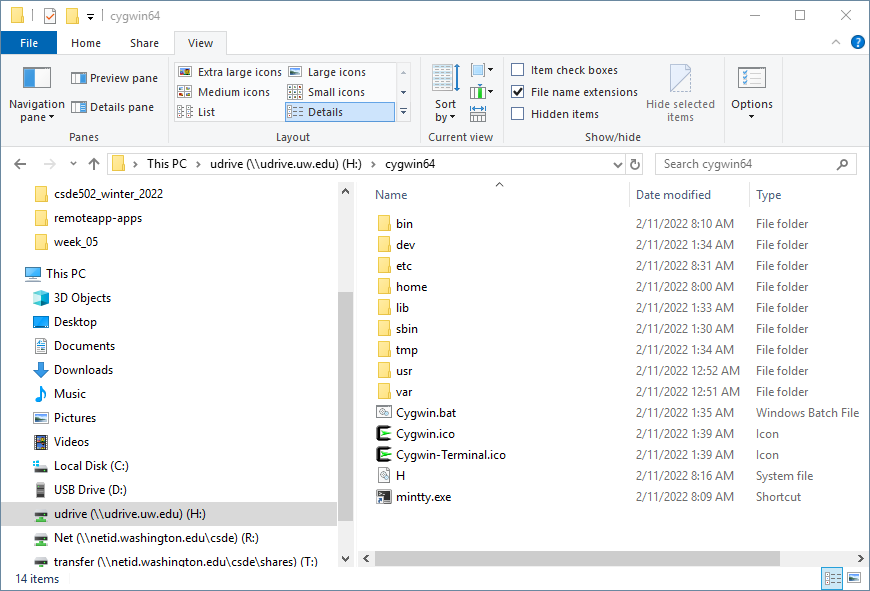
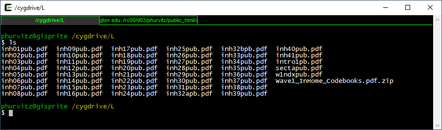
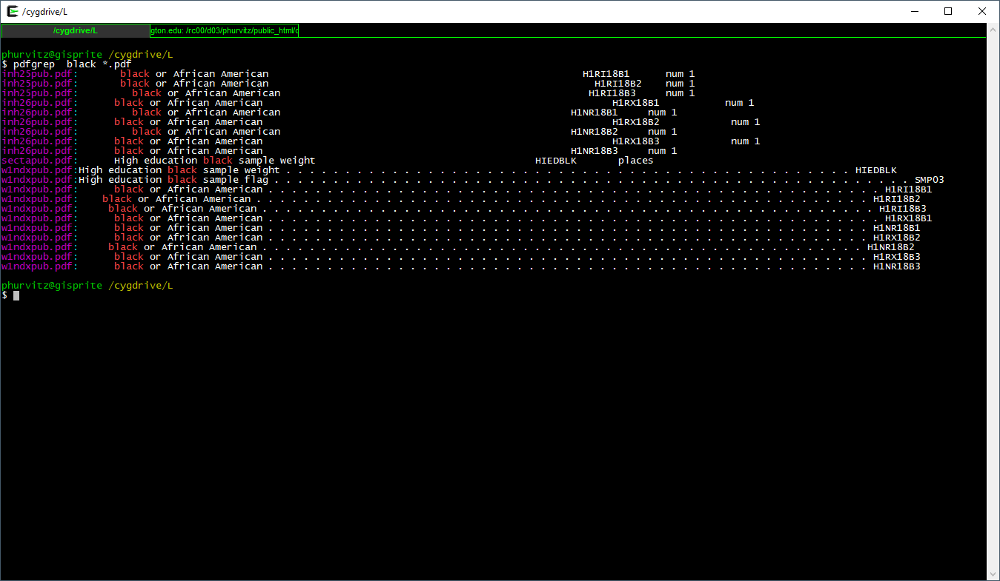
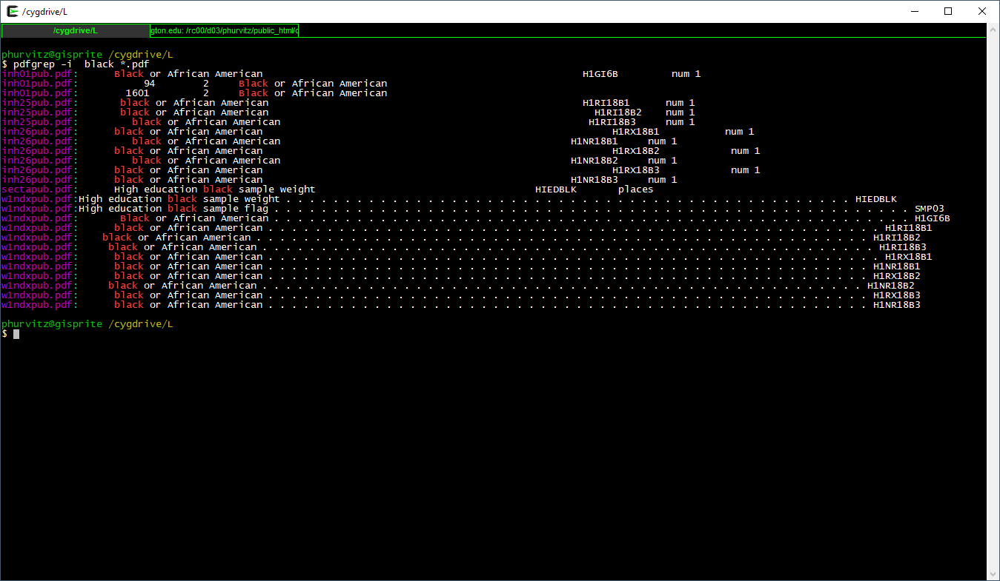
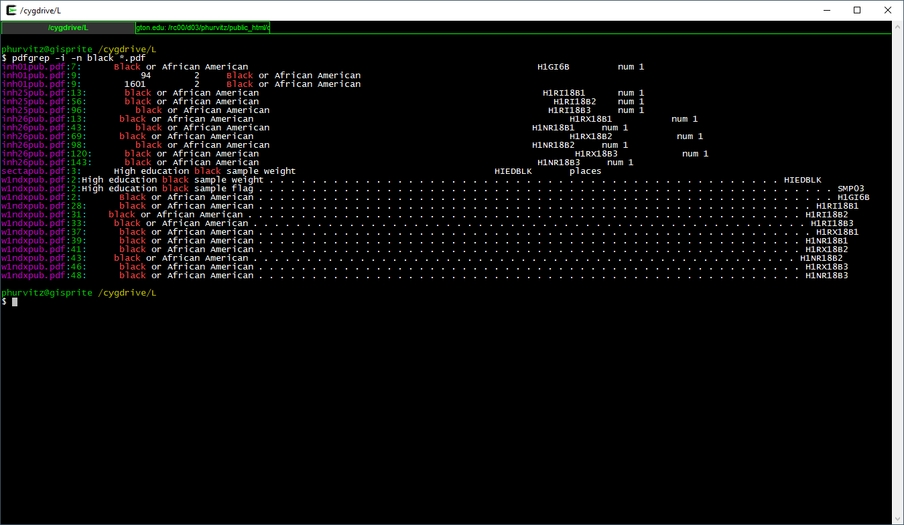
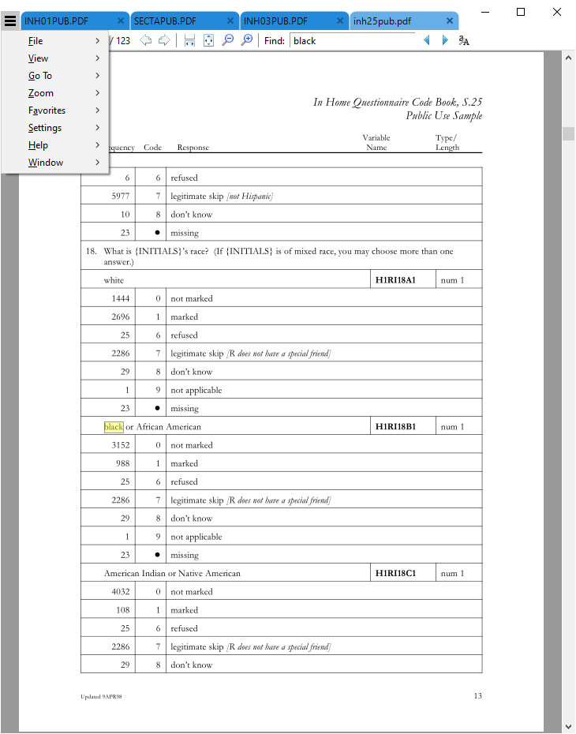
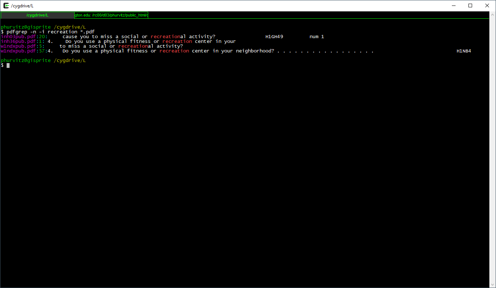
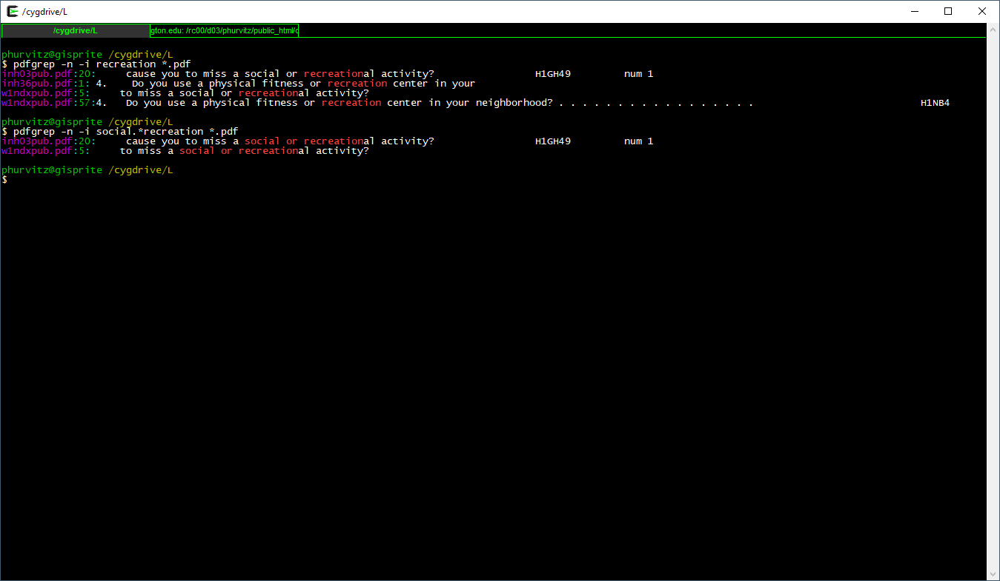
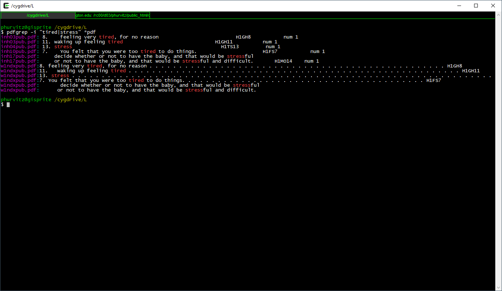

# Week 6 {#week6}

```{r, echo=FALSE, warning=FALSE, message=FALSE}
pacman::p_load(
    tidyverse,
    magrittr,
    knitr,
    kableExtra,
    readstata13,
    haven,
    pdftools,
    captioner,
    dplyr, 
    magrittr,
    scales
)

figure_nums <- captioner(prefix = "Figure")
table_nums <- captioner(prefix = "Table")

# path to this file name
if (!interactive()) {
    fnamepath <- current_input(dir = TRUE)
}
```
<h2>Topics: Cohort Component Method of Population Projection; Add Health Study data (exploring variables and data documentation)</h2>

This week we will be covering two topics:

* [Cohort Component Method of Population Projection (CCMPP)](#ccmpp)
* [Add Health Study data: exploring variables and data documentation](#addhealthmetadata)

First, download the [template Rmd file](files/template.Rmd) and save it in your course working folder as `week_06.Rmd`. Make changes to the title and author as you see fit.


### Cohort Component Method of Population Projection (CCMPP) {#ccmpp}
The `ccmpp` package implements the cohort component method of population projection (CCMPP) described in this section. We will follow the first half of the excellent [CCMPP vignette](https://ihmeuw-demographics.github.io/demCore/articles/ccmpp.html) for this package, which gives a worked example of projection Thailand population from 1960 through 2000 using a baseline population for the year 1960.

It has been suggested that you can use the `ccmpp` package to check your work in CSDE 533.

Let's start by loading the package. Loading the package also exposes the `thailand_data` and `thailand_initial_estimates` data set.

```{r, message=FALSE, warning=FALSE}
library(demCore)
```

Let's look at the Thailand data. This shows the object is a list:

```{r}
is(demCore::thailand_data)
```

Looking at the structure with `str()`, we see it is composed of only one element named `population`. This is a [`data.table`](https://cran.r-project.org/web/packages/data.table/), which is an enhanced data frame. 

```{r}
str(demCore::thailand_data)
```

The `population` `data.table` has `r nrow(demCore::thailand_data$population)` rows and `r ncol(demCore::thailand_data$population)` columns. 

```{r}
dim(demCore::thailand_data)
```

This is the population of five year age classes by sex for years spanning `r min(thailand_data$population$year)` to `r max(thailand_data$population$year)`. `r table_nums(name = "tldata", display = "cite")` shows the first few rows.

*`r table_nums(name = "tldata", caption = "CCMPP Thailand data")`*

```{r}
demCore::thailand_data$population %>%
    head() %>%
    kable() %>%
    kable_styling(
        bootstrap_options =
            c("striped", "hover", "condensed", "responsive"),
        font_size = 12,
        full_width = F, position = "left"
    )
    
```

There is also an object `thailand_initial_estimates`. It is a list:

```{r}
is(thailand_initial_estimates)
```

... that is composed of `r length(thailand_initial_estimates)` elements. Do the elements have names?

```{r}
names(demCore::thailand_initial_estimates)
```

What type of objects are they? We can use `lapply()` and `is()`.

```{r}
lapply(demCore::thailand_initial_estimates, FUN = function(x) (is(x)))
```

This shows us each of the elements is a `data.table`. Let's perusing the structure using `str()`:

```{r}
str(demCore::thailand_initial_estimates)
```

The help entry for `thailand_initial_estimates` states that it is a list of initial estimates for each `ccmpp()` input. 

According to the vignette,

> "[thailand_initial_estimates] is a summary of what the Thailand example inputs look like. The baseline population is for the year 1960 and includes both female and male populations for five year age groups up to 80+. The other four inputs define how the population changes every five calendar years between 1960 and 2000. The survivorship ratios go up to age 85+ while the asfr estimates are defined for the reproductive age groups between age 15 and 50."

For example we can look at the sex ratio at birth (male / female) for each five-year interval (`r table_nums(name = "tldatasrb", display = "cite")`).

*`r table_nums(name = "tldatasrb", caption = "Thailand sex-ratio at birth, 1960-2000")`*

```{r}
demCore::thailand_initial_estimates$srb %>% 
    kable() %>% 
    kable_styling(
        bootstrap_options =
            c("striped", "hover", "condensed", "responsive"),
        font_size = 12,
        full_width = F, position = "left"
    )    
```

For this run of CCMPP we will use the suggested settings, with comments in line with the code. See the documentation for `ccmpp()` for details.

```{r, fig.width=3, fig.height=15}
# the settings for this run of ccmpp
thailand_settings <- list(
    # start of each calendar year, i.e., year_start
    years = seq(1960, 1995, 5),
    # use both sexes
    sexes = c("female", "male"),
    # ages being projected
    ages = seq(0, 80, 5),
    # ages for which mortality parameter estimates are available
    ages_mortality = seq(0, 85, 5),
    # assumed female fertility ages
    ages_asfr = seq(15, 45, 5)
)
```

We now run the `ccmpp()` function to generate a population projection

```{r, fig.width=3, fig.height=15}
thailand_population <- ccmpp(
  inputs = demCore::thailand_initial_estimates,
  settings = thailand_settings
)
```

In order to make a graph roughly matching the one in the vignette, we add a new column `ageclass` by concatenating the start and end ages and reordering the factor based on the `age_start` column.

```{r, fig.width=3, fig.height=15}
thailand_population %<>%
    mutate(ageclass = factor(str_c(age_start, age_end, sep = " to ") %>%
        fct_reorder(., age_start)))
```

Also we can change the maximum age class level to "80 plus" without hard coding in the string "80".

```{r, fig.width=4, fig.height=15}
# max label
maxlev <- length(levels(thailand_population$ageclass))

# current max level
currmaxlev <- levels(thailand_population$ageclass)[maxlev]

# substitute
updatemaxlev <- currmaxlev %>% 
    str_replace(pattern = "to Inf",
                replacement = "plus")

# update
levels(thailand_population$ageclass)[maxlev] <- updatemaxlev
```

Finally, make a graph plotting population against year, stratified by sex and age class.

```{r, fig.width=5, fig.height=15}
ggplot(data = thailand_population,
       mapping = aes(x = year, y = value)) +
    geom_line() +
    # this stratifies the graph by sex and age class
    facet_grid(ageclass ~ sex, scales = "free_y", 
               labeller = labeller(age = thailand_population$age_class)) +
    # do not use a constant Y scale otherwise the older age classes would look flat.
    # and show the Y axis values with commas
    scale_y_continuous(labels = label_number(big.mark = ",")) +
    # change the axis labels
    xlab("Year") +
    ylab("Population")
```


### The Add Health study data {#addhealthmetadata}
The Add Health [web site](https://data.cpc.unc.edu/projects/2/view) describes the study:

> Initiated in 1994 and supported by five program project grants from the Eunice Kennedy Shriver National Institute of Child Health and Human Development (NICHD) with co-funding from 23 other federal agencies and foundations, Add Health is the largest, most comprehensive, nationally-representative longitudinal survey of adolescents ever undertaken. Beginning with an in-school questionnaire administered to a nationally representative sample of students in grades 7-12, the study followed up with a series of in-home interviews conducted in 1995, 1996, 2001-02, 2008, and 2016-18. Add Health participants are now full-fledged adults, aged 33-44, and will soon be moving into midlife. Over the years, Add Health has added a substantial amount of additional data for users, including contextual data on the communities and states in which participants reside, genomic data and a range of biological health markers of participants, and parental survey data.

The public-use data contain a subset of records and variables from the restricted-use full data set. The full data set requires a lengthy application process and meeting specific security standards. [CSDE](https://csde.washington.edu/) has a copy of most of the tables in the restricted-use data set on the [UW Data Collaborative](https://dcollab.uw.edu/data/add-health/).

We will be using the Wave 1 public-use Add Health data for most of the remainder of the term. This week we will briefly delve into the documentation and see how the data set use is supported by the documentation.

The Add Health data are very well documented. The PDFs contain the verbatim text of the survey questions, the range of encoded answers, and count tabulations of responses.

We will revisit the documentation later in this lesson.

#### Data sets
The two data sets we will be using are [AHwave1_v1.dta.zip](data/AHwave1_v1.dta.zip) and [21600-0001-Data.dta.zip](data/21600-0001-Data.dta.zip). If you do not already have a folder `data` in your working directory, create it first, then download each file to that folder.

:::{.rmdnote}
Note for the code examples to run without modification, the assumption is that the data have been downloaded and unzipped in a sub-folder named `data` within the current working directory. You can find out what the current working directory is by entering `getwd()` at the R prompt.
:::

Both of these are Stata files. Stata files version 12 and below can be read with `foreign::read.dta()`, but version 13 and up require `haven::read_dta()` or `readstata13::read.dta13()`.

One of the benefits of the Stata file formats, as compared to e.g., CSV or Excel, is that the Stata files can contain metadata about the variables. The imported data frames themselves often have cryptically coded variable names, but more extensive ***labels***. The labels generally contain descriptions of the variables. The R import process can expose those labels, making the data more easy to interpret.

##### `AHwave1_v1.dta`
`AHwave1_v1.dta` is a Stata version 13 file. Here we will look at the two import options.

###### `haven::read_dta()`
`haven::read_dta()` will read the data in as a data frame. The following code will unzip an existing `data/AHwave1_v1.dta.zip` file and then read the unzipped file.

```{r}
# unzip the file
if(file.exists("data/AHwave1_v1.dta.zip") & !file.exists("data/AHwave1_v1.dta")){
    unzip(zipfile = "data/AHwave1_v1.dta.zip", exdir = "data")
}

# read the data
AHwave1_v1_haven <- haven::read_dta(file = "data/AHwave1_v1.dta")
```

Each labeled variable has attributes can be perused by listing structure. Here we look at the `imonth` variable:

```{r}
str(AHwave1_v1_haven$imonth)
```

Another way to peruse a variable is to view the first few values (e.g., `head()`), here for the `bio_sex` variable:

```{r}
head(AHwave1_v1_haven$bio_sex)
```

One can also list the attributes of the variable itself, which provides a more complete and verbose listing of the variable label, data format, class, and value labels. Here for the variable `h1gi1m`:

```{r}
attributes(AHwave1_v1_haven$h1gi1m)
```

We can see that the variable has attributes `label` (a more verbose label for the variable itself), `format.stata` (data format for the column), `class` (showing the column is a `haven_labelled` `vector` stored in `double precision` format), and `labels` showing the translation of variable values and more descriptive labels.

In order to access the metadata as a single object, one can use the `lapply()` function, because the data frame can also be treated as a list. Here, each variable has its name, label, data format, and labels extracted to a single data frame and presented as a `DT::datatable`. This provides the metadata in a format that is probably easier to use than the PDF documentation. 

```{r}
AHwave1_v1_haven_metadata <- bind_cols(
    # variable name
    varname = colnames(AHwave1_v1_haven),
    # label
    varlabel = lapply(AHwave1_v1_haven, function(x) attributes(x)$label) %>% 
        unlist(),
    # format
    varformat = lapply(AHwave1_v1_haven, function(x) attributes(x)$format.stata) %>%
        unlist(),
    # values
    varvalues = lapply(AHwave1_v1_haven, function(x) attributes(x)$labels) %>% 
        # names the variable label vector
        lapply(., function(x) names(x)) %>% 
        # as character
        as.character() %>% 
        # remove the c() construction
        str_remove_all("^c\\(|\\)$")
)

DT::datatable(AHwave1_v1_haven_metadata)
```

Can you think about writing a generic function for pulling metadata from `dta` files using `haven::read_dta`?

###### `readstata13::read.dta13()`
`readstata13::read.dta13()` will similarly read the data as a data frame. There are a number of different options for converting factors, so if you are dealing with a lot of Stata files you may want to become familiar with some of these options.

For example, using all default options kicks out some warnings about double precision coding and missing factor labels. _[Note: to hide these warnings, for better or worse (i.e., you might not want to hide them), use the code chunk option `warning=FALSE`]._

```{r}
# read the data
AHwave1_v1_rs13 <- readstata13::read.dta13(file = "data/AHwave1_v1.dta")
```

```{r}
# read the data
AHwave1_v1_rs13 <- readstata13::read.dta13(file = "data/AHwave1_v1.dta", generate.factors = TRUE, nonint.factors = TRUE)
```

Metadata can be generated similarly by binding columns representing variable names, labels, and formats:

```{r}
AHwave1_v1_rs13_metadata <- bind_cols(
    varname = colnames(AHwave1_v1_rs13),
    varlabel = attributes(AHwave1_v1_rs13)$var.labels,
    varformat = attributes(AHwave1_v1_rs13)$formats
)

# value ranges; need to do this separately because those variables with no value labels were not accounted for
varvalues <- bind_cols(
    varname = names(attributes(AHwave1_v1_rs13)$label.table) %>% tolower,
    vals = attributes(AHwave1_v1_rs13)$label.table %>% 
    lapply(., function(x) names(x)) %>% 
    as.character() %>% 
    str_remove_all("^c\\(|\\)$"))

# join
AHwave1_v1_rs13_metadata %<>% 
    left_join(varvalues, by = "varname")

DT::datatable(AHwave1_v1_rs13_metadata)
```

The default conversion creates factors, so the tables _may_ be easy to read/interpret ...

```{r}
head(x = AHwave1_v1_rs13$imonth, n = 6)
```

... but programming with this data frame will require more work because the factors would  need to be explicitly named, e.g. in the `filter()`,

```{r}
AHwave1_v1_rs13 %>% 
    head(10) %>% 
    filter(imonth == "(6) June") %>% 
    select(aid, imonth, iday)
```

Because the factors are really just labelled numbers, one could use the numeric values, but care needs to be taken:

```{r}
levels(AHwave1_v1_rs13$imonth) %>% t() %>% t()
```

Because not all months are represented in the data, the numerical value of the month may not be what you expect. For example, the 4th month factor level/label is "(6) June" rather than "(4) April".

Compare this with the results from `haven::read_dta()`. The values are not factors, but labelled double-precision numbers where the integer value is the month:

```{r}
head(AHwave1_v1_haven$imonth)
```

To perform a similar `filter()` & `select()` operation with the `haven` version is much more straightforward:

```{r}
AHwave1_v1_haven %>% 
    head(10) %>% 
    filter(imonth == 6) %>% 
    select(aid, imonth, iday)
```

**Which approach do you prefer?**

##### `21600-0001-Data.dta`
`21600-0001-Data.dta` is a much larger data set. It has the same count of records, but more columns than `AHwave1_v1.dta`.

```{r}
# unzip and read in the larger data set
if(file.exists("data/21600-0001-Data.dta.zip") & !file.exists("data/21600-0001-Data.dta")){
    unzip(zipfile = "data/21600-0001-Data.dta.zip", exdir = "data")
}

# because this is a big file we might want to check if it has been read
if(!exists("data_21600_0001")){
    data_21600_0001 <- haven::read_dta(file = "data/21600-0001-Data.dta")
}

# dimensions of the two
dim(AHwave1_v1_haven)
dim(data_21600_0001)
```

In fact, `AHwave1_v1.dta` seems to be a subset of `21600-0001-Data.dta`. We can show this by lower-casing the column names and then using a `select()` for the same named columns. The `identical()` function can be used to determine if the contents of two objects are exactly the same.

```{r}
# lowercase the column names
colnames(data_21600_0001) %<>% str_to_lower()

# select() some columns of the same name
dat <- data_21600_0001 %>% 
    select(colnames(AHwave1_v1_haven))

# identical?
identical(dat, AHwave1_v1_haven)
# if(file.exists("data/AHwave1_v1.dta")){
#     file.remove("data/AHwave1_v1.dta")
# }
```

We can build a similar table of metadata, but this time as a function:

```{r}
# a generic(?) function to generate metadata for a Stata file read by haven::read_dta()
# x is a data frame from haven::read_dta
f_haven_stata_metadata <- function(x){
    # variable names
    varname <- colnames(x)
    # labels
    varlabel <- x %>% 
        lapply(., function(x) attributes(x)$label) %>% 
        unlist()
    # format
    varformat <- x %>% 
        lapply(., function(x) attributes(x)$format.stata) %>%
        unlist()
    # values
    varvalues <- x %>% 
        lapply(., function(x) attributes(x)$labels) %>% 
        # names the variable label vector
        lapply(., function(x) names(x)) %>% 
        # as character
        as.character() %>% 
        # remove the c() construction
        str_remove_all("^c\\(|\\)$")  
    
    bind_cols(varname = varname, 
              varlabel = varlabel, 
              varformat = varformat,
              varvalues = varvalues)
}

# generate the metadata
data_21600_0001_metadata <- f_haven_stata_metadata(data_21600_0001)

# print the metadata table as a DT::datatable
DT::datatable(data_21600_0001_metadata)

```

#### Searching through documentation
Good data sets have good documentation. Sometimes the documentation is voluminous, as is the case for the Add Health data. With voluminous metadata, are there good approaches to finding what you are interested in without opening each PDF file, reading the table of contents, searching for string matches, etc.?

This section will cover two tools to make searching through PDF files less onerous and more efficient. The two utilities are `pdfgrep` and `pdftools::pdf_text()`

##### `pdfgrep`
`grep` is a string-matching utility developed mainly for UNIX, now available for all common operating systems. It is also implemented in base R with the function `grep()`. The name comes from the [ed text editor](https://en.wikipedia.org/wiki/Ed_(text_editor)) command g/re/p ($\underline{g}$lobally search for a $\underline{r}$egular $\underline{e}$xpression and $\underline{p}$rint matching lines), typically used to print the line number of a text file containing the search pattern. 

If you are not familiar with regular expressions and you plan on doing computational social sciences, the sooner you learn, the better. See the R help topic for `base::regex()`.

We won't be covering `grep` in general here or regular expressions in detail, but will introduce some of the regular expression logic in `pdfgrep`. 

Start by installing a version of `pdfgrep`. These are three implementations, one for Mac and two for Windows. The demo today will use the Cygwin version. The native Windows version is not as powerful/customizable as the Cygwin version and will also likely be more comparable with the Mac version. ___Note:___ `pdfgrep` will only work on PDF files that contain text. PDFs that are composed solely from scanned images contain no text and are therefore not searchable using regular expressions.

[pdfgrep for native Windows](https://soft.rubypdf.com/software/pdfgrep-windows-version)

[pdfgrep for Cygwin under Windows](https://cygwin.com/cgi-bin2/package-cat.cgi?file=x86%2Fpdfgrep%2Fpdfgrep-1.4.1-1&grep=pdfgrep); Cygwin is highly recommended for Windows users--it creates a UNIX-like environment that offers many data processing tools.

[pdfgrep for Mac](http://macappstore.org/pdfgrep/)

:::{.rmdnote}
If you are on Terminal Server 4 or 5 let's try using Cygwin. Download [cygwin64.zip](http://gismo.gis.washington.edu/phurvitz/csde502_winter_2022/cygwin64.zip) and unzip it at the root level of your H: drive. You should see something like this:


Double-click the shortcut to `mintty.exe` to open a Cygwin terminal. If you see a security warning, click `Run`.
:::

A zipped file containing the metadata files for the public use Add Health data is available as [add_health_wave1_metadata.zip](data/add_health_wave1_metadata.zip). Download the file and unzip it in an appropriate location.

###### A few use examples
_[Note: the images below may be hard to read; clicking them will open them in full-size; click with the middle mouse button to open in a new tab.]_

Here we will search through the entire set of PDF files for the regular expression `black`. First, in your Cygwin terminal (or your regular terminal if you are on a Mac), let's list the PDF files using

`
cd /H/csde502_winter_2022/Wave1_InHome_Codebooks
ls *.pdf
`

[](images/week06/2021-02-11_21_31_11-_cygdrive_L.png)


The syntax for the search is 

`
pdfgrep black *.pdf
`

[](images/week06/2021-02-11_21_45_41-_cygdrive_L.png)

*This appears to run very slowly on TS4 and TS5 ... run the command and we will come back to the terminal in a few minutes.*

This prints the file name and the matching text of each PDF containing the regular expression `black`. Suppose we wanted to search for `black` or `Black` or `BLACK`? Use the flag `-i` which is short for case $\underline{i}$nsensitive.

`
pdfgrep -i black *.pdf
`

[](images/week06/2021-02-11_21_47_06-_cygdrive_L.png)

This shows all files that contain `black` in any case combination. 

We might want to know where to look (i.e., page number) in the file. Using the `-n` flag prints the page $\underline{n}$umber.

[](images/week06/2021-02-11_21_47_38-_cygdrive_L.png)

Seeing that there are several matches in `inh25pub.pdf`, the first match on page 13, let's view that:

[](images/week06/2021-02-11_22_16_08-inh25pub.pdf.png)

Let's look for another pattern, the word `recreation` in any case combination and also printing page numbers:

`
pdfgrep -n -i recreation *.pdf
`

[](images/week06/2021-02-11_21_48_14-_cygdrive_L.png)

Seeing the matches, we might want to narrow the search to include only "social or recreation"al activity. Here, the regular expression is `social.*recreation`, where the `.*` regexp translates to "any number of any characters."


[](images/week06/2021-02-11_21_48_34-_cygdrive_L.png)


We will perform one more pattern match. Suppose we were interested in whether subjects were  tired or stressed. The regexp pattern `"pat1|pat2"` (note the quotes and the vertical bar). The quotes indicate to the shell that [this is not a pipe](#magrittr), but part of the regexp. The vertical bar functions as an "or" as it does in logical criteria in R syntax.

Here the full expression to show those metadata files that match either of these patterns.

`
pdfgrep -i "tired|stress" *.pdf
`

[](images/week06/2021-02-11_21_54_04-_cygdrive_L.png)

___Why___, you may ask, if we created those fancy metadata tables from the data, would we want to search for specific strings in the PDF documentation? Because the full documentation is likely to provide more complete explanations, whereas the metadata created from the data labels is only a brief description.

##### `pdftools::pdf_text()`
Staying completely within R, we can perform similar searches through PDF files. We start with `pdftools::pdf_text()`, which converts PDFs to text vectors, where each page is converted to one vector element. This can be piped through text-matching functions, such as `base::grep()` or `stringr::str_match()` (`stringr` is loaded by `tidyverse`).

Unlike `pdfgrep`, which can serially search through a set of files in a directory, `pdf_text()` requires additional work because the function processes one file. Here is an example that mimics searching for the case-insensitive regular expression `black` in the set of PDFs.

We create a function that searches through a single PDF and then loop the function over the set of PDFs in a specified folder, returning the file name list, the pattern we searched on, the page number with the match, and whether the search was case sensitive or not.

```{r}
# a function to get matching strings in a PDF, ignore case
f_pdf_str_match <- function(x, pat, ignore.case = TRUE){
    # convert the PDF to text
    mytext <- pdf_text(x)
    # pattern
    if(ignore.case){
        mypat <- regex(pat, ignore_case = TRUE)
    } else {
        mypat <- pat
    }
    # match strings = pages
    pages <- str_which(string = mytext, pattern = mypat)
    if(length(pages) == 0){
        return(data.frame(fname = x, pat, page_num = as.integer(NA), ignore.case))
    }
    # create a data frame
    data.frame(fname = x, pat, page_num = pages, ignore.case)
}

# a list of my PDFs
mypdfs <- list.files(path = "data/metadata/Wave1_InHome_Codebooks", pattern = "*.pdf$", full.names = TRUE)

# an empty data frame
x <- NULL

# run each one
for(i in mypdfs){
    x <- rbind(x, f_pdf_str_match(i, "black", ignore.case = TRUE))
}

# ignore NAs
x %>% filter(!is.na(page_num))

```

### Conclusion
We will use these data sets and metadata for the next several lessons. The methods presented in today's lesson should increase efficiency and reduce busy-work.

<hr>
Rendered at <tt>`r Sys.time()`</tt>

## Source code
File is at `r fnamepath`.

### Source code for this document

```{r ref.label=knitr::all_labels(), echo=TRUE, eval=FALSE}
```

### Complete Rmd code

```{r comment=''}
cat(readLines(fnamepath), sep = '\n')
```