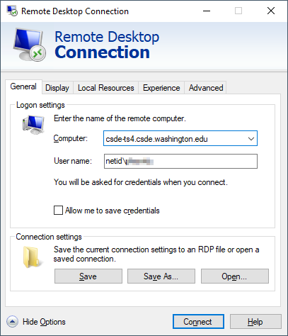
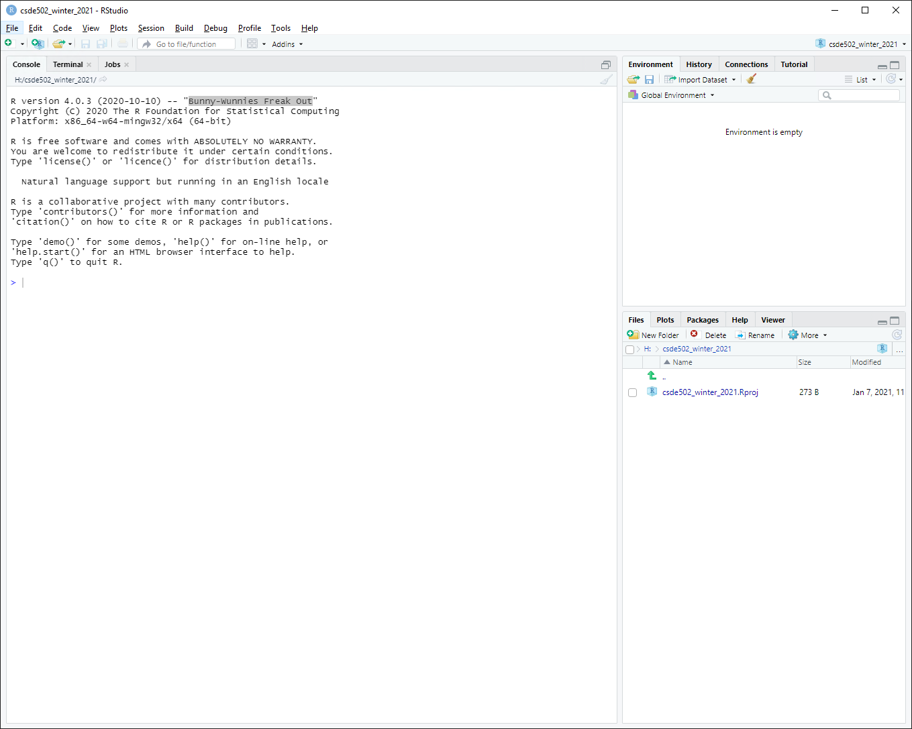

# Week 1 {#week1}


```{r, echo=FALSE, message=FALSE, error=FALSE}
library(tidyverse)
library(magrittr)
library(knitr)
library(kableExtra)
```

<h2>Topics:</h2>
* [Getting started on terminal server 4](#gettingstarted)
* [Introduction to R/RStudio/RMarkdown](#intrormd)
* [R data types](#rdatatypes)
* [R data structures](#rdatastructures)
* [File systems](#filesystems)
* [Data sets:](#datasets001)
    * Employee turnover data

## Getting started on Terminal Server 4 {#gettingstarted}
First, if you are not on campusmake sure you have the Husky OnNet VPN application running and have connected to the UW network. You should see the f5 icon in your task area:


Connect to TS4: `csde-ts4.csde.washington.edu`

If you are using the Windows Remote Desktop Protocol (RDP) connection, your connection parameters should look like this:



If you are using mRemoteNG, the connection parameters will match this:


Once you are connected you should see a number of icons on the desktop and application shortcuts in the Start area.


Open a Windows Explorer (if you are running RDP in full screen mode you should be able to use the key combination Win-E).

Before doing anything, let's change some of the annoying default settings of the Windows Explorer. Tap `File > Options`. In the `View` tab, make sure that `Always show menus` is checked and `Hide extensions for known file types` is unchecked. The latter setting is very important because we want to see the complete file name for all files at all times.


Click `Apply to Folders` so that these settings become default. Click `Yes` to the next dialog.


Now let's make a folder for the files in this course.

Navigate to This PC:


You should see the `H:` drive. This is is the mapped drive that links to your [U Drive](https://itconnect.uw.edu/wares/online-storage/u-drive-central-file-storage-for-users/), and is the place where all of the data for this course is to be stored. __Do not store any data on the `C:` drive!__ The `C:` drive can be wiped without any prior notification.

__Be very careful with your files on the U Drive!__ If you delete files, there is no "undo" functionality. When you are deleting files, you will get a warning that you should take seriously:


Navigate into `H:` and create a new folder named `csde502_winter_2021`. Note the use of lowercase letters and underscores rather than spaces. This will be discussed in the section on file systems later in this lesson.


## Introduction to R Markdown in RStudio {#intrormd}
### Create a project
Now we will use RStudio to create the first R Markdown source file and render it to HTML.

Start RStudio by either dbl-clicking the desktop shortcut or navigating to the alphabetical R section of the Start menu:


Create a new project (`File > New Project...`).


Since we just created the directory to house the project, select `Existing Directory`.


Navigate to that directory and select `Open`.


Click `Create Project`.


You will now have a blank project with only the project file.



### Create an R Markdown file from built-in RStudio functionality
Let's make an R Markdown file (`File > New File > R Markdown...`).


Do not change any of the metadata ... this is just for a quick example.


Click `OK` and then name the file `week_01.Rmd`.


#### Render the Rmd file as HTML

At the console prompt, enter `rmarkdown::render("W` and tap the `TAB` key. This should bring up a list of files that have the character "w" in the file name. Click `week_01.Rmd`.

The syntax here means "run the `render()` function from the `rmarkdown` package on the file `week_01.Rmd`"


After a few moments, the process should complete with a message that the output has been created.


You should see `week_01.html` in the list of files. Click it and select `View in Web Browser`.


You will now see the bare-bones HTML file.


Compare the output of this file with the source code in `week_01.Rmd`. Note there are section headers that begin with hash marks, and R code is indicated with the starting characters 

<code>
\`\`\`\{r\}
</code>

and the ending characters

<code>
\`\`\`
</code>

Next, we will explore some enhancements to the basic R Markdown syntax.

### Create an R Markdown file with some enhancements

Download this version of [`week_01.Rmd`](files/week_01.Rmd) and overwrite the version you just created.

If RStudio prints a message that some packages are required but are not installed, click `Install`.


Change line 3 to include your name and e-mail address. 


#### Render and view the enhanced output
Repeat the rendering process (`rmarkdown::render("Week_01.Rmd")`) 

The new HTML file has a number of enhancements, including a table of contents at the upper left, a table that is easier to read, a Leaflet map, captions and cross-references for the figures and table, an image derived from a PNG file referenced by a URL, the code used to generate various parts of the document that are produced by R code, and the complete source code for the document. A dowbnloadable version of the rendered file: [week_01.html](files/week_01.html).


Including the source code for the document is especially useful for readers of your documents because it lets them see exactly what you did. An entire research chain can be documented in this way, from reading in raw data, performing data cleaning and analysis, and generating results.

## R data types {#rdatatypes}
There are six fundamental data types in R:

1. logical
1. numeric
1. integer
1. complex
1. character
1. raw

The most atomic object in R will exist having one of those data types, described below. An atomic object of the data type can have a value, `NA` which represents an observation with no data (e.g., a missing measurement), or `NULL` which isn't really a value at all, but can still have the data type class.

You will encounter other data types, such as `Date` or `POSIXct` if you are working with dates or time stamps. These other data types are extensions of the fundamental data types.

To determine what data type an object is, use `is(obj)`, `str(obj)`, or `class(obj)`. 

```{r}
print(is("a"))

print(str(TRUE))

print(class(123.45))

print(class(as.integer(1000)))

n <- as.numeric(999999999999999999999)

print(class(n))
```

### Logical
Use `logical` values for characteristics that are either `TRUE` or `FALSE`. Note that if `logical` elements can also have an `NA` value if the observation is missing. In the following examples, 

```{r}
# evaluate as logical, test whether 1 is greater than two
a <- 1 > 2
```

```{r}
# create two numerical values, one being NA, representing ages
age_john <- 39
age_jane <- NA

# logical NA from Jane's undefined age
(jo <- age_john > 50)
(ja <- age_jane > 50)
```

Logical values are often expressed in binary format as 0 = `FALSE` and ` = `TRUE`. in R these values are interconvertible. Other software (e.g., Excel, MS Access) may convert logical values to numbers that you do not expect.

```{r}
(t <- as.logical(1))
(f <- as.logical(0))
```

### Numeric
`Numeric` values are numbers with range about 2e-308 to 2e+308, depending on the computer you are using. You can see the possible range by entering `.Machine` at the R console. These can also include decimals. For more information, see [Double-precision floating-point format](https://en.wikipedia.org/wiki/Double-precision_floating-point_format)


### Integer
`Integer` values are numerical, but can only take on whole, rather than fractional values, and have a truncated range compared to `numeric`. For example, see below, if we try to create an integer that is out of range. The object we created is an integer, but because it is out of range, is value is set to `NA`.

```{r}
i <- as.integer(999999999999999999999)

print(class(i))
```

### Complex
The `complex` type is used in mathematics and you are unlikely to use it in applied social science research unless you get into some heavy statistics. See [Complex number](https://en.wikipedia.org/wiki/Complex_number) for a full treatment.

### Character
`Character` data include the full set of keys on your keyboard that print out a character, typically [A-Z], [a-z], [0-9], punctuation, etc. The full set of ASCII characters is supported, e.g. the `accent aigu` in Café:

```{r}
print(class("Café"))
```

Also numbers can function as characters. Be careful in converting between numerical and character versions. For example, see these ZIP codes:

```{r error=TRUE}
# this is a character
my_zip <- "98115"

# it is not numeric.
my_zip + 2
```

```{r}
# we can convert it to numeric, although it would be silly to do with ZIP codes, which are nominal values
as.numeric(my_zip) + 2

# Boston has ZIP codes starting with zeros
boston_zip <- "02134"
as.numeric(boston_zip)
```

### Raw
`Raw` values are used to store raw bytes in hexadecimal format. You are unlikely to use it in applied social science research. For example, the hexadecimal value for the character `z` is `7a`:

```{r}
print(charToRaw("z"))

class(charToRaw("z"))
```


## R data structures {#rdatastructures}


There are 5 basic data structures in R, as shown in the graphic: 

1. vector
1. matrix
1. array
1. list
1. data frame

In addition, the `factor` data type is very important

### Vector
A vector is an ordered set of elements of one or more elements of the same data type and are created using the `c()` constructor function. For example, a single value is a vector:

```{r}
# create a vector of length 1
a <- 1
is(a)
```


If you try creating a vector with mixed data types, you may get unexpected results; mixing character elements with other type elements will result in character representations, e.g., 

```{r}
c(1, "a", TRUE, charToRaw("z"))
```

Results will depend on the data type you are mixing, for example because logical values can be expressed numerically, the `TRUE` and `FALSE` values are converted to `1` and `0`, respectively.

```{r}
(c(1:3, TRUE, FALSE))
```

But if a character is added, all elements are converted to characters.

```{r}
c(1:3, TRUE, FALSE, "awesome!")
```

Order is important, i.e., 

`1, 2, 3` is not the same as `1, 3, 2`

R will maintain the order of elements in vectors unless a process is initiated that changes the order of those elements:

```{r}
# a vector 
(v <- c(1, 3, 2))

(sort(v))
```

You can get some information about vectors, such as length and data type:

```{r}
# create a random normal 
set.seed(5)
normvec1000 <- rnorm(n = 1000)

length(normvec1000)
class(normvec1000)
class(normvec1000 > 1)
```

Elements of vectors are specified with their index number (1 .. n):

```{r}
v <- seq(from = 0, to = 10, by = 2)
v[4]
```

### Matrix
A matrix is like a vector, in that it an contain only one data type, but it is two-dimensional, having rows and columns. A simple example:

```{r}
# make a vector 1 to 100
(v <- 1:100)

# load to a matrix
(m1 <- matrix(v, ncol = 10, byrow = TRUE))

# different r, c ordering
(m2 <- matrix(v, ncol = 10, byrow = FALSE))
```

If you try to force a vector into a matrix whose row $\times$ col length does not match the length of the vector, the elements will be recycled, which may not be what you want. At least R will give you a warning.

```{r}
(m3 <- matrix(letters, ncol = 10, nrow = 10))
```

### Array
An array is similar to matrix, but it can have more than one dimension. These can be useful for analyzing time series data or other multidimensional data. We will not be using array data in this course, but a simple example of creating and viewing the contents of an array:

```{r}
# a vector 1 to 27
v <- 1:27

# create an array, 3 x 3 x 3
(a <- array(v, dim = c(3, 3, 3)))

# array index is r, c, m (row, column, matrix), e.g., row 1 column 2 matrix 3:
(a[1,2,3])
```

### List
R lists are ordered collections of objects that do not need to be of the same data type. Those objects can be single-value vectors, multiple-value vectors, matrices, data frames, other lists, etc. Because of this, lists are a very flexible data type. But because they can have as little or as much structure as you want, can become difficult to manage and analyze.

Here is an example of a list comprised of single value vectors of different data type. Compare this with the attempt to make a vector comprised of elements of different data type:

```{r}
(l <- list("a", 1, TRUE))
```

Let's modify that list a bit:

```{r}
(l <- list("a", 
           1:20, 
           as.logical(c(0,1,1,0))))
```

The top-level indexing for a list is denoted using two sets of square brackets. For example, the first element of our list can be accessed by `l[[1]]`. For example, the mean of element 2 is obtained by `mean(l[[2]])`: ``r mean(l[[2]])``.

To perform operations on all elements of a list, use `lapply()`:

```{r}
# show the data types
(lapply(X = l, FUN = class))

# mean, maybe?
(lapply(X = l, FUN = function(x) {mean(x)}))
```
### Factor
Factors are similar to vectors, in that they are one-dimensional ordered sets. However, factors also use informational labels. For example, you may have a variable with household income as a text value:

* "<$10,000"
* "$10,000-$549,999"
* "$50,000-$99,999"
* "$100,000-$200,000"
* ">$200,000"

As a vector:

```{r}
(income <- c("<$10,000"
, "$10,000-$49,999"
, "$50,000-$99,999"
, "$100,000-$200,000"
, ">$200,000"))
```

Because these are characters, they do not sort in proper numeric order:

```{r}
sort(income)
```

If these are treated as a factor, the levels can be set for proper ordering:

```{r}
# create a factor from income and set the levels
(income_factor <- factor(x = income, levels = income))

# sort again
(sort(income_factor))
```

As a factor, the data can also be used in statistical models and the magnitude of the variable will also be correctly ordered.

### Data frame
Other than vectors, data frames are probably the most used data type in R. You can think of data frames as matrices that allow columns with different data type. For example, you might have a data set that represents subject IDs as characters, sex or gender as text, height, weight, and age as numerical values, income as a factor, and smoking status as logical. Because a matrix requires only one data type, it would not be possible to store all of these as a matrix. An example:

```{r}
# income levels 
inc <- c("<$10,000"
, "$10,000-$49,999"
, "$50,000-$99,999"
, "$100,000-$200,000"
, ">$200,000")

BMI <-  data.frame(
   sid = c("A1001", "A1002", "B1001"),
   gender = c("Male", "Male","Female"), 
   height_cm = c(152, 171.5, 165), 
   weight_kg = c(81, 93, 78),
   age_y = c(42, 38, 26),
   income = factor(c("$50,000-$99,999", "$100,000-$200,000", "<$10,000"), levels = inc)
)
print(BMI)
```

## File systems {#filesystems}
Although a full treatment of effective uses of file systems is beyond the scope of this course, a few basic rules are worth covering:

1. Never use spaces in folder or file names. 
    Ninety-nine and 44/100ths percent of the time, most modern software will have no problems handling file names with spaces. But that 0.56% of the time when software chokes, you may wonder why your processes are failing. If your directly and file names do not have spaces, then you can at least rule that out!
1. Use lowercase letters in directory and file names.
    In the olden days (DOS), there was not case sensitivity in file names. UNIX has has always used case sensitive file names. So 
    `MyGloriousPhDDissertation.tex` and `mygloriousphddissertation.tex` could actually be different files. Macs, being based on a UNIX kernel, also employ case sensitivity in file names. But Windows? No. Consider the following: there cannot be both `foo.txt` and `FOO.txt` in the same directory. 
    
    
    So if Windows doesn't care, why should we? Save yourself some keyboarding time and confusion by using only lowercase characters in your file names.
1. Include dates in your file names.
    If you expect to have multiple files that are sequential versions of a file in progress, an alternative to using a content management system such as [git](https://git-scm.com/), particularly for binary files such as Word documents or SAS data files, is to have multiple versions of the files but including the date as part of the file name. If you expect to have multiple versions on the same date, include a lowercase alphabetical character; it is improbable that you would have more than 26 versions of a fine on a single calendar date. If you are paranoid, use a suffix number `0000`, `0002` .. `9999`. If you have ten thousand versions of the same file on a given date, you are probably doing something that is not right.
    Now that you are convinced that including dates in file names is a good idea, _please_ use the format `yyyy-mm-dd` or `yyyymmdd`. If you do so, your file names will sort in temporal order.
1. Make use of directories! 
   Although a folder containing 100,000 files can be handled programatically (if file naming conventions are used), it is not possible for a human being to visually scan 100,000 file names. If you have a lot of files for your project, consider creating directories, e.g., 
       - raw_data
       - processed_data
       - analysis_results
       - scripts
       - manuscript
1. Agonize over file names. 
    Optimally when you look at your file names, you will be able to know something about the content of the file. We spend a lot of time doing analysis and creating output. Spending an extra minute thinking about good file names is time well spent.


## Data sets {#datasets001}
### Employee turnover data

<hr>
<h4>Source code for this document</h4>
[01-week01.Rmd](01-week01.Rmd)

```{r, comment='', echo=FALSE}
cat(readLines("01-week01.Rmd"), sep = '\n')
```
