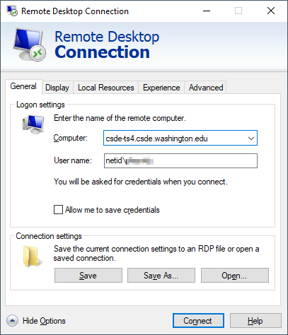
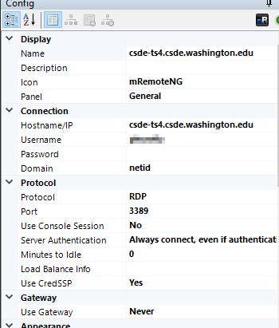
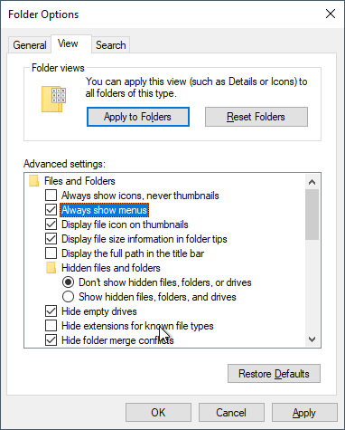
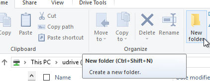
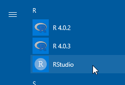
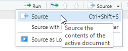
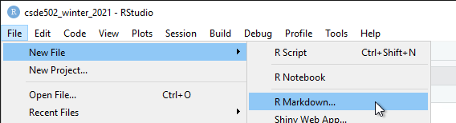
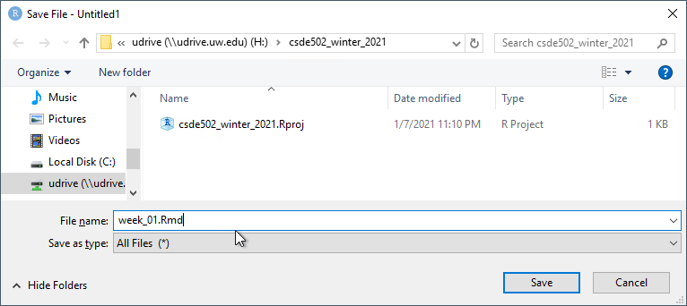
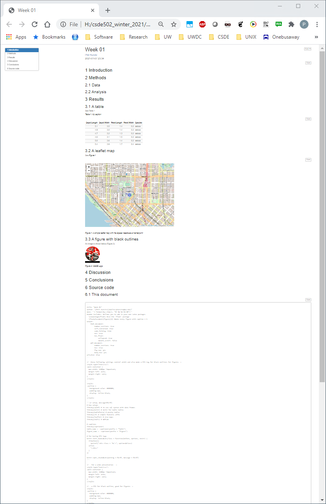

<<<<<<< HEAD
# Week 1 {#week1}


<h2>Topics:</h2>
* [Getting started on terminal server 4](#gettingstarted)
* [Introduction to R/RStudio/R Markdown](#intrormd)
* [R data types](#rdatatypes)
* [R data structures](#rdatastructures)
* [File systems](#filesystems)
* [Data manipulation in the `tidyverse`](#tidyverse)
* [Data sets:](#datasets001)
    * Employee turnover data
    
<hr>
Today's lessons will cover getting started with computing at CSDE, and quickly introduce R, RStudio, and R Markdown.

It is assumed that students in this course have a basic working knowledge of using R, including how to create variables with the assignment operator ("`<-`"), and how to run simple functions(e.g., `mean(dat$age)`). Often in courses that include using R for statistical analysis, some of the following foundations are not explained fully. This section is not intended to be a comprehensive treatment of R data types and structures, but should provide some background for students who are either relatively new at using R or who have not had a systematic introduction.    

The other main topic for today is [`tidyverse`](https://www.tidyverse.org/), which refers to a related set of R packages for data management, analysis, and display. See Hadley Wickham's [tidy tools manifesto](https://tidyverse.tidyverse.org/articles/manifesto.html) for the logic behind the suite of tools. For a brief description of the specific R packages, see [Tidyverse packages](https://www.tidyverse.org/packages/). This is not intended to be a complete introduction to the `tidyverse`, but should provide sufficient background for data handling to support most of the technical aspects of the rest of the course and CSDE 533.

## Getting started on Terminal Server 4 {#gettingstarted}
First, if you are not on campus, make sure you have the Husky OnNet VPN application running and have connected to the UW network. You should see the f5 icon in your task area:


Connect to TS4: `csde-ts4.csde.washington.edu`

If you are using the Windows Remote Desktop Protocol (RDP) connection, your connection parameters should look like this:



If you are using mRemoteNG, the connection parameters will match this:



Once you are connected you should see a number of icons on the desktop and application shortcuts in the Start area.


Open a Windows Explorer (if you are running RDP in full screen mode you should be able to use the key combination Win-E).

Before doing anything, let's change some of the annoying default settings of the Windows Explorer. Tap `File > Options`. In the `View` tab, make sure that `Always show menus` is checked and `Hide extensions for known file types` is unchecked. The latter setting is very important because we want to see the complete file name for all files at all times.



Click `Apply to Folders` so that these settings become default. Click `Yes` to the next dialog.


Now let's make a folder for the files in this course.

Navigate to This PC:


You should see the `H:` drive. This is is the mapped drive that links to your [U Drive](https://itconnect.uw.edu/wares/online-storage/u-drive-central-file-storage-for-users/), and is the place where all of the data for this course is to be stored. __Do not store any data on the `C:` drive!__ The `C:` drive can be wiped without any prior notification.

__Be very careful with your files on the U Drive!__ If you delete files, there is no "undo" functionality. When you are deleting files, you will get a warning that you should take seriously:


Navigate into `H:` and create a new folder named `csde502_winter_2022`. Note the use of lowercase letters and underscores rather than spaces. This will be discussed in the section on file systems later in this lesson.



## Introduction to R Markdown in RStudio {#intrormd}

### Create a project
Now we will use RStudio to create the first R Markdown source file and render it to HTML.

Start RStudio by either dbl-clicking the desktop shortcut or navigating to the alphabetical R section of the Start menu:



:::{.rmdnote}
A brief aside: install R packages.

To get started, because it usually takes some time to install, open a second RStudio session and at the console, to install `tidyverse`, the other packages for CSDE 502 and 533, and for this lesson, download the file [`packages.R`](tools/packages.R).

Open the file in your second RStudio session and in the upper right of the source code pane, click `Source > Source`.



Now continue on with the lesson in your original RStudio session.....
:::

Create a new project (`File > New Project...`).


Since we just created the directory to house the project, select `Existing Directory`.


Navigate to that directory and select `Open`.


Click `Create Project`.


You will now have a blank project with only the project file.


### Create an R Markdown file from built-in RStudio functionality
Let's make an R Markdown file (`File > New File > R Markdown...`).



Do not change any of the metadata ... this is just for a quick example.


Click `OK` and then name the file `week_01.Rmd`.



#### Render the Rmd file as HTML

At the console prompt, enter `R Markdown::render("W` and tap the `TAB` key. This should bring up a list of files that have the character "w" in the file name. Click `week_01.Rmd`.

The syntax here means "run the `render()` function from the `R Markdown` package on the file `week_01.Rmd`"


After a few moments, the process should complete with a message that the output has been created.


If the HTML page does not open automatically, look for `week_01.html` in the list of files. Click it and select `View in Web Browser`.


You will now see the bare-bones HTML file.


Compare the output of this file with the source code in `week_01.Rmd`. Note there are section headers that begin with hash marks, and R code is indicated with the starting characters 

<code>
\`\`\`\{r\}
</code>

and the ending characters

<code>
\`\`\`
</code>

Next, we will explore some enhancements to the basic R Markdown syntax.

### Create an R Markdown file with some enhancements

Download this version of [`week_01.Rmd`](files/week_01.Rmd) and overwrite the version you just created.

If RStudio prints a message that some packages are required but are not installed, click `Install`.


Change line 3 to include your name and e-mail address as shown. 


#### Render and view the enhanced output
Repeat the rendering process (`R Markdown::render("Week_01.Rmd")`) 

The new HTML file has a number of enhancements, including a mailto: hyperlink for your name, a table of contents at the upper left, a table that is easier to read, a Leaflet map, captions and cross-references for the figures and table, an image derived from a PNG file referenced by a URL, the code used to generate various parts of the document that are produced by R code, and the complete source code for the document. A downloadable version of the rendered file: [week_01.html](files/week_01.html).



Including the source code for the document is especially useful for readers of your documents because it lets them see exactly what you did. An entire research chain can be documented in this way, from reading in raw data, performing data cleaning and analysis, and generating results.

## R data types {#rdatatypes}
You may want to download the file [week01.Rmd](files/week01/week01.R), which contains many of the examples below.

There are six fundamental data types in R:

1. logical
1. numeric
1. integer
1. complex
1. character
1. raw

The most atomic object in R will exist having one of those data types, described below. An atomic object of the data type can have a value, `NA` which represents an observation with no data (e.g., a missing measurement), or `NULL` which isn't really a value at all, but can still have the data type class.

You will encounter other data types, such as `Date` or `POSIXct` if you are working with dates or time stamps. These other data types are extensions of the fundamental data types.

To determine what data type an object is, use `is(obj)`, `str(obj)`, or `class(obj)`. 


```r
print(is("a"))
```

```
## [1] "character"           "vector"              "data.frameRowLabels"
## [4] "SuperClassMethod"
```

```r
print(str(TRUE))
```

```
##  logi TRUE
## NULL
```

```r
print(class(123.45))
```

```
## [1] "numeric"
```

```r
print(class(as.integer(1000)))
```

```
## [1] "integer"
```

```r
n <- as.numeric(999999999999999999999)

print(class(n))
```

```
## [1] "numeric"
```

### Logical
Use `logical` values for characteristics that are either `TRUE` or `FALSE`. Note that if `logical` elements can also have an `NA` value if the observation is missing. In the following examples, 


```r
# evaluate as logical, test whether 1 is greater than two
a <- 1 > 2
```


```r
# create two numerical values, one being NA, representing ages
age_john <- 39
age_jane <- NA

# logical NA from Jane's undefined age
(jo <- age_john > 50)
```

```
## [1] FALSE
```

```r
(ja <- age_jane > 50)
```

```
## [1] NA
```

Logical values are often expressed in binary format as 0 = `FALSE` and ` = `TRUE`. in R these values are interconvertible. Other software (e.g., Excel, MS Access) may convert logical values to numbers that you do not expect.


```r
(t <- as.logical(1))
```

```
## [1] TRUE
```

```r
(f <- as.logical(0))
```

```
## [1] FALSE
```

### Numeric
`Numeric` values are numbers with range about 2e-308 to 2e+308, depending on the computer you are using. You can see the possible range by entering `.Machine` at the R console. These can also include decimals. For more information, see [Double-precision floating-point format](https://en.wikipedia.org/wiki/Double-precision_floating-point_format)


### Integer
`Integer` values are numerical, but can only take on whole, rather than fractional values, and have a truncated range compared to `numeric`. For example, see below, if we try to create an integer that is out of range. The object we created is an integer, but because it is out of range, is value is set to `NA`.


```r
i <- as.integer(999999999999999999999)
```

```
## Warning: NAs introduced by coercion to integer range
```

```r
print(class(i))
```

```
## [1] "integer"
```

### Complex
The `complex` type is used in mathematics and you are unlikely to use it in applied social science research unless you get into some heavy statistics. See [Complex number](https://en.wikipedia.org/wiki/Complex_number) for a full treatment.

### Character
`Character` data include the full set of keys on your keyboard that print out a character, typically [A-Z], [a-z], [0-9], punctuation, etc. The full set of ASCII characters is supported, e.g. the `accent aigu` in Café:


```r
print(class("Café"))
```

```
## [1] "character"
```

Also numbers can function as characters. Be careful in converting between numerical and character versions. For example, see these ZIP codes:


```r
# this is a character
my_zip <- "98115"

# it is not numeric.
my_zip + 2
```

```
## Error in my_zip + 2: non-numeric argument to binary operator
```


```r
# we can convert it to numeric, although it would be silly to do with ZIP codes, which are nominal values
as.numeric(my_zip) + 2
```

```
## [1] 98117
```

```r
# Boston has ZIP codes starting with zeros
boston_zip <- "02134"
as.numeric(boston_zip)
```

```
## [1] 2134
```

### Raw
`Raw` values are used to store raw bytes in hexadecimal format. You are unlikely to use it in applied social science research. For example, the hexadecimal value for the character `z` is `7a`:


```r
print(charToRaw("z"))
```

```
## [1] 7a
```

```r
class(charToRaw("z"))
```

```
## [1] "raw"
```


## R data structures {#rdatastructures}


There are 5 basic data structures in R, as shown in the graphic: 

1. vector
1. matrix
1. array
1. list
1. data frame

In addition, the `factor` data type is very important

### Vector
A vector is an ordered set of elements of one or more elements of the same data type and are created using the `c()` constructor function. For example, a single value is a vector:


```r
# create a vector of length 1
a <- 1
is(a)
```

```
## [1] "numeric" "vector"
```


If you try creating a vector with mixed data types, you may get unexpected results; mixing character elements with other type elements will result in character representations, e.g., 


```r
c(1, "a", TRUE, charToRaw("z"))
```

```
## [1] "1"    "a"    "TRUE" "7a"
```

Results will depend on the data type you are mixing, for example because logical values can be expressed numerically, the `TRUE` and `FALSE` values are converted to `1` and `0`, respectively.


```r
(c(1:3, TRUE, FALSE))
```

```
## [1] 1 2 3 1 0
```

But if a character is added, all elements are converted to characters.


```r
c(1:3, TRUE, FALSE, "awesome!")
```

```
## [1] "1"        "2"        "3"        "TRUE"     "FALSE"    "awesome!"
```

Order is important, i.e., 

`1, 2, 3` is not the same as `1, 3, 2`

R will maintain the order of elements in vectors unless a process is initiated that changes the order of those elements:


```r
# a vector 
(v <- c(1, 3, 2))
```

```
## [1] 1 3 2
```

```r
(sort(v))
```

```
## [1] 1 2 3
```

You can get some information about vectors, such as length and data type:


```r
# create a random normal 
set.seed(5)
normvec1000 <- rnorm(n = 1000)

length(normvec1000)
```

```
## [1] 1000
```

```r
class(normvec1000)
```

```
## [1] "numeric"
```

```r
class(normvec1000 > 1)
```

```
## [1] "logical"
```

Elements of vectors are specified with their index number (1 .. n):


```r
v <- seq(from = 0, to = 10, by = 2)
v[4]
```

```
## [1] 6
```

### Matrix
A matrix is like a vector, in that it an contain only one data type, but it is two-dimensional, having rows and columns. A simple example:


```r
# make a vector 1 to 100
(v <- 1:100)
```

```
##   [1]   1   2   3   4   5   6   7   8   9  10  11  12  13  14  15  16  17  18
##  [19]  19  20  21  22  23  24  25  26  27  28  29  30  31  32  33  34  35  36
##  [37]  37  38  39  40  41  42  43  44  45  46  47  48  49  50  51  52  53  54
##  [55]  55  56  57  58  59  60  61  62  63  64  65  66  67  68  69  70  71  72
##  [73]  73  74  75  76  77  78  79  80  81  82  83  84  85  86  87  88  89  90
##  [91]  91  92  93  94  95  96  97  98  99 100
```

```r
# load to a matrix
(m1 <- matrix(v, ncol = 10, byrow = TRUE))
```

```
##       [,1] [,2] [,3] [,4] [,5] [,6] [,7] [,8] [,9] [,10]
##  [1,]    1    2    3    4    5    6    7    8    9    10
##  [2,]   11   12   13   14   15   16   17   18   19    20
##  [3,]   21   22   23   24   25   26   27   28   29    30
##  [4,]   31   32   33   34   35   36   37   38   39    40
##  [5,]   41   42   43   44   45   46   47   48   49    50
##  [6,]   51   52   53   54   55   56   57   58   59    60
##  [7,]   61   62   63   64   65   66   67   68   69    70
##  [8,]   71   72   73   74   75   76   77   78   79    80
##  [9,]   81   82   83   84   85   86   87   88   89    90
## [10,]   91   92   93   94   95   96   97   98   99   100
```

```r
# different r, c ordering
(m2 <- matrix(v, ncol = 10, byrow = FALSE))
```

```
##       [,1] [,2] [,3] [,4] [,5] [,6] [,7] [,8] [,9] [,10]
##  [1,]    1   11   21   31   41   51   61   71   81    91
##  [2,]    2   12   22   32   42   52   62   72   82    92
##  [3,]    3   13   23   33   43   53   63   73   83    93
##  [4,]    4   14   24   34   44   54   64   74   84    94
##  [5,]    5   15   25   35   45   55   65   75   85    95
##  [6,]    6   16   26   36   46   56   66   76   86    96
##  [7,]    7   17   27   37   47   57   67   77   87    97
##  [8,]    8   18   28   38   48   58   68   78   88    98
##  [9,]    9   19   29   39   49   59   69   79   89    99
## [10,]   10   20   30   40   50   60   70   80   90   100
```

If you try to force a vector into a matrix whose row $\times$ col length does not match the length of the vector, the elements will be recycled, which may not be what you want. At least R will give you a warning.


```r
(m3 <- matrix(letters, ncol = 10, nrow = 10))
```

```
## Warning in matrix(letters, ncol = 10, nrow = 10): data length [26] is not a sub-
## multiple or multiple of the number of rows [10]
```

```
##       [,1] [,2] [,3] [,4] [,5] [,6] [,7] [,8] [,9] [,10]
##  [1,] "a"  "k"  "u"  "e"  "o"  "y"  "i"  "s"  "c"  "m"  
##  [2,] "b"  "l"  "v"  "f"  "p"  "z"  "j"  "t"  "d"  "n"  
##  [3,] "c"  "m"  "w"  "g"  "q"  "a"  "k"  "u"  "e"  "o"  
##  [4,] "d"  "n"  "x"  "h"  "r"  "b"  "l"  "v"  "f"  "p"  
##  [5,] "e"  "o"  "y"  "i"  "s"  "c"  "m"  "w"  "g"  "q"  
##  [6,] "f"  "p"  "z"  "j"  "t"  "d"  "n"  "x"  "h"  "r"  
##  [7,] "g"  "q"  "a"  "k"  "u"  "e"  "o"  "y"  "i"  "s"  
##  [8,] "h"  "r"  "b"  "l"  "v"  "f"  "p"  "z"  "j"  "t"  
##  [9,] "i"  "s"  "c"  "m"  "w"  "g"  "q"  "a"  "k"  "u"  
## [10,] "j"  "t"  "d"  "n"  "x"  "h"  "r"  "b"  "l"  "v"
```

### Array
An array is similar to matrix, but it can have more than one dimension. These can be useful for analyzing time series data or other multidimensional data. We will not be using array data in this course, but a simple example of creating and viewing the contents of an array:


```r
# a vector 1 to 27
v <- 1:27

# create an array, 3 x 3 x 3
(a <- array(v, dim = c(3, 3, 3)))
```

```
## , , 1
## 
##      [,1] [,2] [,3]
## [1,]    1    4    7
## [2,]    2    5    8
## [3,]    3    6    9
## 
## , , 2
## 
##      [,1] [,2] [,3]
## [1,]   10   13   16
## [2,]   11   14   17
## [3,]   12   15   18
## 
## , , 3
## 
##      [,1] [,2] [,3]
## [1,]   19   22   25
## [2,]   20   23   26
## [3,]   21   24   27
```

```r
# array index is r, c, m (row, column, matrix), e.g., row 1 column 2 matrix 3:
(a[1,2,3])
```

```
## [1] 22
```

### List
R lists are ordered collections of objects that do not need to be of the same data type. Those objects can be single-value vectors, multiple-value vectors, matrices, data frames, other lists, etc. Because of this, lists are a very flexible data type. But because they can have as little or as much structure as you want, can become difficult to manage and analyze.

Here is an example of a list comprised of single value vectors of different data type. Compare this with the attempt to make a vector comprised of elements of different data type:


```r
(l <- list("a", 1, TRUE))
```

```
## [[1]]
## [1] "a"
## 
## [[2]]
## [1] 1
## 
## [[3]]
## [1] TRUE
```

Let's modify that list a bit:


```r
(l <- list("a", 
           1:20, 
           as.logical(c(0,1,1,0))))
```

```
## [[1]]
## [1] "a"
## 
## [[2]]
##  [1]  1  2  3  4  5  6  7  8  9 10 11 12 13 14 15 16 17 18 19 20
## 
## [[3]]
## [1] FALSE  TRUE  TRUE FALSE
```

The top-level indexing for a list is denoted using two sets of square brackets. For example, the first element of our list can be accessed by `l[[1]]`. For example, the mean of element 2 is obtained by `mean(l[[2]])`: `10.5`.

To perform operations on all elements of a list, use `lapply()`:


```r
# show the data types
(lapply(X = l, FUN = class))
```

```
## [[1]]
## [1] "character"
## 
## [[2]]
## [1] "integer"
## 
## [[3]]
## [1] "logical"
```

```r
# mean, maybe?
(lapply(X = l, FUN = function(x) {mean(x)}))
```

```
## Warning in mean.default(x): argument is not numeric or logical: returning NA
```

```
## [[1]]
## [1] NA
## 
## [[2]]
## [1] 10.5
## 
## [[3]]
## [1] 0.5
```
### Factor
Factors are similar to vectors, in that they are one-dimensional ordered sets. However, factors also use informational labels. For example, you may have a variable with household income as a text value:

* "<$10,000"
* "$10,000-$549,999"
* "$50,000-$99,999"
* "$100,000-$200,000"
* ">$200,000"

As a vector:


```r
(income <- c("<$10,000"
, "$10,000-$49,999"
, "$50,000-$99,999"
, "$100,000-$200,000"
, ">$200,000"))
```

```
## [1] "<$10,000"          "$10,000-$49,999"   "$50,000-$99,999"  
## [4] "$100,000-$200,000" ">$200,000"
```

Because these are characters, they do not sort in proper numeric order:


```r
sort(income)
```

```
## [1] "$10,000-$49,999"   "$100,000-$200,000" "$50,000-$99,999"  
## [4] "<$10,000"          ">$200,000"
```

If these are treated as a factor, the levels can be set for proper ordering:


```r
# create a factor from income and set the levels
(income_factor <- factor(x = income, levels = income))
```

```
## [1] <$10,000          $10,000-$49,999   $50,000-$99,999   $100,000-$200,000
## [5] >$200,000        
## 5 Levels: <$10,000 $10,000-$49,999 $50,000-$99,999 ... >$200,000
```

```r
# sort again
(sort(income_factor))
```

```
## [1] <$10,000          $10,000-$49,999   $50,000-$99,999   $100,000-$200,000
## [5] >$200,000        
## 5 Levels: <$10,000 $10,000-$49,999 $50,000-$99,999 ... >$200,000
```

As a factor, the data can also be used in statistical models and the magnitude of the variable will also be correctly ordered.

### Data frame
Other than vectors, data frames are probably the most used data type in R. You can think of data frames as matrices that allow columns with different data type. For example, you might have a data set that represents subject IDs as characters, sex or gender as text, height, weight, and age as numerical values, income as a factor, and smoking status as logical. Because a matrix requires only one data type, it would not be possible to store all of these as a matrix. An example:


```r
# income levels 
inc <- c("<$10,000"
, "$10,000-$49,999"
, "$50,000-$99,999"
, "$100,000-$200,000"
, ">$200,000")

BMI <-  data.frame(
   sid = c("A1001", "A1002", "B1001"),
   gender = c("Male", "Male","Female"), 
   height_cm = c(152, 171.5, 165), 
   weight_kg = c(81, 93, 78),
   age_y = c(42, 38, 26),
   income = factor(c("$50,000-$99,999", "$100,000-$200,000", "<$10,000"), levels = inc)
)
print(BMI)
```

```
##     sid gender height_cm weight_kg age_y            income
## 1 A1001   Male     152.0        81    42   $50,000-$99,999
## 2 A1002   Male     171.5        93    38 $100,000-$200,000
## 3 B1001 Female     165.0        78    26          <$10,000
```

## File systems {#filesystems}
Although a full treatment of effective uses of file systems is beyond the scope of this course, a few basic rules are worth covering:

1. Never use spaces in folder or file names. 
    Ninety-nine and 44/100ths percent of the time, most modern software will have no problems handling file names with spaces. But that 0.56% of the time when software chokes, you may wonder why your processes are failing. If your directly and file names do not have spaces, then you can at least rule that out!
1. Use lowercase letters in directory and file names.
    In the olden days (MS-DOS), there was not case sensitivity in file names. UNIX has has always used case sensitive file names. So 
    `MyGloriousPhDDissertation.tex` and `mygloriousphddissertation.tex` could actually be different files. Macs, being based on a UNIX kernel, also employ case sensitivity in file names. But Windows? No. Consider the following: there cannot be both `foo.txt` and `FOO.txt` in the same directory. 
    
    
    So if Windows doesn't care, why should we? Save yourself some keyboarding time and confusion by using only lowercase characters in your file names.
1. Include dates in your file names.
    If you expect to have multiple files that are sequential versions of a file in progress, an alternative to using a content management system such as [git](https://git-scm.com/), particularly for binary files such as Word documents or SAS data files, is to have multiple versions of the files but including the date as part of the file name. If you expect to have multiple versions on the same date, include a lowercase alphabetical character; it is improbable that you would have more than 26 versions of a fine on a single calendar date. If you are paranoid, use a suffix number `0000`, `0002` .. `9999`. If you have ten thousand versions of the same file on a given date, you are probably doing something that is not right.
    Now that you are convinced that including dates in file names is a good idea, _please_ use the format `yyyy-mm-dd` or `yyyymmdd`. If you do so, your file names will sort in temporal order.
1. Make use of directories! 
   Although a folder containing 100,000 files can be handled programatically (if file naming conventions are used), it is not possible for a human being to visually scan 100,000 file names. If you have a lot of files for your project, consider creating directories, e.g., 
       - raw_data
       - processed_data
       - analysis_results
       - scripts
       - manuscript
1. Agonize over file names. 
    Optimally when you look at your file names, you will be able to know something about the content of the file. We spend a lot of time doing analysis and creating output. Spending an extra minute thinking about good file names is time well spent.


## Data manipulation in the `tidyverse` {#tidyverse}
One of the R packages we will use frequently is [`tidyverse`](https://www.tidyverse.org/packages/), which is itself a collection of several other packages, each with a specific domain: 

* `ggplot2` (graphics)
* `dplyr` (data manipulation)
* `tidyr` (reformatting data for efficient processing)
* `readr` (reading rectangular R x C data)
* `purrr` (functional programming, e.g., to replace `for()` loops)
* `tibble` (enhanced data frames)
* `stringr` (string, i.e., text manipulation)
* `forcats` (handling factor, i.e., categorical variables)

We will touch on some of these during this course, but there will not be a full review or treatment of the `tidyverse`.

This section will introduce some of the main workhorse functions in tidy data handling. 

Installing tidyverse is straightforward but it may take some time to download and install all of the packages. If you have not done so yet, use

```
install.packages("tidyverse")
```

For today's lesson we will be using one of the Add Health public use data sets, [AHwave1_v1.dta](data/AHwave1_v1.dta). 


```r
# load pacman if necessary
package.check <- lapply("pacman", FUN = function(x) {
    if (!require(x, character.only = TRUE)) {
        install.packages(x, dependencies = TRUE)
        library(x, character.only = TRUE)
    }
})

# load readstata13 if necessary
pacman::p_load(readstata13)

# read the dta file
dat <- readstata13::read.dta13(file.path(myurl, "data/AHwave1_v1.dta"))
```

The data set includes variable labels, which make handling the data easier. Here we print the column names and their labels. Wrapping this in a `DT::data_table` presents a nice interface for showing only a few variables at a time and that allows sorting and searching.


```r
x <- data.frame(colname = names(dat), label = attributes(dat)$var.labels)
DT::datatable(data = x, caption = "Column names and labels in AHwave1_v1.dta.")
```

```{=html}
<div id="htmlwidget-a43fb2b03822b32eaf61" style="width:100%;height:auto;" class="datatables html-widget"></div>
<script type="application/json" data-for="htmlwidget-a43fb2b03822b32eaf61">{"x":{"filter":"none","vertical":false,"caption":"<caption>Column names and labels in AHwave1_v1.dta.<\/caption>","data":[["1","2","3","4","5","6","7","8","9","10","11","12","13","14","15","16","17","18","19","20","21","22","23","24","25","26","27","28","29","30","31","32","33","34","35","36","37","38","39","40","41","42","43","44","45","46","47","48","49","50","51","52","53","54","55","56","57","58","59","60","61","62","63","64","65","66","67","68","69","70","71","72","73","74","75","76","77","78","79","80","81","82","83","84","85","86","87","88","89","90","91","92","93","94","95","96","97","98","99","100","101","102","103"],["aid","imonth","iday","iyear","bio_sex","h1gi1m","h1gi1y","h1gi4","h1gi5a","h1gi5b","h1gi5c","h1gi5d","h1gi5e","h1gi5f","h1gi6a","h1gi6b","h1gi6c","h1gi6d","h1gi6e","h1gi7a","h1gi7b","h1gi7c","h1gi7d","h1gi7e","h1gi7f","h1gi7g","h1gi8","h1gi9","h1gh1","h1fs1","h1fs2","h1fs3","h1fs4","h1fs5","h1fs6","h1fs7","h1fs8","h1fs9","h1fs10","h1fs11","h1fs12","h1fs13","h1fs14","h1fs15","h1fs16","h1fs17","h1fs18","h1fs19","h1hr2a","h1hr3a","h1hr4a","h1hr5a","h1hr6a","h1hr7a","h1hr8a","h1hr2b","h1hr3b","h1hr4b","h1hr5b","h1hr6b","h1hr7b","h1hr8b","h1hr2c","h1hr3c","h1hr4c","h1hr5c","h1hr6c","h1hr7c","h1hr8c","h1hr2d","h1hr3d","h1hr4d","h1hr5d","h1hr6d","h1hr7d","h1hr8d","h1hr2e","h1hr3e","h1hr4e","h1hr5e","h1hr6e","h1hr7e","h1hr8e","h1kq1a","h1kq1b","h1kq2a","h1kq2b","h1kq3a","h1kq3b","h1kq4a","h1kq4b","h1kq5a","h1kq5b","h1kq6a","h1kq6b","h1kq7a","h1kq7b","h1kq8a","h1kq8b","h1kq9a","h1kq9b","h1kq10a","h1kq10b"],["RESPONDENT IDENTIFIER","MONTH OF INTERVIEW-W1","DAY OF INTERVIEW-W1","YEAR OF INTERVIEW-W1","BIOLOGICAL SEX-W1","S1Q1 BIRTH MONTH-W1","S1Q1 BIRTH YEAR-W1","S1Q4 ARE YOU OF HISPANIC ORIGIN-W1","S1Q5A HISPANIC-MEXICAN-W1","S1Q5B HISPANIC-CHICANO-W1","S1Q5C HISPANIC-CUBAN-W1","S1Q5D HISPANIC-PUERTO RICAN-W1","S1Q5E HISPANIC-CENTRAL/SO AMER-W1","S1Q5F HISPANIC-OTHER-W1","S1Q6A RACE-WHITE-W1","S1Q6B RACE-AFRICAN AMERICAN-W1","S1Q6C RACE-AMERICAN INDIAN-W1","S1Q6D RACE-ASIAN-W1","S1Q6E RACE-OTHER-W1","S1Q7A ASIAN-CHINESE-W1","S1Q7B ASIAN-FILIPINO-W1","S1Q7C ASIAN-JAPANESE-W1","S1Q7D ASIAN-ASIAN INDIAN-W1","S1Q7E ASIAN-KOREAN-W1","S1Q7F ASIAN-VIETNAMESE-W1","S1Q7G ASIAN-OTHER-W1","S1Q8 RACE-SINGLE CATEGORY-W1","S1Q9 RACE-INTERVIEWER OBSERVATION-W1","S3Q1 GENERAL HEALTH-W1","S10Q1 BOTHERED BY THINGS-W1","S10Q2 POOR APPETITE-W1","S10Q3 HAD THE BLUES-W1","S10Q4 JUST AS GOOD AS OTHER PEOPLE-W1","S10Q5 TROUBLE KEEPING MIND FOCUSED-W1","S10Q6 FELT DEPRESSED-W1","S10Q7 TOO TIRED TO DO THINGS-W1","S10Q8 HOPEFUL ABOUT THE FUTURE-W1","S10Q9 LIFE HAD BEEN A FAILURE-W1","S10Q10 FEARFUL-W1","S10Q11 HAPPY-W1","S10Q12 TALKED LESS THAN USUAL-W1","S10Q13 FELT LONELY-W1","S10Q14 PEOPLE UNFRIENDLY TO YOU-W1","S10Q15 ENJOYED LIFE-W1","S10Q16 FELT SAD-W1","S10Q17 FELT PEOPLE DISLIKE YOU-W1","S10Q18 HARD TO START DOING THINGS-W1","S10Q19 LIFE NOT WORTH LIVING-W1","S11Q2A HH MEMBER 1-GENDER-W1","S11Q3A HH MEMBER 1-RELATION TO YOU-W1","S11Q4A HH MEMBER 1-OFFSPRING-W1","S11Q5A HH MEMBER 1-SIBLING-W1","S11Q6A HH MEMBER 1-PARENT-W1","S11Q7A HH MEMBER 1-AGE-W1","S11Q8A HH MEMBER 1-APPROXIMATE AGE-W1","S11Q2B HH MEMBER 2-GENDER-W1","S11Q3B HH MEMBER 2-RELATION TO YOU-W1","S11Q4B HH MEMBER 2-OFFSPRING-W1","S11Q5B HH MEMBER 2-SIBLING-W1","S11Q6B HH MEMBER 2-PARENT-W1","S11Q7B HH MEMBER 2-AGE-W1","S11Q8B HH MEMBER 2-APPROXIMATE AGE-W1","S11Q2C HH MEMBER 3-GENDER-W1","S11Q3C HH MEMBER 3-RELATION TO YOU-W1","S11Q4C HH MEMBER 3-OFFSPRING-W1","S11Q5C HH MEMBER 3-SIBLING-W1","S11Q6C HH MEMBER 3-PARENT-W1","S11Q7C HH MEMBER 3-AGE-W1","S11Q8C HH MEMBER 3-APPROXIMATE AGE-W1","S11Q2D HH MEMBER 4-GENDER-W1","S11Q3D HH MEMBER 4-RELATION TO YOU-W1","S11Q4D HH MEMBER 4-OFFSPRING-W1","S11Q5D HH MEMBER 4-SIBLING-W1","S11Q6D HH MEMBER 4-PARENT-W1","S11Q7D HH MEMBER 4-AGE-W1","S11Q8D HH MEMBER 4-APPROXIMATE AGE-W1","S11Q2E HH MEMBER 5-GENDER-W1","S11Q3E HH MEMBER 5-RELATION TO YOU-W1","S11Q4E HH MEMBER 5-OFFSPRING-W1","S11Q5E HH MEMBER 5-SIBLING-W1","S11Q6E HH MEMBER 5-PARENT-W1","S11Q7E HH MEMBER 5-AGE-W1","S11Q8E HH MEMBER 5-APPROXIMATE AGE-W1","S19Q1A SPERM DIES W/I 6 HOURS-W1","S19Q1B CONFIDENT 1A IS CORRECT-W1","S19Q2A CONDOM-MAN SHOULD W/D IMMED-W1","S19Q2B CONFIDENT 2A IS CORRECT-W1","S19Q3A WOMAN OVULATES 14 DAYS AFT PD-W1","S19Q3B CONFIDENT 3A IS CORRECT-W1","S19Q4A LAMBSKIN IS BETTER THAN LATEX-W1","S19Q4B CONFIDENT 4A IS CORRECT-W1","S19Q5A CONDOM SHOULD FIT TIGHTLY-W1","S19Q5B CONFIDENT 5A IS CORRECT-W1","S19Q6A VASELINE CANBE USED W/ CONDOMS-W1","S19Q6B CONFIDENT 6A IS CORRECT-W1","S19Q7A MOST FERTILE BEFORE PERIOD-W1","S19Q7B CONFIDENT 7A IS CORRECT-W1","S19Q8A PREGN POSSIBLE W/ OUTSIDE EJAC-W1","S19Q8B CONFIDENT 8A IS CORRECT-W1","S19Q9A ONLY PENIS TIP NEEDS COVERAGE-W1","S19Q9B CONFIDENT 9A IS CORRECT-W1","S19Q10A MOST FERTILE DURING PERIOD-W1","S19Q10B CONFIDENT 10A IS CORRECT-W1"]],"container":"<table class=\"display\">\n  <thead>\n    <tr>\n      <th> <\/th>\n      <th>colname<\/th>\n      <th>label<\/th>\n    <\/tr>\n  <\/thead>\n<\/table>","options":{"columnDefs":[{"orderable":false,"targets":0}],"order":[],"autoWidth":false,"orderClasses":false}},"evals":[],"jsHooks":[]}</script>
```


### magrittr{#magrittr}


The R package [`magrittr`](https://cran.r-project.org/web/packages/magrittr/index.html) allows the use of "pipes". In UNIX, pipes were used to take the output of one program and to feed as input to another program. For example, the UNIX command `cat` prints the contents of a text file. This would print the contents of the file `00README.txt`:

```cat 00README.txt```

but with large files, the entire contents would scroll by too fast to read. Using a "pipe", denoted with the vertical bar character `|` allowed using the `more` command to print one screen at a time by tapping the `Enter` key for each screen full of text:

```cat 00README.txt | more```

As shown in these two screen captures:


The two main pipe operators we will use in `magrittr` are `%>%` and '%<>%'.

`%>%` is the pipe operator, which functions as a UNIX pipe, that is, to take something on the left hand side of the operator and feed it to the right hand side. 

`%<>%` is the assignment pipe operator, which takes something on the left hand side of the operator, feeds it to the right hand side, and replaces the object on the left-hand side.

For a simple example of the pipe, to list only the first 6 lines of a data frame in base R, we use `head()`, e.g.,


```r
head(iris)
```

```
##   Sepal.Length Sepal.Width Petal.Length Petal.Width Species
## 1          5.1         3.5          1.4         0.2  setosa
## 2          4.9         3.0          1.4         0.2  setosa
## 3          4.7         3.2          1.3         0.2  setosa
## 4          4.6         3.1          1.5         0.2  setosa
## 5          5.0         3.6          1.4         0.2  setosa
## 6          5.4         3.9          1.7         0.4  setosa
```

using a tidy version of this:


```r
iris %>% head()
```

```
##   Sepal.Length Sepal.Width Petal.Length Petal.Width Species
## 1          5.1         3.5          1.4         0.2  setosa
## 2          4.9         3.0          1.4         0.2  setosa
## 3          4.7         3.2          1.3         0.2  setosa
## 4          4.6         3.1          1.5         0.2  setosa
## 5          5.0         3.6          1.4         0.2  setosa
## 6          5.4         3.9          1.7         0.4  setosa
```

In the R base version, we first read `head`, so we know we will be printing the first 6 elements of something, but we don't know what that "something" is. We have to read ahead to know we are reading the first 6 records of `iris`. In the tidy version, we start by knowing we are doing something to the data set, after which we know we are printing the first 6 records.

In base R functions, the process is evaluated from the inside out. For example, to get the mean sepal length of the _setosa_ species in iris, we would do this:


```r
mean(iris[iris$Species == 'setosa', "Sepal.Length"])
```

```
## [1] 5.006
```

From the inside out, we read that we are making a subset of `iris` where Species = "setosa", we are selecting the column "Sepal.Length", and taking the mean. However, it requires reading from the inside out. For a large set of nested functions, we would have ` y <- f(g(h((i(x)))))`, which would require first creating the innermost function (`i()`) and then working outward.

In a tidy approach this would be more like y <- x %>% i() %>% h() %>% g() %>% f()` because the first function applied to the data set `x` is `i()`. Revisiting the mean sepal length of _setosa_ irises, example, under a tidy approach we would do this:


```r
iris %>% filter(Species == 'setosa') %>% summarise(mean(Sepal.Length))
```

```
##   mean(Sepal.Length)
## 1              5.006
```

Which, read from left to right, translates to "using the iris data frame, make a subset of records where species is _setosa_, and summarize those records to get the mean value of sepal length." The tidy version is intended to be easier to write, read, and understand. The command uses the `filter()` function, which will be described below.

### Data subsetting (dplyr)
`dplyr` is the tidyverse R package used most frequently for data manipulation. Selection of records (i.e., subsetting) is done using logical tests to determine what is in the selected set. First we will look at logical tests and then we will cover subsetting rows and columns from data frames.

##### Logical tests
If elements meet a logical test, they will end up in the selected set. If data frame records have values in variables that meet logical criteria, the records will be selected. 

Some logical tests are shown below.

###### `==`: equals


```r
# numeric tests
(1 == 2)
```

```
## [1] FALSE
```


```r
(1 == 3 - 2)
```

```
## [1] TRUE
```


```r
# character test (actually a factor)
(dat$imonth %>% head() %>% str_c(collapse = ", "))
```

```
## [1] "(6) June, (5) May, (6) June, (7) July, (7) July, (6) June"
```

```r
((dat$imonth == "(6) June") %>% head())
```

```
## [1]  TRUE FALSE  TRUE FALSE FALSE  TRUE
```


```r
# character test for multiple patterns
(dat$imonth %in% c("(6) June", "(7) July") %>% head())
```

```
## [1]  TRUE FALSE  TRUE  TRUE  TRUE  TRUE
```


###### `>`, `>=`, `<`, `<=`: numeric comparisons


```r
1 < 2
```

```
## [1] TRUE
```


```r
1 > 2
```

```
## [1] FALSE
```


```r
1 <= -10:10
```

```
##  [1] FALSE FALSE FALSE FALSE FALSE FALSE FALSE FALSE FALSE FALSE FALSE  TRUE
## [13]  TRUE  TRUE  TRUE  TRUE  TRUE  TRUE  TRUE  TRUE  TRUE
```


```r
1 >= -10:10
```

```
##  [1]  TRUE  TRUE  TRUE  TRUE  TRUE  TRUE  TRUE  TRUE  TRUE  TRUE  TRUE  TRUE
## [13] FALSE FALSE FALSE FALSE FALSE FALSE FALSE FALSE FALSE
```

###### `!=`: not equals


```r
1 != 2
```

```
## [1] TRUE
```


```r
# those of the first 6 days that are not 14
(dat$iday %>% head())
```

```
## [1] 23  5 27 14 14 12
```

```r
((dat$iday != 14) %>% head())
```

```
## [1]  TRUE  TRUE  TRUE FALSE FALSE  TRUE
```

###### `!`: invert, or "not"
Sometimes it is more convenient to negate a single condition rather than enumerating all possible matching conditions.


```r
dat$imonth %>% head(20)
```

```
##  [1] (6) June      (5) May       (6) June      (7) July      (7) July     
##  [6] (6) June      (5) May       (6) June      (6) June      (8) August   
## [11] (9) September (5) May       (6) June      (7) July      (5) May      
## [16] (5) May       (7) July      (5) May       (8) August    (7) July     
## 10 Levels: (1) January (4) April (5) May (6) June (7) July ... (12) December
```

```r
((!dat$imonth %in% c("(6) June", "(7) July")) %>% head(20))
```

```
##  [1] FALSE  TRUE FALSE FALSE FALSE FALSE  TRUE FALSE FALSE  TRUE  TRUE  TRUE
## [13] FALSE FALSE  TRUE  TRUE FALSE  TRUE  TRUE FALSE
```

#### Subset rows (`filter()`)
The `filter()` function creates a subset of records based on a logical test. Logical tests can be combined as "and" statements using the `&` operator and "or" statements using the `|` operator. Here we will perform a few filters on a subset of the data.


```r
# first 20 records, fist 10 columns
dat_sub <- dat[1:20, 1:10]
kable(dat_sub, format = "html") %>% kable_styling(bootstrap_options = c("striped", "hover", "condensed", "responsive"), full_width = F, position = "left")
```

<table class="table table-striped table-hover table-condensed table-responsive" style="width: auto !important; ">
 <thead>
  <tr>
   <th style="text-align:left;"> aid </th>
   <th style="text-align:left;"> imonth </th>
   <th style="text-align:right;"> iday </th>
   <th style="text-align:left;"> iyear </th>
   <th style="text-align:left;"> bio_sex </th>
   <th style="text-align:left;"> h1gi1m </th>
   <th style="text-align:left;"> h1gi1y </th>
   <th style="text-align:left;"> h1gi4 </th>
   <th style="text-align:left;"> h1gi5a </th>
   <th style="text-align:left;"> h1gi5b </th>
  </tr>
 </thead>
<tbody>
  <tr>
   <td style="text-align:left;"> 57100270 </td>
   <td style="text-align:left;"> (6) June </td>
   <td style="text-align:right;"> 23 </td>
   <td style="text-align:left;"> (95) 1995 </td>
   <td style="text-align:left;"> (2) Female </td>
   <td style="text-align:left;"> (10) October </td>
   <td style="text-align:left;"> (77) 1977 </td>
   <td style="text-align:left;"> (0) No </td>
   <td style="text-align:left;"> (7) Legitimate skip (not Hispanic) </td>
   <td style="text-align:left;"> (7) Legitimate skip (not Hispanic) </td>
  </tr>
  <tr>
   <td style="text-align:left;"> 57101310 </td>
   <td style="text-align:left;"> (5) May </td>
   <td style="text-align:right;"> 5 </td>
   <td style="text-align:left;"> (95) 1995 </td>
   <td style="text-align:left;"> (2) Female </td>
   <td style="text-align:left;"> (11) November </td>
   <td style="text-align:left;"> (76) 1976 </td>
   <td style="text-align:left;"> (0) No </td>
   <td style="text-align:left;"> (7) Legitimate skip (not Hispanic) </td>
   <td style="text-align:left;"> (7) Legitimate skip (not Hispanic) </td>
  </tr>
  <tr>
   <td style="text-align:left;"> 57103171 </td>
   <td style="text-align:left;"> (6) June </td>
   <td style="text-align:right;"> 27 </td>
   <td style="text-align:left;"> (95) 1995 </td>
   <td style="text-align:left;"> (1) Male </td>
   <td style="text-align:left;"> (10) October </td>
   <td style="text-align:left;"> (79) 1979 </td>
   <td style="text-align:left;"> (0) No </td>
   <td style="text-align:left;"> (7) Legitimate skip (not Hispanic) </td>
   <td style="text-align:left;"> (7) Legitimate skip (not Hispanic) </td>
  </tr>
  <tr>
   <td style="text-align:left;"> 57103869 </td>
   <td style="text-align:left;"> (7) July </td>
   <td style="text-align:right;"> 14 </td>
   <td style="text-align:left;"> (95) 1995 </td>
   <td style="text-align:left;"> (1) Male </td>
   <td style="text-align:left;"> (1) January </td>
   <td style="text-align:left;"> (77) 1977 </td>
   <td style="text-align:left;"> (0) No </td>
   <td style="text-align:left;"> (7) Legitimate skip (not Hispanic) </td>
   <td style="text-align:left;"> (7) Legitimate skip (not Hispanic) </td>
  </tr>
  <tr>
   <td style="text-align:left;"> 57104553 </td>
   <td style="text-align:left;"> (7) July </td>
   <td style="text-align:right;"> 14 </td>
   <td style="text-align:left;"> (95) 1995 </td>
   <td style="text-align:left;"> (2) Female </td>
   <td style="text-align:left;"> (6) June </td>
   <td style="text-align:left;"> (76) 1976 </td>
   <td style="text-align:left;"> (0) No </td>
   <td style="text-align:left;"> (7) Legitimate skip (not Hispanic) </td>
   <td style="text-align:left;"> (7) Legitimate skip (not Hispanic) </td>
  </tr>
  <tr>
   <td style="text-align:left;"> 57104649 </td>
   <td style="text-align:left;"> (6) June </td>
   <td style="text-align:right;"> 12 </td>
   <td style="text-align:left;"> (95) 1995 </td>
   <td style="text-align:left;"> (1) Male </td>
   <td style="text-align:left;"> (12) December </td>
   <td style="text-align:left;"> (81) 1981 </td>
   <td style="text-align:left;"> (0) No </td>
   <td style="text-align:left;"> (7) Legitimate skip (not Hispanic) </td>
   <td style="text-align:left;"> (7) Legitimate skip (not Hispanic) </td>
  </tr>
  <tr>
   <td style="text-align:left;"> 57104676 </td>
   <td style="text-align:left;"> (5) May </td>
   <td style="text-align:right;"> 31 </td>
   <td style="text-align:left;"> (95) 1995 </td>
   <td style="text-align:left;"> (1) Male </td>
   <td style="text-align:left;"> (10) October </td>
   <td style="text-align:left;"> (83) 1983 </td>
   <td style="text-align:left;"> (0) No </td>
   <td style="text-align:left;"> (7) Legitimate skip (not Hispanic) </td>
   <td style="text-align:left;"> (7) Legitimate skip (not Hispanic) </td>
  </tr>
  <tr>
   <td style="text-align:left;"> 57109625 </td>
   <td style="text-align:left;"> (6) June </td>
   <td style="text-align:right;"> 7 </td>
   <td style="text-align:left;"> (95) 1995 </td>
   <td style="text-align:left;"> (1) Male </td>
   <td style="text-align:left;"> (3) March </td>
   <td style="text-align:left;"> (81) 1981 </td>
   <td style="text-align:left;"> (0) No </td>
   <td style="text-align:left;"> (7) Legitimate skip (not Hispanic) </td>
   <td style="text-align:left;"> (7) Legitimate skip (not Hispanic) </td>
  </tr>
  <tr>
   <td style="text-align:left;"> 57110897 </td>
   <td style="text-align:left;"> (6) June </td>
   <td style="text-align:right;"> 27 </td>
   <td style="text-align:left;"> (95) 1995 </td>
   <td style="text-align:left;"> (1) Male </td>
   <td style="text-align:left;"> (9) September </td>
   <td style="text-align:left;"> (81) 1981 </td>
   <td style="text-align:left;"> (0) No </td>
   <td style="text-align:left;"> (7) Legitimate skip (not Hispanic) </td>
   <td style="text-align:left;"> (7) Legitimate skip (not Hispanic) </td>
  </tr>
  <tr>
   <td style="text-align:left;"> 57111071 </td>
   <td style="text-align:left;"> (8) August </td>
   <td style="text-align:right;"> 3 </td>
   <td style="text-align:left;"> (95) 1995 </td>
   <td style="text-align:left;"> (1) Male </td>
   <td style="text-align:left;"> (6) June </td>
   <td style="text-align:left;"> (81) 1981 </td>
   <td style="text-align:left;"> (0) No </td>
   <td style="text-align:left;"> (7) Legitimate skip (not Hispanic) </td>
   <td style="text-align:left;"> (7) Legitimate skip (not Hispanic) </td>
  </tr>
  <tr>
   <td style="text-align:left;"> 57111786 </td>
   <td style="text-align:left;"> (9) September </td>
   <td style="text-align:right;"> 7 </td>
   <td style="text-align:left;"> (95) 1995 </td>
   <td style="text-align:left;"> (1) Male </td>
   <td style="text-align:left;"> (9) September </td>
   <td style="text-align:left;"> (80) 1980 </td>
   <td style="text-align:left;"> (0) No </td>
   <td style="text-align:left;"> (7) Legitimate skip (not Hispanic) </td>
   <td style="text-align:left;"> (7) Legitimate skip (not Hispanic) </td>
  </tr>
  <tr>
   <td style="text-align:left;"> 57113943 </td>
   <td style="text-align:left;"> (5) May </td>
   <td style="text-align:right;"> 20 </td>
   <td style="text-align:left;"> (95) 1995 </td>
   <td style="text-align:left;"> (1) Male </td>
   <td style="text-align:left;"> (1) January </td>
   <td style="text-align:left;"> (79) 1979 </td>
   <td style="text-align:left;"> (0) No </td>
   <td style="text-align:left;"> (7) Legitimate skip (not Hispanic) </td>
   <td style="text-align:left;"> (7) Legitimate skip (not Hispanic) </td>
  </tr>
  <tr>
   <td style="text-align:left;"> 57116359 </td>
   <td style="text-align:left;"> (6) June </td>
   <td style="text-align:right;"> 24 </td>
   <td style="text-align:left;"> (95) 1995 </td>
   <td style="text-align:left;"> (1) Male </td>
   <td style="text-align:left;"> (4) April </td>
   <td style="text-align:left;"> (80) 1980 </td>
   <td style="text-align:left;"> (0) No </td>
   <td style="text-align:left;"> (7) Legitimate skip (not Hispanic) </td>
   <td style="text-align:left;"> (7) Legitimate skip (not Hispanic) </td>
  </tr>
  <tr>
   <td style="text-align:left;"> 57117542 </td>
   <td style="text-align:left;"> (7) July </td>
   <td style="text-align:right;"> 11 </td>
   <td style="text-align:left;"> (95) 1995 </td>
   <td style="text-align:left;"> (1) Male </td>
   <td style="text-align:left;"> (9) September </td>
   <td style="text-align:left;"> (79) 1979 </td>
   <td style="text-align:left;"> (0) No </td>
   <td style="text-align:left;"> (7) Legitimate skip (not Hispanic) </td>
   <td style="text-align:left;"> (7) Legitimate skip (not Hispanic) </td>
  </tr>
  <tr>
   <td style="text-align:left;"> 57117997 </td>
   <td style="text-align:left;"> (5) May </td>
   <td style="text-align:right;"> 20 </td>
   <td style="text-align:left;"> (95) 1995 </td>
   <td style="text-align:left;"> (2) Female </td>
   <td style="text-align:left;"> (10) October </td>
   <td style="text-align:left;"> (82) 1982 </td>
   <td style="text-align:left;"> (0) No </td>
   <td style="text-align:left;"> (7) Legitimate skip (not Hispanic) </td>
   <td style="text-align:left;"> (7) Legitimate skip (not Hispanic) </td>
  </tr>
  <tr>
   <td style="text-align:left;"> 57118381 </td>
   <td style="text-align:left;"> (5) May </td>
   <td style="text-align:right;"> 6 </td>
   <td style="text-align:left;"> (95) 1995 </td>
   <td style="text-align:left;"> (2) Female </td>
   <td style="text-align:left;"> (10) October </td>
   <td style="text-align:left;"> (82) 1982 </td>
   <td style="text-align:left;"> (0) No </td>
   <td style="text-align:left;"> (7) Legitimate skip (not Hispanic) </td>
   <td style="text-align:left;"> (7) Legitimate skip (not Hispanic) </td>
  </tr>
  <tr>
   <td style="text-align:left;"> 57118943 </td>
   <td style="text-align:left;"> (7) July </td>
   <td style="text-align:right;"> 19 </td>
   <td style="text-align:left;"> (95) 1995 </td>
   <td style="text-align:left;"> (2) Female </td>
   <td style="text-align:left;"> (4) April </td>
   <td style="text-align:left;"> (79) 1979 </td>
   <td style="text-align:left;"> (0) No </td>
   <td style="text-align:left;"> (7) Legitimate skip (not Hispanic) </td>
   <td style="text-align:left;"> (7) Legitimate skip (not Hispanic) </td>
  </tr>
  <tr>
   <td style="text-align:left;"> 57120005 </td>
   <td style="text-align:left;"> (5) May </td>
   <td style="text-align:right;"> 25 </td>
   <td style="text-align:left;"> (95) 1995 </td>
   <td style="text-align:left;"> (1) Male </td>
   <td style="text-align:left;"> (9) September </td>
   <td style="text-align:left;"> (82) 1982 </td>
   <td style="text-align:left;"> (0) No </td>
   <td style="text-align:left;"> (7) Legitimate skip (not Hispanic) </td>
   <td style="text-align:left;"> (7) Legitimate skip (not Hispanic) </td>
  </tr>
  <tr>
   <td style="text-align:left;"> 57120046 </td>
   <td style="text-align:left;"> (8) August </td>
   <td style="text-align:right;"> 20 </td>
   <td style="text-align:left;"> (95) 1995 </td>
   <td style="text-align:left;"> (1) Male </td>
   <td style="text-align:left;"> (10) October </td>
   <td style="text-align:left;"> (76) 1976 </td>
   <td style="text-align:left;"> (1) Yes </td>
   <td style="text-align:left;"> (1) Marked </td>
   <td style="text-align:left;"> (0) Not marked </td>
  </tr>
  <tr>
   <td style="text-align:left;"> 57120371 </td>
   <td style="text-align:left;"> (7) July </td>
   <td style="text-align:right;"> 20 </td>
   <td style="text-align:left;"> (95) 1995 </td>
   <td style="text-align:left;"> (2) Female </td>
   <td style="text-align:left;"> (8) August </td>
   <td style="text-align:left;"> (76) 1976 </td>
   <td style="text-align:left;"> (0) No </td>
   <td style="text-align:left;"> (7) Legitimate skip (not Hispanic) </td>
   <td style="text-align:left;"> (7) Legitimate skip (not Hispanic) </td>
  </tr>
</tbody>
</table>

Records from one month:


```r
# from May
(dat_sub %>% filter(imonth == "(5) May"))
```

```
##        aid  imonth iday     iyear    bio_sex        h1gi1m    h1gi1y  h1gi4
## 1 57101310 (5) May    5 (95) 1995 (2) Female (11) November (76) 1976 (0) No
## 2 57104676 (5) May   31 (95) 1995   (1) Male  (10) October (83) 1983 (0) No
## 3 57113943 (5) May   20 (95) 1995   (1) Male   (1) January (79) 1979 (0) No
## 4 57117997 (5) May   20 (95) 1995 (2) Female  (10) October (82) 1982 (0) No
## 5 57118381 (5) May    6 (95) 1995 (2) Female  (10) October (82) 1982 (0) No
## 6 57120005 (5) May   25 (95) 1995   (1) Male (9) September (82) 1982 (0) No
##                               h1gi5a                             h1gi5b
## 1 (7) Legitimate skip (not Hispanic) (7) Legitimate skip (not Hispanic)
## 2 (7) Legitimate skip (not Hispanic) (7) Legitimate skip (not Hispanic)
## 3 (7) Legitimate skip (not Hispanic) (7) Legitimate skip (not Hispanic)
## 4 (7) Legitimate skip (not Hispanic) (7) Legitimate skip (not Hispanic)
## 5 (7) Legitimate skip (not Hispanic) (7) Legitimate skip (not Hispanic)
## 6 (7) Legitimate skip (not Hispanic) (7) Legitimate skip (not Hispanic)
```

Records from one month from females:


```r
(dat_sub %>% filter(imonth == "(5) May" & bio_sex == "(2) Female"))
```

```
##        aid  imonth iday     iyear    bio_sex        h1gi1m    h1gi1y  h1gi4
## 1 57101310 (5) May    5 (95) 1995 (2) Female (11) November (76) 1976 (0) No
## 2 57117997 (5) May   20 (95) 1995 (2) Female  (10) October (82) 1982 (0) No
## 3 57118381 (5) May    6 (95) 1995 (2) Female  (10) October (82) 1982 (0) No
##                               h1gi5a                             h1gi5b
## 1 (7) Legitimate skip (not Hispanic) (7) Legitimate skip (not Hispanic)
## 2 (7) Legitimate skip (not Hispanic) (7) Legitimate skip (not Hispanic)
## 3 (7) Legitimate skip (not Hispanic) (7) Legitimate skip (not Hispanic)
```

Records from one month and from females or where the day of month was before the 15th, which will probably include some males:


```r
(dat_sub %>% filter(imonth == "(5) May" & (bio_sex == "(2) Female") | iday < 15))
```

```
##         aid        imonth iday     iyear    bio_sex        h1gi1m    h1gi1y
## 1  57101310       (5) May    5 (95) 1995 (2) Female (11) November (76) 1976
## 2  57103869      (7) July   14 (95) 1995   (1) Male   (1) January (77) 1977
## 3  57104553      (7) July   14 (95) 1995 (2) Female      (6) June (76) 1976
## 4  57104649      (6) June   12 (95) 1995   (1) Male (12) December (81) 1981
## 5  57109625      (6) June    7 (95) 1995   (1) Male     (3) March (81) 1981
## 6  57111071    (8) August    3 (95) 1995   (1) Male      (6) June (81) 1981
## 7  57111786 (9) September    7 (95) 1995   (1) Male (9) September (80) 1980
## 8  57117542      (7) July   11 (95) 1995   (1) Male (9) September (79) 1979
## 9  57117997       (5) May   20 (95) 1995 (2) Female  (10) October (82) 1982
## 10 57118381       (5) May    6 (95) 1995 (2) Female  (10) October (82) 1982
##     h1gi4                             h1gi5a                             h1gi5b
## 1  (0) No (7) Legitimate skip (not Hispanic) (7) Legitimate skip (not Hispanic)
## 2  (0) No (7) Legitimate skip (not Hispanic) (7) Legitimate skip (not Hispanic)
## 3  (0) No (7) Legitimate skip (not Hispanic) (7) Legitimate skip (not Hispanic)
## 4  (0) No (7) Legitimate skip (not Hispanic) (7) Legitimate skip (not Hispanic)
## 5  (0) No (7) Legitimate skip (not Hispanic) (7) Legitimate skip (not Hispanic)
## 6  (0) No (7) Legitimate skip (not Hispanic) (7) Legitimate skip (not Hispanic)
## 7  (0) No (7) Legitimate skip (not Hispanic) (7) Legitimate skip (not Hispanic)
## 8  (0) No (7) Legitimate skip (not Hispanic) (7) Legitimate skip (not Hispanic)
## 9  (0) No (7) Legitimate skip (not Hispanic) (7) Legitimate skip (not Hispanic)
## 10 (0) No (7) Legitimate skip (not Hispanic) (7) Legitimate skip (not Hispanic)
```

Although these examples are silly and trivial, they show how `filter()` is used to create a selected set of data

#### Subset columns (`select()`)
A subset of columns can be extracted from data frames using the `select()` function, most simply using  named list of columns to keep.


```r
# select 3 columns
(dat_sub_sel <- dat_sub %>%   
    select("aid", "imonth", "iday"))
```

```
##         aid        imonth iday
## 1  57100270      (6) June   23
## 2  57101310       (5) May    5
## 3  57103171      (6) June   27
## 4  57103869      (7) July   14
## 5  57104553      (7) July   14
## 6  57104649      (6) June   12
## 7  57104676       (5) May   31
## 8  57109625      (6) June    7
## 9  57110897      (6) June   27
## 10 57111071    (8) August    3
## 11 57111786 (9) September    7
## 12 57113943       (5) May   20
## 13 57116359      (6) June   24
## 14 57117542      (7) July   11
## 15 57117997       (5) May   20
## 16 57118381       (5) May    6
## 17 57118943      (7) July   19
## 18 57120005       (5) May   25
## 19 57120046    (8) August   20
## 20 57120371      (7) July   20
```


```r
# select all but two named columns
(dat_sub_sel <- dat_sub %>%   
    select(-"imonth", -"iday"))
```

```
##         aid     iyear    bio_sex        h1gi1m    h1gi1y   h1gi4
## 1  57100270 (95) 1995 (2) Female  (10) October (77) 1977  (0) No
## 2  57101310 (95) 1995 (2) Female (11) November (76) 1976  (0) No
## 3  57103171 (95) 1995   (1) Male  (10) October (79) 1979  (0) No
## 4  57103869 (95) 1995   (1) Male   (1) January (77) 1977  (0) No
## 5  57104553 (95) 1995 (2) Female      (6) June (76) 1976  (0) No
## 6  57104649 (95) 1995   (1) Male (12) December (81) 1981  (0) No
## 7  57104676 (95) 1995   (1) Male  (10) October (83) 1983  (0) No
## 8  57109625 (95) 1995   (1) Male     (3) March (81) 1981  (0) No
## 9  57110897 (95) 1995   (1) Male (9) September (81) 1981  (0) No
## 10 57111071 (95) 1995   (1) Male      (6) June (81) 1981  (0) No
## 11 57111786 (95) 1995   (1) Male (9) September (80) 1980  (0) No
## 12 57113943 (95) 1995   (1) Male   (1) January (79) 1979  (0) No
## 13 57116359 (95) 1995   (1) Male     (4) April (80) 1980  (0) No
## 14 57117542 (95) 1995   (1) Male (9) September (79) 1979  (0) No
## 15 57117997 (95) 1995 (2) Female  (10) October (82) 1982  (0) No
## 16 57118381 (95) 1995 (2) Female  (10) October (82) 1982  (0) No
## 17 57118943 (95) 1995 (2) Female     (4) April (79) 1979  (0) No
## 18 57120005 (95) 1995   (1) Male (9) September (82) 1982  (0) No
## 19 57120046 (95) 1995   (1) Male  (10) October (76) 1976 (1) Yes
## 20 57120371 (95) 1995 (2) Female    (8) August (76) 1976  (0) No
##                                h1gi5a                             h1gi5b
## 1  (7) Legitimate skip (not Hispanic) (7) Legitimate skip (not Hispanic)
## 2  (7) Legitimate skip (not Hispanic) (7) Legitimate skip (not Hispanic)
## 3  (7) Legitimate skip (not Hispanic) (7) Legitimate skip (not Hispanic)
## 4  (7) Legitimate skip (not Hispanic) (7) Legitimate skip (not Hispanic)
## 5  (7) Legitimate skip (not Hispanic) (7) Legitimate skip (not Hispanic)
## 6  (7) Legitimate skip (not Hispanic) (7) Legitimate skip (not Hispanic)
## 7  (7) Legitimate skip (not Hispanic) (7) Legitimate skip (not Hispanic)
## 8  (7) Legitimate skip (not Hispanic) (7) Legitimate skip (not Hispanic)
## 9  (7) Legitimate skip (not Hispanic) (7) Legitimate skip (not Hispanic)
## 10 (7) Legitimate skip (not Hispanic) (7) Legitimate skip (not Hispanic)
## 11 (7) Legitimate skip (not Hispanic) (7) Legitimate skip (not Hispanic)
## 12 (7) Legitimate skip (not Hispanic) (7) Legitimate skip (not Hispanic)
## 13 (7) Legitimate skip (not Hispanic) (7) Legitimate skip (not Hispanic)
## 14 (7) Legitimate skip (not Hispanic) (7) Legitimate skip (not Hispanic)
## 15 (7) Legitimate skip (not Hispanic) (7) Legitimate skip (not Hispanic)
## 16 (7) Legitimate skip (not Hispanic) (7) Legitimate skip (not Hispanic)
## 17 (7) Legitimate skip (not Hispanic) (7) Legitimate skip (not Hispanic)
## 18 (7) Legitimate skip (not Hispanic) (7) Legitimate skip (not Hispanic)
## 19                         (1) Marked                     (0) Not marked
## 20 (7) Legitimate skip (not Hispanic) (7) Legitimate skip (not Hispanic)
```


```r
# select columns by position and whose name matches a pattern, in this case the regular expression "^i" meaning "starts with lowercase i"
(dat_sub_sel <- dat_sub %>%   
    select(1, matches("^i")))
```

```
##         aid        imonth iday     iyear
## 1  57100270      (6) June   23 (95) 1995
## 2  57101310       (5) May    5 (95) 1995
## 3  57103171      (6) June   27 (95) 1995
## 4  57103869      (7) July   14 (95) 1995
## 5  57104553      (7) July   14 (95) 1995
## 6  57104649      (6) June   12 (95) 1995
## 7  57104676       (5) May   31 (95) 1995
## 8  57109625      (6) June    7 (95) 1995
## 9  57110897      (6) June   27 (95) 1995
## 10 57111071    (8) August    3 (95) 1995
## 11 57111786 (9) September    7 (95) 1995
## 12 57113943       (5) May   20 (95) 1995
## 13 57116359      (6) June   24 (95) 1995
## 14 57117542      (7) July   11 (95) 1995
## 15 57117997       (5) May   20 (95) 1995
## 16 57118381       (5) May    6 (95) 1995
## 17 57118943      (7) July   19 (95) 1995
## 18 57120005       (5) May   25 (95) 1995
## 19 57120046    (8) August   20 (95) 1995
## 20 57120371      (7) July   20 (95) 1995
```

`select()` can also be used to rename columns:


```r
#select one column, rename two columns
(dat_sub_sel %>% 
   select(aid, Month = imonth, Day = iday))
```

```
##         aid         Month Day
## 1  57100270      (6) June  23
## 2  57101310       (5) May   5
## 3  57103171      (6) June  27
## 4  57103869      (7) July  14
## 5  57104553      (7) July  14
## 6  57104649      (6) June  12
## 7  57104676       (5) May  31
## 8  57109625      (6) June   7
## 9  57110897      (6) June  27
## 10 57111071    (8) August   3
## 11 57111786 (9) September   7
## 12 57113943       (5) May  20
## 13 57116359      (6) June  24
## 14 57117542      (7) July  11
## 15 57117997       (5) May  20
## 16 57118381       (5) May   6
## 17 57118943      (7) July  19
## 18 57120005       (5) May  25
## 19 57120046    (8) August  20
## 20 57120371      (7) July  20
```

Or column renaming can be done with `rename()`, which maintains all input data and only changes the named columns:


```r
(dat_sub_sel %>% 
   rename(Month = imonth, Day = iday))
```

```
##         aid         Month Day     iyear
## 1  57100270      (6) June  23 (95) 1995
## 2  57101310       (5) May   5 (95) 1995
## 3  57103171      (6) June  27 (95) 1995
## 4  57103869      (7) July  14 (95) 1995
## 5  57104553      (7) July  14 (95) 1995
## 6  57104649      (6) June  12 (95) 1995
## 7  57104676       (5) May  31 (95) 1995
## 8  57109625      (6) June   7 (95) 1995
## 9  57110897      (6) June  27 (95) 1995
## 10 57111071    (8) August   3 (95) 1995
## 11 57111786 (9) September   7 (95) 1995
## 12 57113943       (5) May  20 (95) 1995
## 13 57116359      (6) June  24 (95) 1995
## 14 57117542      (7) July  11 (95) 1995
## 15 57117997       (5) May  20 (95) 1995
## 16 57118381       (5) May   6 (95) 1995
## 17 57118943      (7) July  19 (95) 1995
## 18 57120005       (5) May  25 (95) 1995
## 19 57120046    (8) August  20 (95) 1995
## 20 57120371      (7) July  20 (95) 1995
```

#### Subset rows and columns: `filter()` and `select()`
We can combine `filter()` and `select()` with a pipe to create a new data frame with a subset of rows and columns:


```r
# records with day of month > 15 and the first 3 named columns
(x <- dat_sub %>% 
    filter(iday > 15) %>%
    select(aid, imonth, iday)
   )
```

```
##         aid     imonth iday
## 1  57100270   (6) June   23
## 2  57103171   (6) June   27
## 3  57104676    (5) May   31
## 4  57110897   (6) June   27
## 5  57113943    (5) May   20
## 6  57116359   (6) June   24
## 7  57117997    (5) May   20
## 8  57118943   (7) July   19
## 9  57120005    (5) May   25
## 10 57120046 (8) August   20
## 11 57120371   (7) July   20
```

#### Create or calculate columns: `mutate()`
`mutate()` will create new named columns or re-calculate existing columns. Here we will make a column that stratifies birth month, with the cut at June. 

Although the birth month column (`h1gi1m`) is a factor, it is unordered, so we need to make it ordered before using the factor label in a numeric comparison. Fortunately, the factor labels were handled in correct order:


```r
# is this ordered?
is.ordered(dat$h1gi1m)
```

```
## [1] FALSE
```


```r
# what are the levels?
(levels(dat$h1gi1m))
```

```
##  [1] "(1) January"   "(2) February"  "(3) March"     "(4) April"    
##  [5] "(5) May"       "(6) June"      "(7) July"      "(8) August"   
##  [9] "(9) September" "(10) October"  "(11) November" "(12) December"
## [13] "(96) Refused"
```

Assign order, create a new column, and print nicely:


```r
# make birth month ordered
dat$h1gi1m <- factor(dat$h1gi1m, ordered = TRUE)

# now is it ordered?
is.ordered(dat$h1gi1m)
```

```
## [1] TRUE
```


```r
# perform the mutate() using the string representation of the factor for comparison
dat %>% 
    filter(iday > 15) %>%
    select(aid, imonth, iday, birth_month = h1gi1m) %>% 
    mutate(birth_1st_half = (birth_month < "(7) July")) %>% 
    head(20) %>% 
    kable() %>% 
    kable_styling(bootstrap_options = c("striped", "hover", "condensed", "responsive"), full_width = F, position = "left")
```

<table class="table table-striped table-hover table-condensed table-responsive" style="width: auto !important; ">
 <thead>
  <tr>
   <th style="text-align:left;"> aid </th>
   <th style="text-align:left;"> imonth </th>
   <th style="text-align:right;"> iday </th>
   <th style="text-align:left;"> birth_month </th>
   <th style="text-align:left;"> birth_1st_half </th>
  </tr>
 </thead>
<tbody>
  <tr>
   <td style="text-align:left;"> 57100270 </td>
   <td style="text-align:left;"> (6) June </td>
   <td style="text-align:right;"> 23 </td>
   <td style="text-align:left;"> (10) October </td>
   <td style="text-align:left;"> FALSE </td>
  </tr>
  <tr>
   <td style="text-align:left;"> 57103171 </td>
   <td style="text-align:left;"> (6) June </td>
   <td style="text-align:right;"> 27 </td>
   <td style="text-align:left;"> (10) October </td>
   <td style="text-align:left;"> FALSE </td>
  </tr>
  <tr>
   <td style="text-align:left;"> 57104676 </td>
   <td style="text-align:left;"> (5) May </td>
   <td style="text-align:right;"> 31 </td>
   <td style="text-align:left;"> (10) October </td>
   <td style="text-align:left;"> FALSE </td>
  </tr>
  <tr>
   <td style="text-align:left;"> 57110897 </td>
   <td style="text-align:left;"> (6) June </td>
   <td style="text-align:right;"> 27 </td>
   <td style="text-align:left;"> (9) September </td>
   <td style="text-align:left;"> FALSE </td>
  </tr>
  <tr>
   <td style="text-align:left;"> 57113943 </td>
   <td style="text-align:left;"> (5) May </td>
   <td style="text-align:right;"> 20 </td>
   <td style="text-align:left;"> (1) January </td>
   <td style="text-align:left;"> TRUE </td>
  </tr>
  <tr>
   <td style="text-align:left;"> 57116359 </td>
   <td style="text-align:left;"> (6) June </td>
   <td style="text-align:right;"> 24 </td>
   <td style="text-align:left;"> (4) April </td>
   <td style="text-align:left;"> TRUE </td>
  </tr>
  <tr>
   <td style="text-align:left;"> 57117997 </td>
   <td style="text-align:left;"> (5) May </td>
   <td style="text-align:right;"> 20 </td>
   <td style="text-align:left;"> (10) October </td>
   <td style="text-align:left;"> FALSE </td>
  </tr>
  <tr>
   <td style="text-align:left;"> 57118943 </td>
   <td style="text-align:left;"> (7) July </td>
   <td style="text-align:right;"> 19 </td>
   <td style="text-align:left;"> (4) April </td>
   <td style="text-align:left;"> TRUE </td>
  </tr>
  <tr>
   <td style="text-align:left;"> 57120005 </td>
   <td style="text-align:left;"> (5) May </td>
   <td style="text-align:right;"> 25 </td>
   <td style="text-align:left;"> (9) September </td>
   <td style="text-align:left;"> FALSE </td>
  </tr>
  <tr>
   <td style="text-align:left;"> 57120046 </td>
   <td style="text-align:left;"> (8) August </td>
   <td style="text-align:right;"> 20 </td>
   <td style="text-align:left;"> (10) October </td>
   <td style="text-align:left;"> FALSE </td>
  </tr>
  <tr>
   <td style="text-align:left;"> 57120371 </td>
   <td style="text-align:left;"> (7) July </td>
   <td style="text-align:right;"> 20 </td>
   <td style="text-align:left;"> (8) August </td>
   <td style="text-align:left;"> FALSE </td>
  </tr>
  <tr>
   <td style="text-align:left;"> 57121476 </td>
   <td style="text-align:left;"> (5) May </td>
   <td style="text-align:right;"> 20 </td>
   <td style="text-align:left;"> (10) October </td>
   <td style="text-align:left;"> FALSE </td>
  </tr>
  <tr>
   <td style="text-align:left;"> 57123494 </td>
   <td style="text-align:left;"> (7) July </td>
   <td style="text-align:right;"> 21 </td>
   <td style="text-align:left;"> (2) February </td>
   <td style="text-align:left;"> TRUE </td>
  </tr>
  <tr>
   <td style="text-align:left;"> 57129567 </td>
   <td style="text-align:left;"> (7) July </td>
   <td style="text-align:right;"> 26 </td>
   <td style="text-align:left;"> (2) February </td>
   <td style="text-align:left;"> TRUE </td>
  </tr>
  <tr>
   <td style="text-align:left;"> 57130633 </td>
   <td style="text-align:left;"> (8) August </td>
   <td style="text-align:right;"> 26 </td>
   <td style="text-align:left;"> (10) October </td>
   <td style="text-align:left;"> FALSE </td>
  </tr>
  <tr>
   <td style="text-align:left;"> 57131909 </td>
   <td style="text-align:left;"> (4) April </td>
   <td style="text-align:right;"> 27 </td>
   <td style="text-align:left;"> (7) July </td>
   <td style="text-align:left;"> FALSE </td>
  </tr>
  <tr>
   <td style="text-align:left;"> 57133772 </td>
   <td style="text-align:left;"> (7) July </td>
   <td style="text-align:right;"> 19 </td>
   <td style="text-align:left;"> (2) February </td>
   <td style="text-align:left;"> TRUE </td>
  </tr>
  <tr>
   <td style="text-align:left;"> 57134457 </td>
   <td style="text-align:left;"> (7) July </td>
   <td style="text-align:right;"> 18 </td>
   <td style="text-align:left;"> (4) April </td>
   <td style="text-align:left;"> TRUE </td>
  </tr>
  <tr>
   <td style="text-align:left;"> 57136630 </td>
   <td style="text-align:left;"> (5) May </td>
   <td style="text-align:right;"> 16 </td>
   <td style="text-align:left;"> (5) May </td>
   <td style="text-align:left;"> TRUE </td>
  </tr>
  <tr>
   <td style="text-align:left;"> 57139880 </td>
   <td style="text-align:left;"> (6) June </td>
   <td style="text-align:right;"> 19 </td>
   <td style="text-align:left;"> (10) October </td>
   <td style="text-align:left;"> FALSE </td>
  </tr>
</tbody>
</table>

A silly example but showing that `mutate()` can change values of existing columns:


```r
(X <- dat_sub %>% 
     mutate(iday = -1000 + iday))
```

```
##         aid        imonth iday     iyear    bio_sex        h1gi1m    h1gi1y
## 1  57100270      (6) June -977 (95) 1995 (2) Female  (10) October (77) 1977
## 2  57101310       (5) May -995 (95) 1995 (2) Female (11) November (76) 1976
## 3  57103171      (6) June -973 (95) 1995   (1) Male  (10) October (79) 1979
## 4  57103869      (7) July -986 (95) 1995   (1) Male   (1) January (77) 1977
## 5  57104553      (7) July -986 (95) 1995 (2) Female      (6) June (76) 1976
## 6  57104649      (6) June -988 (95) 1995   (1) Male (12) December (81) 1981
## 7  57104676       (5) May -969 (95) 1995   (1) Male  (10) October (83) 1983
## 8  57109625      (6) June -993 (95) 1995   (1) Male     (3) March (81) 1981
## 9  57110897      (6) June -973 (95) 1995   (1) Male (9) September (81) 1981
## 10 57111071    (8) August -997 (95) 1995   (1) Male      (6) June (81) 1981
## 11 57111786 (9) September -993 (95) 1995   (1) Male (9) September (80) 1980
## 12 57113943       (5) May -980 (95) 1995   (1) Male   (1) January (79) 1979
## 13 57116359      (6) June -976 (95) 1995   (1) Male     (4) April (80) 1980
## 14 57117542      (7) July -989 (95) 1995   (1) Male (9) September (79) 1979
## 15 57117997       (5) May -980 (95) 1995 (2) Female  (10) October (82) 1982
## 16 57118381       (5) May -994 (95) 1995 (2) Female  (10) October (82) 1982
## 17 57118943      (7) July -981 (95) 1995 (2) Female     (4) April (79) 1979
## 18 57120005       (5) May -975 (95) 1995   (1) Male (9) September (82) 1982
## 19 57120046    (8) August -980 (95) 1995   (1) Male  (10) October (76) 1976
## 20 57120371      (7) July -980 (95) 1995 (2) Female    (8) August (76) 1976
##      h1gi4                             h1gi5a
## 1   (0) No (7) Legitimate skip (not Hispanic)
## 2   (0) No (7) Legitimate skip (not Hispanic)
## 3   (0) No (7) Legitimate skip (not Hispanic)
## 4   (0) No (7) Legitimate skip (not Hispanic)
## 5   (0) No (7) Legitimate skip (not Hispanic)
## 6   (0) No (7) Legitimate skip (not Hispanic)
## 7   (0) No (7) Legitimate skip (not Hispanic)
## 8   (0) No (7) Legitimate skip (not Hispanic)
## 9   (0) No (7) Legitimate skip (not Hispanic)
## 10  (0) No (7) Legitimate skip (not Hispanic)
## 11  (0) No (7) Legitimate skip (not Hispanic)
## 12  (0) No (7) Legitimate skip (not Hispanic)
## 13  (0) No (7) Legitimate skip (not Hispanic)
## 14  (0) No (7) Legitimate skip (not Hispanic)
## 15  (0) No (7) Legitimate skip (not Hispanic)
## 16  (0) No (7) Legitimate skip (not Hispanic)
## 17  (0) No (7) Legitimate skip (not Hispanic)
## 18  (0) No (7) Legitimate skip (not Hispanic)
## 19 (1) Yes                         (1) Marked
## 20  (0) No (7) Legitimate skip (not Hispanic)
##                                h1gi5b
## 1  (7) Legitimate skip (not Hispanic)
## 2  (7) Legitimate skip (not Hispanic)
## 3  (7) Legitimate skip (not Hispanic)
## 4  (7) Legitimate skip (not Hispanic)
## 5  (7) Legitimate skip (not Hispanic)
## 6  (7) Legitimate skip (not Hispanic)
## 7  (7) Legitimate skip (not Hispanic)
## 8  (7) Legitimate skip (not Hispanic)
## 9  (7) Legitimate skip (not Hispanic)
## 10 (7) Legitimate skip (not Hispanic)
## 11 (7) Legitimate skip (not Hispanic)
## 12 (7) Legitimate skip (not Hispanic)
## 13 (7) Legitimate skip (not Hispanic)
## 14 (7) Legitimate skip (not Hispanic)
## 15 (7) Legitimate skip (not Hispanic)
## 16 (7) Legitimate skip (not Hispanic)
## 17 (7) Legitimate skip (not Hispanic)
## 18 (7) Legitimate skip (not Hispanic)
## 19                     (0) Not marked
## 20 (7) Legitimate skip (not Hispanic)
```

... so do be careful!

Other functions can be used with mutate include (but are by no means limited to!) 

* `if_else()`: create a column by assigning values based on logical criteria
* `case_when()`: similar to `if_else()` but for multiple input values
* `recode()`: change particular values

When we recoded the birth month, the output was a `logical` data type. If we wanted to create a 
`character` or `factor`, we could use `if_else()`. Here we are creating a new data frame based on several operations on `dat`.


```r
dat_1 <- dat %>% 
    filter(iday > 15) %>%
    head(20) %>%
    select(aid, imonth, iday, birth_month = h1gi1m) %>% 
    mutate(birth_year_half = ifelse(test = birth_month < "(7) July", yes = "first", no = "last"))

# make that a factor
dat_1$birth_year_half <- factor(dat_1$birth_year_half, levels = c("first", "last"))
    
# print
kable(dat_1) %>% 
    kable_styling(bootstrap_options = c("striped", "hover", "condensed", "responsive"), full_width = F, position = "left")
```

<table class="table table-striped table-hover table-condensed table-responsive" style="width: auto !important; ">
 <thead>
  <tr>
   <th style="text-align:left;"> aid </th>
   <th style="text-align:left;"> imonth </th>
   <th style="text-align:right;"> iday </th>
   <th style="text-align:left;"> birth_month </th>
   <th style="text-align:left;"> birth_year_half </th>
  </tr>
 </thead>
<tbody>
  <tr>
   <td style="text-align:left;"> 57100270 </td>
   <td style="text-align:left;"> (6) June </td>
   <td style="text-align:right;"> 23 </td>
   <td style="text-align:left;"> (10) October </td>
   <td style="text-align:left;"> last </td>
  </tr>
  <tr>
   <td style="text-align:left;"> 57103171 </td>
   <td style="text-align:left;"> (6) June </td>
   <td style="text-align:right;"> 27 </td>
   <td style="text-align:left;"> (10) October </td>
   <td style="text-align:left;"> last </td>
  </tr>
  <tr>
   <td style="text-align:left;"> 57104676 </td>
   <td style="text-align:left;"> (5) May </td>
   <td style="text-align:right;"> 31 </td>
   <td style="text-align:left;"> (10) October </td>
   <td style="text-align:left;"> last </td>
  </tr>
  <tr>
   <td style="text-align:left;"> 57110897 </td>
   <td style="text-align:left;"> (6) June </td>
   <td style="text-align:right;"> 27 </td>
   <td style="text-align:left;"> (9) September </td>
   <td style="text-align:left;"> last </td>
  </tr>
  <tr>
   <td style="text-align:left;"> 57113943 </td>
   <td style="text-align:left;"> (5) May </td>
   <td style="text-align:right;"> 20 </td>
   <td style="text-align:left;"> (1) January </td>
   <td style="text-align:left;"> first </td>
  </tr>
  <tr>
   <td style="text-align:left;"> 57116359 </td>
   <td style="text-align:left;"> (6) June </td>
   <td style="text-align:right;"> 24 </td>
   <td style="text-align:left;"> (4) April </td>
   <td style="text-align:left;"> first </td>
  </tr>
  <tr>
   <td style="text-align:left;"> 57117997 </td>
   <td style="text-align:left;"> (5) May </td>
   <td style="text-align:right;"> 20 </td>
   <td style="text-align:left;"> (10) October </td>
   <td style="text-align:left;"> last </td>
  </tr>
  <tr>
   <td style="text-align:left;"> 57118943 </td>
   <td style="text-align:left;"> (7) July </td>
   <td style="text-align:right;"> 19 </td>
   <td style="text-align:left;"> (4) April </td>
   <td style="text-align:left;"> first </td>
  </tr>
  <tr>
   <td style="text-align:left;"> 57120005 </td>
   <td style="text-align:left;"> (5) May </td>
   <td style="text-align:right;"> 25 </td>
   <td style="text-align:left;"> (9) September </td>
   <td style="text-align:left;"> last </td>
  </tr>
  <tr>
   <td style="text-align:left;"> 57120046 </td>
   <td style="text-align:left;"> (8) August </td>
   <td style="text-align:right;"> 20 </td>
   <td style="text-align:left;"> (10) October </td>
   <td style="text-align:left;"> last </td>
  </tr>
  <tr>
   <td style="text-align:left;"> 57120371 </td>
   <td style="text-align:left;"> (7) July </td>
   <td style="text-align:right;"> 20 </td>
   <td style="text-align:left;"> (8) August </td>
   <td style="text-align:left;"> last </td>
  </tr>
  <tr>
   <td style="text-align:left;"> 57121476 </td>
   <td style="text-align:left;"> (5) May </td>
   <td style="text-align:right;"> 20 </td>
   <td style="text-align:left;"> (10) October </td>
   <td style="text-align:left;"> last </td>
  </tr>
  <tr>
   <td style="text-align:left;"> 57123494 </td>
   <td style="text-align:left;"> (7) July </td>
   <td style="text-align:right;"> 21 </td>
   <td style="text-align:left;"> (2) February </td>
   <td style="text-align:left;"> first </td>
  </tr>
  <tr>
   <td style="text-align:left;"> 57129567 </td>
   <td style="text-align:left;"> (7) July </td>
   <td style="text-align:right;"> 26 </td>
   <td style="text-align:left;"> (2) February </td>
   <td style="text-align:left;"> first </td>
  </tr>
  <tr>
   <td style="text-align:left;"> 57130633 </td>
   <td style="text-align:left;"> (8) August </td>
   <td style="text-align:right;"> 26 </td>
   <td style="text-align:left;"> (10) October </td>
   <td style="text-align:left;"> last </td>
  </tr>
  <tr>
   <td style="text-align:left;"> 57131909 </td>
   <td style="text-align:left;"> (4) April </td>
   <td style="text-align:right;"> 27 </td>
   <td style="text-align:left;"> (7) July </td>
   <td style="text-align:left;"> last </td>
  </tr>
  <tr>
   <td style="text-align:left;"> 57133772 </td>
   <td style="text-align:left;"> (7) July </td>
   <td style="text-align:right;"> 19 </td>
   <td style="text-align:left;"> (2) February </td>
   <td style="text-align:left;"> first </td>
  </tr>
  <tr>
   <td style="text-align:left;"> 57134457 </td>
   <td style="text-align:left;"> (7) July </td>
   <td style="text-align:right;"> 18 </td>
   <td style="text-align:left;"> (4) April </td>
   <td style="text-align:left;"> first </td>
  </tr>
  <tr>
   <td style="text-align:left;"> 57136630 </td>
   <td style="text-align:left;"> (5) May </td>
   <td style="text-align:right;"> 16 </td>
   <td style="text-align:left;"> (5) May </td>
   <td style="text-align:left;"> first </td>
  </tr>
  <tr>
   <td style="text-align:left;"> 57139880 </td>
   <td style="text-align:left;"> (6) June </td>
   <td style="text-align:right;"> 19 </td>
   <td style="text-align:left;"> (10) October </td>
   <td style="text-align:left;"> last </td>
  </tr>
</tbody>
</table>

If one of your variables contains multiple values and you want to create classes, use `case_when()`. Here is a verbose example stratifying months into quarters. Also we are using the `magrittr` assignment pipe to update the input based on the statement, i.e., `dat_1` will change based on the commands we use. __Be careful using the assignment pipe because it will change your data frame.__

`case_when()` will recode in order or the way the command is written, so for months and quarters, it is not necessary to specify both ends of the quarter. Also any cases that are not explicitly handled can be addressed with the `TRUE ~ ...` argument; in this case, any records that had birth months that were not before September get assigned to quarter 4.


```r
dat_1 %<>% 
    mutate(quarter = case_when(
        birth_month < "(3) March" ~ 1,
        birth_month < "(6) June" ~ 2,
        birth_month < "(9) September" ~ 3,
        TRUE ~ 4))

# print
kable(dat_1) %>% 
    kable_styling(bootstrap_options = c("striped", "hover", "condensed", "responsive"), full_width = F, position = "left")
```

<table class="table table-striped table-hover table-condensed table-responsive" style="width: auto !important; ">
 <thead>
  <tr>
   <th style="text-align:left;"> aid </th>
   <th style="text-align:left;"> imonth </th>
   <th style="text-align:right;"> iday </th>
   <th style="text-align:left;"> birth_month </th>
   <th style="text-align:left;"> birth_year_half </th>
   <th style="text-align:right;"> quarter </th>
  </tr>
 </thead>
<tbody>
  <tr>
   <td style="text-align:left;"> 57100270 </td>
   <td style="text-align:left;"> (6) June </td>
   <td style="text-align:right;"> 23 </td>
   <td style="text-align:left;"> (10) October </td>
   <td style="text-align:left;"> last </td>
   <td style="text-align:right;"> 4 </td>
  </tr>
  <tr>
   <td style="text-align:left;"> 57103171 </td>
   <td style="text-align:left;"> (6) June </td>
   <td style="text-align:right;"> 27 </td>
   <td style="text-align:left;"> (10) October </td>
   <td style="text-align:left;"> last </td>
   <td style="text-align:right;"> 4 </td>
  </tr>
  <tr>
   <td style="text-align:left;"> 57104676 </td>
   <td style="text-align:left;"> (5) May </td>
   <td style="text-align:right;"> 31 </td>
   <td style="text-align:left;"> (10) October </td>
   <td style="text-align:left;"> last </td>
   <td style="text-align:right;"> 4 </td>
  </tr>
  <tr>
   <td style="text-align:left;"> 57110897 </td>
   <td style="text-align:left;"> (6) June </td>
   <td style="text-align:right;"> 27 </td>
   <td style="text-align:left;"> (9) September </td>
   <td style="text-align:left;"> last </td>
   <td style="text-align:right;"> 4 </td>
  </tr>
  <tr>
   <td style="text-align:left;"> 57113943 </td>
   <td style="text-align:left;"> (5) May </td>
   <td style="text-align:right;"> 20 </td>
   <td style="text-align:left;"> (1) January </td>
   <td style="text-align:left;"> first </td>
   <td style="text-align:right;"> 1 </td>
  </tr>
  <tr>
   <td style="text-align:left;"> 57116359 </td>
   <td style="text-align:left;"> (6) June </td>
   <td style="text-align:right;"> 24 </td>
   <td style="text-align:left;"> (4) April </td>
   <td style="text-align:left;"> first </td>
   <td style="text-align:right;"> 2 </td>
  </tr>
  <tr>
   <td style="text-align:left;"> 57117997 </td>
   <td style="text-align:left;"> (5) May </td>
   <td style="text-align:right;"> 20 </td>
   <td style="text-align:left;"> (10) October </td>
   <td style="text-align:left;"> last </td>
   <td style="text-align:right;"> 4 </td>
  </tr>
  <tr>
   <td style="text-align:left;"> 57118943 </td>
   <td style="text-align:left;"> (7) July </td>
   <td style="text-align:right;"> 19 </td>
   <td style="text-align:left;"> (4) April </td>
   <td style="text-align:left;"> first </td>
   <td style="text-align:right;"> 2 </td>
  </tr>
  <tr>
   <td style="text-align:left;"> 57120005 </td>
   <td style="text-align:left;"> (5) May </td>
   <td style="text-align:right;"> 25 </td>
   <td style="text-align:left;"> (9) September </td>
   <td style="text-align:left;"> last </td>
   <td style="text-align:right;"> 4 </td>
  </tr>
  <tr>
   <td style="text-align:left;"> 57120046 </td>
   <td style="text-align:left;"> (8) August </td>
   <td style="text-align:right;"> 20 </td>
   <td style="text-align:left;"> (10) October </td>
   <td style="text-align:left;"> last </td>
   <td style="text-align:right;"> 4 </td>
  </tr>
  <tr>
   <td style="text-align:left;"> 57120371 </td>
   <td style="text-align:left;"> (7) July </td>
   <td style="text-align:right;"> 20 </td>
   <td style="text-align:left;"> (8) August </td>
   <td style="text-align:left;"> last </td>
   <td style="text-align:right;"> 3 </td>
  </tr>
  <tr>
   <td style="text-align:left;"> 57121476 </td>
   <td style="text-align:left;"> (5) May </td>
   <td style="text-align:right;"> 20 </td>
   <td style="text-align:left;"> (10) October </td>
   <td style="text-align:left;"> last </td>
   <td style="text-align:right;"> 4 </td>
  </tr>
  <tr>
   <td style="text-align:left;"> 57123494 </td>
   <td style="text-align:left;"> (7) July </td>
   <td style="text-align:right;"> 21 </td>
   <td style="text-align:left;"> (2) February </td>
   <td style="text-align:left;"> first </td>
   <td style="text-align:right;"> 1 </td>
  </tr>
  <tr>
   <td style="text-align:left;"> 57129567 </td>
   <td style="text-align:left;"> (7) July </td>
   <td style="text-align:right;"> 26 </td>
   <td style="text-align:left;"> (2) February </td>
   <td style="text-align:left;"> first </td>
   <td style="text-align:right;"> 1 </td>
  </tr>
  <tr>
   <td style="text-align:left;"> 57130633 </td>
   <td style="text-align:left;"> (8) August </td>
   <td style="text-align:right;"> 26 </td>
   <td style="text-align:left;"> (10) October </td>
   <td style="text-align:left;"> last </td>
   <td style="text-align:right;"> 4 </td>
  </tr>
  <tr>
   <td style="text-align:left;"> 57131909 </td>
   <td style="text-align:left;"> (4) April </td>
   <td style="text-align:right;"> 27 </td>
   <td style="text-align:left;"> (7) July </td>
   <td style="text-align:left;"> last </td>
   <td style="text-align:right;"> 3 </td>
  </tr>
  <tr>
   <td style="text-align:left;"> 57133772 </td>
   <td style="text-align:left;"> (7) July </td>
   <td style="text-align:right;"> 19 </td>
   <td style="text-align:left;"> (2) February </td>
   <td style="text-align:left;"> first </td>
   <td style="text-align:right;"> 1 </td>
  </tr>
  <tr>
   <td style="text-align:left;"> 57134457 </td>
   <td style="text-align:left;"> (7) July </td>
   <td style="text-align:right;"> 18 </td>
   <td style="text-align:left;"> (4) April </td>
   <td style="text-align:left;"> first </td>
   <td style="text-align:right;"> 2 </td>
  </tr>
  <tr>
   <td style="text-align:left;"> 57136630 </td>
   <td style="text-align:left;"> (5) May </td>
   <td style="text-align:right;"> 16 </td>
   <td style="text-align:left;"> (5) May </td>
   <td style="text-align:left;"> first </td>
   <td style="text-align:right;"> 2 </td>
  </tr>
  <tr>
   <td style="text-align:left;"> 57139880 </td>
   <td style="text-align:left;"> (6) June </td>
   <td style="text-align:right;"> 19 </td>
   <td style="text-align:left;"> (10) October </td>
   <td style="text-align:left;"> last </td>
   <td style="text-align:right;"> 4 </td>
  </tr>
</tbody>
</table>

`recode()` is used to change the `birth_year_half` column:


```r
(dat_1 %<>% 
     mutate(birth_year_half_split = recode(birth_year_half,
                   "first" = "early",
                   "last" = "late")))
```

```
##         aid     imonth iday   birth_month birth_year_half quarter
## 1  57100270   (6) June   23  (10) October            last       4
## 2  57103171   (6) June   27  (10) October            last       4
## 3  57104676    (5) May   31  (10) October            last       4
## 4  57110897   (6) June   27 (9) September            last       4
## 5  57113943    (5) May   20   (1) January           first       1
## 6  57116359   (6) June   24     (4) April           first       2
## 7  57117997    (5) May   20  (10) October            last       4
## 8  57118943   (7) July   19     (4) April           first       2
## 9  57120005    (5) May   25 (9) September            last       4
## 10 57120046 (8) August   20  (10) October            last       4
## 11 57120371   (7) July   20    (8) August            last       3
## 12 57121476    (5) May   20  (10) October            last       4
## 13 57123494   (7) July   21  (2) February           first       1
## 14 57129567   (7) July   26  (2) February           first       1
## 15 57130633 (8) August   26  (10) October            last       4
## 16 57131909  (4) April   27      (7) July            last       3
## 17 57133772   (7) July   19  (2) February           first       1
## 18 57134457   (7) July   18     (4) April           first       2
## 19 57136630    (5) May   16       (5) May           first       2
## 20 57139880   (6) June   19  (10) October            last       4
##    birth_year_half_split
## 1                   late
## 2                   late
## 3                   late
## 4                   late
## 5                  early
## 6                  early
## 7                   late
## 8                  early
## 9                   late
## 10                  late
## 11                  late
## 12                  late
## 13                 early
## 14                 early
## 15                  late
## 16                  late
## 17                 early
## 18                 early
## 19                 early
## 20                  late
```

#### Summarizing/aggregating data
We will spend more time later in the course on data summaries, but an introduction with `dplyr` is worthwhile introducing at this stage. The two main functions are `summarise()` and `group_by()`.

A simple summary will tabulate the count of respondents and the mean age. The filter `! str_detect(h1gi1y, "Refused")` drops records from respondents who refused to give their birth year.


```r
dat %>% 
    filter(! str_detect(h1gi1y, "Refused")) %>% 
    mutate(yeari = str_replace_all(iyear, ".* ", "") %>% as.integer(),
           yearb = str_replace_all(h1gi1y, ".* ", "") %>% as.integer()) %>% 
    summarise(n = n(),
              mean_age = mean(yeari - yearb))
```

```
##      n mean_age
## 1 6501 16.03676
```

Here we will summarize age by sex using the `group_by()` function, and also piping to `prop_table()` to get the percentage:


```r
dat %>% 
    filter(! str_detect(h1gi1y, "Refused")) %>% 
    mutate(yeari = str_replace_all(iyear, ".* ", "") %>% as.integer(),
           yearb = str_replace_all(h1gi1y, ".* ", "") %>% as.integer()) %>% 
    group_by(bio_sex) %>% 
    summarise(mean_age = mean(yeari - yearb),
              sd_age = sd(yeari - yearb),
              n = n(),
              .groups = "drop_last") %>% 
    mutate(pct = prop.table(n) * 100)
```

```
## # A tibble: 2 x 5
##   bio_sex    mean_age sd_age     n   pct
##   <fct>         <dbl>  <dbl> <int> <dbl>
## 1 (1) Male       16.1   1.77  3147  48.4
## 2 (2) Female     16.0   1.77  3354  51.6
```

#### purrr: efficient iterating over elements in vectors and lists
More attention will be paid to `purrr` in the lesson on [functions](#week2).

The workhorse function in `purrr` is `map()`, which applies a function over a list or atomic vector.

A brief example uses a vector `c(9, 16, 25)` and the `map()` function is used to get the square root of each element. The output is a list


```r
# apply the sqrt() function to each element of a vector of integers
map(c(9, 16, 25), sqrt)
```

```
## [[1]]
## [1] 3
## 
## [[2]]
## [1] 4
## 
## [[3]]
## [1] 5
```

Other resources for `purrr`: [Learn to purrr](https://www.rebeccabarter.com/blog/2019-08-19_purrr/), [purrr tutorial](https://jennybc.github.io/purrr-tutorial/)

## Data sets {#datasets001}

### Edward Babushkin's Employee turnover data {#babushkin1}
Some data that will be used in CSDE 533: Edward Babushkin's employee turnover data, explained a bit at [kaggle.com](https://www.kaggle.com/davinwijaya/employee-turnover) and as a [downloadable file](https://github.com/teuschb/hr_data/blob/master/datasets/turnover_babushkin.csv).

Here we will load the data set from a URL:


```r
etdata <- read.csv("https://raw.githubusercontent.com/teuschb/hr_data/master/datasets/turnover_babushkin.csv")
```

Just to get a bit of `tidyverse` in at the last minute, let's get mean and standard deviation of job tenure by gender and 10-year age class:


```r
# create 10-year age classes 
etdata %<>% 
    mutate(age_decade = plyr::round_any(age, 10, f = ceiling)) 

# summarize
etdata %>% 
    # group by gender and age class
    group_by(gender, age_decade) %>% 
    # mean and sd
    summarize(mean_tenure_months = mean(tenure) %>% round(1),
              sd_tenure_months = sd(tenure) %>% round(1), 
              .groups = "keep") %>% 
    # order the output by age and gender
    arrange(gender, mean_tenure_months) %>% 
    # print it nicely
    kable() %>% 
    kable_styling(bootstrap_options = c("striped", "hover", "condensed"))
```

<table class="table table-striped table-hover table-condensed" style="margin-left: auto; margin-right: auto;">
 <thead>
  <tr>
   <th style="text-align:left;"> gender </th>
   <th style="text-align:right;"> age_decade </th>
   <th style="text-align:right;"> mean_tenure_months </th>
   <th style="text-align:right;"> sd_tenure_months </th>
  </tr>
 </thead>
<tbody>
  <tr>
   <td style="text-align:left;"> f </td>
   <td style="text-align:right;"> 60 </td>
   <td style="text-align:right;"> 21.6 </td>
   <td style="text-align:right;"> 20.1 </td>
  </tr>
  <tr>
   <td style="text-align:left;"> f </td>
   <td style="text-align:right;"> 50 </td>
   <td style="text-align:right;"> 22.9 </td>
   <td style="text-align:right;"> 24.2 </td>
  </tr>
  <tr>
   <td style="text-align:left;"> f </td>
   <td style="text-align:right;"> 40 </td>
   <td style="text-align:right;"> 35.4 </td>
   <td style="text-align:right;"> 31.3 </td>
  </tr>
  <tr>
   <td style="text-align:left;"> f </td>
   <td style="text-align:right;"> 30 </td>
   <td style="text-align:right;"> 37.9 </td>
   <td style="text-align:right;"> 35.1 </td>
  </tr>
  <tr>
   <td style="text-align:left;"> f </td>
   <td style="text-align:right;"> 20 </td>
   <td style="text-align:right;"> 75.0 </td>
   <td style="text-align:right;"> 49.3 </td>
  </tr>
  <tr>
   <td style="text-align:left;"> m </td>
   <td style="text-align:right;"> 60 </td>
   <td style="text-align:right;"> 21.1 </td>
   <td style="text-align:right;"> 5.1 </td>
  </tr>
  <tr>
   <td style="text-align:left;"> m </td>
   <td style="text-align:right;"> 50 </td>
   <td style="text-align:right;"> 31.2 </td>
   <td style="text-align:right;"> 29.7 </td>
  </tr>
  <tr>
   <td style="text-align:left;"> m </td>
   <td style="text-align:right;"> 40 </td>
   <td style="text-align:right;"> 33.9 </td>
   <td style="text-align:right;"> 26.3 </td>
  </tr>
  <tr>
   <td style="text-align:left;"> m </td>
   <td style="text-align:right;"> 30 </td>
   <td style="text-align:right;"> 41.8 </td>
   <td style="text-align:right;"> 40.2 </td>
  </tr>
  <tr>
   <td style="text-align:left;"> m </td>
   <td style="text-align:right;"> 20 </td>
   <td style="text-align:right;"> 121.8 </td>
   <td style="text-align:right;"> 33.5 </td>
  </tr>
</tbody>
</table>

<hr>
Rendered at <tt>2022-03-11 16:02:58</tt>

## Source code
File is at CSDE-TS1: R:/Project/CSDE502/2022/csde502-winter-2022-main/01-week01.Rmd.

### R code used in this document

```r
library(tidyverse)
library(magrittr)
library(knitr)
library(kableExtra)

# this course's URL
myurl <- "https://csde-uw.github.io/csde502-winter-2022"

# path to this file name
if (!interactive()) {
    fnamepath <- current_input(dir = TRUE)
    fnamestr <- paste0(Sys.getenv("COMPUTERNAME"), ": ", fnamepath)
} else {
    fnamepath <- ""
}
print(is("a"))

print(str(TRUE))

print(class(123.45))

print(class(as.integer(1000)))

n <- as.numeric(999999999999999999999)

print(class(n))
# evaluate as logical, test whether 1 is greater than two
a <- 1 > 2
# create two numerical values, one being NA, representing ages
age_john <- 39
age_jane <- NA

# logical NA from Jane's undefined age
(jo <- age_john > 50)
(ja <- age_jane > 50)
(t <- as.logical(1))
(f <- as.logical(0))
i <- as.integer(999999999999999999999)

print(class(i))
print(class("Café"))
# this is a character
my_zip <- "98115"

# it is not numeric.
my_zip + 2
# we can convert it to numeric, although it would be silly to do with ZIP codes, which are nominal values
as.numeric(my_zip) + 2

# Boston has ZIP codes starting with zeros
boston_zip <- "02134"
as.numeric(boston_zip)
print(charToRaw("z"))

class(charToRaw("z"))
# create a vector of length 1
a <- 1
is(a)
c(1, "a", TRUE, charToRaw("z"))
(c(1:3, TRUE, FALSE))
c(1:3, TRUE, FALSE, "awesome!")
# a vector 
(v <- c(1, 3, 2))

(sort(v))
# create a random normal 
set.seed(5)
normvec1000 <- rnorm(n = 1000)

length(normvec1000)
class(normvec1000)
class(normvec1000 > 1)
v <- seq(from = 0, to = 10, by = 2)
v[4]
# make a vector 1 to 100
(v <- 1:100)

# load to a matrix
(m1 <- matrix(v, ncol = 10, byrow = TRUE))

# different r, c ordering
(m2 <- matrix(v, ncol = 10, byrow = FALSE))
(m3 <- matrix(letters, ncol = 10, nrow = 10))
# a vector 1 to 27
v <- 1:27

# create an array, 3 x 3 x 3
(a <- array(v, dim = c(3, 3, 3)))

# array index is r, c, m (row, column, matrix), e.g., row 1 column 2 matrix 3:
(a[1,2,3])
(l <- list("a", 1, TRUE))
(l <- list("a", 
           1:20, 
           as.logical(c(0,1,1,0))))
# show the data types
(lapply(X = l, FUN = class))

# mean, maybe?
(lapply(X = l, FUN = function(x) {mean(x)}))
(income <- c("<$10,000"
, "$10,000-$49,999"
, "$50,000-$99,999"
, "$100,000-$200,000"
, ">$200,000"))
sort(income)
# create a factor from income and set the levels
(income_factor <- factor(x = income, levels = income))

# sort again
(sort(income_factor))
# income levels 
inc <- c("<$10,000"
, "$10,000-$49,999"
, "$50,000-$99,999"
, "$100,000-$200,000"
, ">$200,000")

BMI <-  data.frame(
   sid = c("A1001", "A1002", "B1001"),
   gender = c("Male", "Male","Female"), 
   height_cm = c(152, 171.5, 165), 
   weight_kg = c(81, 93, 78),
   age_y = c(42, 38, 26),
   income = factor(c("$50,000-$99,999", "$100,000-$200,000", "<$10,000"), levels = inc)
)
print(BMI)
# load pacman if necessary
package.check <- lapply("pacman", FUN = function(x) {
    if (!require(x, character.only = TRUE)) {
        install.packages(x, dependencies = TRUE)
        library(x, character.only = TRUE)
    }
})

# load readstata13 if necessary
pacman::p_load(readstata13)

# read the dta file
dat <- readstata13::read.dta13(file.path(myurl, "data/AHwave1_v1.dta"))
x <- data.frame(colname = names(dat), label = attributes(dat)$var.labels)
DT::datatable(data = x, caption = "Column names and labels in AHwave1_v1.dta.")
head(iris)
iris %>% head()
mean(iris[iris$Species == 'setosa', "Sepal.Length"])
iris %>% filter(Species == 'setosa') %>% summarise(mean(Sepal.Length))
# numeric tests
(1 == 2)
(1 == 3 - 2)
# character test (actually a factor)
(dat$imonth %>% head() %>% str_c(collapse = ", "))
((dat$imonth == "(6) June") %>% head())
# character test for multiple patterns
(dat$imonth %in% c("(6) June", "(7) July") %>% head())
1 < 2
1 > 2
1 <= -10:10
1 >= -10:10
1 != 2
# those of the first 6 days that are not 14
(dat$iday %>% head())
((dat$iday != 14) %>% head())
dat$imonth %>% head(20)
((!dat$imonth %in% c("(6) June", "(7) July")) %>% head(20))
# first 20 records, fist 10 columns
dat_sub <- dat[1:20, 1:10]
kable(dat_sub, format = "html") %>% kable_styling(bootstrap_options = c("striped", "hover", "condensed", "responsive"), full_width = F, position = "left")
# from May
(dat_sub %>% filter(imonth == "(5) May"))
(dat_sub %>% filter(imonth == "(5) May" & bio_sex == "(2) Female"))
(dat_sub %>% filter(imonth == "(5) May" & (bio_sex == "(2) Female") | iday < 15))

# select 3 columns
(dat_sub_sel <- dat_sub %>%   
    select("aid", "imonth", "iday"))
# select all but two named columns
(dat_sub_sel <- dat_sub %>%   
    select(-"imonth", -"iday"))
# select columns by position and whose name matches a pattern, in this case the regular expression "^i" meaning "starts with lowercase i"
(dat_sub_sel <- dat_sub %>%   
    select(1, matches("^i")))
#select one column, rename two columns
(dat_sub_sel %>% 
   select(aid, Month = imonth, Day = iday))
(dat_sub_sel %>% 
   rename(Month = imonth, Day = iday))
# records with day of month > 15 and the first 3 named columns
(x <- dat_sub %>% 
    filter(iday > 15) %>%
    select(aid, imonth, iday)
   )
# is this ordered?
is.ordered(dat$h1gi1m)
# what are the levels?
(levels(dat$h1gi1m))
# make birth month ordered
dat$h1gi1m <- factor(dat$h1gi1m, ordered = TRUE)

# now is it ordered?
is.ordered(dat$h1gi1m)
# perform the mutate() using the string representation of the factor for comparison
dat %>% 
    filter(iday > 15) %>%
    select(aid, imonth, iday, birth_month = h1gi1m) %>% 
    mutate(birth_1st_half = (birth_month < "(7) July")) %>% 
    head(20) %>% 
    kable() %>% 
    kable_styling(bootstrap_options = c("striped", "hover", "condensed", "responsive"), full_width = F, position = "left")
(X <- dat_sub %>% 
     mutate(iday = -1000 + iday))
dat_1 <- dat %>% 
    filter(iday > 15) %>%
    head(20) %>%
    select(aid, imonth, iday, birth_month = h1gi1m) %>% 
    mutate(birth_year_half = ifelse(test = birth_month < "(7) July", yes = "first", no = "last"))

# make that a factor
dat_1$birth_year_half <- factor(dat_1$birth_year_half, levels = c("first", "last"))
    
# print
kable(dat_1) %>% 
    kable_styling(bootstrap_options = c("striped", "hover", "condensed", "responsive"), full_width = F, position = "left")
dat_1 %<>% 
    mutate(quarter = case_when(
        birth_month < "(3) March" ~ 1,
        birth_month < "(6) June" ~ 2,
        birth_month < "(9) September" ~ 3,
        TRUE ~ 4))

# print
kable(dat_1) %>% 
    kable_styling(bootstrap_options = c("striped", "hover", "condensed", "responsive"), full_width = F, position = "left")
(dat_1 %<>% 
     mutate(birth_year_half_split = recode(birth_year_half,
                   "first" = "early",
                   "last" = "late")))
dat %>% 
    filter(! str_detect(h1gi1y, "Refused")) %>% 
    mutate(yeari = str_replace_all(iyear, ".* ", "") %>% as.integer(),
           yearb = str_replace_all(h1gi1y, ".* ", "") %>% as.integer()) %>% 
    summarise(n = n(),
              mean_age = mean(yeari - yearb))
dat %>% 
    filter(! str_detect(h1gi1y, "Refused")) %>% 
    mutate(yeari = str_replace_all(iyear, ".* ", "") %>% as.integer(),
           yearb = str_replace_all(h1gi1y, ".* ", "") %>% as.integer()) %>% 
    group_by(bio_sex) %>% 
    summarise(mean_age = mean(yeari - yearb),
              sd_age = sd(yeari - yearb),
              n = n(),
              .groups = "drop_last") %>% 
    mutate(pct = prop.table(n) * 100)
# apply the sqrt() function to each element of a vector of integers
map(c(9, 16, 25), sqrt)
etdata <- read.csv("https://raw.githubusercontent.com/teuschb/hr_data/master/datasets/turnover_babushkin.csv")
# create 10-year age classes 
etdata %<>% 
    mutate(age_decade = plyr::round_any(age, 10, f = ceiling)) 

# summarize
etdata %>% 
    # group by gender and age class
    group_by(gender, age_decade) %>% 
    # mean and sd
    summarize(mean_tenure_months = mean(tenure) %>% round(1),
              sd_tenure_months = sd(tenure) %>% round(1), 
              .groups = "keep") %>% 
    # order the output by age and gender
    arrange(gender, mean_tenure_months) %>% 
    # print it nicely
    kable() %>% 
    kable_styling(bootstrap_options = c("striped", "hover", "condensed"))
cat(readLines(fnamepath), sep = '\n')
```

### Complete Rmd code

```r
cat(readLines(fnamepath), sep = '\n')
```

````
# Week 1 {#week1}

```{r, echo=FALSE, message=FALSE, error=FALSE}
library(tidyverse)
library(magrittr)
library(knitr)
library(kableExtra)

# this course's URL
myurl <- "https://csde-uw.github.io/csde502-winter-2022"

# path to this file name
if (!interactive()) {
    fnamepath <- current_input(dir = TRUE)
    fnamestr <- paste0(Sys.getenv("COMPUTERNAME"), ": ", fnamepath)
} else {
    fnamepath <- ""
}
```

<h2>Topics:</h2>
* [Getting started on terminal server 4](#gettingstarted)
* [Introduction to R/RStudio/R Markdown](#intrormd)
* [R data types](#rdatatypes)
* [R data structures](#rdatastructures)
* [File systems](#filesystems)
* [Data manipulation in the `tidyverse`](#tidyverse)
* [Data sets:](#datasets001)
    * Employee turnover data
    
<hr>
Today's lessons will cover getting started with computing at CSDE, and quickly introduce R, RStudio, and R Markdown.

It is assumed that students in this course have a basic working knowledge of using R, including how to create variables with the assignment operator ("`<-`"), and how to run simple functions(e.g., `mean(dat$age)`). Often in courses that include using R for statistical analysis, some of the following foundations are not explained fully. This section is not intended to be a comprehensive treatment of R data types and structures, but should provide some background for students who are either relatively new at using R or who have not had a systematic introduction.    

The other main topic for today is [`tidyverse`](https://www.tidyverse.org/), which refers to a related set of R packages for data management, analysis, and display. See Hadley Wickham's [tidy tools manifesto](https://tidyverse.tidyverse.org/articles/manifesto.html) for the logic behind the suite of tools. For a brief description of the specific R packages, see [Tidyverse packages](https://www.tidyverse.org/packages/). This is not intended to be a complete introduction to the `tidyverse`, but should provide sufficient background for data handling to support most of the technical aspects of the rest of the course and CSDE 533.

## Getting started on Terminal Server 4 {#gettingstarted}
First, if you are not on campus, make sure you have the Husky OnNet VPN application running and have connected to the UW network. You should see the f5 icon in your task area:


Connect to TS4: `csde-ts4.csde.washington.edu`

If you are using the Windows Remote Desktop Protocol (RDP) connection, your connection parameters should look like this:


If you are using mRemoteNG, the connection parameters will match this:


Once you are connected you should see a number of icons on the desktop and application shortcuts in the Start area.


Open a Windows Explorer (if you are running RDP in full screen mode you should be able to use the key combination Win-E).

Before doing anything, let's change some of the annoying default settings of the Windows Explorer. Tap `File > Options`. In the `View` tab, make sure that `Always show menus` is checked and `Hide extensions for known file types` is unchecked. The latter setting is very important because we want to see the complete file name for all files at all times.


Click `Apply to Folders` so that these settings become default. Click `Yes` to the next dialog.


Now let's make a folder for the files in this course.

Navigate to This PC:


You should see the `H:` drive. This is is the mapped drive that links to your [U Drive](https://itconnect.uw.edu/wares/online-storage/u-drive-central-file-storage-for-users/), and is the place where all of the data for this course is to be stored. __Do not store any data on the `C:` drive!__ The `C:` drive can be wiped without any prior notification.

__Be very careful with your files on the U Drive!__ If you delete files, there is no "undo" functionality. When you are deleting files, you will get a warning that you should take seriously:


Navigate into `H:` and create a new folder named `csde502_winter_2022`. Note the use of lowercase letters and underscores rather than spaces. This will be discussed in the section on file systems later in this lesson.


## Introduction to R Markdown in RStudio {#intrormd}

### Create a project
Now we will use RStudio to create the first R Markdown source file and render it to HTML.

Start RStudio by either dbl-clicking the desktop shortcut or navigating to the alphabetical R section of the Start menu:


:::{.rmdnote}
A brief aside: install R packages.

To get started, because it usually takes some time to install, open a second RStudio session and at the console, to install `tidyverse`, the other packages for CSDE 502 and 533, and for this lesson, download the file [`packages.R`](tools/packages.R).

Open the file in your second RStudio session and in the upper right of the source code pane, click `Source > Source`.


Now continue on with the lesson in your original RStudio session.....
:::

Create a new project (`File > New Project...`).


Since we just created the directory to house the project, select `Existing Directory`.


Navigate to that directory and select `Open`.


Click `Create Project`.


You will now have a blank project with only the project file.


### Create an R Markdown file from built-in RStudio functionality
Let's make an R Markdown file (`File > New File > R Markdown...`).


Do not change any of the metadata ... this is just for a quick example.


Click `OK` and then name the file `week_01.Rmd`.


#### Render the Rmd file as HTML

At the console prompt, enter `R Markdown::render("W` and tap the `TAB` key. This should bring up a list of files that have the character "w" in the file name. Click `week_01.Rmd`.

The syntax here means "run the `render()` function from the `R Markdown` package on the file `week_01.Rmd`"


After a few moments, the process should complete with a message that the output has been created.


If the HTML page does not open automatically, look for `week_01.html` in the list of files. Click it and select `View in Web Browser`.


You will now see the bare-bones HTML file.


Compare the output of this file with the source code in `week_01.Rmd`. Note there are section headers that begin with hash marks, and R code is indicated with the starting characters 

<code>
\`\`\`\{r\}
</code>

and the ending characters

<code>
\`\`\`
</code>

Next, we will explore some enhancements to the basic R Markdown syntax.

### Create an R Markdown file with some enhancements

Download this version of [`week_01.Rmd`](files/week_01.Rmd) and overwrite the version you just created.

If RStudio prints a message that some packages are required but are not installed, click `Install`.


Change line 3 to include your name and e-mail address as shown. 


#### Render and view the enhanced output
Repeat the rendering process (`R Markdown::render("Week_01.Rmd")`) 

The new HTML file has a number of enhancements, including a mailto: hyperlink for your name, a table of contents at the upper left, a table that is easier to read, a Leaflet map, captions and cross-references for the figures and table, an image derived from a PNG file referenced by a URL, the code used to generate various parts of the document that are produced by R code, and the complete source code for the document. A downloadable version of the rendered file: [week_01.html](files/week_01.html).


Including the source code for the document is especially useful for readers of your documents because it lets them see exactly what you did. An entire research chain can be documented in this way, from reading in raw data, performing data cleaning and analysis, and generating results.

## R data types {#rdatatypes}
You may want to download the file [week01.Rmd](files/week01/week01.R), which contains many of the examples below.

There are six fundamental data types in R:

1. logical
1. numeric
1. integer
1. complex
1. character
1. raw

The most atomic object in R will exist having one of those data types, described below. An atomic object of the data type can have a value, `NA` which represents an observation with no data (e.g., a missing measurement), or `NULL` which isn't really a value at all, but can still have the data type class.

You will encounter other data types, such as `Date` or `POSIXct` if you are working with dates or time stamps. These other data types are extensions of the fundamental data types.

To determine what data type an object is, use `is(obj)`, `str(obj)`, or `class(obj)`. 

```{r}
print(is("a"))

print(str(TRUE))

print(class(123.45))

print(class(as.integer(1000)))

n <- as.numeric(999999999999999999999)

print(class(n))
```

### Logical
Use `logical` values for characteristics that are either `TRUE` or `FALSE`. Note that if `logical` elements can also have an `NA` value if the observation is missing. In the following examples, 

```{r}
# evaluate as logical, test whether 1 is greater than two
a <- 1 > 2
```

```{r}
# create two numerical values, one being NA, representing ages
age_john <- 39
age_jane <- NA

# logical NA from Jane's undefined age
(jo <- age_john > 50)
(ja <- age_jane > 50)
```

Logical values are often expressed in binary format as 0 = `FALSE` and ` = `TRUE`. in R these values are interconvertible. Other software (e.g., Excel, MS Access) may convert logical values to numbers that you do not expect.

```{r}
(t <- as.logical(1))
(f <- as.logical(0))
```

### Numeric
`Numeric` values are numbers with range about 2e-308 to 2e+308, depending on the computer you are using. You can see the possible range by entering `.Machine` at the R console. These can also include decimals. For more information, see [Double-precision floating-point format](https://en.wikipedia.org/wiki/Double-precision_floating-point_format)


### Integer
`Integer` values are numerical, but can only take on whole, rather than fractional values, and have a truncated range compared to `numeric`. For example, see below, if we try to create an integer that is out of range. The object we created is an integer, but because it is out of range, is value is set to `NA`.

```{r}
i <- as.integer(999999999999999999999)

print(class(i))
```

### Complex
The `complex` type is used in mathematics and you are unlikely to use it in applied social science research unless you get into some heavy statistics. See [Complex number](https://en.wikipedia.org/wiki/Complex_number) for a full treatment.

### Character
`Character` data include the full set of keys on your keyboard that print out a character, typically [A-Z], [a-z], [0-9], punctuation, etc. The full set of ASCII characters is supported, e.g. the `accent aigu` in Café:

```{r}
print(class("Café"))
```

Also numbers can function as characters. Be careful in converting between numerical and character versions. For example, see these ZIP codes:

```{r error=TRUE}
# this is a character
my_zip <- "98115"

# it is not numeric.
my_zip + 2
```

```{r}
# we can convert it to numeric, although it would be silly to do with ZIP codes, which are nominal values
as.numeric(my_zip) + 2

# Boston has ZIP codes starting with zeros
boston_zip <- "02134"
as.numeric(boston_zip)
```

### Raw
`Raw` values are used to store raw bytes in hexadecimal format. You are unlikely to use it in applied social science research. For example, the hexadecimal value for the character `z` is `7a`:

```{r}
print(charToRaw("z"))

class(charToRaw("z"))
```


## R data structures {#rdatastructures}


There are 5 basic data structures in R, as shown in the graphic: 

1. vector
1. matrix
1. array
1. list
1. data frame

In addition, the `factor` data type is very important

### Vector
A vector is an ordered set of elements of one or more elements of the same data type and are created using the `c()` constructor function. For example, a single value is a vector:

```{r}
# create a vector of length 1
a <- 1
is(a)
```


If you try creating a vector with mixed data types, you may get unexpected results; mixing character elements with other type elements will result in character representations, e.g., 

```{r}
c(1, "a", TRUE, charToRaw("z"))
```

Results will depend on the data type you are mixing, for example because logical values can be expressed numerically, the `TRUE` and `FALSE` values are converted to `1` and `0`, respectively.

```{r}
(c(1:3, TRUE, FALSE))
```

But if a character is added, all elements are converted to characters.

```{r}
c(1:3, TRUE, FALSE, "awesome!")
```

Order is important, i.e., 

`1, 2, 3` is not the same as `1, 3, 2`

R will maintain the order of elements in vectors unless a process is initiated that changes the order of those elements:

```{r}
# a vector 
(v <- c(1, 3, 2))

(sort(v))
```

You can get some information about vectors, such as length and data type:

```{r}
# create a random normal 
set.seed(5)
normvec1000 <- rnorm(n = 1000)

length(normvec1000)
class(normvec1000)
class(normvec1000 > 1)
```

Elements of vectors are specified with their index number (1 .. n):

```{r}
v <- seq(from = 0, to = 10, by = 2)
v[4]
```

### Matrix
A matrix is like a vector, in that it an contain only one data type, but it is two-dimensional, having rows and columns. A simple example:

```{r}
# make a vector 1 to 100
(v <- 1:100)

# load to a matrix
(m1 <- matrix(v, ncol = 10, byrow = TRUE))

# different r, c ordering
(m2 <- matrix(v, ncol = 10, byrow = FALSE))
```

If you try to force a vector into a matrix whose row $\times$ col length does not match the length of the vector, the elements will be recycled, which may not be what you want. At least R will give you a warning.

```{r}
(m3 <- matrix(letters, ncol = 10, nrow = 10))
```

### Array
An array is similar to matrix, but it can have more than one dimension. These can be useful for analyzing time series data or other multidimensional data. We will not be using array data in this course, but a simple example of creating and viewing the contents of an array:

```{r}
# a vector 1 to 27
v <- 1:27

# create an array, 3 x 3 x 3
(a <- array(v, dim = c(3, 3, 3)))

# array index is r, c, m (row, column, matrix), e.g., row 1 column 2 matrix 3:
(a[1,2,3])
```

### List
R lists are ordered collections of objects that do not need to be of the same data type. Those objects can be single-value vectors, multiple-value vectors, matrices, data frames, other lists, etc. Because of this, lists are a very flexible data type. But because they can have as little or as much structure as you want, can become difficult to manage and analyze.

Here is an example of a list comprised of single value vectors of different data type. Compare this with the attempt to make a vector comprised of elements of different data type:

```{r}
(l <- list("a", 1, TRUE))
```

Let's modify that list a bit:

```{r}
(l <- list("a", 
           1:20, 
           as.logical(c(0,1,1,0))))
```

The top-level indexing for a list is denoted using two sets of square brackets. For example, the first element of our list can be accessed by `l[[1]]`. For example, the mean of element 2 is obtained by `mean(l[[2]])`: ``r mean(l[[2]])``.

To perform operations on all elements of a list, use `lapply()`:

```{r}
# show the data types
(lapply(X = l, FUN = class))

# mean, maybe?
(lapply(X = l, FUN = function(x) {mean(x)}))
```
### Factor
Factors are similar to vectors, in that they are one-dimensional ordered sets. However, factors also use informational labels. For example, you may have a variable with household income as a text value:

* "<$10,000"
* "$10,000-$549,999"
* "$50,000-$99,999"
* "$100,000-$200,000"
* ">$200,000"

As a vector:

```{r}
(income <- c("<$10,000"
, "$10,000-$49,999"
, "$50,000-$99,999"
, "$100,000-$200,000"
, ">$200,000"))
```

Because these are characters, they do not sort in proper numeric order:

```{r}
sort(income)
```

If these are treated as a factor, the levels can be set for proper ordering:

```{r}
# create a factor from income and set the levels
(income_factor <- factor(x = income, levels = income))

# sort again
(sort(income_factor))
```

As a factor, the data can also be used in statistical models and the magnitude of the variable will also be correctly ordered.

### Data frame
Other than vectors, data frames are probably the most used data type in R. You can think of data frames as matrices that allow columns with different data type. For example, you might have a data set that represents subject IDs as characters, sex or gender as text, height, weight, and age as numerical values, income as a factor, and smoking status as logical. Because a matrix requires only one data type, it would not be possible to store all of these as a matrix. An example:

```{r}
# income levels 
inc <- c("<$10,000"
, "$10,000-$49,999"
, "$50,000-$99,999"
, "$100,000-$200,000"
, ">$200,000")

BMI <-  data.frame(
   sid = c("A1001", "A1002", "B1001"),
   gender = c("Male", "Male","Female"), 
   height_cm = c(152, 171.5, 165), 
   weight_kg = c(81, 93, 78),
   age_y = c(42, 38, 26),
   income = factor(c("$50,000-$99,999", "$100,000-$200,000", "<$10,000"), levels = inc)
)
print(BMI)
```

## File systems {#filesystems}
Although a full treatment of effective uses of file systems is beyond the scope of this course, a few basic rules are worth covering:

1. Never use spaces in folder or file names. 
    Ninety-nine and 44/100ths percent of the time, most modern software will have no problems handling file names with spaces. But that 0.56% of the time when software chokes, you may wonder why your processes are failing. If your directly and file names do not have spaces, then you can at least rule that out!
1. Use lowercase letters in directory and file names.
    In the olden days (MS-DOS), there was not case sensitivity in file names. UNIX has has always used case sensitive file names. So 
    `MyGloriousPhDDissertation.tex` and `mygloriousphddissertation.tex` could actually be different files. Macs, being based on a UNIX kernel, also employ case sensitivity in file names. But Windows? No. Consider the following: there cannot be both `foo.txt` and `FOO.txt` in the same directory. 
    
    
    So if Windows doesn't care, why should we? Save yourself some keyboarding time and confusion by using only lowercase characters in your file names.
1. Include dates in your file names.
    If you expect to have multiple files that are sequential versions of a file in progress, an alternative to using a content management system such as [git](https://git-scm.com/), particularly for binary files such as Word documents or SAS data files, is to have multiple versions of the files but including the date as part of the file name. If you expect to have multiple versions on the same date, include a lowercase alphabetical character; it is improbable that you would have more than 26 versions of a fine on a single calendar date. If you are paranoid, use a suffix number `0000`, `0002` .. `9999`. If you have ten thousand versions of the same file on a given date, you are probably doing something that is not right.
    Now that you are convinced that including dates in file names is a good idea, _please_ use the format `yyyy-mm-dd` or `yyyymmdd`. If you do so, your file names will sort in temporal order.
1. Make use of directories! 
   Although a folder containing 100,000 files can be handled programatically (if file naming conventions are used), it is not possible for a human being to visually scan 100,000 file names. If you have a lot of files for your project, consider creating directories, e.g., 
       - raw_data
       - processed_data
       - analysis_results
       - scripts
       - manuscript
1. Agonize over file names. 
    Optimally when you look at your file names, you will be able to know something about the content of the file. We spend a lot of time doing analysis and creating output. Spending an extra minute thinking about good file names is time well spent.


## Data manipulation in the `tidyverse` {#tidyverse}
One of the R packages we will use frequently is [`tidyverse`](https://www.tidyverse.org/packages/), which is itself a collection of several other packages, each with a specific domain: 

* `ggplot2` (graphics)
* `dplyr` (data manipulation)
* `tidyr` (reformatting data for efficient processing)
* `readr` (reading rectangular R x C data)
* `purrr` (functional programming, e.g., to replace `for()` loops)
* `tibble` (enhanced data frames)
* `stringr` (string, i.e., text manipulation)
* `forcats` (handling factor, i.e., categorical variables)

We will touch on some of these during this course, but there will not be a full review or treatment of the `tidyverse`.

This section will introduce some of the main workhorse functions in tidy data handling. 

Installing tidyverse is straightforward but it may take some time to download and install all of the packages. If you have not done so yet, use

```
install.packages("tidyverse")
```

For today's lesson we will be using one of the Add Health public use data sets, [AHwave1_v1.dta](data/AHwave1_v1.dta). 

```{r warning=FALSE, message=FALSE}
# load pacman if necessary
package.check <- lapply("pacman", FUN = function(x) {
    if (!require(x, character.only = TRUE)) {
        install.packages(x, dependencies = TRUE)
        library(x, character.only = TRUE)
    }
})

# load readstata13 if necessary
pacman::p_load(readstata13)

# read the dta file
dat <- readstata13::read.dta13(file.path(myurl, "data/AHwave1_v1.dta"))
```

The data set includes variable labels, which make handling the data easier. Here we print the column names and their labels. Wrapping this in a `DT::data_table` presents a nice interface for showing only a few variables at a time and that allows sorting and searching.

```{r}
x <- data.frame(colname = names(dat), label = attributes(dat)$var.labels)
DT::datatable(data = x, caption = "Column names and labels in AHwave1_v1.dta.")
```


### magrittr{#magrittr}


The R package [`magrittr`](https://cran.r-project.org/web/packages/magrittr/index.html) allows the use of "pipes". In UNIX, pipes were used to take the output of one program and to feed as input to another program. For example, the UNIX command `cat` prints the contents of a text file. This would print the contents of the file `00README.txt`:

```cat 00README.txt```

but with large files, the entire contents would scroll by too fast to read. Using a "pipe", denoted with the vertical bar character `|` allowed using the `more` command to print one screen at a time by tapping the `Enter` key for each screen full of text:

```cat 00README.txt | more```

As shown in these two screen captures:


The two main pipe operators we will use in `magrittr` are `%>%` and '%<>%'.

`%>%` is the pipe operator, which functions as a UNIX pipe, that is, to take something on the left hand side of the operator and feed it to the right hand side. 

`%<>%` is the assignment pipe operator, which takes something on the left hand side of the operator, feeds it to the right hand side, and replaces the object on the left-hand side.

For a simple example of the pipe, to list only the first 6 lines of a data frame in base R, we use `head()`, e.g.,

```{r}
head(iris)
```

using a tidy version of this:

```{r}
iris %>% head()
```

In the R base version, we first read `head`, so we know we will be printing the first 6 elements of something, but we don't know what that "something" is. We have to read ahead to know we are reading the first 6 records of `iris`. In the tidy version, we start by knowing we are doing something to the data set, after which we know we are printing the first 6 records.

In base R functions, the process is evaluated from the inside out. For example, to get the mean sepal length of the _setosa_ species in iris, we would do this:

```{r}
mean(iris[iris$Species == 'setosa', "Sepal.Length"])
```

From the inside out, we read that we are making a subset of `iris` where Species = "setosa", we are selecting the column "Sepal.Length", and taking the mean. However, it requires reading from the inside out. For a large set of nested functions, we would have ` y <- f(g(h((i(x)))))`, which would require first creating the innermost function (`i()`) and then working outward.

In a tidy approach this would be more like y <- x %>% i() %>% h() %>% g() %>% f()` because the first function applied to the data set `x` is `i()`. Revisiting the mean sepal length of _setosa_ irises, example, under a tidy approach we would do this:

```{r}
iris %>% filter(Species == 'setosa') %>% summarise(mean(Sepal.Length))
```

Which, read from left to right, translates to "using the iris data frame, make a subset of records where species is _setosa_, and summarize those records to get the mean value of sepal length." The tidy version is intended to be easier to write, read, and understand. The command uses the `filter()` function, which will be described below.

### Data subsetting (dplyr)
`dplyr` is the tidyverse R package used most frequently for data manipulation. Selection of records (i.e., subsetting) is done using logical tests to determine what is in the selected set. First we will look at logical tests and then we will cover subsetting rows and columns from data frames.

##### Logical tests
If elements meet a logical test, they will end up in the selected set. If data frame records have values in variables that meet logical criteria, the records will be selected. 

Some logical tests are shown below.

###### `==`: equals

```{r}
# numeric tests
(1 == 2)
```

```{r}
(1 == 3 - 2)
```

```{r}
# character test (actually a factor)
(dat$imonth %>% head() %>% str_c(collapse = ", "))
((dat$imonth == "(6) June") %>% head())
```

```{r}
# character test for multiple patterns
(dat$imonth %in% c("(6) June", "(7) July") %>% head())
```


###### `>`, `>=`, `<`, `<=`: numeric comparisons

```{r}
1 < 2
```

```{r}
1 > 2
```

```{r}
1 <= -10:10
```

```{r}
1 >= -10:10
```

###### `!=`: not equals

```{r}
1 != 2
```

```{r}
# those of the first 6 days that are not 14
(dat$iday %>% head())
((dat$iday != 14) %>% head())
```

###### `!`: invert, or "not"
Sometimes it is more convenient to negate a single condition rather than enumerating all possible matching conditions.

```{r}
dat$imonth %>% head(20)
((!dat$imonth %in% c("(6) June", "(7) July")) %>% head(20))
```

#### Subset rows (`filter()`)
The `filter()` function creates a subset of records based on a logical test. Logical tests can be combined as "and" statements using the `&` operator and "or" statements using the `|` operator. Here we will perform a few filters on a subset of the data.

```{r}
# first 20 records, fist 10 columns
dat_sub <- dat[1:20, 1:10]
kable(dat_sub, format = "html") %>% kable_styling(bootstrap_options = c("striped", "hover", "condensed", "responsive"), full_width = F, position = "left")
```

Records from one month:

```{r}
# from May
(dat_sub %>% filter(imonth == "(5) May"))
```

Records from one month from females:

```{r}
(dat_sub %>% filter(imonth == "(5) May" & bio_sex == "(2) Female"))
```

Records from one month and from females or where the day of month was before the 15th, which will probably include some males:

```{r}
(dat_sub %>% filter(imonth == "(5) May" & (bio_sex == "(2) Female") | iday < 15))

```

Although these examples are silly and trivial, they show how `filter()` is used to create a selected set of data

#### Subset columns (`select()`)
A subset of columns can be extracted from data frames using the `select()` function, most simply using  named list of columns to keep.

```{r}
# select 3 columns
(dat_sub_sel <- dat_sub %>%   
    select("aid", "imonth", "iday"))
```

```{r}
# select all but two named columns
(dat_sub_sel <- dat_sub %>%   
    select(-"imonth", -"iday"))
```

```{r}
# select columns by position and whose name matches a pattern, in this case the regular expression "^i" meaning "starts with lowercase i"
(dat_sub_sel <- dat_sub %>%   
    select(1, matches("^i")))
```

`select()` can also be used to rename columns:

```{r}
#select one column, rename two columns
(dat_sub_sel %>% 
   select(aid, Month = imonth, Day = iday))
```

Or column renaming can be done with `rename()`, which maintains all input data and only changes the named columns:

```{r}
(dat_sub_sel %>% 
   rename(Month = imonth, Day = iday))
```

#### Subset rows and columns: `filter()` and `select()`
We can combine `filter()` and `select()` with a pipe to create a new data frame with a subset of rows and columns:

```{r}
# records with day of month > 15 and the first 3 named columns
(x <- dat_sub %>% 
    filter(iday > 15) %>%
    select(aid, imonth, iday)
   )
```

#### Create or calculate columns: `mutate()`
`mutate()` will create new named columns or re-calculate existing columns. Here we will make a column that stratifies birth month, with the cut at June. 

Although the birth month column (`h1gi1m`) is a factor, it is unordered, so we need to make it ordered before using the factor label in a numeric comparison. Fortunately, the factor labels were handled in correct order:

```{r}
# is this ordered?
is.ordered(dat$h1gi1m)
```

```{r}
# what are the levels?
(levels(dat$h1gi1m))
```

Assign order, create a new column, and print nicely:

```{r}
# make birth month ordered
dat$h1gi1m <- factor(dat$h1gi1m, ordered = TRUE)

# now is it ordered?
is.ordered(dat$h1gi1m)
```

```{r}
# perform the mutate() using the string representation of the factor for comparison
dat %>% 
    filter(iday > 15) %>%
    select(aid, imonth, iday, birth_month = h1gi1m) %>% 
    mutate(birth_1st_half = (birth_month < "(7) July")) %>% 
    head(20) %>% 
    kable() %>% 
    kable_styling(bootstrap_options = c("striped", "hover", "condensed", "responsive"), full_width = F, position = "left")
```

A silly example but showing that `mutate()` can change values of existing columns:

```{r}
(X <- dat_sub %>% 
     mutate(iday = -1000 + iday))
```

... so do be careful!

Other functions can be used with mutate include (but are by no means limited to!) 

* `if_else()`: create a column by assigning values based on logical criteria
* `case_when()`: similar to `if_else()` but for multiple input values
* `recode()`: change particular values

When we recoded the birth month, the output was a `logical` data type. If we wanted to create a 
`character` or `factor`, we could use `if_else()`. Here we are creating a new data frame based on several operations on `dat`.

```{r}
dat_1 <- dat %>% 
    filter(iday > 15) %>%
    head(20) %>%
    select(aid, imonth, iday, birth_month = h1gi1m) %>% 
    mutate(birth_year_half = ifelse(test = birth_month < "(7) July", yes = "first", no = "last"))

# make that a factor
dat_1$birth_year_half <- factor(dat_1$birth_year_half, levels = c("first", "last"))
    
# print
kable(dat_1) %>% 
    kable_styling(bootstrap_options = c("striped", "hover", "condensed", "responsive"), full_width = F, position = "left")
```

If one of your variables contains multiple values and you want to create classes, use `case_when()`. Here is a verbose example stratifying months into quarters. Also we are using the `magrittr` assignment pipe to update the input based on the statement, i.e., `dat_1` will change based on the commands we use. __Be careful using the assignment pipe because it will change your data frame.__

`case_when()` will recode in order or the way the command is written, so for months and quarters, it is not necessary to specify both ends of the quarter. Also any cases that are not explicitly handled can be addressed with the `TRUE ~ ...` argument; in this case, any records that had birth months that were not before September get assigned to quarter 4.

```{r}
dat_1 %<>% 
    mutate(quarter = case_when(
        birth_month < "(3) March" ~ 1,
        birth_month < "(6) June" ~ 2,
        birth_month < "(9) September" ~ 3,
        TRUE ~ 4))

# print
kable(dat_1) %>% 
    kable_styling(bootstrap_options = c("striped", "hover", "condensed", "responsive"), full_width = F, position = "left")
```

`recode()` is used to change the `birth_year_half` column:

```{r}
(dat_1 %<>% 
     mutate(birth_year_half_split = recode(birth_year_half,
                   "first" = "early",
                   "last" = "late")))
```

#### Summarizing/aggregating data
We will spend more time later in the course on data summaries, but an introduction with `dplyr` is worthwhile introducing at this stage. The two main functions are `summarise()` and `group_by()`.

A simple summary will tabulate the count of respondents and the mean age. The filter `! str_detect(h1gi1y, "Refused")` drops records from respondents who refused to give their birth year.

```{r}
dat %>% 
    filter(! str_detect(h1gi1y, "Refused")) %>% 
    mutate(yeari = str_replace_all(iyear, ".* ", "") %>% as.integer(),
           yearb = str_replace_all(h1gi1y, ".* ", "") %>% as.integer()) %>% 
    summarise(n = n(),
              mean_age = mean(yeari - yearb))
```

Here we will summarize age by sex using the `group_by()` function, and also piping to `prop_table()` to get the percentage:

```{r}
dat %>% 
    filter(! str_detect(h1gi1y, "Refused")) %>% 
    mutate(yeari = str_replace_all(iyear, ".* ", "") %>% as.integer(),
           yearb = str_replace_all(h1gi1y, ".* ", "") %>% as.integer()) %>% 
    group_by(bio_sex) %>% 
    summarise(mean_age = mean(yeari - yearb),
              sd_age = sd(yeari - yearb),
              n = n(),
              .groups = "drop_last") %>% 
    mutate(pct = prop.table(n) * 100)
```

#### purrr: efficient iterating over elements in vectors and lists
More attention will be paid to `purrr` in the lesson on [functions](#week2).

The workhorse function in `purrr` is `map()`, which applies a function over a list or atomic vector.

A brief example uses a vector `c(9, 16, 25)` and the `map()` function is used to get the square root of each element. The output is a list

```{r}
# apply the sqrt() function to each element of a vector of integers
map(c(9, 16, 25), sqrt)
```

Other resources for `purrr`: [Learn to purrr](https://www.rebeccabarter.com/blog/2019-08-19_purrr/), [purrr tutorial](https://jennybc.github.io/purrr-tutorial/)

## Data sets {#datasets001}

### Edward Babushkin's Employee turnover data {#babushkin1}
Some data that will be used in CSDE 533: Edward Babushkin's employee turnover data, explained a bit at [kaggle.com](https://www.kaggle.com/davinwijaya/employee-turnover) and as a [downloadable file](https://github.com/teuschb/hr_data/blob/master/datasets/turnover_babushkin.csv).

Here we will load the data set from a URL:

```{r}
etdata <- read.csv("https://raw.githubusercontent.com/teuschb/hr_data/master/datasets/turnover_babushkin.csv")
```

Just to get a bit of `tidyverse` in at the last minute, let's get mean and standard deviation of job tenure by gender and 10-year age class:

```{r}
# create 10-year age classes 
etdata %<>% 
    mutate(age_decade = plyr::round_any(age, 10, f = ceiling)) 

# summarize
etdata %>% 
    # group by gender and age class
    group_by(gender, age_decade) %>% 
    # mean and sd
    summarize(mean_tenure_months = mean(tenure) %>% round(1),
              sd_tenure_months = sd(tenure) %>% round(1), 
              .groups = "keep") %>% 
    # order the output by age and gender
    arrange(gender, mean_tenure_months) %>% 
    # print it nicely
    kable() %>% 
    kable_styling(bootstrap_options = c("striped", "hover", "condensed"))
```

<hr>
Rendered at <tt>`r Sys.time()`</tt>

## Source code
File is at `r fnamestr`.

### R code used in this document
```{r ref.label=knitr::all_labels(), echo=TRUE, eval=FALSE}
```

### Complete Rmd code
```{r comment=''}
cat(readLines(fnamepath), sep = '\n')
```
````

=======
# Week 1 {#week1}


<h2>Topics:</h2>
* [Getting started on terminal server 4](#gettingstarted)
* [Introduction to R/RStudio/R Markdown](#intrormd)
* [R data types](#rdatatypes)
* [R data structures](#rdatastructures)
* [File systems](#filesystems)
* [Data manipulation in the `tidyverse`](#tidyverse)
* [Data sets:](#datasets001)
    * Employee turnover data
    
<hr>
Today's lessons will cover getting started with computing at CSDE, and quickly introduce R, RStudio, and R Markdown.

It is assumed that students in this course have a basic working knowledge of using R, including how to create variables with the assignment operator ("`<-`"), and how to run simple functions(e.g., `mean(dat$age)`). Often in courses that include using R for statistical analysis, some of the following foundations are not explained fully. This section is not intended to be a comprehensive treatment of R data types and structures, but should provide some background for students who are either relatively new at using R or who have not had a systematic introduction.    

The other main topic for today is [`tidyverse`](https://www.tidyverse.org/), which refers to a related set of R packages for data management, analysis, and display. See Hadley Wickham's [tidy tools manifesto](https://tidyverse.tidyverse.org/articles/manifesto.html) for the logic behind the suite of tools. For a brief description of the specific R packages, see [Tidyverse packages](https://www.tidyverse.org/packages/). This is not intended to be a complete introduction to the `tidyverse`, but should provide sufficient background for data handling to support most of the technical aspects of the rest of the course and CSDE 533.

## Getting started on Terminal Server 4 {#gettingstarted}
First, if you are not on campus, make sure you have the Husky OnNet VPN application running and have connected to the UW network. You should see the f5 icon in your task area:


Connect to TS4: `csde-ts4.csde.washington.edu`

If you are using the Windows Remote Desktop Protocol (RDP) connection, your connection parameters should look like this:


If you are using mRemoteNG, the connection parameters will match this:


Once you are connected you should see a number of icons on the desktop and application shortcuts in the Start area.


Open a Windows Explorer (if you are running RDP in full screen mode you should be able to use the key combination Win-E).

Before doing anything, let's change some of the annoying default settings of the Windows Explorer. Tap `File > Options`. In the `View` tab, make sure that `Always show menus` is checked and `Hide extensions for known file types` is unchecked. The latter setting is very important because we want to see the complete file name for all files at all times.


Click `Apply to Folders` so that these settings become default. Click `Yes` to the next dialog.


Now let's make a folder for the files in this course.

Navigate to This PC:


You should see the `H:` drive. This is is the mapped drive that links to your [U Drive](https://itconnect.uw.edu/wares/online-storage/u-drive-central-file-storage-for-users/), and is the place where all of the data for this course is to be stored. __Do not store any data on the `C:` drive!__ The `C:` drive can be wiped without any prior notification.

__Be very careful with your files on the U Drive!__ If you delete files, there is no "undo" functionality. When you are deleting files, you will get a warning that you should take seriously:


Navigate into `H:` and create a new folder named `csde502_winter_2022`. Note the use of lowercase letters and underscores rather than spaces. This will be discussed in the section on file systems later in this lesson.


## Introduction to R Markdown in RStudio {#intrormd}

### Create a project
Now we will use RStudio to create the first R Markdown source file and render it to HTML.

Start RStudio by either dbl-clicking the desktop shortcut or navigating to the alphabetical R section of the Start menu:


:::{.rmdnote}
A brief aside: install R packages.

To get started, because it usually takes some time to install, open a second RStudio session and at the console, to install `tidyverse`, the other packages for CSDE 502 and 533, and for this lesson, download the file [`packages.R`](tools/packages.R).

Open the file in your second RStudio session and in the upper right of the source code pane, click `Source > Source`.


Now continue on with the lesson in your original RStudio session.....
:::

Create a new project (`File > New Project...`).


Since we just created the directory to house the project, select `Existing Directory`.


Navigate to that directory and select `Open`.


Click `Create Project`.


You will now have a blank project with only the project file.


### Create an R Markdown file from built-in RStudio functionality
Let's make an R Markdown file (`File > New File > R Markdown...`).


Do not change any of the metadata ... this is just for a quick example.


Click `OK` and then name the file `week_01.Rmd`.


#### Render the Rmd file as HTML

At the console prompt, enter `R Markdown::render("W` and tap the `TAB` key. This should bring up a list of files that have the character "w" in the file name. Click `week_01.Rmd`.

The syntax here means "run the `render()` function from the `R Markdown` package on the file `week_01.Rmd`"


After a few moments, the process should complete with a message that the output has been created.


If the HTML page does not open automatically, look for `week_01.html` in the list of files. Click it and select `View in Web Browser`.


You will now see the bare-bones HTML file.


Compare the output of this file with the source code in `week_01.Rmd`. Note there are section headers that begin with hash marks, and R code is indicated with the starting characters 

<code>
\`\`\`\{r\}
</code>

and the ending characters

<code>
\`\`\`
</code>

Next, we will explore some enhancements to the basic R Markdown syntax.

### Create an R Markdown file with some enhancements

Download this version of [`week_01.Rmd`](files/week_01.Rmd) and overwrite the version you just created.

If RStudio prints a message that some packages are required but are not installed, click `Install`.


Change line 3 to include your name and e-mail address as shown. 


#### Render and view the enhanced output
Repeat the rendering process (`R Markdown::render("Week_01.Rmd")`) 

The new HTML file has a number of enhancements, including a mailto: hyperlink for your name, a table of contents at the upper left, a table that is easier to read, a Leaflet map, captions and cross-references for the figures and table, an image derived from a PNG file referenced by a URL, the code used to generate various parts of the document that are produced by R code, and the complete source code for the document. A downloadable version of the rendered file: [week_01.html](files/week_01.html).


Including the source code for the document is especially useful for readers of your documents because it lets them see exactly what you did. An entire research chain can be documented in this way, from reading in raw data, performing data cleaning and analysis, and generating results.

## R data types {#rdatatypes}
You may want to download the file [week01.Rmd](files/week01/week01.R), which contains many of the examples below.

There are six fundamental data types in R:

1. logical
1. numeric
1. integer
1. complex
1. character
1. raw

The most atomic object in R will exist having one of those data types, described below. An atomic object of the data type can have a value, `NA` which represents an observation with no data (e.g., a missing measurement), or `NULL` which isn't really a value at all, but can still have the data type class.

You will encounter other data types, such as `Date` or `POSIXct` if you are working with dates or time stamps. These other data types are extensions of the fundamental data types.

To determine what data type an object is, use `is(obj)`, `str(obj)`, or `class(obj)`. 


```r
print(is("a"))
```

```
## [1] "character"           "vector"              "data.frameRowLabels"
## [4] "SuperClassMethod"
```

```r
print(str(TRUE))
```

```
##  logi TRUE
## NULL
```

```r
print(class(123.45))
```

```
## [1] "numeric"
```

```r
print(class(as.integer(1000)))
```

```
## [1] "integer"
```

```r
n <- as.numeric(999999999999999999999)

print(class(n))
```

```
## [1] "numeric"
```

### Logical
Use `logical` values for characteristics that are either `TRUE` or `FALSE`. Note that if `logical` elements can also have an `NA` value if the observation is missing. In the following examples, 


```r
# evaluate as logical, test whether 1 is greater than two
a <- 1 > 2
```


```r
# create two numerical values, one being NA, representing ages
age_john <- 39
age_jane <- NA

# logical NA from Jane's undefined age
(jo <- age_john > 50)
```

```
## [1] FALSE
```

```r
(ja <- age_jane > 50)
```

```
## [1] NA
```

Logical values are often expressed in binary format as 0 = `FALSE` and ` = `TRUE`. in R these values are interconvertible. Other software (e.g., Excel, MS Access) may convert logical values to numbers that you do not expect.


```r
(t <- as.logical(1))
```

```
## [1] TRUE
```

```r
(f <- as.logical(0))
```

```
## [1] FALSE
```

### Numeric
`Numeric` values are numbers with range about 2e-308 to 2e+308, depending on the computer you are using. You can see the possible range by entering `.Machine` at the R console. These can also include decimals. For more information, see [Double-precision floating-point format](https://en.wikipedia.org/wiki/Double-precision_floating-point_format)


### Integer
`Integer` values are numerical, but can only take on whole, rather than fractional values, and have a truncated range compared to `numeric`. For example, see below, if we try to create an integer that is out of range. The object we created is an integer, but because it is out of range, is value is set to `NA`.


```r
i <- as.integer(999999999999999999999)
```

```
## Warning: NAs introduced by coercion to integer range
```

```r
print(class(i))
```

```
## [1] "integer"
```

### Complex
The `complex` type is used in mathematics and you are unlikely to use it in applied social science research unless you get into some heavy statistics. See [Complex number](https://en.wikipedia.org/wiki/Complex_number) for a full treatment.

### Character
`Character` data include the full set of keys on your keyboard that print out a character, typically [A-Z], [a-z], [0-9], punctuation, etc. The full set of ASCII characters is supported, e.g. the `accent aigu` in Café:


```r
print(class("Café"))
```

```
## [1] "character"
```

Also numbers can function as characters. Be careful in converting between numerical and character versions. For example, see these ZIP codes:


```r
# this is a character
my_zip <- "98115"

# it is not numeric.
my_zip + 2
```

```
## Error in my_zip + 2: non-numeric argument to binary operator
```


```r
# we can convert it to numeric, although it would be silly to do with ZIP codes, which are nominal values
as.numeric(my_zip) + 2
```

```
## [1] 98117
```

```r
# Boston has ZIP codes starting with zeros
boston_zip <- "02134"
as.numeric(boston_zip)
```

```
## [1] 2134
```

### Raw
`Raw` values are used to store raw bytes in hexadecimal format. You are unlikely to use it in applied social science research. For example, the hexadecimal value for the character `z` is `7a`:


```r
print(charToRaw("z"))
```

```
## [1] 7a
```

```r
class(charToRaw("z"))
```

```
## [1] "raw"
```


## R data structures {#rdatastructures}


There are 5 basic data structures in R, as shown in the graphic: 

1. vector
1. matrix
1. array
1. list
1. data frame

In addition, the `factor` data type is very important

### Vector
A vector is an ordered set of elements of one or more elements of the same data type and are created using the `c()` constructor function. For example, a single value is a vector:


```r
# create a vector of length 1
a <- 1
is(a)
```

```
## [1] "numeric" "vector"
```


If you try creating a vector with mixed data types, you may get unexpected results; mixing character elements with other type elements will result in character representations, e.g., 


```r
c(1, "a", TRUE, charToRaw("z"))
```

```
## [1] "1"    "a"    "TRUE" "7a"
```

Results will depend on the data type you are mixing, for example because logical values can be expressed numerically, the `TRUE` and `FALSE` values are converted to `1` and `0`, respectively.


```r
(c(1:3, TRUE, FALSE))
```

```
## [1] 1 2 3 1 0
```

But if a character is added, all elements are converted to characters.


```r
c(1:3, TRUE, FALSE, "awesome!")
```

```
## [1] "1"        "2"        "3"        "TRUE"     "FALSE"    "awesome!"
```

Order is important, i.e., 

`1, 2, 3` is not the same as `1, 3, 2`

R will maintain the order of elements in vectors unless a process is initiated that changes the order of those elements:


```r
# a vector 
(v <- c(1, 3, 2))
```

```
## [1] 1 3 2
```

```r
(sort(v))
```

```
## [1] 1 2 3
```

You can get some information about vectors, such as length and data type:


```r
# create a random normal 
set.seed(5)
normvec1000 <- rnorm(n = 1000)

length(normvec1000)
```

```
## [1] 1000
```

```r
class(normvec1000)
```

```
## [1] "numeric"
```

```r
class(normvec1000 > 1)
```

```
## [1] "logical"
```

Elements of vectors are specified with their index number (1 .. n):


```r
v <- seq(from = 0, to = 10, by = 2)
v[4]
```

```
## [1] 6
```

### Matrix
A matrix is like a vector, in that it an contain only one data type, but it is two-dimensional, having rows and columns. A simple example:


```r
# make a vector 1 to 100
(v <- 1:100)
```

```
##   [1]   1   2   3   4   5   6   7   8   9  10  11  12  13  14  15  16  17  18
##  [19]  19  20  21  22  23  24  25  26  27  28  29  30  31  32  33  34  35  36
##  [37]  37  38  39  40  41  42  43  44  45  46  47  48  49  50  51  52  53  54
##  [55]  55  56  57  58  59  60  61  62  63  64  65  66  67  68  69  70  71  72
##  [73]  73  74  75  76  77  78  79  80  81  82  83  84  85  86  87  88  89  90
##  [91]  91  92  93  94  95  96  97  98  99 100
```

```r
# load to a matrix
(m1 <- matrix(v, ncol = 10, byrow = TRUE))
```

```
##       [,1] [,2] [,3] [,4] [,5] [,6] [,7] [,8] [,9] [,10]
##  [1,]    1    2    3    4    5    6    7    8    9    10
##  [2,]   11   12   13   14   15   16   17   18   19    20
##  [3,]   21   22   23   24   25   26   27   28   29    30
##  [4,]   31   32   33   34   35   36   37   38   39    40
##  [5,]   41   42   43   44   45   46   47   48   49    50
##  [6,]   51   52   53   54   55   56   57   58   59    60
##  [7,]   61   62   63   64   65   66   67   68   69    70
##  [8,]   71   72   73   74   75   76   77   78   79    80
##  [9,]   81   82   83   84   85   86   87   88   89    90
## [10,]   91   92   93   94   95   96   97   98   99   100
```

```r
# different r, c ordering
(m2 <- matrix(v, ncol = 10, byrow = FALSE))
```

```
##       [,1] [,2] [,3] [,4] [,5] [,6] [,7] [,8] [,9] [,10]
##  [1,]    1   11   21   31   41   51   61   71   81    91
##  [2,]    2   12   22   32   42   52   62   72   82    92
##  [3,]    3   13   23   33   43   53   63   73   83    93
##  [4,]    4   14   24   34   44   54   64   74   84    94
##  [5,]    5   15   25   35   45   55   65   75   85    95
##  [6,]    6   16   26   36   46   56   66   76   86    96
##  [7,]    7   17   27   37   47   57   67   77   87    97
##  [8,]    8   18   28   38   48   58   68   78   88    98
##  [9,]    9   19   29   39   49   59   69   79   89    99
## [10,]   10   20   30   40   50   60   70   80   90   100
```

If you try to force a vector into a matrix whose row $\times$ col length does not match the length of the vector, the elements will be recycled, which may not be what you want. At least R will give you a warning.


```r
(m3 <- matrix(letters, ncol = 10, nrow = 10))
```

```
## Warning in matrix(letters, ncol = 10, nrow = 10): data length [26] is not a sub-
## multiple or multiple of the number of rows [10]
```

```
##       [,1] [,2] [,3] [,4] [,5] [,6] [,7] [,8] [,9] [,10]
##  [1,] "a"  "k"  "u"  "e"  "o"  "y"  "i"  "s"  "c"  "m"  
##  [2,] "b"  "l"  "v"  "f"  "p"  "z"  "j"  "t"  "d"  "n"  
##  [3,] "c"  "m"  "w"  "g"  "q"  "a"  "k"  "u"  "e"  "o"  
##  [4,] "d"  "n"  "x"  "h"  "r"  "b"  "l"  "v"  "f"  "p"  
##  [5,] "e"  "o"  "y"  "i"  "s"  "c"  "m"  "w"  "g"  "q"  
##  [6,] "f"  "p"  "z"  "j"  "t"  "d"  "n"  "x"  "h"  "r"  
##  [7,] "g"  "q"  "a"  "k"  "u"  "e"  "o"  "y"  "i"  "s"  
##  [8,] "h"  "r"  "b"  "l"  "v"  "f"  "p"  "z"  "j"  "t"  
##  [9,] "i"  "s"  "c"  "m"  "w"  "g"  "q"  "a"  "k"  "u"  
## [10,] "j"  "t"  "d"  "n"  "x"  "h"  "r"  "b"  "l"  "v"
```

### Array
An array is similar to matrix, but it can have more than one dimension. These can be useful for analyzing time series data or other multidimensional data. We will not be using array data in this course, but a simple example of creating and viewing the contents of an array:


```r
# a vector 1 to 27
v <- 1:27

# create an array, 3 x 3 x 3
(a <- array(v, dim = c(3, 3, 3)))
```

```
## , , 1
## 
##      [,1] [,2] [,3]
## [1,]    1    4    7
## [2,]    2    5    8
## [3,]    3    6    9
## 
## , , 2
## 
##      [,1] [,2] [,3]
## [1,]   10   13   16
## [2,]   11   14   17
## [3,]   12   15   18
## 
## , , 3
## 
##      [,1] [,2] [,3]
## [1,]   19   22   25
## [2,]   20   23   26
## [3,]   21   24   27
```

```r
# array index is r, c, m (row, column, matrix), e.g., row 1 column 2 matrix 3:
(a[1,2,3])
```

```
## [1] 22
```

### List
R lists are ordered collections of objects that do not need to be of the same data type. Those objects can be single-value vectors, multiple-value vectors, matrices, data frames, other lists, etc. Because of this, lists are a very flexible data type. But because they can have as little or as much structure as you want, can become difficult to manage and analyze.

Here is an example of a list comprised of single value vectors of different data type. Compare this with the attempt to make a vector comprised of elements of different data type:


```r
(l <- list("a", 1, TRUE))
```

```
## [[1]]
## [1] "a"
## 
## [[2]]
## [1] 1
## 
## [[3]]
## [1] TRUE
```

Let's modify that list a bit:


```r
(l <- list("a", 
           1:20, 
           as.logical(c(0,1,1,0))))
```

```
## [[1]]
## [1] "a"
## 
## [[2]]
##  [1]  1  2  3  4  5  6  7  8  9 10 11 12 13 14 15 16 17 18 19 20
## 
## [[3]]
## [1] FALSE  TRUE  TRUE FALSE
```

The top-level indexing for a list is denoted using two sets of square brackets. For example, the first element of our list can be accessed by `l[[1]]`. For example, the mean of element 2 is obtained by `mean(l[[2]])`: `10.5`.

To perform operations on all elements of a list, use `lapply()`:


```r
# show the data types
(lapply(X = l, FUN = class))
```

```
## [[1]]
## [1] "character"
## 
## [[2]]
## [1] "integer"
## 
## [[3]]
## [1] "logical"
```

```r
# mean, maybe?
(lapply(X = l, FUN = function(x) {mean(x)}))
```

```
## Warning in mean.default(x): argument is not numeric or logical: returning NA
```

```
## [[1]]
## [1] NA
## 
## [[2]]
## [1] 10.5
## 
## [[3]]
## [1] 0.5
```
### Factor
Factors are similar to vectors, in that they are one-dimensional ordered sets. However, factors also use informational labels. For example, you may have a variable with household income as a text value:

* "<$10,000"
* "$10,000-$549,999"
* "$50,000-$99,999"
* "$100,000-$200,000"
* ">$200,000"

As a vector:


```r
(income <- c("<$10,000"
, "$10,000-$49,999"
, "$50,000-$99,999"
, "$100,000-$200,000"
, ">$200,000"))
```

```
## [1] "<$10,000"          "$10,000-$49,999"   "$50,000-$99,999"  
## [4] "$100,000-$200,000" ">$200,000"
```

Because these are characters, they do not sort in proper numeric order:


```r
sort(income)
```

```
## [1] "$10,000-$49,999"   "$100,000-$200,000" "$50,000-$99,999"  
## [4] "<$10,000"          ">$200,000"
```

If these are treated as a factor, the levels can be set for proper ordering:


```r
# create a factor from income and set the levels
(income_factor <- factor(x = income, levels = income))
```

```
## [1] <$10,000          $10,000-$49,999   $50,000-$99,999   $100,000-$200,000
## [5] >$200,000        
## 5 Levels: <$10,000 $10,000-$49,999 $50,000-$99,999 ... >$200,000
```

```r
# sort again
(sort(income_factor))
```

```
## [1] <$10,000          $10,000-$49,999   $50,000-$99,999   $100,000-$200,000
## [5] >$200,000        
## 5 Levels: <$10,000 $10,000-$49,999 $50,000-$99,999 ... >$200,000
```

As a factor, the data can also be used in statistical models and the magnitude of the variable will also be correctly ordered.

### Data frame
Other than vectors, data frames are probably the most used data type in R. You can think of data frames as matrices that allow columns with different data type. For example, you might have a data set that represents subject IDs as characters, sex or gender as text, height, weight, and age as numerical values, income as a factor, and smoking status as logical. Because a matrix requires only one data type, it would not be possible to store all of these as a matrix. An example:


```r
# income levels 
inc <- c("<$10,000"
, "$10,000-$49,999"
, "$50,000-$99,999"
, "$100,000-$200,000"
, ">$200,000")

BMI <-  data.frame(
   sid = c("A1001", "A1002", "B1001"),
   gender = c("Male", "Male","Female"), 
   height_cm = c(152, 171.5, 165), 
   weight_kg = c(81, 93, 78),
   age_y = c(42, 38, 26),
   income = factor(c("$50,000-$99,999", "$100,000-$200,000", "<$10,000"), levels = inc)
)
print(BMI)
```

```
##     sid gender height_cm weight_kg age_y            income
## 1 A1001   Male     152.0        81    42   $50,000-$99,999
## 2 A1002   Male     171.5        93    38 $100,000-$200,000
## 3 B1001 Female     165.0        78    26          <$10,000
```

## File systems {#filesystems}
Although a full treatment of effective uses of file systems is beyond the scope of this course, a few basic rules are worth covering:

1. Never use spaces in folder or file names. 
    Ninety-nine and 44/100ths percent of the time, most modern software will have no problems handling file names with spaces. But that 0.56% of the time when software chokes, you may wonder why your processes are failing. If your directly and file names do not have spaces, then you can at least rule that out!
1. Use lowercase letters in directory and file names.
    In the olden days (MS-DOS), there was not case sensitivity in file names. UNIX has has always used case sensitive file names. So 
    `MyGloriousPhDDissertation.tex` and `mygloriousphddissertation.tex` could actually be different files. Macs, being based on a UNIX kernel, also employ case sensitivity in file names. But Windows? No. Consider the following: there cannot be both `foo.txt` and `FOO.txt` in the same directory. 
    
    
    So if Windows doesn't care, why should we? Save yourself some keyboarding time and confusion by using only lowercase characters in your file names.
1. Include dates in your file names.
    If you expect to have multiple files that are sequential versions of a file in progress, an alternative to using a content management system such as [git](https://git-scm.com/), particularly for binary files such as Word documents or SAS data files, is to have multiple versions of the files but including the date as part of the file name. If you expect to have multiple versions on the same date, include a lowercase alphabetical character; it is improbable that you would have more than 26 versions of a fine on a single calendar date. If you are paranoid, use a suffix number `0000`, `0002` .. `9999`. If you have ten thousand versions of the same file on a given date, you are probably doing something that is not right.
    Now that you are convinced that including dates in file names is a good idea, _please_ use the format `yyyy-mm-dd` or `yyyymmdd`. If you do so, your file names will sort in temporal order.
1. Make use of directories! 
   Although a folder containing 100,000 files can be handled programatically (if file naming conventions are used), it is not possible for a human being to visually scan 100,000 file names. If you have a lot of files for your project, consider creating directories, e.g., 
       - raw_data
       - processed_data
       - analysis_results
       - scripts
       - manuscript
1. Agonize over file names. 
    Optimally when you look at your file names, you will be able to know something about the content of the file. We spend a lot of time doing analysis and creating output. Spending an extra minute thinking about good file names is time well spent.


## Data manipulation in the `tidyverse` {#tidyverse}
One of the R packages we will use frequently is [`tidyverse`](https://www.tidyverse.org/packages/), which is itself a collection of several other packages, each with a specific domain: 

* `ggplot2` (graphics)
* `dplyr` (data manipulation)
* `tidyr` (reformatting data for efficient processing)
* `readr` (reading rectangular R x C data)
* `purrr` (functional programming, e.g., to replace `for()` loops)
* `tibble` (enhanced data frames)
* `stringr` (string, i.e., text manipulation)
* `forcats` (handling factor, i.e., categorical variables)

We will touch on some of these during this course, but there will not be a full review or treatment of the `tidyverse`.

This section will introduce some of the main workhorse functions in tidy data handling. 

Installing tidyverse is straightforward but it may take some time to download and install all of the packages. If you have not done so yet, use

```
install.packages("tidyverse")
```

For today's lesson we will be using one of the Add Health public use data sets, [AHwave1_v1.dta](data/AHwave1_v1.dta). 


```r
# load pacman if necessary
package.check <- lapply("pacman", FUN = function(x) {
    if (!require(x, character.only = TRUE)) {
        install.packages(x, dependencies = TRUE)
        library(x, character.only = TRUE)
    }
})

# load readstata13 if necessary
pacman::p_load(readstata13)

# read the dta file
dat <- readstata13::read.dta13(file.path(myurl, "data/AHwave1_v1.dta"))
```

The data set includes variable labels, which make handling the data easier. Here we print the column names and their labels. Wrapping this in a `DT::data_table` presents a nice interface for showing only a few variables at a time and that allows sorting and searching.


```r
x <- data.frame(colname = names(dat), label = attributes(dat)$var.labels)
DT::datatable(data = x, caption = "Column names and labels in AHwave1_v1.dta.")
```

```{=html}
<div id="htmlwidget-a43fb2b03822b32eaf61" style="width:100%;height:auto;" class="datatables html-widget"></div>
<script type="application/json" data-for="htmlwidget-a43fb2b03822b32eaf61">{"x":{"filter":"none","vertical":false,"caption":"<caption>Column names and labels in AHwave1_v1.dta.<\/caption>","data":[["1","2","3","4","5","6","7","8","9","10","11","12","13","14","15","16","17","18","19","20","21","22","23","24","25","26","27","28","29","30","31","32","33","34","35","36","37","38","39","40","41","42","43","44","45","46","47","48","49","50","51","52","53","54","55","56","57","58","59","60","61","62","63","64","65","66","67","68","69","70","71","72","73","74","75","76","77","78","79","80","81","82","83","84","85","86","87","88","89","90","91","92","93","94","95","96","97","98","99","100","101","102","103"],["aid","imonth","iday","iyear","bio_sex","h1gi1m","h1gi1y","h1gi4","h1gi5a","h1gi5b","h1gi5c","h1gi5d","h1gi5e","h1gi5f","h1gi6a","h1gi6b","h1gi6c","h1gi6d","h1gi6e","h1gi7a","h1gi7b","h1gi7c","h1gi7d","h1gi7e","h1gi7f","h1gi7g","h1gi8","h1gi9","h1gh1","h1fs1","h1fs2","h1fs3","h1fs4","h1fs5","h1fs6","h1fs7","h1fs8","h1fs9","h1fs10","h1fs11","h1fs12","h1fs13","h1fs14","h1fs15","h1fs16","h1fs17","h1fs18","h1fs19","h1hr2a","h1hr3a","h1hr4a","h1hr5a","h1hr6a","h1hr7a","h1hr8a","h1hr2b","h1hr3b","h1hr4b","h1hr5b","h1hr6b","h1hr7b","h1hr8b","h1hr2c","h1hr3c","h1hr4c","h1hr5c","h1hr6c","h1hr7c","h1hr8c","h1hr2d","h1hr3d","h1hr4d","h1hr5d","h1hr6d","h1hr7d","h1hr8d","h1hr2e","h1hr3e","h1hr4e","h1hr5e","h1hr6e","h1hr7e","h1hr8e","h1kq1a","h1kq1b","h1kq2a","h1kq2b","h1kq3a","h1kq3b","h1kq4a","h1kq4b","h1kq5a","h1kq5b","h1kq6a","h1kq6b","h1kq7a","h1kq7b","h1kq8a","h1kq8b","h1kq9a","h1kq9b","h1kq10a","h1kq10b"],["RESPONDENT IDENTIFIER","MONTH OF INTERVIEW-W1","DAY OF INTERVIEW-W1","YEAR OF INTERVIEW-W1","BIOLOGICAL SEX-W1","S1Q1 BIRTH MONTH-W1","S1Q1 BIRTH YEAR-W1","S1Q4 ARE YOU OF HISPANIC ORIGIN-W1","S1Q5A HISPANIC-MEXICAN-W1","S1Q5B HISPANIC-CHICANO-W1","S1Q5C HISPANIC-CUBAN-W1","S1Q5D HISPANIC-PUERTO RICAN-W1","S1Q5E HISPANIC-CENTRAL/SO AMER-W1","S1Q5F HISPANIC-OTHER-W1","S1Q6A RACE-WHITE-W1","S1Q6B RACE-AFRICAN AMERICAN-W1","S1Q6C RACE-AMERICAN INDIAN-W1","S1Q6D RACE-ASIAN-W1","S1Q6E RACE-OTHER-W1","S1Q7A ASIAN-CHINESE-W1","S1Q7B ASIAN-FILIPINO-W1","S1Q7C ASIAN-JAPANESE-W1","S1Q7D ASIAN-ASIAN INDIAN-W1","S1Q7E ASIAN-KOREAN-W1","S1Q7F ASIAN-VIETNAMESE-W1","S1Q7G ASIAN-OTHER-W1","S1Q8 RACE-SINGLE CATEGORY-W1","S1Q9 RACE-INTERVIEWER OBSERVATION-W1","S3Q1 GENERAL HEALTH-W1","S10Q1 BOTHERED BY THINGS-W1","S10Q2 POOR APPETITE-W1","S10Q3 HAD THE BLUES-W1","S10Q4 JUST AS GOOD AS OTHER PEOPLE-W1","S10Q5 TROUBLE KEEPING MIND FOCUSED-W1","S10Q6 FELT DEPRESSED-W1","S10Q7 TOO TIRED TO DO THINGS-W1","S10Q8 HOPEFUL ABOUT THE FUTURE-W1","S10Q9 LIFE HAD BEEN A FAILURE-W1","S10Q10 FEARFUL-W1","S10Q11 HAPPY-W1","S10Q12 TALKED LESS THAN USUAL-W1","S10Q13 FELT LONELY-W1","S10Q14 PEOPLE UNFRIENDLY TO YOU-W1","S10Q15 ENJOYED LIFE-W1","S10Q16 FELT SAD-W1","S10Q17 FELT PEOPLE DISLIKE YOU-W1","S10Q18 HARD TO START DOING THINGS-W1","S10Q19 LIFE NOT WORTH LIVING-W1","S11Q2A HH MEMBER 1-GENDER-W1","S11Q3A HH MEMBER 1-RELATION TO YOU-W1","S11Q4A HH MEMBER 1-OFFSPRING-W1","S11Q5A HH MEMBER 1-SIBLING-W1","S11Q6A HH MEMBER 1-PARENT-W1","S11Q7A HH MEMBER 1-AGE-W1","S11Q8A HH MEMBER 1-APPROXIMATE AGE-W1","S11Q2B HH MEMBER 2-GENDER-W1","S11Q3B HH MEMBER 2-RELATION TO YOU-W1","S11Q4B HH MEMBER 2-OFFSPRING-W1","S11Q5B HH MEMBER 2-SIBLING-W1","S11Q6B HH MEMBER 2-PARENT-W1","S11Q7B HH MEMBER 2-AGE-W1","S11Q8B HH MEMBER 2-APPROXIMATE AGE-W1","S11Q2C HH MEMBER 3-GENDER-W1","S11Q3C HH MEMBER 3-RELATION TO YOU-W1","S11Q4C HH MEMBER 3-OFFSPRING-W1","S11Q5C HH MEMBER 3-SIBLING-W1","S11Q6C HH MEMBER 3-PARENT-W1","S11Q7C HH MEMBER 3-AGE-W1","S11Q8C HH MEMBER 3-APPROXIMATE AGE-W1","S11Q2D HH MEMBER 4-GENDER-W1","S11Q3D HH MEMBER 4-RELATION TO YOU-W1","S11Q4D HH MEMBER 4-OFFSPRING-W1","S11Q5D HH MEMBER 4-SIBLING-W1","S11Q6D HH MEMBER 4-PARENT-W1","S11Q7D HH MEMBER 4-AGE-W1","S11Q8D HH MEMBER 4-APPROXIMATE AGE-W1","S11Q2E HH MEMBER 5-GENDER-W1","S11Q3E HH MEMBER 5-RELATION TO YOU-W1","S11Q4E HH MEMBER 5-OFFSPRING-W1","S11Q5E HH MEMBER 5-SIBLING-W1","S11Q6E HH MEMBER 5-PARENT-W1","S11Q7E HH MEMBER 5-AGE-W1","S11Q8E HH MEMBER 5-APPROXIMATE AGE-W1","S19Q1A SPERM DIES W/I 6 HOURS-W1","S19Q1B CONFIDENT 1A IS CORRECT-W1","S19Q2A CONDOM-MAN SHOULD W/D IMMED-W1","S19Q2B CONFIDENT 2A IS CORRECT-W1","S19Q3A WOMAN OVULATES 14 DAYS AFT PD-W1","S19Q3B CONFIDENT 3A IS CORRECT-W1","S19Q4A LAMBSKIN IS BETTER THAN LATEX-W1","S19Q4B CONFIDENT 4A IS CORRECT-W1","S19Q5A CONDOM SHOULD FIT TIGHTLY-W1","S19Q5B CONFIDENT 5A IS CORRECT-W1","S19Q6A VASELINE CANBE USED W/ CONDOMS-W1","S19Q6B CONFIDENT 6A IS CORRECT-W1","S19Q7A MOST FERTILE BEFORE PERIOD-W1","S19Q7B CONFIDENT 7A IS CORRECT-W1","S19Q8A PREGN POSSIBLE W/ OUTSIDE EJAC-W1","S19Q8B CONFIDENT 8A IS CORRECT-W1","S19Q9A ONLY PENIS TIP NEEDS COVERAGE-W1","S19Q9B CONFIDENT 9A IS CORRECT-W1","S19Q10A MOST FERTILE DURING PERIOD-W1","S19Q10B CONFIDENT 10A IS CORRECT-W1"]],"container":"<table class=\"display\">\n  <thead>\n    <tr>\n      <th> <\/th>\n      <th>colname<\/th>\n      <th>label<\/th>\n    <\/tr>\n  <\/thead>\n<\/table>","options":{"columnDefs":[{"orderable":false,"targets":0}],"order":[],"autoWidth":false,"orderClasses":false}},"evals":[],"jsHooks":[]}</script>
```


### magrittr{#magrittr}


The R package [`magrittr`](https://cran.r-project.org/web/packages/magrittr/index.html) allows the use of "pipes". In UNIX, pipes were used to take the output of one program and to feed as input to another program. For example, the UNIX command `cat` prints the contents of a text file. This would print the contents of the file `00README.txt`:

```cat 00README.txt```

but with large files, the entire contents would scroll by too fast to read. Using a "pipe", denoted with the vertical bar character `|` allowed using the `more` command to print one screen at a time by tapping the `Enter` key for each screen full of text:

```cat 00README.txt | more```

As shown in these two screen captures:


The two main pipe operators we will use in `magrittr` are `%>%` and '%<>%'.

`%>%` is the pipe operator, which functions as a UNIX pipe, that is, to take something on the left hand side of the operator and feed it to the right hand side. 

`%<>%` is the assignment pipe operator, which takes something on the left hand side of the operator, feeds it to the right hand side, and replaces the object on the left-hand side.

For a simple example of the pipe, to list only the first 6 lines of a data frame in base R, we use `head()`, e.g.,


```r
head(iris)
```

```
##   Sepal.Length Sepal.Width Petal.Length Petal.Width Species
## 1          5.1         3.5          1.4         0.2  setosa
## 2          4.9         3.0          1.4         0.2  setosa
## 3          4.7         3.2          1.3         0.2  setosa
## 4          4.6         3.1          1.5         0.2  setosa
## 5          5.0         3.6          1.4         0.2  setosa
## 6          5.4         3.9          1.7         0.4  setosa
```

using a tidy version of this:


```r
iris %>% head()
```

```
##   Sepal.Length Sepal.Width Petal.Length Petal.Width Species
## 1          5.1         3.5          1.4         0.2  setosa
## 2          4.9         3.0          1.4         0.2  setosa
## 3          4.7         3.2          1.3         0.2  setosa
## 4          4.6         3.1          1.5         0.2  setosa
## 5          5.0         3.6          1.4         0.2  setosa
## 6          5.4         3.9          1.7         0.4  setosa
```

In the R base version, we first read `head`, so we know we will be printing the first 6 elements of something, but we don't know what that "something" is. We have to read ahead to know we are reading the first 6 records of `iris`. In the tidy version, we start by knowing we are doing something to the data set, after which we know we are printing the first 6 records.

In base R functions, the process is evaluated from the inside out. For example, to get the mean sepal length of the _setosa_ species in iris, we would do this:


```r
mean(iris[iris$Species == 'setosa', "Sepal.Length"])
```

```
## [1] 5.006
```

From the inside out, we read that we are making a subset of `iris` where Species = "setosa", we are selecting the column "Sepal.Length", and taking the mean. However, it requires reading from the inside out. For a large set of nested functions, we would have ` y <- f(g(h((i(x)))))`, which would require first creating the innermost function (`i()`) and then working outward.

In a tidy approach this would be more like y <- x %>% i() %>% h() %>% g() %>% f()` because the first function applied to the data set `x` is `i()`. Revisiting the mean sepal length of _setosa_ irises, example, under a tidy approach we would do this:


```r
iris %>% filter(Species == 'setosa') %>% summarise(mean(Sepal.Length))
```

```
##   mean(Sepal.Length)
## 1              5.006
```

Which, read from left to right, translates to "using the iris data frame, make a subset of records where species is _setosa_, and summarize those records to get the mean value of sepal length." The tidy version is intended to be easier to write, read, and understand. The command uses the `filter()` function, which will be described below.

### Data subsetting (dplyr)
`dplyr` is the tidyverse R package used most frequently for data manipulation. Selection of records (i.e., subsetting) is done using logical tests to determine what is in the selected set. First we will look at logical tests and then we will cover subsetting rows and columns from data frames.

##### Logical tests
If elements meet a logical test, they will end up in the selected set. If data frame records have values in variables that meet logical criteria, the records will be selected. 

Some logical tests are shown below.

###### `==`: equals


```r
# numeric tests
(1 == 2)
```

```
## [1] FALSE
```


```r
(1 == 3 - 2)
```

```
## [1] TRUE
```


```r
# character test (actually a factor)
(dat$imonth %>% head() %>% str_c(collapse = ", "))
```

```
## [1] "(6) June, (5) May, (6) June, (7) July, (7) July, (6) June"
```

```r
((dat$imonth == "(6) June") %>% head())
```

```
## [1]  TRUE FALSE  TRUE FALSE FALSE  TRUE
```


```r
# character test for multiple patterns
(dat$imonth %in% c("(6) June", "(7) July") %>% head())
```

```
## [1]  TRUE FALSE  TRUE  TRUE  TRUE  TRUE
```


###### `>`, `>=`, `<`, `<=`: numeric comparisons


```r
1 < 2
```

```
## [1] TRUE
```


```r
1 > 2
```

```
## [1] FALSE
```


```r
1 <= -10:10
```

```
##  [1] FALSE FALSE FALSE FALSE FALSE FALSE FALSE FALSE FALSE FALSE FALSE  TRUE
## [13]  TRUE  TRUE  TRUE  TRUE  TRUE  TRUE  TRUE  TRUE  TRUE
```


```r
1 >= -10:10
```

```
##  [1]  TRUE  TRUE  TRUE  TRUE  TRUE  TRUE  TRUE  TRUE  TRUE  TRUE  TRUE  TRUE
## [13] FALSE FALSE FALSE FALSE FALSE FALSE FALSE FALSE FALSE
```

###### `!=`: not equals


```r
1 != 2
```

```
## [1] TRUE
```


```r
# those of the first 6 days that are not 14
(dat$iday %>% head())
```

```
## [1] 23  5 27 14 14 12
```

```r
((dat$iday != 14) %>% head())
```

```
## [1]  TRUE  TRUE  TRUE FALSE FALSE  TRUE
```

###### `!`: invert, or "not"
Sometimes it is more convenient to negate a single condition rather than enumerating all possible matching conditions.


```r
dat$imonth %>% head(20)
```

```
##  [1] (6) June      (5) May       (6) June      (7) July      (7) July     
##  [6] (6) June      (5) May       (6) June      (6) June      (8) August   
## [11] (9) September (5) May       (6) June      (7) July      (5) May      
## [16] (5) May       (7) July      (5) May       (8) August    (7) July     
## 10 Levels: (1) January (4) April (5) May (6) June (7) July ... (12) December
```

```r
((!dat$imonth %in% c("(6) June", "(7) July")) %>% head(20))
```

```
##  [1] FALSE  TRUE FALSE FALSE FALSE FALSE  TRUE FALSE FALSE  TRUE  TRUE  TRUE
## [13] FALSE FALSE  TRUE  TRUE FALSE  TRUE  TRUE FALSE
```

#### Subset rows (`filter()`)
The `filter()` function creates a subset of records based on a logical test. Logical tests can be combined as "and" statements using the `&` operator and "or" statements using the `|` operator. Here we will perform a few filters on a subset of the data.


```r
# first 20 records, fist 10 columns
dat_sub <- dat[1:20, 1:10]
kable(dat_sub, format = "html") %>% kable_styling(bootstrap_options = c("striped", "hover", "condensed", "responsive"), full_width = F, position = "left")
```

<table class="table table-striped table-hover table-condensed table-responsive" style="width: auto !important; ">
 <thead>
  <tr>
   <th style="text-align:left;"> aid </th>
   <th style="text-align:left;"> imonth </th>
   <th style="text-align:right;"> iday </th>
   <th style="text-align:left;"> iyear </th>
   <th style="text-align:left;"> bio_sex </th>
   <th style="text-align:left;"> h1gi1m </th>
   <th style="text-align:left;"> h1gi1y </th>
   <th style="text-align:left;"> h1gi4 </th>
   <th style="text-align:left;"> h1gi5a </th>
   <th style="text-align:left;"> h1gi5b </th>
  </tr>
 </thead>
<tbody>
  <tr>
   <td style="text-align:left;"> 57100270 </td>
   <td style="text-align:left;"> (6) June </td>
   <td style="text-align:right;"> 23 </td>
   <td style="text-align:left;"> (95) 1995 </td>
   <td style="text-align:left;"> (2) Female </td>
   <td style="text-align:left;"> (10) October </td>
   <td style="text-align:left;"> (77) 1977 </td>
   <td style="text-align:left;"> (0) No </td>
   <td style="text-align:left;"> (7) Legitimate skip (not Hispanic) </td>
   <td style="text-align:left;"> (7) Legitimate skip (not Hispanic) </td>
  </tr>
  <tr>
   <td style="text-align:left;"> 57101310 </td>
   <td style="text-align:left;"> (5) May </td>
   <td style="text-align:right;"> 5 </td>
   <td style="text-align:left;"> (95) 1995 </td>
   <td style="text-align:left;"> (2) Female </td>
   <td style="text-align:left;"> (11) November </td>
   <td style="text-align:left;"> (76) 1976 </td>
   <td style="text-align:left;"> (0) No </td>
   <td style="text-align:left;"> (7) Legitimate skip (not Hispanic) </td>
   <td style="text-align:left;"> (7) Legitimate skip (not Hispanic) </td>
  </tr>
  <tr>
   <td style="text-align:left;"> 57103171 </td>
   <td style="text-align:left;"> (6) June </td>
   <td style="text-align:right;"> 27 </td>
   <td style="text-align:left;"> (95) 1995 </td>
   <td style="text-align:left;"> (1) Male </td>
   <td style="text-align:left;"> (10) October </td>
   <td style="text-align:left;"> (79) 1979 </td>
   <td style="text-align:left;"> (0) No </td>
   <td style="text-align:left;"> (7) Legitimate skip (not Hispanic) </td>
   <td style="text-align:left;"> (7) Legitimate skip (not Hispanic) </td>
  </tr>
  <tr>
   <td style="text-align:left;"> 57103869 </td>
   <td style="text-align:left;"> (7) July </td>
   <td style="text-align:right;"> 14 </td>
   <td style="text-align:left;"> (95) 1995 </td>
   <td style="text-align:left;"> (1) Male </td>
   <td style="text-align:left;"> (1) January </td>
   <td style="text-align:left;"> (77) 1977 </td>
   <td style="text-align:left;"> (0) No </td>
   <td style="text-align:left;"> (7) Legitimate skip (not Hispanic) </td>
   <td style="text-align:left;"> (7) Legitimate skip (not Hispanic) </td>
  </tr>
  <tr>
   <td style="text-align:left;"> 57104553 </td>
   <td style="text-align:left;"> (7) July </td>
   <td style="text-align:right;"> 14 </td>
   <td style="text-align:left;"> (95) 1995 </td>
   <td style="text-align:left;"> (2) Female </td>
   <td style="text-align:left;"> (6) June </td>
   <td style="text-align:left;"> (76) 1976 </td>
   <td style="text-align:left;"> (0) No </td>
   <td style="text-align:left;"> (7) Legitimate skip (not Hispanic) </td>
   <td style="text-align:left;"> (7) Legitimate skip (not Hispanic) </td>
  </tr>
  <tr>
   <td style="text-align:left;"> 57104649 </td>
   <td style="text-align:left;"> (6) June </td>
   <td style="text-align:right;"> 12 </td>
   <td style="text-align:left;"> (95) 1995 </td>
   <td style="text-align:left;"> (1) Male </td>
   <td style="text-align:left;"> (12) December </td>
   <td style="text-align:left;"> (81) 1981 </td>
   <td style="text-align:left;"> (0) No </td>
   <td style="text-align:left;"> (7) Legitimate skip (not Hispanic) </td>
   <td style="text-align:left;"> (7) Legitimate skip (not Hispanic) </td>
  </tr>
  <tr>
   <td style="text-align:left;"> 57104676 </td>
   <td style="text-align:left;"> (5) May </td>
   <td style="text-align:right;"> 31 </td>
   <td style="text-align:left;"> (95) 1995 </td>
   <td style="text-align:left;"> (1) Male </td>
   <td style="text-align:left;"> (10) October </td>
   <td style="text-align:left;"> (83) 1983 </td>
   <td style="text-align:left;"> (0) No </td>
   <td style="text-align:left;"> (7) Legitimate skip (not Hispanic) </td>
   <td style="text-align:left;"> (7) Legitimate skip (not Hispanic) </td>
  </tr>
  <tr>
   <td style="text-align:left;"> 57109625 </td>
   <td style="text-align:left;"> (6) June </td>
   <td style="text-align:right;"> 7 </td>
   <td style="text-align:left;"> (95) 1995 </td>
   <td style="text-align:left;"> (1) Male </td>
   <td style="text-align:left;"> (3) March </td>
   <td style="text-align:left;"> (81) 1981 </td>
   <td style="text-align:left;"> (0) No </td>
   <td style="text-align:left;"> (7) Legitimate skip (not Hispanic) </td>
   <td style="text-align:left;"> (7) Legitimate skip (not Hispanic) </td>
  </tr>
  <tr>
   <td style="text-align:left;"> 57110897 </td>
   <td style="text-align:left;"> (6) June </td>
   <td style="text-align:right;"> 27 </td>
   <td style="text-align:left;"> (95) 1995 </td>
   <td style="text-align:left;"> (1) Male </td>
   <td style="text-align:left;"> (9) September </td>
   <td style="text-align:left;"> (81) 1981 </td>
   <td style="text-align:left;"> (0) No </td>
   <td style="text-align:left;"> (7) Legitimate skip (not Hispanic) </td>
   <td style="text-align:left;"> (7) Legitimate skip (not Hispanic) </td>
  </tr>
  <tr>
   <td style="text-align:left;"> 57111071 </td>
   <td style="text-align:left;"> (8) August </td>
   <td style="text-align:right;"> 3 </td>
   <td style="text-align:left;"> (95) 1995 </td>
   <td style="text-align:left;"> (1) Male </td>
   <td style="text-align:left;"> (6) June </td>
   <td style="text-align:left;"> (81) 1981 </td>
   <td style="text-align:left;"> (0) No </td>
   <td style="text-align:left;"> (7) Legitimate skip (not Hispanic) </td>
   <td style="text-align:left;"> (7) Legitimate skip (not Hispanic) </td>
  </tr>
  <tr>
   <td style="text-align:left;"> 57111786 </td>
   <td style="text-align:left;"> (9) September </td>
   <td style="text-align:right;"> 7 </td>
   <td style="text-align:left;"> (95) 1995 </td>
   <td style="text-align:left;"> (1) Male </td>
   <td style="text-align:left;"> (9) September </td>
   <td style="text-align:left;"> (80) 1980 </td>
   <td style="text-align:left;"> (0) No </td>
   <td style="text-align:left;"> (7) Legitimate skip (not Hispanic) </td>
   <td style="text-align:left;"> (7) Legitimate skip (not Hispanic) </td>
  </tr>
  <tr>
   <td style="text-align:left;"> 57113943 </td>
   <td style="text-align:left;"> (5) May </td>
   <td style="text-align:right;"> 20 </td>
   <td style="text-align:left;"> (95) 1995 </td>
   <td style="text-align:left;"> (1) Male </td>
   <td style="text-align:left;"> (1) January </td>
   <td style="text-align:left;"> (79) 1979 </td>
   <td style="text-align:left;"> (0) No </td>
   <td style="text-align:left;"> (7) Legitimate skip (not Hispanic) </td>
   <td style="text-align:left;"> (7) Legitimate skip (not Hispanic) </td>
  </tr>
  <tr>
   <td style="text-align:left;"> 57116359 </td>
   <td style="text-align:left;"> (6) June </td>
   <td style="text-align:right;"> 24 </td>
   <td style="text-align:left;"> (95) 1995 </td>
   <td style="text-align:left;"> (1) Male </td>
   <td style="text-align:left;"> (4) April </td>
   <td style="text-align:left;"> (80) 1980 </td>
   <td style="text-align:left;"> (0) No </td>
   <td style="text-align:left;"> (7) Legitimate skip (not Hispanic) </td>
   <td style="text-align:left;"> (7) Legitimate skip (not Hispanic) </td>
  </tr>
  <tr>
   <td style="text-align:left;"> 57117542 </td>
   <td style="text-align:left;"> (7) July </td>
   <td style="text-align:right;"> 11 </td>
   <td style="text-align:left;"> (95) 1995 </td>
   <td style="text-align:left;"> (1) Male </td>
   <td style="text-align:left;"> (9) September </td>
   <td style="text-align:left;"> (79) 1979 </td>
   <td style="text-align:left;"> (0) No </td>
   <td style="text-align:left;"> (7) Legitimate skip (not Hispanic) </td>
   <td style="text-align:left;"> (7) Legitimate skip (not Hispanic) </td>
  </tr>
  <tr>
   <td style="text-align:left;"> 57117997 </td>
   <td style="text-align:left;"> (5) May </td>
   <td style="text-align:right;"> 20 </td>
   <td style="text-align:left;"> (95) 1995 </td>
   <td style="text-align:left;"> (2) Female </td>
   <td style="text-align:left;"> (10) October </td>
   <td style="text-align:left;"> (82) 1982 </td>
   <td style="text-align:left;"> (0) No </td>
   <td style="text-align:left;"> (7) Legitimate skip (not Hispanic) </td>
   <td style="text-align:left;"> (7) Legitimate skip (not Hispanic) </td>
  </tr>
  <tr>
   <td style="text-align:left;"> 57118381 </td>
   <td style="text-align:left;"> (5) May </td>
   <td style="text-align:right;"> 6 </td>
   <td style="text-align:left;"> (95) 1995 </td>
   <td style="text-align:left;"> (2) Female </td>
   <td style="text-align:left;"> (10) October </td>
   <td style="text-align:left;"> (82) 1982 </td>
   <td style="text-align:left;"> (0) No </td>
   <td style="text-align:left;"> (7) Legitimate skip (not Hispanic) </td>
   <td style="text-align:left;"> (7) Legitimate skip (not Hispanic) </td>
  </tr>
  <tr>
   <td style="text-align:left;"> 57118943 </td>
   <td style="text-align:left;"> (7) July </td>
   <td style="text-align:right;"> 19 </td>
   <td style="text-align:left;"> (95) 1995 </td>
   <td style="text-align:left;"> (2) Female </td>
   <td style="text-align:left;"> (4) April </td>
   <td style="text-align:left;"> (79) 1979 </td>
   <td style="text-align:left;"> (0) No </td>
   <td style="text-align:left;"> (7) Legitimate skip (not Hispanic) </td>
   <td style="text-align:left;"> (7) Legitimate skip (not Hispanic) </td>
  </tr>
  <tr>
   <td style="text-align:left;"> 57120005 </td>
   <td style="text-align:left;"> (5) May </td>
   <td style="text-align:right;"> 25 </td>
   <td style="text-align:left;"> (95) 1995 </td>
   <td style="text-align:left;"> (1) Male </td>
   <td style="text-align:left;"> (9) September </td>
   <td style="text-align:left;"> (82) 1982 </td>
   <td style="text-align:left;"> (0) No </td>
   <td style="text-align:left;"> (7) Legitimate skip (not Hispanic) </td>
   <td style="text-align:left;"> (7) Legitimate skip (not Hispanic) </td>
  </tr>
  <tr>
   <td style="text-align:left;"> 57120046 </td>
   <td style="text-align:left;"> (8) August </td>
   <td style="text-align:right;"> 20 </td>
   <td style="text-align:left;"> (95) 1995 </td>
   <td style="text-align:left;"> (1) Male </td>
   <td style="text-align:left;"> (10) October </td>
   <td style="text-align:left;"> (76) 1976 </td>
   <td style="text-align:left;"> (1) Yes </td>
   <td style="text-align:left;"> (1) Marked </td>
   <td style="text-align:left;"> (0) Not marked </td>
  </tr>
  <tr>
   <td style="text-align:left;"> 57120371 </td>
   <td style="text-align:left;"> (7) July </td>
   <td style="text-align:right;"> 20 </td>
   <td style="text-align:left;"> (95) 1995 </td>
   <td style="text-align:left;"> (2) Female </td>
   <td style="text-align:left;"> (8) August </td>
   <td style="text-align:left;"> (76) 1976 </td>
   <td style="text-align:left;"> (0) No </td>
   <td style="text-align:left;"> (7) Legitimate skip (not Hispanic) </td>
   <td style="text-align:left;"> (7) Legitimate skip (not Hispanic) </td>
  </tr>
</tbody>
</table>

Records from one month:


```r
# from May
(dat_sub %>% filter(imonth == "(5) May"))
```

```
##        aid  imonth iday     iyear    bio_sex        h1gi1m    h1gi1y  h1gi4
## 1 57101310 (5) May    5 (95) 1995 (2) Female (11) November (76) 1976 (0) No
## 2 57104676 (5) May   31 (95) 1995   (1) Male  (10) October (83) 1983 (0) No
## 3 57113943 (5) May   20 (95) 1995   (1) Male   (1) January (79) 1979 (0) No
## 4 57117997 (5) May   20 (95) 1995 (2) Female  (10) October (82) 1982 (0) No
## 5 57118381 (5) May    6 (95) 1995 (2) Female  (10) October (82) 1982 (0) No
## 6 57120005 (5) May   25 (95) 1995   (1) Male (9) September (82) 1982 (0) No
##                               h1gi5a                             h1gi5b
## 1 (7) Legitimate skip (not Hispanic) (7) Legitimate skip (not Hispanic)
## 2 (7) Legitimate skip (not Hispanic) (7) Legitimate skip (not Hispanic)
## 3 (7) Legitimate skip (not Hispanic) (7) Legitimate skip (not Hispanic)
## 4 (7) Legitimate skip (not Hispanic) (7) Legitimate skip (not Hispanic)
## 5 (7) Legitimate skip (not Hispanic) (7) Legitimate skip (not Hispanic)
## 6 (7) Legitimate skip (not Hispanic) (7) Legitimate skip (not Hispanic)
```

Records from one month from females:


```r
(dat_sub %>% filter(imonth == "(5) May" & bio_sex == "(2) Female"))
```

```
##        aid  imonth iday     iyear    bio_sex        h1gi1m    h1gi1y  h1gi4
## 1 57101310 (5) May    5 (95) 1995 (2) Female (11) November (76) 1976 (0) No
## 2 57117997 (5) May   20 (95) 1995 (2) Female  (10) October (82) 1982 (0) No
## 3 57118381 (5) May    6 (95) 1995 (2) Female  (10) October (82) 1982 (0) No
##                               h1gi5a                             h1gi5b
## 1 (7) Legitimate skip (not Hispanic) (7) Legitimate skip (not Hispanic)
## 2 (7) Legitimate skip (not Hispanic) (7) Legitimate skip (not Hispanic)
## 3 (7) Legitimate skip (not Hispanic) (7) Legitimate skip (not Hispanic)
```

Records from one month and from females or where the day of month was before the 15th, which will probably include some males:


```r
(dat_sub %>% filter(imonth == "(5) May" & (bio_sex == "(2) Female") | iday < 15))
```

```
##         aid        imonth iday     iyear    bio_sex        h1gi1m    h1gi1y
## 1  57101310       (5) May    5 (95) 1995 (2) Female (11) November (76) 1976
## 2  57103869      (7) July   14 (95) 1995   (1) Male   (1) January (77) 1977
## 3  57104553      (7) July   14 (95) 1995 (2) Female      (6) June (76) 1976
## 4  57104649      (6) June   12 (95) 1995   (1) Male (12) December (81) 1981
## 5  57109625      (6) June    7 (95) 1995   (1) Male     (3) March (81) 1981
## 6  57111071    (8) August    3 (95) 1995   (1) Male      (6) June (81) 1981
## 7  57111786 (9) September    7 (95) 1995   (1) Male (9) September (80) 1980
## 8  57117542      (7) July   11 (95) 1995   (1) Male (9) September (79) 1979
## 9  57117997       (5) May   20 (95) 1995 (2) Female  (10) October (82) 1982
## 10 57118381       (5) May    6 (95) 1995 (2) Female  (10) October (82) 1982
##     h1gi4                             h1gi5a                             h1gi5b
## 1  (0) No (7) Legitimate skip (not Hispanic) (7) Legitimate skip (not Hispanic)
## 2  (0) No (7) Legitimate skip (not Hispanic) (7) Legitimate skip (not Hispanic)
## 3  (0) No (7) Legitimate skip (not Hispanic) (7) Legitimate skip (not Hispanic)
## 4  (0) No (7) Legitimate skip (not Hispanic) (7) Legitimate skip (not Hispanic)
## 5  (0) No (7) Legitimate skip (not Hispanic) (7) Legitimate skip (not Hispanic)
## 6  (0) No (7) Legitimate skip (not Hispanic) (7) Legitimate skip (not Hispanic)
## 7  (0) No (7) Legitimate skip (not Hispanic) (7) Legitimate skip (not Hispanic)
## 8  (0) No (7) Legitimate skip (not Hispanic) (7) Legitimate skip (not Hispanic)
## 9  (0) No (7) Legitimate skip (not Hispanic) (7) Legitimate skip (not Hispanic)
## 10 (0) No (7) Legitimate skip (not Hispanic) (7) Legitimate skip (not Hispanic)
```

Although these examples are silly and trivial, they show how `filter()` is used to create a selected set of data

#### Subset columns (`select()`)
A subset of columns can be extracted from data frames using the `select()` function, most simply using  named list of columns to keep.


```r
# select 3 columns
(dat_sub_sel <- dat_sub %>%   
    select("aid", "imonth", "iday"))
```

```
##         aid        imonth iday
## 1  57100270      (6) June   23
## 2  57101310       (5) May    5
## 3  57103171      (6) June   27
## 4  57103869      (7) July   14
## 5  57104553      (7) July   14
## 6  57104649      (6) June   12
## 7  57104676       (5) May   31
## 8  57109625      (6) June    7
## 9  57110897      (6) June   27
## 10 57111071    (8) August    3
## 11 57111786 (9) September    7
## 12 57113943       (5) May   20
## 13 57116359      (6) June   24
## 14 57117542      (7) July   11
## 15 57117997       (5) May   20
## 16 57118381       (5) May    6
## 17 57118943      (7) July   19
## 18 57120005       (5) May   25
## 19 57120046    (8) August   20
## 20 57120371      (7) July   20
```


```r
# select all but two named columns
(dat_sub_sel <- dat_sub %>%   
    select(-"imonth", -"iday"))
```

```
##         aid     iyear    bio_sex        h1gi1m    h1gi1y   h1gi4
## 1  57100270 (95) 1995 (2) Female  (10) October (77) 1977  (0) No
## 2  57101310 (95) 1995 (2) Female (11) November (76) 1976  (0) No
## 3  57103171 (95) 1995   (1) Male  (10) October (79) 1979  (0) No
## 4  57103869 (95) 1995   (1) Male   (1) January (77) 1977  (0) No
## 5  57104553 (95) 1995 (2) Female      (6) June (76) 1976  (0) No
## 6  57104649 (95) 1995   (1) Male (12) December (81) 1981  (0) No
## 7  57104676 (95) 1995   (1) Male  (10) October (83) 1983  (0) No
## 8  57109625 (95) 1995   (1) Male     (3) March (81) 1981  (0) No
## 9  57110897 (95) 1995   (1) Male (9) September (81) 1981  (0) No
## 10 57111071 (95) 1995   (1) Male      (6) June (81) 1981  (0) No
## 11 57111786 (95) 1995   (1) Male (9) September (80) 1980  (0) No
## 12 57113943 (95) 1995   (1) Male   (1) January (79) 1979  (0) No
## 13 57116359 (95) 1995   (1) Male     (4) April (80) 1980  (0) No
## 14 57117542 (95) 1995   (1) Male (9) September (79) 1979  (0) No
## 15 57117997 (95) 1995 (2) Female  (10) October (82) 1982  (0) No
## 16 57118381 (95) 1995 (2) Female  (10) October (82) 1982  (0) No
## 17 57118943 (95) 1995 (2) Female     (4) April (79) 1979  (0) No
## 18 57120005 (95) 1995   (1) Male (9) September (82) 1982  (0) No
## 19 57120046 (95) 1995   (1) Male  (10) October (76) 1976 (1) Yes
## 20 57120371 (95) 1995 (2) Female    (8) August (76) 1976  (0) No
##                                h1gi5a                             h1gi5b
## 1  (7) Legitimate skip (not Hispanic) (7) Legitimate skip (not Hispanic)
## 2  (7) Legitimate skip (not Hispanic) (7) Legitimate skip (not Hispanic)
## 3  (7) Legitimate skip (not Hispanic) (7) Legitimate skip (not Hispanic)
## 4  (7) Legitimate skip (not Hispanic) (7) Legitimate skip (not Hispanic)
## 5  (7) Legitimate skip (not Hispanic) (7) Legitimate skip (not Hispanic)
## 6  (7) Legitimate skip (not Hispanic) (7) Legitimate skip (not Hispanic)
## 7  (7) Legitimate skip (not Hispanic) (7) Legitimate skip (not Hispanic)
## 8  (7) Legitimate skip (not Hispanic) (7) Legitimate skip (not Hispanic)
## 9  (7) Legitimate skip (not Hispanic) (7) Legitimate skip (not Hispanic)
## 10 (7) Legitimate skip (not Hispanic) (7) Legitimate skip (not Hispanic)
## 11 (7) Legitimate skip (not Hispanic) (7) Legitimate skip (not Hispanic)
## 12 (7) Legitimate skip (not Hispanic) (7) Legitimate skip (not Hispanic)
## 13 (7) Legitimate skip (not Hispanic) (7) Legitimate skip (not Hispanic)
## 14 (7) Legitimate skip (not Hispanic) (7) Legitimate skip (not Hispanic)
## 15 (7) Legitimate skip (not Hispanic) (7) Legitimate skip (not Hispanic)
## 16 (7) Legitimate skip (not Hispanic) (7) Legitimate skip (not Hispanic)
## 17 (7) Legitimate skip (not Hispanic) (7) Legitimate skip (not Hispanic)
## 18 (7) Legitimate skip (not Hispanic) (7) Legitimate skip (not Hispanic)
## 19                         (1) Marked                     (0) Not marked
## 20 (7) Legitimate skip (not Hispanic) (7) Legitimate skip (not Hispanic)
```


```r
# select columns by position and whose name matches a pattern, in this case the regular expression "^i" meaning "starts with lowercase i"
(dat_sub_sel <- dat_sub %>%   
    select(1, matches("^i")))
```

```
##         aid        imonth iday     iyear
## 1  57100270      (6) June   23 (95) 1995
## 2  57101310       (5) May    5 (95) 1995
## 3  57103171      (6) June   27 (95) 1995
## 4  57103869      (7) July   14 (95) 1995
## 5  57104553      (7) July   14 (95) 1995
## 6  57104649      (6) June   12 (95) 1995
## 7  57104676       (5) May   31 (95) 1995
## 8  57109625      (6) June    7 (95) 1995
## 9  57110897      (6) June   27 (95) 1995
## 10 57111071    (8) August    3 (95) 1995
## 11 57111786 (9) September    7 (95) 1995
## 12 57113943       (5) May   20 (95) 1995
## 13 57116359      (6) June   24 (95) 1995
## 14 57117542      (7) July   11 (95) 1995
## 15 57117997       (5) May   20 (95) 1995
## 16 57118381       (5) May    6 (95) 1995
## 17 57118943      (7) July   19 (95) 1995
## 18 57120005       (5) May   25 (95) 1995
## 19 57120046    (8) August   20 (95) 1995
## 20 57120371      (7) July   20 (95) 1995
```

`select()` can also be used to rename columns:


```r
#select one column, rename two columns
(dat_sub_sel %>% 
   select(aid, Month = imonth, Day = iday))
```

```
##         aid         Month Day
## 1  57100270      (6) June  23
## 2  57101310       (5) May   5
## 3  57103171      (6) June  27
## 4  57103869      (7) July  14
## 5  57104553      (7) July  14
## 6  57104649      (6) June  12
## 7  57104676       (5) May  31
## 8  57109625      (6) June   7
## 9  57110897      (6) June  27
## 10 57111071    (8) August   3
## 11 57111786 (9) September   7
## 12 57113943       (5) May  20
## 13 57116359      (6) June  24
## 14 57117542      (7) July  11
## 15 57117997       (5) May  20
## 16 57118381       (5) May   6
## 17 57118943      (7) July  19
## 18 57120005       (5) May  25
## 19 57120046    (8) August  20
## 20 57120371      (7) July  20
```

Or column renaming can be done with `rename()`, which maintains all input data and only changes the named columns:


```r
(dat_sub_sel %>% 
   rename(Month = imonth, Day = iday))
```

```
##         aid         Month Day     iyear
## 1  57100270      (6) June  23 (95) 1995
## 2  57101310       (5) May   5 (95) 1995
## 3  57103171      (6) June  27 (95) 1995
## 4  57103869      (7) July  14 (95) 1995
## 5  57104553      (7) July  14 (95) 1995
## 6  57104649      (6) June  12 (95) 1995
## 7  57104676       (5) May  31 (95) 1995
## 8  57109625      (6) June   7 (95) 1995
## 9  57110897      (6) June  27 (95) 1995
## 10 57111071    (8) August   3 (95) 1995
## 11 57111786 (9) September   7 (95) 1995
## 12 57113943       (5) May  20 (95) 1995
## 13 57116359      (6) June  24 (95) 1995
## 14 57117542      (7) July  11 (95) 1995
## 15 57117997       (5) May  20 (95) 1995
## 16 57118381       (5) May   6 (95) 1995
## 17 57118943      (7) July  19 (95) 1995
## 18 57120005       (5) May  25 (95) 1995
## 19 57120046    (8) August  20 (95) 1995
## 20 57120371      (7) July  20 (95) 1995
```

#### Subset rows and columns: `filter()` and `select()`
We can combine `filter()` and `select()` with a pipe to create a new data frame with a subset of rows and columns:


```r
# records with day of month > 15 and the first 3 named columns
(x <- dat_sub %>% 
    filter(iday > 15) %>%
    select(aid, imonth, iday)
   )
```

```
##         aid     imonth iday
## 1  57100270   (6) June   23
## 2  57103171   (6) June   27
## 3  57104676    (5) May   31
## 4  57110897   (6) June   27
## 5  57113943    (5) May   20
## 6  57116359   (6) June   24
## 7  57117997    (5) May   20
## 8  57118943   (7) July   19
## 9  57120005    (5) May   25
## 10 57120046 (8) August   20
## 11 57120371   (7) July   20
```

#### Create or calculate columns: `mutate()`
`mutate()` will create new named columns or re-calculate existing columns. Here we will make a column that stratifies birth month, with the cut at June. 

Although the birth month column (`h1gi1m`) is a factor, it is unordered, so we need to make it ordered before using the factor label in a numeric comparison. Fortunately, the factor labels were handled in correct order:


```r
# is this ordered?
is.ordered(dat$h1gi1m)
```

```
## [1] FALSE
```


```r
# what are the levels?
(levels(dat$h1gi1m))
```

```
##  [1] "(1) January"   "(2) February"  "(3) March"     "(4) April"    
##  [5] "(5) May"       "(6) June"      "(7) July"      "(8) August"   
##  [9] "(9) September" "(10) October"  "(11) November" "(12) December"
## [13] "(96) Refused"
```

Assign order, create a new column, and print nicely:


```r
# make birth month ordered
dat$h1gi1m <- factor(dat$h1gi1m, ordered = TRUE)

# now is it ordered?
is.ordered(dat$h1gi1m)
```

```
## [1] TRUE
```


```r
# perform the mutate() using the string representation of the factor for comparison
dat %>% 
    filter(iday > 15) %>%
    select(aid, imonth, iday, birth_month = h1gi1m) %>% 
    mutate(birth_1st_half = (birth_month < "(7) July")) %>% 
    head(20) %>% 
    kable() %>% 
    kable_styling(bootstrap_options = c("striped", "hover", "condensed", "responsive"), full_width = F, position = "left")
```

<table class="table table-striped table-hover table-condensed table-responsive" style="width: auto !important; ">
 <thead>
  <tr>
   <th style="text-align:left;"> aid </th>
   <th style="text-align:left;"> imonth </th>
   <th style="text-align:right;"> iday </th>
   <th style="text-align:left;"> birth_month </th>
   <th style="text-align:left;"> birth_1st_half </th>
  </tr>
 </thead>
<tbody>
  <tr>
   <td style="text-align:left;"> 57100270 </td>
   <td style="text-align:left;"> (6) June </td>
   <td style="text-align:right;"> 23 </td>
   <td style="text-align:left;"> (10) October </td>
   <td style="text-align:left;"> FALSE </td>
  </tr>
  <tr>
   <td style="text-align:left;"> 57103171 </td>
   <td style="text-align:left;"> (6) June </td>
   <td style="text-align:right;"> 27 </td>
   <td style="text-align:left;"> (10) October </td>
   <td style="text-align:left;"> FALSE </td>
  </tr>
  <tr>
   <td style="text-align:left;"> 57104676 </td>
   <td style="text-align:left;"> (5) May </td>
   <td style="text-align:right;"> 31 </td>
   <td style="text-align:left;"> (10) October </td>
   <td style="text-align:left;"> FALSE </td>
  </tr>
  <tr>
   <td style="text-align:left;"> 57110897 </td>
   <td style="text-align:left;"> (6) June </td>
   <td style="text-align:right;"> 27 </td>
   <td style="text-align:left;"> (9) September </td>
   <td style="text-align:left;"> FALSE </td>
  </tr>
  <tr>
   <td style="text-align:left;"> 57113943 </td>
   <td style="text-align:left;"> (5) May </td>
   <td style="text-align:right;"> 20 </td>
   <td style="text-align:left;"> (1) January </td>
   <td style="text-align:left;"> TRUE </td>
  </tr>
  <tr>
   <td style="text-align:left;"> 57116359 </td>
   <td style="text-align:left;"> (6) June </td>
   <td style="text-align:right;"> 24 </td>
   <td style="text-align:left;"> (4) April </td>
   <td style="text-align:left;"> TRUE </td>
  </tr>
  <tr>
   <td style="text-align:left;"> 57117997 </td>
   <td style="text-align:left;"> (5) May </td>
   <td style="text-align:right;"> 20 </td>
   <td style="text-align:left;"> (10) October </td>
   <td style="text-align:left;"> FALSE </td>
  </tr>
  <tr>
   <td style="text-align:left;"> 57118943 </td>
   <td style="text-align:left;"> (7) July </td>
   <td style="text-align:right;"> 19 </td>
   <td style="text-align:left;"> (4) April </td>
   <td style="text-align:left;"> TRUE </td>
  </tr>
  <tr>
   <td style="text-align:left;"> 57120005 </td>
   <td style="text-align:left;"> (5) May </td>
   <td style="text-align:right;"> 25 </td>
   <td style="text-align:left;"> (9) September </td>
   <td style="text-align:left;"> FALSE </td>
  </tr>
  <tr>
   <td style="text-align:left;"> 57120046 </td>
   <td style="text-align:left;"> (8) August </td>
   <td style="text-align:right;"> 20 </td>
   <td style="text-align:left;"> (10) October </td>
   <td style="text-align:left;"> FALSE </td>
  </tr>
  <tr>
   <td style="text-align:left;"> 57120371 </td>
   <td style="text-align:left;"> (7) July </td>
   <td style="text-align:right;"> 20 </td>
   <td style="text-align:left;"> (8) August </td>
   <td style="text-align:left;"> FALSE </td>
  </tr>
  <tr>
   <td style="text-align:left;"> 57121476 </td>
   <td style="text-align:left;"> (5) May </td>
   <td style="text-align:right;"> 20 </td>
   <td style="text-align:left;"> (10) October </td>
   <td style="text-align:left;"> FALSE </td>
  </tr>
  <tr>
   <td style="text-align:left;"> 57123494 </td>
   <td style="text-align:left;"> (7) July </td>
   <td style="text-align:right;"> 21 </td>
   <td style="text-align:left;"> (2) February </td>
   <td style="text-align:left;"> TRUE </td>
  </tr>
  <tr>
   <td style="text-align:left;"> 57129567 </td>
   <td style="text-align:left;"> (7) July </td>
   <td style="text-align:right;"> 26 </td>
   <td style="text-align:left;"> (2) February </td>
   <td style="text-align:left;"> TRUE </td>
  </tr>
  <tr>
   <td style="text-align:left;"> 57130633 </td>
   <td style="text-align:left;"> (8) August </td>
   <td style="text-align:right;"> 26 </td>
   <td style="text-align:left;"> (10) October </td>
   <td style="text-align:left;"> FALSE </td>
  </tr>
  <tr>
   <td style="text-align:left;"> 57131909 </td>
   <td style="text-align:left;"> (4) April </td>
   <td style="text-align:right;"> 27 </td>
   <td style="text-align:left;"> (7) July </td>
   <td style="text-align:left;"> FALSE </td>
  </tr>
  <tr>
   <td style="text-align:left;"> 57133772 </td>
   <td style="text-align:left;"> (7) July </td>
   <td style="text-align:right;"> 19 </td>
   <td style="text-align:left;"> (2) February </td>
   <td style="text-align:left;"> TRUE </td>
  </tr>
  <tr>
   <td style="text-align:left;"> 57134457 </td>
   <td style="text-align:left;"> (7) July </td>
   <td style="text-align:right;"> 18 </td>
   <td style="text-align:left;"> (4) April </td>
   <td style="text-align:left;"> TRUE </td>
  </tr>
  <tr>
   <td style="text-align:left;"> 57136630 </td>
   <td style="text-align:left;"> (5) May </td>
   <td style="text-align:right;"> 16 </td>
   <td style="text-align:left;"> (5) May </td>
   <td style="text-align:left;"> TRUE </td>
  </tr>
  <tr>
   <td style="text-align:left;"> 57139880 </td>
   <td style="text-align:left;"> (6) June </td>
   <td style="text-align:right;"> 19 </td>
   <td style="text-align:left;"> (10) October </td>
   <td style="text-align:left;"> FALSE </td>
  </tr>
</tbody>
</table>

A silly example but showing that `mutate()` can change values of existing columns:


```r
(X <- dat_sub %>% 
     mutate(iday = -1000 + iday))
```

```
##         aid        imonth iday     iyear    bio_sex        h1gi1m    h1gi1y
## 1  57100270      (6) June -977 (95) 1995 (2) Female  (10) October (77) 1977
## 2  57101310       (5) May -995 (95) 1995 (2) Female (11) November (76) 1976
## 3  57103171      (6) June -973 (95) 1995   (1) Male  (10) October (79) 1979
## 4  57103869      (7) July -986 (95) 1995   (1) Male   (1) January (77) 1977
## 5  57104553      (7) July -986 (95) 1995 (2) Female      (6) June (76) 1976
## 6  57104649      (6) June -988 (95) 1995   (1) Male (12) December (81) 1981
## 7  57104676       (5) May -969 (95) 1995   (1) Male  (10) October (83) 1983
## 8  57109625      (6) June -993 (95) 1995   (1) Male     (3) March (81) 1981
## 9  57110897      (6) June -973 (95) 1995   (1) Male (9) September (81) 1981
## 10 57111071    (8) August -997 (95) 1995   (1) Male      (6) June (81) 1981
## 11 57111786 (9) September -993 (95) 1995   (1) Male (9) September (80) 1980
## 12 57113943       (5) May -980 (95) 1995   (1) Male   (1) January (79) 1979
## 13 57116359      (6) June -976 (95) 1995   (1) Male     (4) April (80) 1980
## 14 57117542      (7) July -989 (95) 1995   (1) Male (9) September (79) 1979
## 15 57117997       (5) May -980 (95) 1995 (2) Female  (10) October (82) 1982
## 16 57118381       (5) May -994 (95) 1995 (2) Female  (10) October (82) 1982
## 17 57118943      (7) July -981 (95) 1995 (2) Female     (4) April (79) 1979
## 18 57120005       (5) May -975 (95) 1995   (1) Male (9) September (82) 1982
## 19 57120046    (8) August -980 (95) 1995   (1) Male  (10) October (76) 1976
## 20 57120371      (7) July -980 (95) 1995 (2) Female    (8) August (76) 1976
##      h1gi4                             h1gi5a
## 1   (0) No (7) Legitimate skip (not Hispanic)
## 2   (0) No (7) Legitimate skip (not Hispanic)
## 3   (0) No (7) Legitimate skip (not Hispanic)
## 4   (0) No (7) Legitimate skip (not Hispanic)
## 5   (0) No (7) Legitimate skip (not Hispanic)
## 6   (0) No (7) Legitimate skip (not Hispanic)
## 7   (0) No (7) Legitimate skip (not Hispanic)
## 8   (0) No (7) Legitimate skip (not Hispanic)
## 9   (0) No (7) Legitimate skip (not Hispanic)
## 10  (0) No (7) Legitimate skip (not Hispanic)
## 11  (0) No (7) Legitimate skip (not Hispanic)
## 12  (0) No (7) Legitimate skip (not Hispanic)
## 13  (0) No (7) Legitimate skip (not Hispanic)
## 14  (0) No (7) Legitimate skip (not Hispanic)
## 15  (0) No (7) Legitimate skip (not Hispanic)
## 16  (0) No (7) Legitimate skip (not Hispanic)
## 17  (0) No (7) Legitimate skip (not Hispanic)
## 18  (0) No (7) Legitimate skip (not Hispanic)
## 19 (1) Yes                         (1) Marked
## 20  (0) No (7) Legitimate skip (not Hispanic)
##                                h1gi5b
## 1  (7) Legitimate skip (not Hispanic)
## 2  (7) Legitimate skip (not Hispanic)
## 3  (7) Legitimate skip (not Hispanic)
## 4  (7) Legitimate skip (not Hispanic)
## 5  (7) Legitimate skip (not Hispanic)
## 6  (7) Legitimate skip (not Hispanic)
## 7  (7) Legitimate skip (not Hispanic)
## 8  (7) Legitimate skip (not Hispanic)
## 9  (7) Legitimate skip (not Hispanic)
## 10 (7) Legitimate skip (not Hispanic)
## 11 (7) Legitimate skip (not Hispanic)
## 12 (7) Legitimate skip (not Hispanic)
## 13 (7) Legitimate skip (not Hispanic)
## 14 (7) Legitimate skip (not Hispanic)
## 15 (7) Legitimate skip (not Hispanic)
## 16 (7) Legitimate skip (not Hispanic)
## 17 (7) Legitimate skip (not Hispanic)
## 18 (7) Legitimate skip (not Hispanic)
## 19                     (0) Not marked
## 20 (7) Legitimate skip (not Hispanic)
```

... so do be careful!

Other functions can be used with mutate include (but are by no means limited to!) 

* `if_else()`: create a column by assigning values based on logical criteria
* `case_when()`: similar to `if_else()` but for multiple input values
* `recode()`: change particular values

When we recoded the birth month, the output was a `logical` data type. If we wanted to create a 
`character` or `factor`, we could use `if_else()`. Here we are creating a new data frame based on several operations on `dat`.


```r
dat_1 <- dat %>% 
    filter(iday > 15) %>%
    head(20) %>%
    select(aid, imonth, iday, birth_month = h1gi1m) %>% 
    mutate(birth_year_half = ifelse(test = birth_month < "(7) July", yes = "first", no = "last"))

# make that a factor
dat_1$birth_year_half <- factor(dat_1$birth_year_half, levels = c("first", "last"))
    
# print
kable(dat_1) %>% 
    kable_styling(bootstrap_options = c("striped", "hover", "condensed", "responsive"), full_width = F, position = "left")
```

<table class="table table-striped table-hover table-condensed table-responsive" style="width: auto !important; ">
 <thead>
  <tr>
   <th style="text-align:left;"> aid </th>
   <th style="text-align:left;"> imonth </th>
   <th style="text-align:right;"> iday </th>
   <th style="text-align:left;"> birth_month </th>
   <th style="text-align:left;"> birth_year_half </th>
  </tr>
 </thead>
<tbody>
  <tr>
   <td style="text-align:left;"> 57100270 </td>
   <td style="text-align:left;"> (6) June </td>
   <td style="text-align:right;"> 23 </td>
   <td style="text-align:left;"> (10) October </td>
   <td style="text-align:left;"> last </td>
  </tr>
  <tr>
   <td style="text-align:left;"> 57103171 </td>
   <td style="text-align:left;"> (6) June </td>
   <td style="text-align:right;"> 27 </td>
   <td style="text-align:left;"> (10) October </td>
   <td style="text-align:left;"> last </td>
  </tr>
  <tr>
   <td style="text-align:left;"> 57104676 </td>
   <td style="text-align:left;"> (5) May </td>
   <td style="text-align:right;"> 31 </td>
   <td style="text-align:left;"> (10) October </td>
   <td style="text-align:left;"> last </td>
  </tr>
  <tr>
   <td style="text-align:left;"> 57110897 </td>
   <td style="text-align:left;"> (6) June </td>
   <td style="text-align:right;"> 27 </td>
   <td style="text-align:left;"> (9) September </td>
   <td style="text-align:left;"> last </td>
  </tr>
  <tr>
   <td style="text-align:left;"> 57113943 </td>
   <td style="text-align:left;"> (5) May </td>
   <td style="text-align:right;"> 20 </td>
   <td style="text-align:left;"> (1) January </td>
   <td style="text-align:left;"> first </td>
  </tr>
  <tr>
   <td style="text-align:left;"> 57116359 </td>
   <td style="text-align:left;"> (6) June </td>
   <td style="text-align:right;"> 24 </td>
   <td style="text-align:left;"> (4) April </td>
   <td style="text-align:left;"> first </td>
  </tr>
  <tr>
   <td style="text-align:left;"> 57117997 </td>
   <td style="text-align:left;"> (5) May </td>
   <td style="text-align:right;"> 20 </td>
   <td style="text-align:left;"> (10) October </td>
   <td style="text-align:left;"> last </td>
  </tr>
  <tr>
   <td style="text-align:left;"> 57118943 </td>
   <td style="text-align:left;"> (7) July </td>
   <td style="text-align:right;"> 19 </td>
   <td style="text-align:left;"> (4) April </td>
   <td style="text-align:left;"> first </td>
  </tr>
  <tr>
   <td style="text-align:left;"> 57120005 </td>
   <td style="text-align:left;"> (5) May </td>
   <td style="text-align:right;"> 25 </td>
   <td style="text-align:left;"> (9) September </td>
   <td style="text-align:left;"> last </td>
  </tr>
  <tr>
   <td style="text-align:left;"> 57120046 </td>
   <td style="text-align:left;"> (8) August </td>
   <td style="text-align:right;"> 20 </td>
   <td style="text-align:left;"> (10) October </td>
   <td style="text-align:left;"> last </td>
  </tr>
  <tr>
   <td style="text-align:left;"> 57120371 </td>
   <td style="text-align:left;"> (7) July </td>
   <td style="text-align:right;"> 20 </td>
   <td style="text-align:left;"> (8) August </td>
   <td style="text-align:left;"> last </td>
  </tr>
  <tr>
   <td style="text-align:left;"> 57121476 </td>
   <td style="text-align:left;"> (5) May </td>
   <td style="text-align:right;"> 20 </td>
   <td style="text-align:left;"> (10) October </td>
   <td style="text-align:left;"> last </td>
  </tr>
  <tr>
   <td style="text-align:left;"> 57123494 </td>
   <td style="text-align:left;"> (7) July </td>
   <td style="text-align:right;"> 21 </td>
   <td style="text-align:left;"> (2) February </td>
   <td style="text-align:left;"> first </td>
  </tr>
  <tr>
   <td style="text-align:left;"> 57129567 </td>
   <td style="text-align:left;"> (7) July </td>
   <td style="text-align:right;"> 26 </td>
   <td style="text-align:left;"> (2) February </td>
   <td style="text-align:left;"> first </td>
  </tr>
  <tr>
   <td style="text-align:left;"> 57130633 </td>
   <td style="text-align:left;"> (8) August </td>
   <td style="text-align:right;"> 26 </td>
   <td style="text-align:left;"> (10) October </td>
   <td style="text-align:left;"> last </td>
  </tr>
  <tr>
   <td style="text-align:left;"> 57131909 </td>
   <td style="text-align:left;"> (4) April </td>
   <td style="text-align:right;"> 27 </td>
   <td style="text-align:left;"> (7) July </td>
   <td style="text-align:left;"> last </td>
  </tr>
  <tr>
   <td style="text-align:left;"> 57133772 </td>
   <td style="text-align:left;"> (7) July </td>
   <td style="text-align:right;"> 19 </td>
   <td style="text-align:left;"> (2) February </td>
   <td style="text-align:left;"> first </td>
  </tr>
  <tr>
   <td style="text-align:left;"> 57134457 </td>
   <td style="text-align:left;"> (7) July </td>
   <td style="text-align:right;"> 18 </td>
   <td style="text-align:left;"> (4) April </td>
   <td style="text-align:left;"> first </td>
  </tr>
  <tr>
   <td style="text-align:left;"> 57136630 </td>
   <td style="text-align:left;"> (5) May </td>
   <td style="text-align:right;"> 16 </td>
   <td style="text-align:left;"> (5) May </td>
   <td style="text-align:left;"> first </td>
  </tr>
  <tr>
   <td style="text-align:left;"> 57139880 </td>
   <td style="text-align:left;"> (6) June </td>
   <td style="text-align:right;"> 19 </td>
   <td style="text-align:left;"> (10) October </td>
   <td style="text-align:left;"> last </td>
  </tr>
</tbody>
</table>

If one of your variables contains multiple values and you want to create classes, use `case_when()`. Here is a verbose example stratifying months into quarters. Also we are using the `magrittr` assignment pipe to update the input based on the statement, i.e., `dat_1` will change based on the commands we use. __Be careful using the assignment pipe because it will change your data frame.__

`case_when()` will recode in order or the way the command is written, so for months and quarters, it is not necessary to specify both ends of the quarter. Also any cases that are not explicitly handled can be addressed with the `TRUE ~ ...` argument; in this case, any records that had birth months that were not before September get assigned to quarter 4.


```r
dat_1 %<>% 
    mutate(quarter = case_when(
        birth_month < "(3) March" ~ 1,
        birth_month < "(6) June" ~ 2,
        birth_month < "(9) September" ~ 3,
        TRUE ~ 4))

# print
kable(dat_1) %>% 
    kable_styling(bootstrap_options = c("striped", "hover", "condensed", "responsive"), full_width = F, position = "left")
```

<table class="table table-striped table-hover table-condensed table-responsive" style="width: auto !important; ">
 <thead>
  <tr>
   <th style="text-align:left;"> aid </th>
   <th style="text-align:left;"> imonth </th>
   <th style="text-align:right;"> iday </th>
   <th style="text-align:left;"> birth_month </th>
   <th style="text-align:left;"> birth_year_half </th>
   <th style="text-align:right;"> quarter </th>
  </tr>
 </thead>
<tbody>
  <tr>
   <td style="text-align:left;"> 57100270 </td>
   <td style="text-align:left;"> (6) June </td>
   <td style="text-align:right;"> 23 </td>
   <td style="text-align:left;"> (10) October </td>
   <td style="text-align:left;"> last </td>
   <td style="text-align:right;"> 4 </td>
  </tr>
  <tr>
   <td style="text-align:left;"> 57103171 </td>
   <td style="text-align:left;"> (6) June </td>
   <td style="text-align:right;"> 27 </td>
   <td style="text-align:left;"> (10) October </td>
   <td style="text-align:left;"> last </td>
   <td style="text-align:right;"> 4 </td>
  </tr>
  <tr>
   <td style="text-align:left;"> 57104676 </td>
   <td style="text-align:left;"> (5) May </td>
   <td style="text-align:right;"> 31 </td>
   <td style="text-align:left;"> (10) October </td>
   <td style="text-align:left;"> last </td>
   <td style="text-align:right;"> 4 </td>
  </tr>
  <tr>
   <td style="text-align:left;"> 57110897 </td>
   <td style="text-align:left;"> (6) June </td>
   <td style="text-align:right;"> 27 </td>
   <td style="text-align:left;"> (9) September </td>
   <td style="text-align:left;"> last </td>
   <td style="text-align:right;"> 4 </td>
  </tr>
  <tr>
   <td style="text-align:left;"> 57113943 </td>
   <td style="text-align:left;"> (5) May </td>
   <td style="text-align:right;"> 20 </td>
   <td style="text-align:left;"> (1) January </td>
   <td style="text-align:left;"> first </td>
   <td style="text-align:right;"> 1 </td>
  </tr>
  <tr>
   <td style="text-align:left;"> 57116359 </td>
   <td style="text-align:left;"> (6) June </td>
   <td style="text-align:right;"> 24 </td>
   <td style="text-align:left;"> (4) April </td>
   <td style="text-align:left;"> first </td>
   <td style="text-align:right;"> 2 </td>
  </tr>
  <tr>
   <td style="text-align:left;"> 57117997 </td>
   <td style="text-align:left;"> (5) May </td>
   <td style="text-align:right;"> 20 </td>
   <td style="text-align:left;"> (10) October </td>
   <td style="text-align:left;"> last </td>
   <td style="text-align:right;"> 4 </td>
  </tr>
  <tr>
   <td style="text-align:left;"> 57118943 </td>
   <td style="text-align:left;"> (7) July </td>
   <td style="text-align:right;"> 19 </td>
   <td style="text-align:left;"> (4) April </td>
   <td style="text-align:left;"> first </td>
   <td style="text-align:right;"> 2 </td>
  </tr>
  <tr>
   <td style="text-align:left;"> 57120005 </td>
   <td style="text-align:left;"> (5) May </td>
   <td style="text-align:right;"> 25 </td>
   <td style="text-align:left;"> (9) September </td>
   <td style="text-align:left;"> last </td>
   <td style="text-align:right;"> 4 </td>
  </tr>
  <tr>
   <td style="text-align:left;"> 57120046 </td>
   <td style="text-align:left;"> (8) August </td>
   <td style="text-align:right;"> 20 </td>
   <td style="text-align:left;"> (10) October </td>
   <td style="text-align:left;"> last </td>
   <td style="text-align:right;"> 4 </td>
  </tr>
  <tr>
   <td style="text-align:left;"> 57120371 </td>
   <td style="text-align:left;"> (7) July </td>
   <td style="text-align:right;"> 20 </td>
   <td style="text-align:left;"> (8) August </td>
   <td style="text-align:left;"> last </td>
   <td style="text-align:right;"> 3 </td>
  </tr>
  <tr>
   <td style="text-align:left;"> 57121476 </td>
   <td style="text-align:left;"> (5) May </td>
   <td style="text-align:right;"> 20 </td>
   <td style="text-align:left;"> (10) October </td>
   <td style="text-align:left;"> last </td>
   <td style="text-align:right;"> 4 </td>
  </tr>
  <tr>
   <td style="text-align:left;"> 57123494 </td>
   <td style="text-align:left;"> (7) July </td>
   <td style="text-align:right;"> 21 </td>
   <td style="text-align:left;"> (2) February </td>
   <td style="text-align:left;"> first </td>
   <td style="text-align:right;"> 1 </td>
  </tr>
  <tr>
   <td style="text-align:left;"> 57129567 </td>
   <td style="text-align:left;"> (7) July </td>
   <td style="text-align:right;"> 26 </td>
   <td style="text-align:left;"> (2) February </td>
   <td style="text-align:left;"> first </td>
   <td style="text-align:right;"> 1 </td>
  </tr>
  <tr>
   <td style="text-align:left;"> 57130633 </td>
   <td style="text-align:left;"> (8) August </td>
   <td style="text-align:right;"> 26 </td>
   <td style="text-align:left;"> (10) October </td>
   <td style="text-align:left;"> last </td>
   <td style="text-align:right;"> 4 </td>
  </tr>
  <tr>
   <td style="text-align:left;"> 57131909 </td>
   <td style="text-align:left;"> (4) April </td>
   <td style="text-align:right;"> 27 </td>
   <td style="text-align:left;"> (7) July </td>
   <td style="text-align:left;"> last </td>
   <td style="text-align:right;"> 3 </td>
  </tr>
  <tr>
   <td style="text-align:left;"> 57133772 </td>
   <td style="text-align:left;"> (7) July </td>
   <td style="text-align:right;"> 19 </td>
   <td style="text-align:left;"> (2) February </td>
   <td style="text-align:left;"> first </td>
   <td style="text-align:right;"> 1 </td>
  </tr>
  <tr>
   <td style="text-align:left;"> 57134457 </td>
   <td style="text-align:left;"> (7) July </td>
   <td style="text-align:right;"> 18 </td>
   <td style="text-align:left;"> (4) April </td>
   <td style="text-align:left;"> first </td>
   <td style="text-align:right;"> 2 </td>
  </tr>
  <tr>
   <td style="text-align:left;"> 57136630 </td>
   <td style="text-align:left;"> (5) May </td>
   <td style="text-align:right;"> 16 </td>
   <td style="text-align:left;"> (5) May </td>
   <td style="text-align:left;"> first </td>
   <td style="text-align:right;"> 2 </td>
  </tr>
  <tr>
   <td style="text-align:left;"> 57139880 </td>
   <td style="text-align:left;"> (6) June </td>
   <td style="text-align:right;"> 19 </td>
   <td style="text-align:left;"> (10) October </td>
   <td style="text-align:left;"> last </td>
   <td style="text-align:right;"> 4 </td>
  </tr>
</tbody>
</table>

`recode()` is used to change the `birth_year_half` column:


```r
(dat_1 %<>% 
     mutate(birth_year_half_split = recode(birth_year_half,
                   "first" = "early",
                   "last" = "late")))
```

```
##         aid     imonth iday   birth_month birth_year_half quarter
## 1  57100270   (6) June   23  (10) October            last       4
## 2  57103171   (6) June   27  (10) October            last       4
## 3  57104676    (5) May   31  (10) October            last       4
## 4  57110897   (6) June   27 (9) September            last       4
## 5  57113943    (5) May   20   (1) January           first       1
## 6  57116359   (6) June   24     (4) April           first       2
## 7  57117997    (5) May   20  (10) October            last       4
## 8  57118943   (7) July   19     (4) April           first       2
## 9  57120005    (5) May   25 (9) September            last       4
## 10 57120046 (8) August   20  (10) October            last       4
## 11 57120371   (7) July   20    (8) August            last       3
## 12 57121476    (5) May   20  (10) October            last       4
## 13 57123494   (7) July   21  (2) February           first       1
## 14 57129567   (7) July   26  (2) February           first       1
## 15 57130633 (8) August   26  (10) October            last       4
## 16 57131909  (4) April   27      (7) July            last       3
## 17 57133772   (7) July   19  (2) February           first       1
## 18 57134457   (7) July   18     (4) April           first       2
## 19 57136630    (5) May   16       (5) May           first       2
## 20 57139880   (6) June   19  (10) October            last       4
##    birth_year_half_split
## 1                   late
## 2                   late
## 3                   late
## 4                   late
## 5                  early
## 6                  early
## 7                   late
## 8                  early
## 9                   late
## 10                  late
## 11                  late
## 12                  late
## 13                 early
## 14                 early
## 15                  late
## 16                  late
## 17                 early
## 18                 early
## 19                 early
## 20                  late
```

#### Summarizing/aggregating data
We will spend more time later in the course on data summaries, but an introduction with `dplyr` is worthwhile introducing at this stage. The two main functions are `summarise()` and `group_by()`.

A simple summary will tabulate the count of respondents and the mean age. The filter `! str_detect(h1gi1y, "Refused")` drops records from respondents who refused to give their birth year.


```r
dat %>% 
    filter(! str_detect(h1gi1y, "Refused")) %>% 
    mutate(yeari = str_replace_all(iyear, ".* ", "") %>% as.integer(),
           yearb = str_replace_all(h1gi1y, ".* ", "") %>% as.integer()) %>% 
    summarise(n = n(),
              mean_age = mean(yeari - yearb))
```

```
##      n mean_age
## 1 6501 16.03676
```

Here we will summarize age by sex using the `group_by()` function, and also piping to `prop_table()` to get the percentage:


```r
dat %>% 
    filter(! str_detect(h1gi1y, "Refused")) %>% 
    mutate(yeari = str_replace_all(iyear, ".* ", "") %>% as.integer(),
           yearb = str_replace_all(h1gi1y, ".* ", "") %>% as.integer()) %>% 
    group_by(bio_sex) %>% 
    summarise(mean_age = mean(yeari - yearb),
              sd_age = sd(yeari - yearb),
              n = n(),
              .groups = "drop_last") %>% 
    mutate(pct = prop.table(n) * 100)
```

```
## # A tibble: 2 x 5
##   bio_sex    mean_age sd_age     n   pct
##   <fct>         <dbl>  <dbl> <int> <dbl>
## 1 (1) Male       16.1   1.77  3147  48.4
## 2 (2) Female     16.0   1.77  3354  51.6
```

#### purrr: efficient iterating over elements in vectors and lists
More attention will be paid to `purrr` in the lesson on [functions](#week2).

The workhorse function in `purrr` is `map()`, which applies a function over a list or atomic vector.

A brief example uses a vector `c(9, 16, 25)` and the `map()` function is used to get the square root of each element. The output is a list


```r
# apply the sqrt() function to each element of a vector of integers
map(c(9, 16, 25), sqrt)
```

```
## [[1]]
## [1] 3
## 
## [[2]]
## [1] 4
## 
## [[3]]
## [1] 5
```

Other resources for `purrr`: [Learn to purrr](https://www.rebeccabarter.com/blog/2019-08-19_purrr/), [purrr tutorial](https://jennybc.github.io/purrr-tutorial/)

## Data sets {#datasets001}

### Edward Babushkin's Employee turnover data {#babushkin1}
Some data that will be used in CSDE 533: Edward Babushkin's employee turnover data, explained a bit at [kaggle.com](https://www.kaggle.com/davinwijaya/employee-turnover) and as a [downloadable file](https://github.com/teuschb/hr_data/blob/master/datasets/turnover_babushkin.csv).

Here we will load the data set from a URL:


```r
etdata <- read.csv("https://raw.githubusercontent.com/teuschb/hr_data/master/datasets/turnover_babushkin.csv")
```

Just to get a bit of `tidyverse` in at the last minute, let's get mean and standard deviation of job tenure by gender and 10-year age class:


```r
# create 10-year age classes 
etdata %<>% 
    mutate(age_decade = plyr::round_any(age, 10, f = ceiling)) 

# summarize
etdata %>% 
    # group by gender and age class
    group_by(gender, age_decade) %>% 
    # mean and sd
    summarize(mean_tenure_months = mean(tenure) %>% round(1),
              sd_tenure_months = sd(tenure) %>% round(1), 
              .groups = "keep") %>% 
    # order the output by age and gender
    arrange(gender, mean_tenure_months) %>% 
    # print it nicely
    kable() %>% 
    kable_styling(bootstrap_options = c("striped", "hover", "condensed"))
```

<table class="table table-striped table-hover table-condensed" style="margin-left: auto; margin-right: auto;">
 <thead>
  <tr>
   <th style="text-align:left;"> gender </th>
   <th style="text-align:right;"> age_decade </th>
   <th style="text-align:right;"> mean_tenure_months </th>
   <th style="text-align:right;"> sd_tenure_months </th>
  </tr>
 </thead>
<tbody>
  <tr>
   <td style="text-align:left;"> f </td>
   <td style="text-align:right;"> 60 </td>
   <td style="text-align:right;"> 21.6 </td>
   <td style="text-align:right;"> 20.1 </td>
  </tr>
  <tr>
   <td style="text-align:left;"> f </td>
   <td style="text-align:right;"> 50 </td>
   <td style="text-align:right;"> 22.9 </td>
   <td style="text-align:right;"> 24.2 </td>
  </tr>
  <tr>
   <td style="text-align:left;"> f </td>
   <td style="text-align:right;"> 40 </td>
   <td style="text-align:right;"> 35.4 </td>
   <td style="text-align:right;"> 31.3 </td>
  </tr>
  <tr>
   <td style="text-align:left;"> f </td>
   <td style="text-align:right;"> 30 </td>
   <td style="text-align:right;"> 37.9 </td>
   <td style="text-align:right;"> 35.1 </td>
  </tr>
  <tr>
   <td style="text-align:left;"> f </td>
   <td style="text-align:right;"> 20 </td>
   <td style="text-align:right;"> 75.0 </td>
   <td style="text-align:right;"> 49.3 </td>
  </tr>
  <tr>
   <td style="text-align:left;"> m </td>
   <td style="text-align:right;"> 60 </td>
   <td style="text-align:right;"> 21.1 </td>
   <td style="text-align:right;"> 5.1 </td>
  </tr>
  <tr>
   <td style="text-align:left;"> m </td>
   <td style="text-align:right;"> 50 </td>
   <td style="text-align:right;"> 31.2 </td>
   <td style="text-align:right;"> 29.7 </td>
  </tr>
  <tr>
   <td style="text-align:left;"> m </td>
   <td style="text-align:right;"> 40 </td>
   <td style="text-align:right;"> 33.9 </td>
   <td style="text-align:right;"> 26.3 </td>
  </tr>
  <tr>
   <td style="text-align:left;"> m </td>
   <td style="text-align:right;"> 30 </td>
   <td style="text-align:right;"> 41.8 </td>
   <td style="text-align:right;"> 40.2 </td>
  </tr>
  <tr>
   <td style="text-align:left;"> m </td>
   <td style="text-align:right;"> 20 </td>
   <td style="text-align:right;"> 121.8 </td>
   <td style="text-align:right;"> 33.5 </td>
  </tr>
</tbody>
</table>

<hr>
<<<<<<< HEAD
Rendered at <tt>2022-03-11 16:02:58</tt>
=======
Rendered at <tt>2022-03-04 00:42:04</tt>
>>>>>>> 30102f5ff2370c3a3ecdf20f2626c3c01ac56fe8

## Source code
File is at CSDE-TS1: R:/Project/CSDE502/2022/csde502-winter-2022-main/01-week01.Rmd.

### R code used in this document

```r
library(tidyverse)
library(magrittr)
library(knitr)
library(kableExtra)

# this course's URL
myurl <- "https://csde-uw.github.io/csde502-winter-2022"

# path to this file name
if (!interactive()) {
    fnamepath <- current_input(dir = TRUE)
    fnamestr <- paste0(Sys.getenv("COMPUTERNAME"), ": ", fnamepath)
} else {
    fnamepath <- ""
}
print(is("a"))

print(str(TRUE))

print(class(123.45))

print(class(as.integer(1000)))

n <- as.numeric(999999999999999999999)

print(class(n))
# evaluate as logical, test whether 1 is greater than two
a <- 1 > 2
# create two numerical values, one being NA, representing ages
age_john <- 39
age_jane <- NA

# logical NA from Jane's undefined age
(jo <- age_john > 50)
(ja <- age_jane > 50)
(t <- as.logical(1))
(f <- as.logical(0))
i <- as.integer(999999999999999999999)

print(class(i))
print(class("Café"))
# this is a character
my_zip <- "98115"

# it is not numeric.
my_zip + 2
# we can convert it to numeric, although it would be silly to do with ZIP codes, which are nominal values
as.numeric(my_zip) + 2

# Boston has ZIP codes starting with zeros
boston_zip <- "02134"
as.numeric(boston_zip)
print(charToRaw("z"))

class(charToRaw("z"))
# create a vector of length 1
a <- 1
is(a)
c(1, "a", TRUE, charToRaw("z"))
(c(1:3, TRUE, FALSE))
c(1:3, TRUE, FALSE, "awesome!")
# a vector 
(v <- c(1, 3, 2))

(sort(v))
# create a random normal 
set.seed(5)
normvec1000 <- rnorm(n = 1000)

length(normvec1000)
class(normvec1000)
class(normvec1000 > 1)
v <- seq(from = 0, to = 10, by = 2)
v[4]
# make a vector 1 to 100
(v <- 1:100)

# load to a matrix
(m1 <- matrix(v, ncol = 10, byrow = TRUE))

# different r, c ordering
(m2 <- matrix(v, ncol = 10, byrow = FALSE))
(m3 <- matrix(letters, ncol = 10, nrow = 10))
# a vector 1 to 27
v <- 1:27

# create an array, 3 x 3 x 3
(a <- array(v, dim = c(3, 3, 3)))

# array index is r, c, m (row, column, matrix), e.g., row 1 column 2 matrix 3:
(a[1,2,3])
(l <- list("a", 1, TRUE))
(l <- list("a", 
           1:20, 
           as.logical(c(0,1,1,0))))
# show the data types
(lapply(X = l, FUN = class))

# mean, maybe?
(lapply(X = l, FUN = function(x) {mean(x)}))
(income <- c("<$10,000"
, "$10,000-$49,999"
, "$50,000-$99,999"
, "$100,000-$200,000"
, ">$200,000"))
sort(income)
# create a factor from income and set the levels
(income_factor <- factor(x = income, levels = income))

# sort again
(sort(income_factor))
# income levels 
inc <- c("<$10,000"
, "$10,000-$49,999"
, "$50,000-$99,999"
, "$100,000-$200,000"
, ">$200,000")

BMI <-  data.frame(
   sid = c("A1001", "A1002", "B1001"),
   gender = c("Male", "Male","Female"), 
   height_cm = c(152, 171.5, 165), 
   weight_kg = c(81, 93, 78),
   age_y = c(42, 38, 26),
   income = factor(c("$50,000-$99,999", "$100,000-$200,000", "<$10,000"), levels = inc)
)
print(BMI)
# load pacman if necessary
package.check <- lapply("pacman", FUN = function(x) {
    if (!require(x, character.only = TRUE)) {
        install.packages(x, dependencies = TRUE)
        library(x, character.only = TRUE)
    }
})

# load readstata13 if necessary
pacman::p_load(readstata13)

# read the dta file
dat <- readstata13::read.dta13(file.path(myurl, "data/AHwave1_v1.dta"))
x <- data.frame(colname = names(dat), label = attributes(dat)$var.labels)
DT::datatable(data = x, caption = "Column names and labels in AHwave1_v1.dta.")
head(iris)
iris %>% head()
mean(iris[iris$Species == 'setosa', "Sepal.Length"])
iris %>% filter(Species == 'setosa') %>% summarise(mean(Sepal.Length))
# numeric tests
(1 == 2)
(1 == 3 - 2)
# character test (actually a factor)
(dat$imonth %>% head() %>% str_c(collapse = ", "))
((dat$imonth == "(6) June") %>% head())
# character test for multiple patterns
(dat$imonth %in% c("(6) June", "(7) July") %>% head())
1 < 2
1 > 2
1 <= -10:10
1 >= -10:10
1 != 2
# those of the first 6 days that are not 14
(dat$iday %>% head())
((dat$iday != 14) %>% head())
dat$imonth %>% head(20)
((!dat$imonth %in% c("(6) June", "(7) July")) %>% head(20))
# first 20 records, fist 10 columns
dat_sub <- dat[1:20, 1:10]
kable(dat_sub, format = "html") %>% kable_styling(bootstrap_options = c("striped", "hover", "condensed", "responsive"), full_width = F, position = "left")
# from May
(dat_sub %>% filter(imonth == "(5) May"))
(dat_sub %>% filter(imonth == "(5) May" & bio_sex == "(2) Female"))
(dat_sub %>% filter(imonth == "(5) May" & (bio_sex == "(2) Female") | iday < 15))

# select 3 columns
(dat_sub_sel <- dat_sub %>%   
    select("aid", "imonth", "iday"))
# select all but two named columns
(dat_sub_sel <- dat_sub %>%   
    select(-"imonth", -"iday"))
# select columns by position and whose name matches a pattern, in this case the regular expression "^i" meaning "starts with lowercase i"
(dat_sub_sel <- dat_sub %>%   
    select(1, matches("^i")))
#select one column, rename two columns
(dat_sub_sel %>% 
   select(aid, Month = imonth, Day = iday))
(dat_sub_sel %>% 
   rename(Month = imonth, Day = iday))
# records with day of month > 15 and the first 3 named columns
(x <- dat_sub %>% 
    filter(iday > 15) %>%
    select(aid, imonth, iday)
   )
# is this ordered?
is.ordered(dat$h1gi1m)
# what are the levels?
(levels(dat$h1gi1m))
# make birth month ordered
dat$h1gi1m <- factor(dat$h1gi1m, ordered = TRUE)

# now is it ordered?
is.ordered(dat$h1gi1m)
# perform the mutate() using the string representation of the factor for comparison
dat %>% 
    filter(iday > 15) %>%
    select(aid, imonth, iday, birth_month = h1gi1m) %>% 
    mutate(birth_1st_half = (birth_month < "(7) July")) %>% 
    head(20) %>% 
    kable() %>% 
    kable_styling(bootstrap_options = c("striped", "hover", "condensed", "responsive"), full_width = F, position = "left")
(X <- dat_sub %>% 
     mutate(iday = -1000 + iday))
dat_1 <- dat %>% 
    filter(iday > 15) %>%
    head(20) %>%
    select(aid, imonth, iday, birth_month = h1gi1m) %>% 
    mutate(birth_year_half = ifelse(test = birth_month < "(7) July", yes = "first", no = "last"))

# make that a factor
dat_1$birth_year_half <- factor(dat_1$birth_year_half, levels = c("first", "last"))
    
# print
kable(dat_1) %>% 
    kable_styling(bootstrap_options = c("striped", "hover", "condensed", "responsive"), full_width = F, position = "left")
dat_1 %<>% 
    mutate(quarter = case_when(
        birth_month < "(3) March" ~ 1,
        birth_month < "(6) June" ~ 2,
        birth_month < "(9) September" ~ 3,
        TRUE ~ 4))

# print
kable(dat_1) %>% 
    kable_styling(bootstrap_options = c("striped", "hover", "condensed", "responsive"), full_width = F, position = "left")
(dat_1 %<>% 
     mutate(birth_year_half_split = recode(birth_year_half,
                   "first" = "early",
                   "last" = "late")))
dat %>% 
    filter(! str_detect(h1gi1y, "Refused")) %>% 
    mutate(yeari = str_replace_all(iyear, ".* ", "") %>% as.integer(),
           yearb = str_replace_all(h1gi1y, ".* ", "") %>% as.integer()) %>% 
    summarise(n = n(),
              mean_age = mean(yeari - yearb))
dat %>% 
    filter(! str_detect(h1gi1y, "Refused")) %>% 
    mutate(yeari = str_replace_all(iyear, ".* ", "") %>% as.integer(),
           yearb = str_replace_all(h1gi1y, ".* ", "") %>% as.integer()) %>% 
    group_by(bio_sex) %>% 
    summarise(mean_age = mean(yeari - yearb),
              sd_age = sd(yeari - yearb),
              n = n(),
              .groups = "drop_last") %>% 
    mutate(pct = prop.table(n) * 100)
# apply the sqrt() function to each element of a vector of integers
map(c(9, 16, 25), sqrt)
etdata <- read.csv("https://raw.githubusercontent.com/teuschb/hr_data/master/datasets/turnover_babushkin.csv")
# create 10-year age classes 
etdata %<>% 
    mutate(age_decade = plyr::round_any(age, 10, f = ceiling)) 

# summarize
etdata %>% 
    # group by gender and age class
    group_by(gender, age_decade) %>% 
    # mean and sd
    summarize(mean_tenure_months = mean(tenure) %>% round(1),
              sd_tenure_months = sd(tenure) %>% round(1), 
              .groups = "keep") %>% 
    # order the output by age and gender
    arrange(gender, mean_tenure_months) %>% 
    # print it nicely
    kable() %>% 
    kable_styling(bootstrap_options = c("striped", "hover", "condensed"))
cat(readLines(fnamepath), sep = '\n')
```

### Complete Rmd code

```r
cat(readLines(fnamepath), sep = '\n')
```

````
# Week 1 {#week1}

```{r, echo=FALSE, message=FALSE, error=FALSE}
library(tidyverse)
library(magrittr)
library(knitr)
library(kableExtra)

# this course's URL
myurl <- "https://csde-uw.github.io/csde502-winter-2022"

# path to this file name
if (!interactive()) {
    fnamepath <- current_input(dir = TRUE)
    fnamestr <- paste0(Sys.getenv("COMPUTERNAME"), ": ", fnamepath)
} else {
    fnamepath <- ""
}
```

<h2>Topics:</h2>
* [Getting started on terminal server 4](#gettingstarted)
* [Introduction to R/RStudio/R Markdown](#intrormd)
* [R data types](#rdatatypes)
* [R data structures](#rdatastructures)
* [File systems](#filesystems)
* [Data manipulation in the `tidyverse`](#tidyverse)
* [Data sets:](#datasets001)
    * Employee turnover data
    
<hr>
Today's lessons will cover getting started with computing at CSDE, and quickly introduce R, RStudio, and R Markdown.

It is assumed that students in this course have a basic working knowledge of using R, including how to create variables with the assignment operator ("`<-`"), and how to run simple functions(e.g., `mean(dat$age)`). Often in courses that include using R for statistical analysis, some of the following foundations are not explained fully. This section is not intended to be a comprehensive treatment of R data types and structures, but should provide some background for students who are either relatively new at using R or who have not had a systematic introduction.    

The other main topic for today is [`tidyverse`](https://www.tidyverse.org/), which refers to a related set of R packages for data management, analysis, and display. See Hadley Wickham's [tidy tools manifesto](https://tidyverse.tidyverse.org/articles/manifesto.html) for the logic behind the suite of tools. For a brief description of the specific R packages, see [Tidyverse packages](https://www.tidyverse.org/packages/). This is not intended to be a complete introduction to the `tidyverse`, but should provide sufficient background for data handling to support most of the technical aspects of the rest of the course and CSDE 533.

## Getting started on Terminal Server 4 {#gettingstarted}
First, if you are not on campus, make sure you have the Husky OnNet VPN application running and have connected to the UW network. You should see the f5 icon in your task area:


Connect to TS4: `csde-ts4.csde.washington.edu`

If you are using the Windows Remote Desktop Protocol (RDP) connection, your connection parameters should look like this:


If you are using mRemoteNG, the connection parameters will match this:


Once you are connected you should see a number of icons on the desktop and application shortcuts in the Start area.


Open a Windows Explorer (if you are running RDP in full screen mode you should be able to use the key combination Win-E).

Before doing anything, let's change some of the annoying default settings of the Windows Explorer. Tap `File > Options`. In the `View` tab, make sure that `Always show menus` is checked and `Hide extensions for known file types` is unchecked. The latter setting is very important because we want to see the complete file name for all files at all times.


Click `Apply to Folders` so that these settings become default. Click `Yes` to the next dialog.


Now let's make a folder for the files in this course.

Navigate to This PC:


You should see the `H:` drive. This is is the mapped drive that links to your [U Drive](https://itconnect.uw.edu/wares/online-storage/u-drive-central-file-storage-for-users/), and is the place where all of the data for this course is to be stored. __Do not store any data on the `C:` drive!__ The `C:` drive can be wiped without any prior notification.

__Be very careful with your files on the U Drive!__ If you delete files, there is no "undo" functionality. When you are deleting files, you will get a warning that you should take seriously:


Navigate into `H:` and create a new folder named `csde502_winter_2022`. Note the use of lowercase letters and underscores rather than spaces. This will be discussed in the section on file systems later in this lesson.


## Introduction to R Markdown in RStudio {#intrormd}

### Create a project
Now we will use RStudio to create the first R Markdown source file and render it to HTML.

Start RStudio by either dbl-clicking the desktop shortcut or navigating to the alphabetical R section of the Start menu:


:::{.rmdnote}
A brief aside: install R packages.

To get started, because it usually takes some time to install, open a second RStudio session and at the console, to install `tidyverse`, the other packages for CSDE 502 and 533, and for this lesson, download the file [`packages.R`](tools/packages.R).

Open the file in your second RStudio session and in the upper right of the source code pane, click `Source > Source`.


Now continue on with the lesson in your original RStudio session.....
:::

Create a new project (`File > New Project...`).


Since we just created the directory to house the project, select `Existing Directory`.


Navigate to that directory and select `Open`.


Click `Create Project`.


You will now have a blank project with only the project file.


### Create an R Markdown file from built-in RStudio functionality
Let's make an R Markdown file (`File > New File > R Markdown...`).


Do not change any of the metadata ... this is just for a quick example.


Click `OK` and then name the file `week_01.Rmd`.


#### Render the Rmd file as HTML

At the console prompt, enter `R Markdown::render("W` and tap the `TAB` key. This should bring up a list of files that have the character "w" in the file name. Click `week_01.Rmd`.

The syntax here means "run the `render()` function from the `R Markdown` package on the file `week_01.Rmd`"


After a few moments, the process should complete with a message that the output has been created.


If the HTML page does not open automatically, look for `week_01.html` in the list of files. Click it and select `View in Web Browser`.


You will now see the bare-bones HTML file.


Compare the output of this file with the source code in `week_01.Rmd`. Note there are section headers that begin with hash marks, and R code is indicated with the starting characters 

<code>
\`\`\`\{r\}
</code>

and the ending characters

<code>
\`\`\`
</code>

Next, we will explore some enhancements to the basic R Markdown syntax.

### Create an R Markdown file with some enhancements

Download this version of [`week_01.Rmd`](files/week_01.Rmd) and overwrite the version you just created.

If RStudio prints a message that some packages are required but are not installed, click `Install`.


Change line 3 to include your name and e-mail address as shown. 


#### Render and view the enhanced output
Repeat the rendering process (`R Markdown::render("Week_01.Rmd")`) 

The new HTML file has a number of enhancements, including a mailto: hyperlink for your name, a table of contents at the upper left, a table that is easier to read, a Leaflet map, captions and cross-references for the figures and table, an image derived from a PNG file referenced by a URL, the code used to generate various parts of the document that are produced by R code, and the complete source code for the document. A downloadable version of the rendered file: [week_01.html](files/week_01.html).


Including the source code for the document is especially useful for readers of your documents because it lets them see exactly what you did. An entire research chain can be documented in this way, from reading in raw data, performing data cleaning and analysis, and generating results.

## R data types {#rdatatypes}
You may want to download the file [week01.Rmd](files/week01/week01.R), which contains many of the examples below.

There are six fundamental data types in R:

1. logical
1. numeric
1. integer
1. complex
1. character
1. raw

The most atomic object in R will exist having one of those data types, described below. An atomic object of the data type can have a value, `NA` which represents an observation with no data (e.g., a missing measurement), or `NULL` which isn't really a value at all, but can still have the data type class.

You will encounter other data types, such as `Date` or `POSIXct` if you are working with dates or time stamps. These other data types are extensions of the fundamental data types.

To determine what data type an object is, use `is(obj)`, `str(obj)`, or `class(obj)`. 

```{r}
print(is("a"))

print(str(TRUE))

print(class(123.45))

print(class(as.integer(1000)))

n <- as.numeric(999999999999999999999)

print(class(n))
```

### Logical
Use `logical` values for characteristics that are either `TRUE` or `FALSE`. Note that if `logical` elements can also have an `NA` value if the observation is missing. In the following examples, 

```{r}
# evaluate as logical, test whether 1 is greater than two
a <- 1 > 2
```

```{r}
# create two numerical values, one being NA, representing ages
age_john <- 39
age_jane <- NA

# logical NA from Jane's undefined age
(jo <- age_john > 50)
(ja <- age_jane > 50)
```

Logical values are often expressed in binary format as 0 = `FALSE` and ` = `TRUE`. in R these values are interconvertible. Other software (e.g., Excel, MS Access) may convert logical values to numbers that you do not expect.

```{r}
(t <- as.logical(1))
(f <- as.logical(0))
```

### Numeric
`Numeric` values are numbers with range about 2e-308 to 2e+308, depending on the computer you are using. You can see the possible range by entering `.Machine` at the R console. These can also include decimals. For more information, see [Double-precision floating-point format](https://en.wikipedia.org/wiki/Double-precision_floating-point_format)


### Integer
`Integer` values are numerical, but can only take on whole, rather than fractional values, and have a truncated range compared to `numeric`. For example, see below, if we try to create an integer that is out of range. The object we created is an integer, but because it is out of range, is value is set to `NA`.

```{r}
i <- as.integer(999999999999999999999)

print(class(i))
```

### Complex
The `complex` type is used in mathematics and you are unlikely to use it in applied social science research unless you get into some heavy statistics. See [Complex number](https://en.wikipedia.org/wiki/Complex_number) for a full treatment.

### Character
`Character` data include the full set of keys on your keyboard that print out a character, typically [A-Z], [a-z], [0-9], punctuation, etc. The full set of ASCII characters is supported, e.g. the `accent aigu` in Café:

```{r}
print(class("Café"))
```

Also numbers can function as characters. Be careful in converting between numerical and character versions. For example, see these ZIP codes:

```{r error=TRUE}
# this is a character
my_zip <- "98115"

# it is not numeric.
my_zip + 2
```

```{r}
# we can convert it to numeric, although it would be silly to do with ZIP codes, which are nominal values
as.numeric(my_zip) + 2

# Boston has ZIP codes starting with zeros
boston_zip <- "02134"
as.numeric(boston_zip)
```

### Raw
`Raw` values are used to store raw bytes in hexadecimal format. You are unlikely to use it in applied social science research. For example, the hexadecimal value for the character `z` is `7a`:

```{r}
print(charToRaw("z"))

class(charToRaw("z"))
```


## R data structures {#rdatastructures}


There are 5 basic data structures in R, as shown in the graphic: 

1. vector
1. matrix
1. array
1. list
1. data frame

In addition, the `factor` data type is very important

### Vector
A vector is an ordered set of elements of one or more elements of the same data type and are created using the `c()` constructor function. For example, a single value is a vector:

```{r}
# create a vector of length 1
a <- 1
is(a)
```


If you try creating a vector with mixed data types, you may get unexpected results; mixing character elements with other type elements will result in character representations, e.g., 

```{r}
c(1, "a", TRUE, charToRaw("z"))
```

Results will depend on the data type you are mixing, for example because logical values can be expressed numerically, the `TRUE` and `FALSE` values are converted to `1` and `0`, respectively.

```{r}
(c(1:3, TRUE, FALSE))
```

But if a character is added, all elements are converted to characters.

```{r}
c(1:3, TRUE, FALSE, "awesome!")
```

Order is important, i.e., 

`1, 2, 3` is not the same as `1, 3, 2`

R will maintain the order of elements in vectors unless a process is initiated that changes the order of those elements:

```{r}
# a vector 
(v <- c(1, 3, 2))

(sort(v))
```

You can get some information about vectors, such as length and data type:

```{r}
# create a random normal 
set.seed(5)
normvec1000 <- rnorm(n = 1000)

length(normvec1000)
class(normvec1000)
class(normvec1000 > 1)
```

Elements of vectors are specified with their index number (1 .. n):

```{r}
v <- seq(from = 0, to = 10, by = 2)
v[4]
```

### Matrix
A matrix is like a vector, in that it an contain only one data type, but it is two-dimensional, having rows and columns. A simple example:

```{r}
# make a vector 1 to 100
(v <- 1:100)

# load to a matrix
(m1 <- matrix(v, ncol = 10, byrow = TRUE))

# different r, c ordering
(m2 <- matrix(v, ncol = 10, byrow = FALSE))
```

If you try to force a vector into a matrix whose row $\times$ col length does not match the length of the vector, the elements will be recycled, which may not be what you want. At least R will give you a warning.

```{r}
(m3 <- matrix(letters, ncol = 10, nrow = 10))
```

### Array
An array is similar to matrix, but it can have more than one dimension. These can be useful for analyzing time series data or other multidimensional data. We will not be using array data in this course, but a simple example of creating and viewing the contents of an array:

```{r}
# a vector 1 to 27
v <- 1:27

# create an array, 3 x 3 x 3
(a <- array(v, dim = c(3, 3, 3)))

# array index is r, c, m (row, column, matrix), e.g., row 1 column 2 matrix 3:
(a[1,2,3])
```

### List
R lists are ordered collections of objects that do not need to be of the same data type. Those objects can be single-value vectors, multiple-value vectors, matrices, data frames, other lists, etc. Because of this, lists are a very flexible data type. But because they can have as little or as much structure as you want, can become difficult to manage and analyze.

Here is an example of a list comprised of single value vectors of different data type. Compare this with the attempt to make a vector comprised of elements of different data type:

```{r}
(l <- list("a", 1, TRUE))
```

Let's modify that list a bit:

```{r}
(l <- list("a", 
           1:20, 
           as.logical(c(0,1,1,0))))
```

The top-level indexing for a list is denoted using two sets of square brackets. For example, the first element of our list can be accessed by `l[[1]]`. For example, the mean of element 2 is obtained by `mean(l[[2]])`: ``r mean(l[[2]])``.

To perform operations on all elements of a list, use `lapply()`:

```{r}
# show the data types
(lapply(X = l, FUN = class))

# mean, maybe?
(lapply(X = l, FUN = function(x) {mean(x)}))
```
### Factor
Factors are similar to vectors, in that they are one-dimensional ordered sets. However, factors also use informational labels. For example, you may have a variable with household income as a text value:

* "<$10,000"
* "$10,000-$549,999"
* "$50,000-$99,999"
* "$100,000-$200,000"
* ">$200,000"

As a vector:

```{r}
(income <- c("<$10,000"
, "$10,000-$49,999"
, "$50,000-$99,999"
, "$100,000-$200,000"
, ">$200,000"))
```

Because these are characters, they do not sort in proper numeric order:

```{r}
sort(income)
```

If these are treated as a factor, the levels can be set for proper ordering:

```{r}
# create a factor from income and set the levels
(income_factor <- factor(x = income, levels = income))

# sort again
(sort(income_factor))
```

As a factor, the data can also be used in statistical models and the magnitude of the variable will also be correctly ordered.

### Data frame
Other than vectors, data frames are probably the most used data type in R. You can think of data frames as matrices that allow columns with different data type. For example, you might have a data set that represents subject IDs as characters, sex or gender as text, height, weight, and age as numerical values, income as a factor, and smoking status as logical. Because a matrix requires only one data type, it would not be possible to store all of these as a matrix. An example:

```{r}
# income levels 
inc <- c("<$10,000"
, "$10,000-$49,999"
, "$50,000-$99,999"
, "$100,000-$200,000"
, ">$200,000")

BMI <-  data.frame(
   sid = c("A1001", "A1002", "B1001"),
   gender = c("Male", "Male","Female"), 
   height_cm = c(152, 171.5, 165), 
   weight_kg = c(81, 93, 78),
   age_y = c(42, 38, 26),
   income = factor(c("$50,000-$99,999", "$100,000-$200,000", "<$10,000"), levels = inc)
)
print(BMI)
```

## File systems {#filesystems}
Although a full treatment of effective uses of file systems is beyond the scope of this course, a few basic rules are worth covering:

1. Never use spaces in folder or file names. 
    Ninety-nine and 44/100ths percent of the time, most modern software will have no problems handling file names with spaces. But that 0.56% of the time when software chokes, you may wonder why your processes are failing. If your directly and file names do not have spaces, then you can at least rule that out!
1. Use lowercase letters in directory and file names.
    In the olden days (MS-DOS), there was not case sensitivity in file names. UNIX has has always used case sensitive file names. So 
    `MyGloriousPhDDissertation.tex` and `mygloriousphddissertation.tex` could actually be different files. Macs, being based on a UNIX kernel, also employ case sensitivity in file names. But Windows? No. Consider the following: there cannot be both `foo.txt` and `FOO.txt` in the same directory. 
    
    
    So if Windows doesn't care, why should we? Save yourself some keyboarding time and confusion by using only lowercase characters in your file names.
1. Include dates in your file names.
    If you expect to have multiple files that are sequential versions of a file in progress, an alternative to using a content management system such as [git](https://git-scm.com/), particularly for binary files such as Word documents or SAS data files, is to have multiple versions of the files but including the date as part of the file name. If you expect to have multiple versions on the same date, include a lowercase alphabetical character; it is improbable that you would have more than 26 versions of a fine on a single calendar date. If you are paranoid, use a suffix number `0000`, `0002` .. `9999`. If you have ten thousand versions of the same file on a given date, you are probably doing something that is not right.
    Now that you are convinced that including dates in file names is a good idea, _please_ use the format `yyyy-mm-dd` or `yyyymmdd`. If you do so, your file names will sort in temporal order.
1. Make use of directories! 
   Although a folder containing 100,000 files can be handled programatically (if file naming conventions are used), it is not possible for a human being to visually scan 100,000 file names. If you have a lot of files for your project, consider creating directories, e.g., 
       - raw_data
       - processed_data
       - analysis_results
       - scripts
       - manuscript
1. Agonize over file names. 
    Optimally when you look at your file names, you will be able to know something about the content of the file. We spend a lot of time doing analysis and creating output. Spending an extra minute thinking about good file names is time well spent.


## Data manipulation in the `tidyverse` {#tidyverse}
One of the R packages we will use frequently is [`tidyverse`](https://www.tidyverse.org/packages/), which is itself a collection of several other packages, each with a specific domain: 

* `ggplot2` (graphics)
* `dplyr` (data manipulation)
* `tidyr` (reformatting data for efficient processing)
* `readr` (reading rectangular R x C data)
* `purrr` (functional programming, e.g., to replace `for()` loops)
* `tibble` (enhanced data frames)
* `stringr` (string, i.e., text manipulation)
* `forcats` (handling factor, i.e., categorical variables)

We will touch on some of these during this course, but there will not be a full review or treatment of the `tidyverse`.

This section will introduce some of the main workhorse functions in tidy data handling. 

Installing tidyverse is straightforward but it may take some time to download and install all of the packages. If you have not done so yet, use

```
install.packages("tidyverse")
```

For today's lesson we will be using one of the Add Health public use data sets, [AHwave1_v1.dta](data/AHwave1_v1.dta). 

```{r warning=FALSE, message=FALSE}
# load pacman if necessary
package.check <- lapply("pacman", FUN = function(x) {
    if (!require(x, character.only = TRUE)) {
        install.packages(x, dependencies = TRUE)
        library(x, character.only = TRUE)
    }
})

# load readstata13 if necessary
pacman::p_load(readstata13)

# read the dta file
dat <- readstata13::read.dta13(file.path(myurl, "data/AHwave1_v1.dta"))
```

The data set includes variable labels, which make handling the data easier. Here we print the column names and their labels. Wrapping this in a `DT::data_table` presents a nice interface for showing only a few variables at a time and that allows sorting and searching.

```{r}
x <- data.frame(colname = names(dat), label = attributes(dat)$var.labels)
DT::datatable(data = x, caption = "Column names and labels in AHwave1_v1.dta.")
```


### magrittr{#magrittr}


The R package [`magrittr`](https://cran.r-project.org/web/packages/magrittr/index.html) allows the use of "pipes". In UNIX, pipes were used to take the output of one program and to feed as input to another program. For example, the UNIX command `cat` prints the contents of a text file. This would print the contents of the file `00README.txt`:

```cat 00README.txt```

but with large files, the entire contents would scroll by too fast to read. Using a "pipe", denoted with the vertical bar character `|` allowed using the `more` command to print one screen at a time by tapping the `Enter` key for each screen full of text:

```cat 00README.txt | more```

As shown in these two screen captures:


The two main pipe operators we will use in `magrittr` are `%>%` and '%<>%'.

`%>%` is the pipe operator, which functions as a UNIX pipe, that is, to take something on the left hand side of the operator and feed it to the right hand side. 

`%<>%` is the assignment pipe operator, which takes something on the left hand side of the operator, feeds it to the right hand side, and replaces the object on the left-hand side.

For a simple example of the pipe, to list only the first 6 lines of a data frame in base R, we use `head()`, e.g.,

```{r}
head(iris)
```

using a tidy version of this:

```{r}
iris %>% head()
```

In the R base version, we first read `head`, so we know we will be printing the first 6 elements of something, but we don't know what that "something" is. We have to read ahead to know we are reading the first 6 records of `iris`. In the tidy version, we start by knowing we are doing something to the data set, after which we know we are printing the first 6 records.

In base R functions, the process is evaluated from the inside out. For example, to get the mean sepal length of the _setosa_ species in iris, we would do this:

```{r}
mean(iris[iris$Species == 'setosa', "Sepal.Length"])
```

From the inside out, we read that we are making a subset of `iris` where Species = "setosa", we are selecting the column "Sepal.Length", and taking the mean. However, it requires reading from the inside out. For a large set of nested functions, we would have ` y <- f(g(h((i(x)))))`, which would require first creating the innermost function (`i()`) and then working outward.

In a tidy approach this would be more like y <- x %>% i() %>% h() %>% g() %>% f()` because the first function applied to the data set `x` is `i()`. Revisiting the mean sepal length of _setosa_ irises, example, under a tidy approach we would do this:

```{r}
iris %>% filter(Species == 'setosa') %>% summarise(mean(Sepal.Length))
```

Which, read from left to right, translates to "using the iris data frame, make a subset of records where species is _setosa_, and summarize those records to get the mean value of sepal length." The tidy version is intended to be easier to write, read, and understand. The command uses the `filter()` function, which will be described below.

### Data subsetting (dplyr)
`dplyr` is the tidyverse R package used most frequently for data manipulation. Selection of records (i.e., subsetting) is done using logical tests to determine what is in the selected set. First we will look at logical tests and then we will cover subsetting rows and columns from data frames.

##### Logical tests
If elements meet a logical test, they will end up in the selected set. If data frame records have values in variables that meet logical criteria, the records will be selected. 

Some logical tests are shown below.

###### `==`: equals

```{r}
# numeric tests
(1 == 2)
```

```{r}
(1 == 3 - 2)
```

```{r}
# character test (actually a factor)
(dat$imonth %>% head() %>% str_c(collapse = ", "))
((dat$imonth == "(6) June") %>% head())
```

```{r}
# character test for multiple patterns
(dat$imonth %in% c("(6) June", "(7) July") %>% head())
```


###### `>`, `>=`, `<`, `<=`: numeric comparisons

```{r}
1 < 2
```

```{r}
1 > 2
```

```{r}
1 <= -10:10
```

```{r}
1 >= -10:10
```

###### `!=`: not equals

```{r}
1 != 2
```

```{r}
# those of the first 6 days that are not 14
(dat$iday %>% head())
((dat$iday != 14) %>% head())
```

###### `!`: invert, or "not"
Sometimes it is more convenient to negate a single condition rather than enumerating all possible matching conditions.

```{r}
dat$imonth %>% head(20)
((!dat$imonth %in% c("(6) June", "(7) July")) %>% head(20))
```

#### Subset rows (`filter()`)
The `filter()` function creates a subset of records based on a logical test. Logical tests can be combined as "and" statements using the `&` operator and "or" statements using the `|` operator. Here we will perform a few filters on a subset of the data.

```{r}
# first 20 records, fist 10 columns
dat_sub <- dat[1:20, 1:10]
kable(dat_sub, format = "html") %>% kable_styling(bootstrap_options = c("striped", "hover", "condensed", "responsive"), full_width = F, position = "left")
```

Records from one month:

```{r}
# from May
(dat_sub %>% filter(imonth == "(5) May"))
```

Records from one month from females:

```{r}
(dat_sub %>% filter(imonth == "(5) May" & bio_sex == "(2) Female"))
```

Records from one month and from females or where the day of month was before the 15th, which will probably include some males:

```{r}
(dat_sub %>% filter(imonth == "(5) May" & (bio_sex == "(2) Female") | iday < 15))

```

Although these examples are silly and trivial, they show how `filter()` is used to create a selected set of data

#### Subset columns (`select()`)
A subset of columns can be extracted from data frames using the `select()` function, most simply using  named list of columns to keep.

```{r}
# select 3 columns
(dat_sub_sel <- dat_sub %>%   
    select("aid", "imonth", "iday"))
```

```{r}
# select all but two named columns
(dat_sub_sel <- dat_sub %>%   
    select(-"imonth", -"iday"))
```

```{r}
# select columns by position and whose name matches a pattern, in this case the regular expression "^i" meaning "starts with lowercase i"
(dat_sub_sel <- dat_sub %>%   
    select(1, matches("^i")))
```

`select()` can also be used to rename columns:

```{r}
#select one column, rename two columns
(dat_sub_sel %>% 
   select(aid, Month = imonth, Day = iday))
```

Or column renaming can be done with `rename()`, which maintains all input data and only changes the named columns:

```{r}
(dat_sub_sel %>% 
   rename(Month = imonth, Day = iday))
```

#### Subset rows and columns: `filter()` and `select()`
We can combine `filter()` and `select()` with a pipe to create a new data frame with a subset of rows and columns:

```{r}
# records with day of month > 15 and the first 3 named columns
(x <- dat_sub %>% 
    filter(iday > 15) %>%
    select(aid, imonth, iday)
   )
```

#### Create or calculate columns: `mutate()`
`mutate()` will create new named columns or re-calculate existing columns. Here we will make a column that stratifies birth month, with the cut at June. 

Although the birth month column (`h1gi1m`) is a factor, it is unordered, so we need to make it ordered before using the factor label in a numeric comparison. Fortunately, the factor labels were handled in correct order:

```{r}
# is this ordered?
is.ordered(dat$h1gi1m)
```

```{r}
# what are the levels?
(levels(dat$h1gi1m))
```

Assign order, create a new column, and print nicely:

```{r}
# make birth month ordered
dat$h1gi1m <- factor(dat$h1gi1m, ordered = TRUE)

# now is it ordered?
is.ordered(dat$h1gi1m)
```

```{r}
# perform the mutate() using the string representation of the factor for comparison
dat %>% 
    filter(iday > 15) %>%
    select(aid, imonth, iday, birth_month = h1gi1m) %>% 
    mutate(birth_1st_half = (birth_month < "(7) July")) %>% 
    head(20) %>% 
    kable() %>% 
    kable_styling(bootstrap_options = c("striped", "hover", "condensed", "responsive"), full_width = F, position = "left")
```

A silly example but showing that `mutate()` can change values of existing columns:

```{r}
(X <- dat_sub %>% 
     mutate(iday = -1000 + iday))
```

... so do be careful!

Other functions can be used with mutate include (but are by no means limited to!) 

* `if_else()`: create a column by assigning values based on logical criteria
* `case_when()`: similar to `if_else()` but for multiple input values
* `recode()`: change particular values

When we recoded the birth month, the output was a `logical` data type. If we wanted to create a 
`character` or `factor`, we could use `if_else()`. Here we are creating a new data frame based on several operations on `dat`.

```{r}
dat_1 <- dat %>% 
    filter(iday > 15) %>%
    head(20) %>%
    select(aid, imonth, iday, birth_month = h1gi1m) %>% 
    mutate(birth_year_half = ifelse(test = birth_month < "(7) July", yes = "first", no = "last"))

# make that a factor
dat_1$birth_year_half <- factor(dat_1$birth_year_half, levels = c("first", "last"))
    
# print
kable(dat_1) %>% 
    kable_styling(bootstrap_options = c("striped", "hover", "condensed", "responsive"), full_width = F, position = "left")
```

If one of your variables contains multiple values and you want to create classes, use `case_when()`. Here is a verbose example stratifying months into quarters. Also we are using the `magrittr` assignment pipe to update the input based on the statement, i.e., `dat_1` will change based on the commands we use. __Be careful using the assignment pipe because it will change your data frame.__

`case_when()` will recode in order or the way the command is written, so for months and quarters, it is not necessary to specify both ends of the quarter. Also any cases that are not explicitly handled can be addressed with the `TRUE ~ ...` argument; in this case, any records that had birth months that were not before September get assigned to quarter 4.

```{r}
dat_1 %<>% 
    mutate(quarter = case_when(
        birth_month < "(3) March" ~ 1,
        birth_month < "(6) June" ~ 2,
        birth_month < "(9) September" ~ 3,
        TRUE ~ 4))

# print
kable(dat_1) %>% 
    kable_styling(bootstrap_options = c("striped", "hover", "condensed", "responsive"), full_width = F, position = "left")
```

`recode()` is used to change the `birth_year_half` column:

```{r}
(dat_1 %<>% 
     mutate(birth_year_half_split = recode(birth_year_half,
                   "first" = "early",
                   "last" = "late")))
```

#### Summarizing/aggregating data
We will spend more time later in the course on data summaries, but an introduction with `dplyr` is worthwhile introducing at this stage. The two main functions are `summarise()` and `group_by()`.

A simple summary will tabulate the count of respondents and the mean age. The filter `! str_detect(h1gi1y, "Refused")` drops records from respondents who refused to give their birth year.

```{r}
dat %>% 
    filter(! str_detect(h1gi1y, "Refused")) %>% 
    mutate(yeari = str_replace_all(iyear, ".* ", "") %>% as.integer(),
           yearb = str_replace_all(h1gi1y, ".* ", "") %>% as.integer()) %>% 
    summarise(n = n(),
              mean_age = mean(yeari - yearb))
```

Here we will summarize age by sex using the `group_by()` function, and also piping to `prop_table()` to get the percentage:

```{r}
dat %>% 
    filter(! str_detect(h1gi1y, "Refused")) %>% 
    mutate(yeari = str_replace_all(iyear, ".* ", "") %>% as.integer(),
           yearb = str_replace_all(h1gi1y, ".* ", "") %>% as.integer()) %>% 
    group_by(bio_sex) %>% 
    summarise(mean_age = mean(yeari - yearb),
              sd_age = sd(yeari - yearb),
              n = n(),
              .groups = "drop_last") %>% 
    mutate(pct = prop.table(n) * 100)
```

#### purrr: efficient iterating over elements in vectors and lists
More attention will be paid to `purrr` in the lesson on [functions](#week2).

The workhorse function in `purrr` is `map()`, which applies a function over a list or atomic vector.

A brief example uses a vector `c(9, 16, 25)` and the `map()` function is used to get the square root of each element. The output is a list

```{r}
# apply the sqrt() function to each element of a vector of integers
map(c(9, 16, 25), sqrt)
```

Other resources for `purrr`: [Learn to purrr](https://www.rebeccabarter.com/blog/2019-08-19_purrr/), [purrr tutorial](https://jennybc.github.io/purrr-tutorial/)

## Data sets {#datasets001}

### Edward Babushkin's Employee turnover data {#babushkin1}
Some data that will be used in CSDE 533: Edward Babushkin's employee turnover data, explained a bit at [kaggle.com](https://www.kaggle.com/davinwijaya/employee-turnover) and as a [downloadable file](https://github.com/teuschb/hr_data/blob/master/datasets/turnover_babushkin.csv).

Here we will load the data set from a URL:

```{r}
etdata <- read.csv("https://raw.githubusercontent.com/teuschb/hr_data/master/datasets/turnover_babushkin.csv")
```

Just to get a bit of `tidyverse` in at the last minute, let's get mean and standard deviation of job tenure by gender and 10-year age class:

```{r}
# create 10-year age classes 
etdata %<>% 
    mutate(age_decade = plyr::round_any(age, 10, f = ceiling)) 

# summarize
etdata %>% 
    # group by gender and age class
    group_by(gender, age_decade) %>% 
    # mean and sd
    summarize(mean_tenure_months = mean(tenure) %>% round(1),
              sd_tenure_months = sd(tenure) %>% round(1), 
              .groups = "keep") %>% 
    # order the output by age and gender
    arrange(gender, mean_tenure_months) %>% 
    # print it nicely
    kable() %>% 
    kable_styling(bootstrap_options = c("striped", "hover", "condensed"))
```

<hr>
Rendered at <tt>`r Sys.time()`</tt>

## Source code
File is at `r fnamestr`.

### R code used in this document
```{r ref.label=knitr::all_labels(), echo=TRUE, eval=FALSE}
```

### Complete Rmd code
```{r comment=''}
cat(readLines(fnamepath), sep = '\n')
```
````

>>>>>>> bb05171a00180a3992d6af04b0b6a5e400e9e5d2
