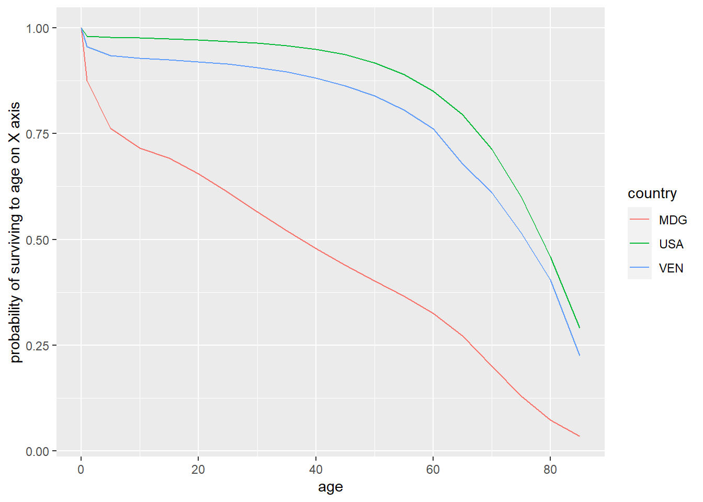

# Week 4 {#week4}


<h2>Topics: Functions and sampling</h2>
This week's topics cover functions and sampling, the latter including a cursory treatment of loops and bootstrapping. We will revisit Ben's code for reading Human Mortality and Human Fertility databases to look at the use of `purrr::map()` as an alternative to `for()` looping in functions. Finally we will delve into `demogR` and `demography` packages for analysis of age-structured demographic models and forecasting mortality, fertility, migration and population data.

* [R environments](#renviron)
* [R functions](#rfunc)
* [Sampling in R](#rsampling)
* [Packages for running demographic analysis](#demogpackages)
    * [`demogR`](#demogR)
    * [`demography`](#demography)
    
Download [exercise_blank.Rmd](files/exercise_blank.Rmd) as a template for this lesson.

## Environments {#renviron}
Functions exist in `environments`, which are "frames" or collections containing objects including variables, functions, etc. There is a global environment (`.GlobalEnv`) that contains all of the data, functions, in the current R session. Those objects can be enumerated with the `ls()` function. 

The reason environments are mentioned at this time is because functions instantiate environments that exist while the function is running, but once the function is completed, the environment is removed from memory. More on this [below](#funcenviron).

## Functions {#rfunc}
Functions are sets of statements in R that are grouped together to perform a specific task or set of tasks. Functions are either built in, included in packages, or user-defined. Functions are used mainly to simplify running a series of individual commands or functions, for situations where the same process will need to be run multiple times on different inputs, or when control structures are needed (e.g., looping, logical branching).

### Function Components
The different parts of a function are:

1. (Usually) Name: This is the actual name of the function. It is stored in an R environment as an object with this name.
1. (Optional) Arguments: Arguments specify the inputs or options to the function. When a function is invoked, you pass a value to the argument. Arguments are optional; that is, a function may contain no arguments. Also arguments can have default values.
1. Body: The function body contains a collection of statements that defines what the function does.
1. Return value: The return value of a function is the last expression in the function body to be evaluated.

Another important concept for functions is environments.

#### Name
Most functions are created with code of the form

```
function_name <- function(argument(s)){
    statement(s)
}
```

For example, to square a vector of numerical values:


```r
f_square <- function(x){
    x^2
}
```

the function name is `f_square`.

Some functions are not named, and are referred to as "anonymous" functions. For example, functions can be used within the `apply` family of functions. Here is an oprationalized example.


```r
# create a list of three vectors of random numbers of different random lengths

# set.seed() makes the random process reproducible.
set.seed(10)
# vector lengths
v.len <- rnorm(n = 3, mean = 30, sd = 10) %>% round(0)

# make the random vectors
set.seed(5)
v1 <- rnorm(n = v.len[1])
set.seed(3)
v2 <- rnorm(n = v.len[2])
set.seed(6)
v3 <- rnorm(n = v.len[3])

# create the list
L <- list(v1, v2, v3)

# get the first value from each vector in the list
lapply(X = L, FUN = function(x) {x[1]})
```

```
## [[1]]
## [1] -0.8408555
## 
## [[2]]
## [1] -0.9619334
## 
## [[3]]
## [1] 0.269606
```

The `lapply()` function is used to _apply_ a function to each element of a list. In this example, the last line of the code chunk is:

```
lapply(X = L, FUN = function(x) {x[1]})

```

in which the body of the function is `x[1]`, i.e., obtain the first element of a vector. In natural language, this translates to "for each element of the list _L_, obtain the first element of vector _x_". But the function itself is not named, and hence "anonymous."

#### Arguments
Most functions require arguments. Arguments are used to instantiate variables within the function's environment that can be used later in the body of the function. Each argument is named, and the name is used within the function as a local variable within the function's environment.

Following our example from above, `f_square` takes an argument named "x" that is a numeric vector.

Here, let's modify the function to demonstrate that within the environment of the function, `x` is a variable by using `print(x)`:


```r
f_square_2 <- function(x){
    message("input:")
    print(x)
    message("output:")
    x^2
}

f_square_2(c(1,2,3))
```

```
## input:
```

```
## [1] 1 2 3
```

```
## output:
```

```
## [1] 1 4 9
```

We can try running the original function using different (or no) arguments:

Here, using a vector of a single NA numeric


```r
f_square(as.numeric(NA))
```

```
## [1] NA
```

... or a vector that contains a numeric NA (with the first two elements being numeric, the third element `NA` is automatically cast as a numeric):


```r
f_square(c(1, 2, NA))
```

```
## [1]  1  4 NA
```

... or a null:


```r
f_square(NULL)
```

```
## numeric(0)
```

... or a vector containing a null:


```r
f_square(c(1, 2, NULL))
```

```
## [1] 1 4
```

... or with no argument at all:

```
f_square()
```

<font color="red">
```
## Error in f_square() : argument "x" is missing, with no default
```
</font>

Some functions do not require arguments, e.g., to get the current date or time:


```r
Sys.Date()
```

```
## [1] "2022-02-18"
```

```r
Sys.time()
```

```
## [1] "2022-02-18 16:11:56 PST"
```

... and if we try to use an argument we get an error:

```
Sys.Date(1)
```

<font color="red">
```
## Error in Sys.Date(1) : unused argument (1)
```
</font>

##### Default values for arguments
If you want an argument to have a default value, it is specified in the listed arguments in the form `argument = value`. 

Following our previous `f_square_2()` function, we can set the default value of `x` to `3`:


```r
f_square_3 <- function(x = 3){
    x^2
}
```

Because the default argument is set, the function can be run with no arguments, and the default will be substituted in:


```r
f_square_3()
```

```
## [1] 9
```


A more meaningful example demonstrates stratification of counts into intensity bins using accelerometry data. We will be using accelerometry from one day's data from one subject in a study.

The cut points for accelerometry were identified at 0, 2690, 6167, and 9642 counts per minute, from Sasaki et al. (2011).

*Sasaki JE, John D, Freedson PS. Validation and comparison of ActiGraph activity monitors. J Sci Med Sport. 2011;14(5):411-416. doi:10.1016/j.jsams.2011.04.003"*

The variable `vm3` is the vector magnitude measured with the accelerometer for each minute. Data: [accelerometry.csv](files/accelerometry.csv).


```r
# read the accelerometry data
acc <- read.csv("files/accelerometry.csv")

# print first 6 lines
head(acc)
```

```
##                 time_acc vm3
## 1 2018-09-13 02:59:00-07   0
## 2 2018-09-13 02:58:00-07   0
## 3 2018-09-13 02:57:00-07   0
## 4 2018-09-13 02:56:00-07   0
## 5 2018-09-13 02:55:00-07   0
## 6 2018-09-13 02:54:00-07   0
```


The following function codes intensity by the aforementioned cut points by default and using default labels:


```r
f_acc_intensity <- function(x,
                            cuts = c(
                                -Inf,
                                2690, 6167, 9642, Inf
                            ),
                            labels = c(
                                "sedentary/low",
                                "moderate", "vigorous", "very vigorous"
                            )) {
    cut(x = acc$vm3, breaks = cuts, labels = labels)
}
```

... and when run with the defaults to tabulate the minutes spent in different PA levels


```r
# recode
acc$intens_default <- f_acc_intensity(acc$vm3)

# tabulate
acc %>% 
    group_by(intens_default) %>% 
    summarise(n = n())
```

```
## # A tibble: 3 x 2
##   intens_default     n
##   <fct>          <int>
## 1 sedentary/low   1435
## 2 moderate           4
## 3 vigorous           1
```

But we could run this with different thresholds and levels, where SPLA = "sedentary/low physical activity" and MVPA = "moderate-to-very vigorous physical activity):


```r
acc$intens_2lev <- f_acc_intensity(x = acc$vm3,
                                cuts = c(-Inf, 2690, Inf),
                                labels = c("SLPA", "MVVPA"))
acc %>% 
    group_by(intens_2lev) %>% 
    summarise(n = n())
```

```
## # A tibble: 2 x 2
##   intens_2lev     n
##   <fct>       <int>
## 1 SLPA         1435
## 2 MVVPA           5
```


##### The `...` argument
When functions do not have a known _a priori_ number or set of arguments, or when a large number of arguments is to be passed to another function the `...` argument is used. We will not cover this here, but you are encouraged to read more: [How to Use the Dots Argument in R](https://www.dummies.com/programming/r/how-to-use-the-dots-argument-in-r/); [The three-dots construct in R](https://www.r-bloggers.com/2013/01/the-three-dots-construct-in-r/).

#### Body
The function's body contains all of the code to perform the purpose of the function. Following our initial example, the body of the function is simply 

```
x^2
```

The body can be as simple or complicated as it needs to be in order to achieve the desired result.

### Logical testing for branching
Sometimes you want to vary what your code does based on some condition. If the condition is met, then execute a block of code. If the condition is not met, or some other condition is met, then execute other code. For a more complete tutorial, see [R if else elseif Statement](https://www.learnbyexample.org/r-if-else-elseif-statement/)


Following our previous `f_square_2()` function, we can modify to print the input based on the logical argument `verbose`. In this code, if the `verbose` object is set to `TRUE`, some text is printed in a message as well as the value that was supplied for `x`. In either case (`verbose = TRUE` or `verbose = FALSE`), the output value of `x^2` is returned.


```r
f_square_4 <- function(x, verbose = FALSE){
    # only run the next lines if verbose is true
    if(verbose){
        message("input:")
        print(x)
        message("output:")
    }
    x^2
}
```

Here we run with the default option `verbose = FALSE`; only the final value `x^2` is in the output:


```r
f_square_4(x = c(1, 2, 3))
```

```
## [1] 1 4 9
```

... and with `verbose = TRUE`, additional text is printed :


```r
f_square_4(x = c(1, 2, 3), verbose = TRUE)
```

```
## input:
```

```
## [1] 1 2 3
```

```
## output:
```

```
## [1] 1 4 9
```

There are additional ways to use `if()`, as nested statements, using:

```
if(condition1){
    if(condition2){
        statement
    }
}
```

Or with an alternative:

```
if(condition){
    statement1
    statement2
    ...
} else {
    statement3
    statement4
}
...
```

Or with an additional condition to check if the first condition is not met:


```
if(condition1){
    statement1
    statement2
    ...
} else if (condition2){
    statement3
    statement4
} else {
    statement5
    statement6
}
...
```

### Return value
The return value is either the last evaluated expression in the function or an object specified using the `return()` function. For functions that are intended to return only one value, by convention that is the last line in the function.

In our original `f_square()` function, the return value is `x^2` since no other `return()` value was specified, e.g., for a vector of one element:


```r
f_square <- function(x){
    x^2
}
f_square(3)
```

```
## [1] 9
```

or a vector with multiple elements:


```r
f_square(c(1,2,3))
```

```
## [1] 1 4 9
```

However, if it is possible that different outputs can be produced by a function based on some logical testing, one can explicitly use `return(object)` in the code; at that time the object will be output and the function will stop. A simple example of explicitly specifying return values is shown in this numerical comparison function:


```r
f_compare <- function(x, y){
    # either missing?
    if(nargs() != 2)
        return("invalid number of arguments")
    # numeric?
    if(!is.numeric(x) | !is.numeric(y)){
        return(sprintf("%s or %s is not numeric.", x, y))
    }
    # comparisons follow
    if(x > y){
        return(sprintf("%s is greater than %s", x, y))
    } 
    if(x < y) {
        return(sprintf("%s is less than %s", x, y))
    }
    if(x == y){
        return(sprintf("%s equals %s", x, y))
    }
}
```

Based on criteria such as the number of arguments or the relative value of the arguments `x` and `y`, different outputs are generated. Here are a few examples running the function:


```r
f_compare(1)
```

```
## [1] "invalid number of arguments"
```

```r
f_compare(1, 2)
```

```
## [1] "1 is less than 2"
```

```r
f_compare(2, 1)
```

```
## [1] "2 is greater than 1"
```

If you want to handle an expected error, you can print an informative message and use `return(invisible())`, which returns nothing at all (whereas `return()` results in a `NULL` object) e.g., here without `invisible()`:


```r
f_readfile <- function(fname){
    if(!file.exists(fname)){
        warning(paste(fname, "does not exist!"))
        return()
    } else {
        read.csv(fname)
    }
}

f_readfile("foobar.txt")
```

```
## Warning in f_readfile("foobar.txt"): foobar.txt does not exist!
```

```
## NULL
```

... and with `invisible()`:


```r
f_readfile <- function(fname){
    if(!file.exists(fname)){
        warning(paste(fname, "does not exist!"))
        return(invisible())
    } else {
        read.csv(fname)
    }
}

f_readfile("foobar.txt")
```

```
## Warning in f_readfile("foobar.txt"): foobar.txt does not exist!
```

### Function environments {#funcenviron}
As mentioned before, functions instantiate environments that exist only while the function is being evaluated. This means that functions can include named variables that have the same name as a variable in a different environment. For example here is a function that only lists what objects are in the local and global environments:


```r
# declare a few variables
x <- 1
y <- "hello"

# a simple function
f <- function(x){
    # create a local variable
    y <- x + 2
    # another function inside this function
    g <- function(x){
        x * 3
    }
    # what variables are in this environment?
    print("----------")
    print("objects in this function's environment:")
    print(ls())
    # what is in the global env?
    print("----------")
    print("objects in the global environment:")
    print(ls(envir = .GlobalEnv))
    # return the output of the function
    print("----------")
    y
}

f(1)
```

```
## [1] "----------"
## [1] "objects in this function's environment:"
## [1] "g" "x" "y"
## [1] "----------"
## [1] "objects in the global environment:"
##  [1] "acc"             "f"               "f_acc_intensity" "f_compare"      
##  [5] "f_readfile"      "f_square"        "f_square_2"      "f_square_3"     
##  [9] "f_square_4"      "figure_nums"     "fnamepath"       "L"              
## [13] "table_nums"      "v.len"           "v1"              "v2"             
## [17] "v3"              "x"               "y"              
## [1] "----------"
```

```
## [1] 3
```

Once the function completes, all objects in its local environment are purged. If you are running a complicated function that creates intermediate values that you want to examine for troubleshooting, you can create an environment in the `.GlobalEnv` (i.e., the overall environment in which R is running), and then assign a variable with a specific value to that environment created specifically for examining the intermediate products of the function:


```r
# a function to show how we can assign
g <- function(x){
    # code for a bunch of complicated operations
    # ...
    # create environment "foo"
    if(!exists("foo")){
        message("make foo")
        assign(x = "foo", value = new.env(), envir = .GlobalEnv)
    }    
    # generates an intermediate data frame named "bar"
    bar <- head(iris)
    # save to the foo env
    assign(x = "bar", value = bar, envir = foo)
    # more code to do more complicated stuff
    # ...
    foobar <- head(cars)
    # also assign 
    assign(x = "foobar", value = foobar, envir = foo)
    # yet more complicated stuff here
    # ...
}
```

When the function runs, the objects `bar` and `foobar` are placed in the `foo` environment. We can examine those:


```r
# run the function
g()
```

```
## make foo
```

```r
# what is in environment "foo"?
ls(envir = foo)
```

```
## [1] "bar"    "foobar"
```

And we can view their values:


```r
print(foo$bar)
```

```
##   Sepal.Length Sepal.Width Petal.Length Petal.Width Species
## 1          5.1         3.5          1.4         0.2  setosa
## 2          4.9         3.0          1.4         0.2  setosa
## 3          4.7         3.2          1.3         0.2  setosa
## 4          4.6         3.1          1.5         0.2  setosa
## 5          5.0         3.6          1.4         0.2  setosa
## 6          5.4         3.9          1.7         0.4  setosa
```


```r
print(foo$foobar)
```

```
##   speed dist
## 1     4    2
## 2     4   10
## 3     7    4
## 4     7   22
## 5     8   16
## 6     9   10
```

But those objects will not appear in the `.GloalEnv`, even though the environment `foo` does; you could consider that the objects `bar` and `foobar` are "nested" in environment `foo` which is itself nested in `.GlobalEnv`.


```r
ls(envir = .GlobalEnv)
```

```
##  [1] "acc"             "f"               "f_acc_intensity" "f_compare"      
##  [5] "f_readfile"      "f_square"        "f_square_2"      "f_square_3"     
##  [9] "f_square_4"      "figure_nums"     "fnamepath"       "foo"            
## [13] "g"               "L"               "table_nums"      "v.len"          
## [17] "v1"              "v2"              "v3"              "x"              
## [21] "y"
```

### Looping 
Loops are run when you want to perform a series of tasks over and over on a set of objects. 

#### Looping with `for()` loops
 A loop is constructed using the form ...

```
for (element in set){
    do something
}
```

where `element` represents the variable value of the current iteration and `set` is a group of objects, such as elements in a vector or list

A few simple examples follow.

Print each letter in the first 5 letters of the alphabet. In this example, the iterated element is a letter, and the variable `i` has the value of the letter in each iteration. The built in vector `letters` is used. So on the first iteration, `i = 1`, on the second iteration,m `i = 2` and so on.


```r
for (i in head(letters, 5)){
    print(i)
}
```

```
## [1] "a"
## [1] "b"
## [1] "c"
## [1] "d"
## [1] "e"
```


In this example, the object `i` takes on integer values 1 through 10. Within the loop, a message is printed that includes the term `i^2`, which evaluates to `1^2`, `2^2`, $\dots$, `10^2`.


```r
for(i in 1:10){
    message(paste(i, "squared equals", i^2))
}
```

```
## 1 squared equals 1
```

```
## 2 squared equals 4
```

```
## 3 squared equals 9
```

```
## 4 squared equals 16
```

```
## 5 squared equals 25
```

```
## 6 squared equals 36
```

```
## 7 squared equals 49
```

```
## 8 squared equals 64
```

```
## 9 squared equals 81
```

```
## 10 squared equals 100
```

Here is a similar approach, but using a numerical index referring to the position within a vector. The vector to be iterated over is `1:length(states_5)`, which evaluates to `1, 2, 3, 4, 5`. In each iteration, we print the index of the iterator and the state name.


```r
# take the first 5 state names
states_5 <- head(state.name, 5)

# iterate over those
for (i in 1:length(states_5)){
    s <- states_5[i]
    message(paste0(i, ": ", s))
}
```

```
## 1: Alabama
```

```
## 2: Alaska
```

```
## 3: Arizona
```

```
## 4: Arkansas
```

```
## 5: California
```

In this example, we will use an index that is the position of rows within a data frame.


```r
# initialize a value to hold a sum
mySum <- 0

# create a data frame of 5 rows
y <- iris %>% head(5)

# loop
for(x in 1:nrow(y)){
    message(paste("iteration:", x))
    # get the sepal length for this iteration
    sl <- y$Sepal.Length[x]
    # add to make a cumulative sum
    mySum <- mySum + sl
    # calculate the mean
    myMean <- mySum / x
    message(paste0("  sepal length = ", sl, 
                   "; cumulative sum = ", mySum, 
                   "; mean = ", myMean))
  
}
```

```
## iteration: 1
```

```
##   sepal length = 5.1; cumulative sum = 5.1; mean = 5.1
```

```
## iteration: 2
```

```
##   sepal length = 4.9; cumulative sum = 10; mean = 5
```

```
## iteration: 3
```

```
##   sepal length = 4.7; cumulative sum = 14.7; mean = 4.9
```

```
## iteration: 4
```

```
##   sepal length = 4.6; cumulative sum = 19.3; mean = 4.825
```

```
## iteration: 5
```

```
##   sepal length = 5; cumulative sum = 24.3; mean = 4.86
```

Here we will iterate over the elements of a list, also including the system run time by wrapping the loop in a `system.time()` call.


```r
# make it reproducible
set.seed(5)

# create a list
L <- list(
    v1 = rnorm(n = 10, mean = 1),
    v2 = rpois(n = 20, lambda = 5),
    v3 = runif(n = 25, min = 0, max = 10)
)

# run the loop
system.time(
    for(i in L){
        print(mean(i))
    }
)
```

```
## [1] 0.9211485
## [1] 4.45
## [1] 5.917916
```

```
##    user  system elapsed 
##       0       0       0
```

#### Alternatives to loops: `apply()`. `lapply()`, `tapply()`, `sapply()`
There is a family of functions (`*apply()`) in R that are built to iterate over a matrix, or elements of vectors or lists.

The `apply` function performs a function over the rows or columns of a matrix. Here are some simple examples that get the sums of the rows and columns of a matrix:


```r
# a matrix
(m <- matrix(1:9, nrow = 3))
```

```
##      [,1] [,2] [,3]
## [1,]    1    4    7
## [2,]    2    5    8
## [3,]    3    6    9
```

```r
# row sums
message("row sums")
```

```
## row sums
```

```r
(rs <- apply(X = m, MARGIN = 1, FUN = sum))
```

```
## [1] 12 15 18
```

```r
# column sums
message("column sums")
```

```
## column sums
```

```r
(cs <- apply(X = m, MARGIN = 2, FUN = sum))
```

```
## [1]  6 15 24
```

The `lapply()` function runs over elements of a list. Here we will run the same analysis as before (mean of the vectors in list `L`). The output of `lapply()` is a list with the same number of elements as the input; the output elements also have the original list element names.


```r
system.time(
    Lmean <- lapply(X = L, FUN = mean)
)
```

```
##    user  system elapsed 
##       0       0       0
```

```r
Lmean
```

```
## $v1
## [1] 0.9211485
## 
## $v2
## [1] 4.45
## 
## $v3
## [1] 5.917916
```

Note the difference in `system.time()` when using `lapply()`. In general one should always use the `*apply()` functions rather than loops if possible. Loops are better for multi-step operations versus operations on single matrices, vectors, or lists.

You should look up the help documentation for `tapply()`, `lapply()`. There is also a nice tutorial, [Tutorial on the R Apply Family](https://www.datacamp.com/community/tutorials/r-tutorial-apply-family).

#### `purrr` 
`purrr` aims to simplify looping, particularly for multiple-step processes.

The main functions in `purrr` are `map_*()`, with specific variants to be run on data frames (`map_dfr()`), character vectors (`map_chr()`), logical (`map_lgl()`), integer (`map_int()`), and double precision numeric (`map_dbl()`).

Although a full treatment of `purrr` is beyond our scope, see a [great `purrr` tutorial with worked examples](https://jennybc.github.io/purrr-tutorial.)

##### Efficient download of census data using `purrr` and `tigris`

Here, following on the lessons from using the `tigirs` package for downloading US Census TIGER/Line data, we will download all counties for all states using `purrr::map_dfr()` and export to a GPKG database.


```r
# the tigris download function for counties
f_county <- function(state_name, year = 2019){
    # this downloads a single county
    counties(state = state_name, year)
}

# the map_dfr() functionality is wrapped in here
get_counties <- function(year = 2019) {
    # the output is a data frame. input (.x) is the state name, the function (.f) is the county download
    map_dfr(
        # input is the built in vector "state.name"
        .x = state.name,
        # each iteration runs the f_county() function over the iteration's state
        .f = function(x) {
            f_county(state_name = x, year = year)
        }
    )
}

# run the function
all_counties <- get_counties()

# export to GPKG
myTmpDir <- tempdir()
st_write(obj = all_counties, dsn = file.path(myTmpDir, "counties.gpkg"), layer = "us_counties_2019", delete_dsn = TRUE)
```

```
## Deleting source `C:\Temp\13\RtmpecAqm2/counties.gpkg' failed
## Writing layer `us_counties_2019' to data source 
##   `C:\Temp\13\RtmpecAqm2/counties.gpkg' using driver `GPKG'
## Writing 3141 features with 17 fields and geometry type Multi Polygon.
```

In Figure  1 we show the counties displayed in QGIS.


\    
_Figure  1: Downloaded counties for the US_

This process could easily be applied to multiple years of data or different census units (block groups, blocks, tracts).

##### Revisiting Ben's HMDHFDplus example
Let's revisit Ben's [example using HMDHFDplus](#benhmdhfdplus)


```r
# Help function to list the available countries
# this generates a vector of all country abbreviations
countries <- HMDHFDplus::getHMDcountries()[1:2]

# Function to download a specified HMD data set item for a single county
# the country code is referenced as "CNTRY"
# the "item" is the base name of the link with ".txt" removed. For example,
# https://www.mortality.org/hmd/ISR/STATS/Mx_1x1.txt
#                                         Mx_1x1       <<- this is the item for 1 year x 1 year death rates
read_hmd_country <- function(CNTRY, item) {
  HMDHFDplus::readHMDweb(
    # the country from the function call
    CNTRY = CNTRY,
    # the item to download
    item = item,
    # the username from this key's record
    username = keyring::key_list("human-mortality-database")$username,
    # the password for this key's record
    password = keyring::key_get(
      service = "human-mortality-database",
      username = keyring::key_list("human-mortality-database")$username
    )
  )
}

# Help function to list the available countries
# this generates a vector of all country abbreviations
# for speed in class we will use only two countries
countries <- HMDHFDplus::getHMDcountries()[1:2]

# Download a data set iteratively for all countries using purrr::map()
# In this case, age-specific mortality in 1-year periods x 1-year age groups
# for all 1-year periods available
# output is a data frame named "mx_1x1"
mx_1x1 <- countries %>%
    # Returns a list of data.frames, adding a column for country code to each
    # the map() function performs a run of Ben's read_hmd_country() function for each listed country
    purrr::map_dfr(function(country) {
        # the item to read is 1 x 1 death rates
        read_hmd_country(CNTRY = country, item = "Mx_1x1") %>%
            # this adds the column "country" storing the country ISO code
            dplyr::mutate(country = country)
    }) %>%
    # Phil added this to make it a tibble
    tibble()
```

The key piece here is 

```
purrr::map_dfr(function(country) {
    # the item to read is 1 x 1 death rates
    read_hmd_country(country, "Mx_1x1")
```

which constructs a data frame by iterating over `countries` and applying the function `read_hmd_country()` to download the variable `Mx_1x1`. Here we plot mortality data from Australia and Austria over the time series (Figure  2).


```r
tmx <- mx_1x1 %>% 
    group_by(Year, country) %>% 
    dplyr::summarise(mortality = sum(Total, na.rm = TRUE), .groups = "keep")

tmx %>% ggplot(mapping = aes(x = Year, y = mortality)) +
    geom_line() +
    facet_grid(country ~ .) + 
    xlab("year")
```


\    
*Figure  2: Mortality data from Australia and Austria*

#### Bootstrapping 
Bootstrapping is used to estimate the characteristics of a population by repeating a large number of random samples (with replacement) and then calculating summary statistics on the set of samples. The reason replacement is used is that each sample represents a "snapshot" of the population. As the number of samples increases, the summary continues to approach the true population characteristics.

We will use a simple example from a hypothetical population. If we had no idea what the male/female split was, we could generate a large number of small-ish samples and the take the mean.

Back to the bootstrap: we will use 5,000 samples of size 100 from our hypothetical population to estimate the proportion of females.


```r
# create the population
# 1 indicates female and 0 indicates male
pop <- c(rep(1, 5e4 * 3 / 5), rep(0, 5e4 * 2 / 5))

# initialize a vector
F <- NULL

# run the bootstrap
for (i in seq(from = 1, to = 5000, by = 1)){
    # sample once
    s <- sample(x = pop, size = 100, replace = TRUE)
    # calculate percent female
    p <- sum(s) / length(s)
    # concatenate the result with the running result
    F <- c(F, p)
}

# mean and standard deviation of the bootstrap
mean(F)
```

```
## [1] 0.602186
```

```r
sd(F)
```

```
## [1] 0.04900736
```

Using the bootstrap results, we can estimate the 95% confidence interval around the mean using the `Rmisc::CI()` function, and make a density plot showing the mean and the confidence interval (`r figure_nums(name = "bootstrat_plot", display = "cite")).


```r
# 95% CI
ci_95 <- Rmisc::CI(x = F, ci = 0.95)

# plot with 95 % CI
plot(density(F), main = "")
abline(v = ci_95, col=c(2,1,2))
```


\    
*Figure  3: Density plot from bootstrapping*

If we already had an enumeration of the population, this method would be unnecessary. However, most survey-derived data are generated from samples. If the sample is representative of the underlying population,  the sample can be considered an acceptable proxy.


## Sampling {#rsampling}
The general topic of sampling is far greater than what we can cover in this course. However, a few examples may be helpful for students who have little experience in sampling.

The main R function for sampling is `sample()`, which draws a random sample from a vector or data frame. Options for `sample()` include the size of the sample, whether or not to replace sampled individuals to the pool, and a probability weight of the same length (or number of rows) as the population from which the sample is drawn.

### Sampling with replacement
Sampling with replacement is similar to rolling a die. Each roll of the die has a 1/6 probability of coming up with each value. For example we simulate rolling a die 100,00 times:


```r
# set.seed makes it so that random processes can be repeated with the same outputs
set.seed(5)

# create a vector to represent the faces of a die
d <- 1:6

# now make a sample of 100,000 rolls of the die, with replacement for independent rolls
s <- sample(x = d, size = 100000, replace = TRUE)

# tabulate the result
(tbs <- table(s))
```

```
## s
##     1     2     3     4     5     6 
## 16644 16856 16839 16705 16453 16503
```

```r
# proportions
(prop.table(tbs))
```

```
## s
##       1       2       3       4       5       6 
## 0.16644 0.16856 0.16839 0.16705 0.16453 0.16503
```

The probability of rolling two of the same number in a row is 1/6 $\times$ 1/6, or $\approx$ 0.028

### Sampling without replacement
Sampling without replacement removes from the population the individual that was sampled. For example, the probability of selecting an ace from a whole deck of cards is 4/52, or $\approx$ 0.077. If we drew once from the deck and returned the card back to the deck to draw again, both samples would be independent. The probability of drawing two aces would be 4/52 $\times$ 4/52, or $\approx$ 0.0059. _That_ is an example of sampling _with_ replacement, similar to rolling a die.

Performing the same sample _without_ replacement, i.e., finding an ace, removing it, and then sampling again would have a probability of drawing two aces being 4/52 $\times$ 3/51, or $\approx$ 0.0045.

If you were to design an study in which once a person was surveyed once they would not be eligible to be surveyed again, that would also be an example of samping *without* replacement.

For a population of sufficient size relative to the sample, sampling with or without replacement will lead to nearly identical results.

Let's use an example of a population of 50,000 persons, where 30,000 are female and 20,000 are male. If we were to sample two persons with replacement, the probability that they would both be female would be 30000/50000 $\times$ 30000/50000, or 0.36.

If we sample without replacement, the probability of selecting a female in the first sample of one would be 30000/50000, and the second sample of 1 would have a probability of selecting a female 29999/49999, with a joint probability of $\approx$ 0.359995.

## R packages for demographic analysis {#demogpackages}
There is always a growing list of available packages for analysis in R. Here we will briefly cover two packages for demographic analysis.

### `demogR` {#demogR}
Age-Structured Demographic Models

The [`demogR`](https://cran.r-project.org/web/packages/demogR/) package provides a number of functions for analysis of age-structured demographic models. In this exercise we will look at the `life.table()` function for creating life tables from enumerated deaths and mid-interval population estimates.

We will follow the example from the help page on `life.table()`. The example uses the `goodman` data set, which has aggregate data from Venezuela, Madagascar, and the USA from 1965, 1966, and 1967, respectively. The table contains these fields:

* age\
age classes
* ven.nKx\
mid-year population structure for Venezuela
* ven.nDx\
enumerated deaths for Venezuela
* ven.bx\
enumerated births for Venezuela
* mad.nKx\
mid-year population structure for Madagascar
* mad.nDx\
enumerated deaths for Madagascar
* mad.bx\
enumerated births for Madagascar
* usa.nKx\
mid-year population structure for the United States
* usa.nDx\
enumerated deaths for the United States
* usa.bx\
enumerated births for the United States

The first step is to create the life table itself, which should be run with at least three arguments, `x` (age at the beginning of the age classes of the life table), `nDx` (deaths), and `nKx` (population size). We will create the life table using the three countries' data and the default Keyfitz and Fleiger (`kf`) calculation type. Results are in Table  1.


```r
# load the Goodman data from the demogR package
data(goodman)

## default type="kf", Venezuela data
vlt <- with(goodman, life.table(x=age, nKx=ven.nKx, nDx=ven.nDx))

## US life table
ult <- with(goodman, life.table(x=age, nKx=usa.nKx, nDx=usa.nDx))

## Madagascar life table
mlt <- with(goodman, life.table(x=age, nKx=mad.nKx, nDx=mad.nDx))

# some values for the text
vlx35 <- vlt %>% filter(x == 35) %>% pull(lx) %>% round(2)
vlx80 <- vlt %>% filter(x == 80) %>% pull(lx) %>% round(2)
ulx35 <- ult %>% filter(x == 35) %>% pull(lx) %>% round(2)
ulx80 <- ult %>% filter(x == 80) %>% pull(lx) %>% round(2)
mlx35 <- mlt %>% filter(x == 35) %>% pull(lx) %>% round(2)
mlx80 <- mlt %>% filter(x == 80) %>% pull(lx) %>% round(2)

# combine these
lt <- bind_rows(vlt, ult, mlt)
```

*Table  1: Venezuela life table, Keyfitz and Fleiger method*


```r
lt %>% kable() %>% 
    kable_styling(bootstrap_options =
                      c("striped", "hover", "condensed", "responsive"), 
                  full_width = F, position = "left", font_size = 12, fixed_thead = T) %>% 
    pack_rows(group_label = "Venezuela", start_row = 1, end_row = 19) %>% 
    pack_rows(group_label = "USA", start_row = 20, end_row = 38) %>% 
    pack_rows(group_label = "Madagascar", start_row = 39, end_row = 57)
```

<table class="table table-striped table-hover table-condensed table-responsive" style="font-size: 12px; ">
 <thead>
  <tr>
   <th style="text-align:right;position: sticky; top:0; background-color: #FFFFFF;"> x </th>
   <th style="text-align:right;position: sticky; top:0; background-color: #FFFFFF;"> nax </th>
   <th style="text-align:right;position: sticky; top:0; background-color: #FFFFFF;"> nMx </th>
   <th style="text-align:right;position: sticky; top:0; background-color: #FFFFFF;"> nqx </th>
   <th style="text-align:right;position: sticky; top:0; background-color: #FFFFFF;"> lx </th>
   <th style="text-align:right;position: sticky; top:0; background-color: #FFFFFF;"> ndx </th>
   <th style="text-align:right;position: sticky; top:0; background-color: #FFFFFF;"> nLx </th>
   <th style="text-align:right;position: sticky; top:0; background-color: #FFFFFF;"> Tx </th>
   <th style="text-align:right;position: sticky; top:0; background-color: #FFFFFF;"> ex </th>
  </tr>
 </thead>
<tbody>
  <tr grouplength="19"><td colspan="9" style="border-bottom: 1px solid;"><strong>Venezuela</strong></td></tr>
<tr>
   <td style="text-align:right;padding-left: 2em;" indentlevel="1"> 0 </td>
   <td style="text-align:right;"> 0.1483 </td>
   <td style="text-align:right;"> 0.0461 </td>
   <td style="text-align:right;"> 0.0443 </td>
   <td style="text-align:right;"> 1.0000 </td>
   <td style="text-align:right;"> 0.0443 </td>
   <td style="text-align:right;"> 0.9622 </td>
   <td style="text-align:right;"> 67.70 </td>
   <td style="text-align:right;"> 67.70 </td>
  </tr>
  <tr>
   <td style="text-align:right;padding-left: 2em;" indentlevel="1"> 1 </td>
   <td style="text-align:right;"> 1.5000 </td>
   <td style="text-align:right;"> 0.0057 </td>
   <td style="text-align:right;"> 0.0226 </td>
   <td style="text-align:right;"> 0.9557 </td>
   <td style="text-align:right;"> 0.0216 </td>
   <td style="text-align:right;"> 3.7687 </td>
   <td style="text-align:right;"> 66.74 </td>
   <td style="text-align:right;"> 69.84 </td>
  </tr>
  <tr>
   <td style="text-align:right;padding-left: 2em;" indentlevel="1"> 5 </td>
   <td style="text-align:right;"> 2.5000 </td>
   <td style="text-align:right;"> 0.0012 </td>
   <td style="text-align:right;"> 0.0058 </td>
   <td style="text-align:right;"> 0.9341 </td>
   <td style="text-align:right;"> 0.0055 </td>
   <td style="text-align:right;"> 4.6568 </td>
   <td style="text-align:right;"> 62.97 </td>
   <td style="text-align:right;"> 67.41 </td>
  </tr>
  <tr>
   <td style="text-align:right;padding-left: 2em;" indentlevel="1"> 10 </td>
   <td style="text-align:right;"> 2.5000 </td>
   <td style="text-align:right;"> 0.0007 </td>
   <td style="text-align:right;"> 0.0036 </td>
   <td style="text-align:right;"> 0.9286 </td>
   <td style="text-align:right;"> 0.0034 </td>
   <td style="text-align:right;"> 4.6347 </td>
   <td style="text-align:right;"> 58.31 </td>
   <td style="text-align:right;"> 62.80 </td>
  </tr>
  <tr>
   <td style="text-align:right;padding-left: 2em;" indentlevel="1"> 15 </td>
   <td style="text-align:right;"> 2.5000 </td>
   <td style="text-align:right;"> 0.0011 </td>
   <td style="text-align:right;"> 0.0054 </td>
   <td style="text-align:right;"> 0.9253 </td>
   <td style="text-align:right;"> 0.0050 </td>
   <td style="text-align:right;"> 4.6138 </td>
   <td style="text-align:right;"> 53.68 </td>
   <td style="text-align:right;"> 58.01 </td>
  </tr>
  <tr>
   <td style="text-align:right;padding-left: 2em;" indentlevel="1"> 20 </td>
   <td style="text-align:right;"> 2.5000 </td>
   <td style="text-align:right;"> 0.0013 </td>
   <td style="text-align:right;"> 0.0065 </td>
   <td style="text-align:right;"> 0.9202 </td>
   <td style="text-align:right;"> 0.0060 </td>
   <td style="text-align:right;"> 4.5863 </td>
   <td style="text-align:right;"> 49.07 </td>
   <td style="text-align:right;"> 53.32 </td>
  </tr>
  <tr>
   <td style="text-align:right;padding-left: 2em;" indentlevel="1"> 25 </td>
   <td style="text-align:right;"> 2.5000 </td>
   <td style="text-align:right;"> 0.0017 </td>
   <td style="text-align:right;"> 0.0086 </td>
   <td style="text-align:right;"> 0.9143 </td>
   <td style="text-align:right;"> 0.0079 </td>
   <td style="text-align:right;"> 4.5516 </td>
   <td style="text-align:right;"> 44.48 </td>
   <td style="text-align:right;"> 48.65 </td>
  </tr>
  <tr>
   <td style="text-align:right;padding-left: 2em;" indentlevel="1"> 30 </td>
   <td style="text-align:right;"> 2.5000 </td>
   <td style="text-align:right;"> 0.0022 </td>
   <td style="text-align:right;"> 0.0109 </td>
   <td style="text-align:right;"> 0.9064 </td>
   <td style="text-align:right;"> 0.0098 </td>
   <td style="text-align:right;"> 4.5074 </td>
   <td style="text-align:right;"> 39.93 </td>
   <td style="text-align:right;"> 44.05 </td>
  </tr>
  <tr>
   <td style="text-align:right;padding-left: 2em;" indentlevel="1"> 35 </td>
   <td style="text-align:right;"> 2.5000 </td>
   <td style="text-align:right;"> 0.0033 </td>
   <td style="text-align:right;"> 0.0163 </td>
   <td style="text-align:right;"> 0.8966 </td>
   <td style="text-align:right;"> 0.0146 </td>
   <td style="text-align:right;"> 4.4463 </td>
   <td style="text-align:right;"> 35.42 </td>
   <td style="text-align:right;"> 39.51 </td>
  </tr>
  <tr>
   <td style="text-align:right;padding-left: 2em;" indentlevel="1"> 40 </td>
   <td style="text-align:right;"> 2.5000 </td>
   <td style="text-align:right;"> 0.0042 </td>
   <td style="text-align:right;"> 0.0209 </td>
   <td style="text-align:right;"> 0.8820 </td>
   <td style="text-align:right;"> 0.0184 </td>
   <td style="text-align:right;"> 4.3639 </td>
   <td style="text-align:right;"> 30.97 </td>
   <td style="text-align:right;"> 35.12 </td>
  </tr>
  <tr>
   <td style="text-align:right;padding-left: 2em;" indentlevel="1"> 45 </td>
   <td style="text-align:right;"> 2.5000 </td>
   <td style="text-align:right;"> 0.0055 </td>
   <td style="text-align:right;"> 0.0273 </td>
   <td style="text-align:right;"> 0.8636 </td>
   <td style="text-align:right;"> 0.0236 </td>
   <td style="text-align:right;"> 4.2588 </td>
   <td style="text-align:right;"> 26.61 </td>
   <td style="text-align:right;"> 30.81 </td>
  </tr>
  <tr>
   <td style="text-align:right;padding-left: 2em;" indentlevel="1"> 50 </td>
   <td style="text-align:right;"> 2.5000 </td>
   <td style="text-align:right;"> 0.0083 </td>
   <td style="text-align:right;"> 0.0406 </td>
   <td style="text-align:right;"> 0.8400 </td>
   <td style="text-align:right;"> 0.0341 </td>
   <td style="text-align:right;"> 4.1146 </td>
   <td style="text-align:right;"> 22.35 </td>
   <td style="text-align:right;"> 26.61 </td>
  </tr>
  <tr>
   <td style="text-align:right;padding-left: 2em;" indentlevel="1"> 55 </td>
   <td style="text-align:right;"> 2.5000 </td>
   <td style="text-align:right;"> 0.0111 </td>
   <td style="text-align:right;"> 0.0542 </td>
   <td style="text-align:right;"> 0.8059 </td>
   <td style="text-align:right;"> 0.0436 </td>
   <td style="text-align:right;"> 3.9202 </td>
   <td style="text-align:right;"> 18.24 </td>
   <td style="text-align:right;"> 22.63 </td>
  </tr>
  <tr>
   <td style="text-align:right;padding-left: 2em;" indentlevel="1"> 60 </td>
   <td style="text-align:right;"> 2.5000 </td>
   <td style="text-align:right;"> 0.0231 </td>
   <td style="text-align:right;"> 0.1090 </td>
   <td style="text-align:right;"> 0.7622 </td>
   <td style="text-align:right;"> 0.0831 </td>
   <td style="text-align:right;"> 3.6035 </td>
   <td style="text-align:right;"> 14.32 </td>
   <td style="text-align:right;"> 18.78 </td>
  </tr>
  <tr>
   <td style="text-align:right;padding-left: 2em;" indentlevel="1"> 65 </td>
   <td style="text-align:right;"> 2.5000 </td>
   <td style="text-align:right;"> 0.0214 </td>
   <td style="text-align:right;"> 0.1015 </td>
   <td style="text-align:right;"> 0.6792 </td>
   <td style="text-align:right;"> 0.0689 </td>
   <td style="text-align:right;"> 3.2235 </td>
   <td style="text-align:right;"> 10.71 </td>
   <td style="text-align:right;"> 15.77 </td>
  </tr>
  <tr>
   <td style="text-align:right;padding-left: 2em;" indentlevel="1"> 70 </td>
   <td style="text-align:right;"> 2.5000 </td>
   <td style="text-align:right;"> 0.0338 </td>
   <td style="text-align:right;"> 0.1558 </td>
   <td style="text-align:right;"> 0.6103 </td>
   <td style="text-align:right;"> 0.0951 </td>
   <td style="text-align:right;"> 2.8136 </td>
   <td style="text-align:right;"> 7.49 </td>
   <td style="text-align:right;"> 12.27 </td>
  </tr>
  <tr>
   <td style="text-align:right;padding-left: 2em;" indentlevel="1"> 75 </td>
   <td style="text-align:right;"> 2.5000 </td>
   <td style="text-align:right;"> 0.0485 </td>
   <td style="text-align:right;"> 0.2164 </td>
   <td style="text-align:right;"> 0.5152 </td>
   <td style="text-align:right;"> 0.1115 </td>
   <td style="text-align:right;"> 2.2971 </td>
   <td style="text-align:right;"> 4.68 </td>
   <td style="text-align:right;"> 9.08 </td>
  </tr>
  <tr>
   <td style="text-align:right;padding-left: 2em;" indentlevel="1"> 80 </td>
   <td style="text-align:right;"> 2.5000 </td>
   <td style="text-align:right;"> 0.1137 </td>
   <td style="text-align:right;"> 0.4426 </td>
   <td style="text-align:right;"> 0.4037 </td>
   <td style="text-align:right;"> 0.1787 </td>
   <td style="text-align:right;"> 1.5717 </td>
   <td style="text-align:right;"> 2.38 </td>
   <td style="text-align:right;"> 5.89 </td>
  </tr>
  <tr>
   <td style="text-align:right;padding-left: 2em;" indentlevel="1"> 85 </td>
   <td style="text-align:right;"> 3.5868 </td>
   <td style="text-align:right;"> 0.2788 </td>
   <td style="text-align:right;"> 1.0000 </td>
   <td style="text-align:right;"> 0.2250 </td>
   <td style="text-align:right;"> 0.2250 </td>
   <td style="text-align:right;"> 0.8070 </td>
   <td style="text-align:right;"> 0.81 </td>
   <td style="text-align:right;"> 3.59 </td>
  </tr>
  <tr grouplength="19"><td colspan="9" style="border-bottom: 1px solid;"><strong>USA</strong></td></tr>
<tr>
   <td style="text-align:right;padding-left: 2em;" indentlevel="1"> 0 </td>
   <td style="text-align:right;"> 0.1030 </td>
   <td style="text-align:right;"> 0.0194 </td>
   <td style="text-align:right;"> 0.0191 </td>
   <td style="text-align:right;"> 1.0000 </td>
   <td style="text-align:right;"> 0.0191 </td>
   <td style="text-align:right;"> 0.9829 </td>
   <td style="text-align:right;"> 74.25 </td>
   <td style="text-align:right;"> 74.25 </td>
  </tr>
  <tr>
   <td style="text-align:right;padding-left: 2em;" indentlevel="1"> 1 </td>
   <td style="text-align:right;"> 1.5000 </td>
   <td style="text-align:right;"> 0.0008 </td>
   <td style="text-align:right;"> 0.0031 </td>
   <td style="text-align:right;"> 0.9809 </td>
   <td style="text-align:right;"> 0.0030 </td>
   <td style="text-align:right;"> 3.9163 </td>
   <td style="text-align:right;"> 73.27 </td>
   <td style="text-align:right;"> 74.69 </td>
  </tr>
  <tr>
   <td style="text-align:right;padding-left: 2em;" indentlevel="1"> 5 </td>
   <td style="text-align:right;"> 2.5000 </td>
   <td style="text-align:right;"> 0.0004 </td>
   <td style="text-align:right;"> 0.0018 </td>
   <td style="text-align:right;"> 0.9780 </td>
   <td style="text-align:right;"> 0.0017 </td>
   <td style="text-align:right;"> 4.8855 </td>
   <td style="text-align:right;"> 69.35 </td>
   <td style="text-align:right;"> 70.91 </td>
  </tr>
  <tr>
   <td style="text-align:right;padding-left: 2em;" indentlevel="1"> 10 </td>
   <td style="text-align:right;"> 2.5000 </td>
   <td style="text-align:right;"> 0.0003 </td>
   <td style="text-align:right;"> 0.0015 </td>
   <td style="text-align:right;"> 0.9762 </td>
   <td style="text-align:right;"> 0.0015 </td>
   <td style="text-align:right;"> 4.8775 </td>
   <td style="text-align:right;"> 64.46 </td>
   <td style="text-align:right;"> 66.03 </td>
  </tr>
  <tr>
   <td style="text-align:right;padding-left: 2em;" indentlevel="1"> 15 </td>
   <td style="text-align:right;"> 2.5000 </td>
   <td style="text-align:right;"> 0.0006 </td>
   <td style="text-align:right;"> 0.0029 </td>
   <td style="text-align:right;"> 0.9748 </td>
   <td style="text-align:right;"> 0.0028 </td>
   <td style="text-align:right;"> 4.8668 </td>
   <td style="text-align:right;"> 59.59 </td>
   <td style="text-align:right;"> 61.13 </td>
  </tr>
  <tr>
   <td style="text-align:right;padding-left: 2em;" indentlevel="1"> 20 </td>
   <td style="text-align:right;"> 2.5000 </td>
   <td style="text-align:right;"> 0.0007 </td>
   <td style="text-align:right;"> 0.0036 </td>
   <td style="text-align:right;"> 0.9719 </td>
   <td style="text-align:right;"> 0.0035 </td>
   <td style="text-align:right;"> 4.8510 </td>
   <td style="text-align:right;"> 54.72 </td>
   <td style="text-align:right;"> 56.30 </td>
  </tr>
  <tr>
   <td style="text-align:right;padding-left: 2em;" indentlevel="1"> 25 </td>
   <td style="text-align:right;"> 2.5000 </td>
   <td style="text-align:right;"> 0.0008 </td>
   <td style="text-align:right;"> 0.0042 </td>
   <td style="text-align:right;"> 0.9685 </td>
   <td style="text-align:right;"> 0.0041 </td>
   <td style="text-align:right;"> 4.8321 </td>
   <td style="text-align:right;"> 49.87 </td>
   <td style="text-align:right;"> 51.49 </td>
  </tr>
  <tr>
   <td style="text-align:right;padding-left: 2em;" indentlevel="1"> 30 </td>
   <td style="text-align:right;"> 2.5000 </td>
   <td style="text-align:right;"> 0.0012 </td>
   <td style="text-align:right;"> 0.0061 </td>
   <td style="text-align:right;"> 0.9644 </td>
   <td style="text-align:right;"> 0.0058 </td>
   <td style="text-align:right;"> 4.8073 </td>
   <td style="text-align:right;"> 45.04 </td>
   <td style="text-align:right;"> 46.70 </td>
  </tr>
  <tr>
   <td style="text-align:right;padding-left: 2em;" indentlevel="1"> 35 </td>
   <td style="text-align:right;"> 2.5000 </td>
   <td style="text-align:right;"> 0.0019 </td>
   <td style="text-align:right;"> 0.0092 </td>
   <td style="text-align:right;"> 0.9585 </td>
   <td style="text-align:right;"> 0.0088 </td>
   <td style="text-align:right;"> 4.7706 </td>
   <td style="text-align:right;"> 40.23 </td>
   <td style="text-align:right;"> 41.97 </td>
  </tr>
  <tr>
   <td style="text-align:right;padding-left: 2em;" indentlevel="1"> 40 </td>
   <td style="text-align:right;"> 2.5000 </td>
   <td style="text-align:right;"> 0.0027 </td>
   <td style="text-align:right;"> 0.0136 </td>
   <td style="text-align:right;"> 0.9497 </td>
   <td style="text-align:right;"> 0.0129 </td>
   <td style="text-align:right;"> 4.7162 </td>
   <td style="text-align:right;"> 35.46 </td>
   <td style="text-align:right;"> 37.34 </td>
  </tr>
  <tr>
   <td style="text-align:right;padding-left: 2em;" indentlevel="1"> 45 </td>
   <td style="text-align:right;"> 2.5000 </td>
   <td style="text-align:right;"> 0.0042 </td>
   <td style="text-align:right;"> 0.0207 </td>
   <td style="text-align:right;"> 0.9368 </td>
   <td style="text-align:right;"> 0.0194 </td>
   <td style="text-align:right;"> 4.6354 </td>
   <td style="text-align:right;"> 30.74 </td>
   <td style="text-align:right;"> 32.82 </td>
  </tr>
  <tr>
   <td style="text-align:right;padding-left: 2em;" indentlevel="1"> 50 </td>
   <td style="text-align:right;"> 2.5000 </td>
   <td style="text-align:right;"> 0.0062 </td>
   <td style="text-align:right;"> 0.0303 </td>
   <td style="text-align:right;"> 0.9174 </td>
   <td style="text-align:right;"> 0.0278 </td>
   <td style="text-align:right;"> 4.5174 </td>
   <td style="text-align:right;"> 26.11 </td>
   <td style="text-align:right;"> 28.46 </td>
  </tr>
  <tr>
   <td style="text-align:right;padding-left: 2em;" indentlevel="1"> 55 </td>
   <td style="text-align:right;"> 2.5000 </td>
   <td style="text-align:right;"> 0.0091 </td>
   <td style="text-align:right;"> 0.0444 </td>
   <td style="text-align:right;"> 0.8896 </td>
   <td style="text-align:right;"> 0.0395 </td>
   <td style="text-align:right;"> 4.3491 </td>
   <td style="text-align:right;"> 21.59 </td>
   <td style="text-align:right;"> 24.27 </td>
  </tr>
  <tr>
   <td style="text-align:right;padding-left: 2em;" indentlevel="1"> 60 </td>
   <td style="text-align:right;"> 2.5000 </td>
   <td style="text-align:right;"> 0.0134 </td>
   <td style="text-align:right;"> 0.0646 </td>
   <td style="text-align:right;"> 0.8501 </td>
   <td style="text-align:right;"> 0.0549 </td>
   <td style="text-align:right;"> 4.1131 </td>
   <td style="text-align:right;"> 17.24 </td>
   <td style="text-align:right;"> 20.28 </td>
  </tr>
  <tr>
   <td style="text-align:right;padding-left: 2em;" indentlevel="1"> 65 </td>
   <td style="text-align:right;"> 2.5000 </td>
   <td style="text-align:right;"> 0.0217 </td>
   <td style="text-align:right;"> 0.1031 </td>
   <td style="text-align:right;"> 0.7952 </td>
   <td style="text-align:right;"> 0.0820 </td>
   <td style="text-align:right;"> 3.7709 </td>
   <td style="text-align:right;"> 13.13 </td>
   <td style="text-align:right;"> 16.51 </td>
  </tr>
  <tr>
   <td style="text-align:right;padding-left: 2em;" indentlevel="1"> 70 </td>
   <td style="text-align:right;"> 2.5000 </td>
   <td style="text-align:right;"> 0.0340 </td>
   <td style="text-align:right;"> 0.1568 </td>
   <td style="text-align:right;"> 0.7132 </td>
   <td style="text-align:right;"> 0.1118 </td>
   <td style="text-align:right;"> 3.2864 </td>
   <td style="text-align:right;"> 9.36 </td>
   <td style="text-align:right;"> 13.12 </td>
  </tr>
  <tr>
   <td style="text-align:right;padding-left: 2em;" indentlevel="1"> 75 </td>
   <td style="text-align:right;"> 2.5000 </td>
   <td style="text-align:right;"> 0.0536 </td>
   <td style="text-align:right;"> 0.2364 </td>
   <td style="text-align:right;"> 0.6014 </td>
   <td style="text-align:right;"> 0.1422 </td>
   <td style="text-align:right;"> 2.6514 </td>
   <td style="text-align:right;"> 6.07 </td>
   <td style="text-align:right;"> 10.09 </td>
  </tr>
  <tr>
   <td style="text-align:right;padding-left: 2em;" indentlevel="1"> 80 </td>
   <td style="text-align:right;"> 2.5000 </td>
   <td style="text-align:right;"> 0.0896 </td>
   <td style="text-align:right;"> 0.3660 </td>
   <td style="text-align:right;"> 0.4592 </td>
   <td style="text-align:right;"> 0.1681 </td>
   <td style="text-align:right;"> 1.8758 </td>
   <td style="text-align:right;"> 3.42 </td>
   <td style="text-align:right;"> 7.45 </td>
  </tr>
  <tr>
   <td style="text-align:right;padding-left: 2em;" indentlevel="1"> 85 </td>
   <td style="text-align:right;"> 5.3018 </td>
   <td style="text-align:right;"> 0.1886 </td>
   <td style="text-align:right;"> 1.0000 </td>
   <td style="text-align:right;"> 0.2911 </td>
   <td style="text-align:right;"> 0.2911 </td>
   <td style="text-align:right;"> 1.5435 </td>
   <td style="text-align:right;"> 1.54 </td>
   <td style="text-align:right;"> 5.30 </td>
  </tr>
  <tr grouplength="19"><td colspan="9" style="border-bottom: 1px solid;"><strong>Madagascar</strong></td></tr>
<tr>
   <td style="text-align:right;padding-left: 2em;" indentlevel="1"> 0 </td>
   <td style="text-align:right;"> 0.3016 </td>
   <td style="text-align:right;"> 0.1363 </td>
   <td style="text-align:right;"> 0.1244 </td>
   <td style="text-align:right;"> 1.0000 </td>
   <td style="text-align:right;"> 0.1244 </td>
   <td style="text-align:right;"> 0.9131 </td>
   <td style="text-align:right;"> 38.54 </td>
   <td style="text-align:right;"> 38.54 </td>
  </tr>
  <tr>
   <td style="text-align:right;padding-left: 2em;" indentlevel="1"> 1 </td>
   <td style="text-align:right;"> 1.5000 </td>
   <td style="text-align:right;"> 0.0349 </td>
   <td style="text-align:right;"> 0.1285 </td>
   <td style="text-align:right;"> 0.8756 </td>
   <td style="text-align:right;"> 0.1125 </td>
   <td style="text-align:right;"> 3.2212 </td>
   <td style="text-align:right;"> 37.62 </td>
   <td style="text-align:right;"> 42.97 </td>
  </tr>
  <tr>
   <td style="text-align:right;padding-left: 2em;" indentlevel="1"> 5 </td>
   <td style="text-align:right;"> 2.5000 </td>
   <td style="text-align:right;"> 0.0128 </td>
   <td style="text-align:right;"> 0.0621 </td>
   <td style="text-align:right;"> 0.7631 </td>
   <td style="text-align:right;"> 0.0474 </td>
   <td style="text-align:right;"> 3.6972 </td>
   <td style="text-align:right;"> 34.40 </td>
   <td style="text-align:right;"> 45.08 </td>
  </tr>
  <tr>
   <td style="text-align:right;padding-left: 2em;" indentlevel="1"> 10 </td>
   <td style="text-align:right;"> 2.5000 </td>
   <td style="text-align:right;"> 0.0066 </td>
   <td style="text-align:right;"> 0.0326 </td>
   <td style="text-align:right;"> 0.7158 </td>
   <td style="text-align:right;"> 0.0233 </td>
   <td style="text-align:right;"> 3.5205 </td>
   <td style="text-align:right;"> 30.71 </td>
   <td style="text-align:right;"> 42.90 </td>
  </tr>
  <tr>
   <td style="text-align:right;padding-left: 2em;" indentlevel="1"> 15 </td>
   <td style="text-align:right;"> 2.5000 </td>
   <td style="text-align:right;"> 0.0109 </td>
   <td style="text-align:right;"> 0.0530 </td>
   <td style="text-align:right;"> 0.6924 </td>
   <td style="text-align:right;"> 0.0367 </td>
   <td style="text-align:right;"> 3.3704 </td>
   <td style="text-align:right;"> 27.19 </td>
   <td style="text-align:right;"> 39.26 </td>
  </tr>
  <tr>
   <td style="text-align:right;padding-left: 2em;" indentlevel="1"> 20 </td>
   <td style="text-align:right;"> 2.5000 </td>
   <td style="text-align:right;"> 0.0140 </td>
   <td style="text-align:right;"> 0.0676 </td>
   <td style="text-align:right;"> 0.6557 </td>
   <td style="text-align:right;"> 0.0443 </td>
   <td style="text-align:right;"> 3.1677 </td>
   <td style="text-align:right;"> 23.81 </td>
   <td style="text-align:right;"> 36.32 </td>
  </tr>
  <tr>
   <td style="text-align:right;padding-left: 2em;" indentlevel="1"> 25 </td>
   <td style="text-align:right;"> 2.5000 </td>
   <td style="text-align:right;"> 0.0156 </td>
   <td style="text-align:right;"> 0.0751 </td>
   <td style="text-align:right;"> 0.6114 </td>
   <td style="text-align:right;"> 0.0459 </td>
   <td style="text-align:right;"> 2.9421 </td>
   <td style="text-align:right;"> 20.65 </td>
   <td style="text-align:right;"> 33.77 </td>
  </tr>
  <tr>
   <td style="text-align:right;padding-left: 2em;" indentlevel="1"> 30 </td>
   <td style="text-align:right;"> 2.5000 </td>
   <td style="text-align:right;"> 0.0166 </td>
   <td style="text-align:right;"> 0.0797 </td>
   <td style="text-align:right;"> 0.5655 </td>
   <td style="text-align:right;"> 0.0451 </td>
   <td style="text-align:right;"> 2.7147 </td>
   <td style="text-align:right;"> 17.71 </td>
   <td style="text-align:right;"> 31.31 </td>
  </tr>
  <tr>
   <td style="text-align:right;padding-left: 2em;" indentlevel="1"> 35 </td>
   <td style="text-align:right;"> 2.5000 </td>
   <td style="text-align:right;"> 0.0165 </td>
   <td style="text-align:right;"> 0.0793 </td>
   <td style="text-align:right;"> 0.5204 </td>
   <td style="text-align:right;"> 0.0413 </td>
   <td style="text-align:right;"> 2.4988 </td>
   <td style="text-align:right;"> 14.99 </td>
   <td style="text-align:right;"> 28.81 </td>
  </tr>
  <tr>
   <td style="text-align:right;padding-left: 2em;" indentlevel="1"> 40 </td>
   <td style="text-align:right;"> 2.5000 </td>
   <td style="text-align:right;"> 0.0174 </td>
   <td style="text-align:right;"> 0.0836 </td>
   <td style="text-align:right;"> 0.4791 </td>
   <td style="text-align:right;"> 0.0401 </td>
   <td style="text-align:right;"> 2.2955 </td>
   <td style="text-align:right;"> 12.49 </td>
   <td style="text-align:right;"> 26.07 </td>
  </tr>
  <tr>
   <td style="text-align:right;padding-left: 2em;" indentlevel="1"> 45 </td>
   <td style="text-align:right;"> 2.5000 </td>
   <td style="text-align:right;"> 0.0178 </td>
   <td style="text-align:right;"> 0.0850 </td>
   <td style="text-align:right;"> 0.4391 </td>
   <td style="text-align:right;"> 0.0373 </td>
   <td style="text-align:right;"> 2.1021 </td>
   <td style="text-align:right;"> 10.20 </td>
   <td style="text-align:right;"> 23.22 </td>
  </tr>
  <tr>
   <td style="text-align:right;padding-left: 2em;" indentlevel="1"> 50 </td>
   <td style="text-align:right;"> 2.5000 </td>
   <td style="text-align:right;"> 0.0188 </td>
   <td style="text-align:right;"> 0.0899 </td>
   <td style="text-align:right;"> 0.4018 </td>
   <td style="text-align:right;"> 0.0361 </td>
   <td style="text-align:right;"> 1.9185 </td>
   <td style="text-align:right;"> 8.09 </td>
   <td style="text-align:right;"> 20.15 </td>
  </tr>
  <tr>
   <td style="text-align:right;padding-left: 2em;" indentlevel="1"> 55 </td>
   <td style="text-align:right;"> 2.5000 </td>
   <td style="text-align:right;"> 0.0230 </td>
   <td style="text-align:right;"> 0.1089 </td>
   <td style="text-align:right;"> 0.3656 </td>
   <td style="text-align:right;"> 0.0398 </td>
   <td style="text-align:right;"> 1.7286 </td>
   <td style="text-align:right;"> 6.18 </td>
   <td style="text-align:right;"> 16.89 </td>
  </tr>
  <tr>
   <td style="text-align:right;padding-left: 2em;" indentlevel="1"> 60 </td>
   <td style="text-align:right;"> 2.5000 </td>
   <td style="text-align:right;"> 0.0361 </td>
   <td style="text-align:right;"> 0.1654 </td>
   <td style="text-align:right;"> 0.3258 </td>
   <td style="text-align:right;"> 0.0539 </td>
   <td style="text-align:right;"> 1.4944 </td>
   <td style="text-align:right;"> 4.45 </td>
   <td style="text-align:right;"> 13.65 </td>
  </tr>
  <tr>
   <td style="text-align:right;padding-left: 2em;" indentlevel="1"> 65 </td>
   <td style="text-align:right;"> 2.5000 </td>
   <td style="text-align:right;"> 0.0602 </td>
   <td style="text-align:right;"> 0.2615 </td>
   <td style="text-align:right;"> 0.2719 </td>
   <td style="text-align:right;"> 0.0711 </td>
   <td style="text-align:right;"> 1.1818 </td>
   <td style="text-align:right;"> 2.95 </td>
   <td style="text-align:right;"> 10.86 </td>
  </tr>
  <tr>
   <td style="text-align:right;padding-left: 2em;" indentlevel="1"> 70 </td>
   <td style="text-align:right;"> 2.5000 </td>
   <td style="text-align:right;"> 0.0852 </td>
   <td style="text-align:right;"> 0.3512 </td>
   <td style="text-align:right;"> 0.2008 </td>
   <td style="text-align:right;"> 0.0705 </td>
   <td style="text-align:right;"> 0.8278 </td>
   <td style="text-align:right;"> 1.77 </td>
   <td style="text-align:right;"> 8.82 </td>
  </tr>
  <tr>
   <td style="text-align:right;padding-left: 2em;" indentlevel="1"> 75 </td>
   <td style="text-align:right;"> 2.5000 </td>
   <td style="text-align:right;"> 0.1132 </td>
   <td style="text-align:right;"> 0.4412 </td>
   <td style="text-align:right;"> 0.1303 </td>
   <td style="text-align:right;"> 0.0575 </td>
   <td style="text-align:right;"> 0.5077 </td>
   <td style="text-align:right;"> 0.94 </td>
   <td style="text-align:right;"> 7.24 </td>
  </tr>
  <tr>
   <td style="text-align:right;padding-left: 2em;" indentlevel="1"> 80 </td>
   <td style="text-align:right;"> 2.5000 </td>
   <td style="text-align:right;"> 0.1445 </td>
   <td style="text-align:right;"> 0.5309 </td>
   <td style="text-align:right;"> 0.0728 </td>
   <td style="text-align:right;"> 0.0387 </td>
   <td style="text-align:right;"> 0.2674 </td>
   <td style="text-align:right;"> 0.44 </td>
   <td style="text-align:right;"> 5.98 </td>
  </tr>
  <tr>
   <td style="text-align:right;padding-left: 2em;" indentlevel="1"> 85 </td>
   <td style="text-align:right;"> 4.9122 </td>
   <td style="text-align:right;"> 0.2036 </td>
   <td style="text-align:right;"> 1.0000 </td>
   <td style="text-align:right;"> 0.0342 </td>
   <td style="text-align:right;"> 0.0342 </td>
   <td style="text-align:right;"> 0.1678 </td>
   <td style="text-align:right;"> 0.17 </td>
   <td style="text-align:right;"> 4.91 </td>
  </tr>
</tbody>
</table>

The results have nine output columns:

1. x\	
age at the beginning of the interval
1. nax\
person-years lived by those dying in the interval x to x+n
1. nMx\
period central death rate
1. nqx\
probability of death between ages x and x+n
1. lx\
probability of survival to exact age x
1. ndx\
proportion of deaths occurring between ages x and x+n
1. nLx\
person-years lived in the interval x to x+n
1. Tx\
person-years of life left in the cohort at age x
1. ex\
life expectancy at age x

For example, the life table estimates in Venezuela in 1965, a probability of reaching the age of 35 was 0.9, whereas reaching 80 had a probability of 0.4. In the US in 1967, the respective probabilities were 0.96 and 0.46, and in Madagascar in 1966 the probabilities were 0.52 and 0.07.

Another way to look at the data is to plot the life expectancy, shown in Figure  4. The difference between Venezuela and the US were less stark than the difference between Madagascar and the other two countries. In 1966, a woman from Madagascar had a less than 50% chance of reaching age 40! One wonders what these life expectancies look like with more recent data.


```r
lt %<>% mutate(
    country = c(rep("VEN", 19), rep("USA", 19), rep("MDG", 19))
)
ggplot(data = lt, mapping = aes(x = x, y = lx, col = country))+
    geom_line() +
    xlab("age") +
    ylab("probability of surviving to age on X axis")
```


\    
*Figure  4: Life expectancy, Madagascar (1966), Venezuela (1965), USA (1967)*

### `demography` {#demography}
The [`demography`](https://cran.r-project.org/web/packages/demography/index.html) also contains a large number of functions for demographic analysis. For other reference, see [An R intro to the demography package](https://rpubs.com/Timexpo/487053).

We will look at one example from the documentation.


```md
france.lt <- lifetable(fr.mort)
plot(france.lt)
lt1990 <- print(lifetable(fr.mort,year=1990))
```

The first step is creating the life table using the `lifetable()` function. The function requires data of a specific format, which can be provided in the package's `fr.mort` data set. What is in the `fr.mort` data set? Let's see:


```r
fr.mort
```

```
## Mortality data for FRATNP
##     Series: total female male
##     Years: 1816 - 2006
##     Ages:  0 - 110
```

This tells us there were time series for females, males, and all persons, spanning years 1816 to 2006 and covering ages 0 to 110.

We can delve deeper:


```r
attributes(fr.mort)
```

```
## $names
## [1] "type"   "label"  "lambda" "year"   "age"    "rate"   "pop"   
## 
## $class
## [1] "demogdata"
```

Here we see there are specific objects within the data set. Let's look at some of them. `age`:


```r
fr.mort$age
```

```
##   [1]   0   1   2   3   4   5   6   7   8   9  10  11  12  13  14  15  16  17
##  [19]  18  19  20  21  22  23  24  25  26  27  28  29  30  31  32  33  34  35
##  [37]  36  37  38  39  40  41  42  43  44  45  46  47  48  49  50  51  52  53
##  [55]  54  55  56  57  58  59  60  61  62  63  64  65  66  67  68  69  70  71
##  [73]  72  73  74  75  76  77  78  79  80  81  82  83  84  85  86  87  88  89
##  [91]  90  91  92  93  94  95  96  97  98  99 100 101 102 103 104 105 106 107
## [109] 108 109 110
```

`year`:


```r
fr.mort$year
```

```
##   [1] 1816 1817 1818 1819 1820 1821 1822 1823 1824 1825 1826 1827 1828 1829 1830
##  [16] 1831 1832 1833 1834 1835 1836 1837 1838 1839 1840 1841 1842 1843 1844 1845
##  [31] 1846 1847 1848 1849 1850 1851 1852 1853 1854 1855 1856 1857 1858 1859 1860
##  [46] 1861 1862 1863 1864 1865 1866 1867 1868 1869 1870 1871 1872 1873 1874 1875
##  [61] 1876 1877 1878 1879 1880 1881 1882 1883 1884 1885 1886 1887 1888 1889 1890
##  [76] 1891 1892 1893 1894 1895 1896 1897 1898 1899 1900 1901 1902 1903 1904 1905
##  [91] 1906 1907 1908 1909 1910 1911 1912 1913 1914 1915 1916 1917 1918 1919 1920
## [106] 1921 1922 1923 1924 1925 1926 1927 1928 1929 1930 1931 1932 1933 1934 1935
## [121] 1936 1937 1938 1939 1940 1941 1942 1943 1944 1945 1946 1947 1948 1949 1950
## [136] 1951 1952 1953 1954 1955 1956 1957 1958 1959 1960 1961 1962 1963 1964 1965
## [151] 1966 1967 1968 1969 1970 1971 1972 1973 1974 1975 1976 1977 1978 1979 1980
## [166] 1981 1982 1983 1984 1985 1986 1987 1988 1989 1990 1991 1992 1993 1994 1995
## [181] 1996 1997 1998 1999 2000 2001 2002 2003 2004 2005 2006
```

The population data are stored in the `pop` object, which is composed of three matrices representing all persons, females, and males:


```r
fr.mort$pop %>% names()
```

```
## [1] "total"  "female" "male"
```

Each of these matrices has the same number of rows and columns, corresponding to the ages (0-110, 111 rows) and years (1816-2006, columns). Here let's look at a sample of the total, the first 5 rows and columns:


```r
fr.mort$pop$total[1:5, 1:5]
```

```
##       1816     1817     1818     1819     1820
## 0 834354.6 853197.1 831620.7 845830.8 905102.5
## 1 782273.1 790396.6 758436.8 742192.0 748048.4
## 2 714854.9 738047.1 747182.6 719243.2 712245.3
## 3 686823.1 683758.6 707277.3 712488.9 692287.6
## 4 674202.5 660565.5 669365.5 683663.9 687342.6
```

This shows for example in 1816 there were estimated to be 834354.6 persons less than one year of age.

Output from running the `lifetable()` function can be plotted. `r figure_nums(name = "france_ltplot", display = "cite") shows curves for each year using a rainbow palette. It is interesting to note that the earliest years in the time series had more positive life expectancies than some of the intermediate years particularly for persons below the age of 40.


```r
# min and max years
y0 <- min(fr.mort$year)
y1 <- max(fr.mort$year)

# make the life table and plot life expectancy graph
france.lt <- lifetable(fr.mort)
plot(france.lt)
```


*Figure  5: Life expectancy in France from 1816 to 2006*

Finally, let's look at the life table from 2005. 


```r
# create the life table
lt_france_2005 <- lifetable(fr.mort,year=2005)

# print using the native interface
print(lt_france_2005)
```

```
## Period lifetable for FRATNP : total 
## 
## Year: 2005 
##         mx     qx     lx     dx     Lx      Tx      ex
## 0   0.0036 0.0036 1.0000 0.0036 0.9966 80.3450 80.3450
## 1   0.0003 0.0003 0.9964 0.0003 0.9962 79.3484 79.6353
## 2   0.0002 0.0002 0.9961 0.0002 0.9960 78.3522 78.6592
## 3   0.0002 0.0002 0.9959 0.0002 0.9958 77.3562 77.6747
## 4   0.0001 0.0001 0.9957 0.0001 0.9957 76.3604 76.6864
## 5   0.0001 0.0001 0.9956 0.0001 0.9956 75.3647 75.6966
## 6   0.0001 0.0001 0.9955 0.0001 0.9954 74.3691 74.7052
## 7   0.0001 0.0001 0.9954 0.0001 0.9953 73.3737 73.7133
## 8   0.0001 0.0001 0.9953 0.0001 0.9952 72.3783 72.7203
## 9   0.0001 0.0001 0.9952 0.0001 0.9952 71.3831 71.7276
## 10  0.0001 0.0001 0.9951 0.0001 0.9951 70.3879 70.7330
## 11  0.0001 0.0001 0.9950 0.0001 0.9950 69.3928 69.7393
## 12  0.0001 0.0001 0.9949 0.0001 0.9949 68.3979 68.7459
## 13  0.0001 0.0001 0.9949 0.0001 0.9948 67.4030 67.7518
## 14  0.0002 0.0002 0.9947 0.0002 0.9947 66.4082 66.7599
## 15  0.0002 0.0002 0.9946 0.0002 0.9945 65.4135 65.7702
## 16  0.0003 0.0003 0.9944 0.0003 0.9942 64.4190 64.7838
## 17  0.0004 0.0004 0.9941 0.0004 0.9939 63.4248 63.8039
## 18  0.0005 0.0005 0.9937 0.0005 0.9935 62.4310 62.8270
## 19  0.0005 0.0005 0.9932 0.0005 0.9929 61.4375 61.8576
## 20  0.0006 0.0006 0.9927 0.0006 0.9924 60.4446 60.8906
## 21  0.0006 0.0006 0.9921 0.0006 0.9918 59.4522 59.9263
## 22  0.0006 0.0006 0.9915 0.0006 0.9912 58.4604 58.9599
## 23  0.0006 0.0006 0.9910 0.0006 0.9906 57.4691 57.9935
## 24  0.0006 0.0006 0.9903 0.0006 0.9900 56.4785 57.0303
## 25  0.0006 0.0006 0.9898 0.0006 0.9895 55.4884 56.0620
## 26  0.0006 0.0006 0.9892 0.0006 0.9889 54.4990 55.0939
## 27  0.0006 0.0006 0.9886 0.0006 0.9883 53.5101 54.1274
## 28  0.0006 0.0006 0.9880 0.0006 0.9878 52.5217 53.1573
## 29  0.0006 0.0006 0.9875 0.0006 0.9872 51.5340 52.1882
## 30  0.0007 0.0007 0.9868 0.0007 0.9865 50.5468 51.2208
## 31  0.0008 0.0008 0.9862 0.0008 0.9858 49.5603 50.2553
## 32  0.0008 0.0008 0.9854 0.0008 0.9850 48.5745 49.2933
## 33  0.0008 0.0008 0.9847 0.0008 0.9843 47.5895 48.3309
## 34  0.0009 0.0009 0.9839 0.0009 0.9834 46.6052 47.3691
## 35  0.0009 0.0009 0.9830 0.0009 0.9826 45.6218 46.4101
## 36  0.0011 0.0011 0.9821 0.0010 0.9816 44.6392 45.4520
## 37  0.0011 0.0011 0.9811 0.0011 0.9805 43.6576 44.4996
## 38  0.0012 0.0012 0.9800 0.0012 0.9794 42.6771 43.5473
## 39  0.0014 0.0014 0.9788 0.0013 0.9781 41.6977 42.6006
## 40  0.0015 0.0015 0.9775 0.0015 0.9767 40.7195 41.6578
## 41  0.0016 0.0016 0.9760 0.0016 0.9752 39.7428 40.7215
## 42  0.0018 0.0018 0.9744 0.0017 0.9736 38.7676 39.7856
## 43  0.0019 0.0019 0.9727 0.0019 0.9718 37.7941 38.8552
## 44  0.0022 0.0022 0.9708 0.0022 0.9697 36.8223 37.9290
## 45  0.0025 0.0025 0.9686 0.0024 0.9674 35.8526 37.0132
## 46  0.0028 0.0028 0.9662 0.0027 0.9649 34.8851 36.1043
## 47  0.0031 0.0030 0.9635 0.0029 0.9621 33.9202 35.2037
## 48  0.0034 0.0034 0.9606 0.0033 0.9590 32.9582 34.3097
## 49  0.0038 0.0038 0.9573 0.0036 0.9555 31.9992 33.4258
## 50  0.0041 0.0040 0.9537 0.0039 0.9518 31.0437 32.5506
## 51  0.0043 0.0043 0.9498 0.0041 0.9478 30.0919 31.6807
## 52  0.0045 0.0045 0.9458 0.0042 0.9437 29.1441 30.8145
## 53  0.0048 0.0048 0.9416 0.0045 0.9393 28.2004 29.9502
## 54  0.0052 0.0052 0.9370 0.0049 0.9346 27.2611 29.0931
## 55  0.0055 0.0054 0.9321 0.0051 0.9296 26.3265 28.2432
## 56  0.0059 0.0059 0.9271 0.0054 0.9243 25.3969 27.3950
## 57  0.0064 0.0064 0.9216 0.0059 0.9187 24.4726 26.5536
## 58  0.0068 0.0068 0.9157 0.0062 0.9126 23.5539 25.7213
## 59  0.0073 0.0073 0.9095 0.0066 0.9062 22.6413 24.8942
## 60  0.0078 0.0078 0.9029 0.0070 0.8993 21.7351 24.0734
## 61  0.0081 0.0080 0.8958 0.0072 0.8922 20.8357 23.2589
## 62  0.0088 0.0088 0.8886 0.0078 0.8847 19.9435 22.4432
## 63  0.0093 0.0093 0.8808 0.0082 0.8767 19.0588 21.6371
## 64  0.0095 0.0094 0.8726 0.0082 0.8685 18.1821 20.8357
## 65  0.0109 0.0108 0.8644 0.0094 0.8597 17.3135 20.0291
## 66  0.0115 0.0114 0.8550 0.0098 0.8502 16.4538 19.2432
## 67  0.0124 0.0124 0.8453 0.0104 0.8400 15.6036 18.4602
## 68  0.0135 0.0134 0.8348 0.0112 0.8292 14.7636 17.6850
## 69  0.0148 0.0147 0.8237 0.0121 0.8176 13.9344 16.9178
## 70  0.0159 0.0158 0.8116 0.0128 0.8052 13.1168 16.1623
## 71  0.0182 0.0181 0.7987 0.0144 0.7915 12.3116 15.4137
## 72  0.0196 0.0195 0.7843 0.0153 0.7767 11.5201 14.6879
## 73  0.0214 0.0212 0.7691 0.0163 0.7609 10.7434 13.9693
## 74  0.0242 0.0239 0.7528 0.0180 0.7438  9.9824 13.2604
## 75  0.0258 0.0255 0.7348 0.0187 0.7254  9.2386 12.5730
## 76  0.0289 0.0285 0.7161 0.0204 0.7059  8.5132 11.8889
## 77  0.0328 0.0323 0.6957 0.0225 0.6844  7.8074 11.2229
## 78  0.0363 0.0356 0.6732 0.0240 0.6612  7.1229 10.5806
## 79  0.0406 0.0398 0.6492 0.0258 0.6363  6.4617  9.9531
## 80  0.0457 0.0447 0.6234 0.0279 0.6095  5.8254  9.3445
## 81  0.0514 0.0501 0.5955 0.0298 0.5806  5.2159  8.7586
## 82  0.0580 0.0563 0.5657 0.0319 0.5498  4.6353  8.1940
## 83  0.0655 0.0634 0.5338 0.0338 0.5169  4.0856  7.6533
## 84  0.0736 0.0710 0.5000 0.0355 0.4822  3.5686  7.1373
## 85  0.0880 0.0842 0.4645 0.0391 0.4449  3.0864  6.6447
## 86  0.0871 0.0834 0.4254 0.0355 0.4076  2.6415  6.2100
## 87  0.1063 0.1009 0.3899 0.0394 0.3702  2.2339  5.7297
## 88  0.1204 0.1135 0.3505 0.0398 0.3306  1.8637  5.3168
## 89  0.1221 0.1150 0.3107 0.0357 0.2929  1.5330  4.9337
## 90  0.1623 0.1501 0.2750 0.0413 0.2543  1.2402  4.5100
## 91  0.1708 0.1574 0.2337 0.0368 0.2153  0.9858  4.2183
## 92  0.1870 0.1711 0.1969 0.0337 0.1801  0.7705  3.9127
## 93  0.2138 0.1931 0.1632 0.0315 0.1475  0.5904  3.6169
## 94  0.2324 0.2082 0.1317 0.0274 0.1180  0.4430  3.3630
## 95  0.2606 0.2305 0.1043 0.0240 0.0923  0.3250  3.1158
## 96  0.2894 0.2528 0.0802 0.0203 0.0701  0.2327  2.8995
## 97  0.3208 0.2764 0.0600 0.0166 0.0517  0.1626  2.7112
## 98  0.3508 0.2985 0.0434 0.0130 0.0369  0.1109  2.5560
## 99  0.3612 0.3059 0.0304 0.0093 0.0258  0.0740  2.4308
## 100 0.4383 1.0000 0.0211 0.0211 0.0482  0.0482  2.2818
```
The output of `lifetable` prints in a tabular format but is not a data frame and so the various methods of making nice looking tables do not work out of the box. This also means standard exporting functions such as `write.csv()` will not work. However, with some work the specific objects returned from the function, we can construct a decent looking table.


```r
# I looked at the individual vectors output from the lifetable function. These are the ones we want:
positions <- c(1,3:10)

# use lapply() across some of the list objects to
#   get the object (a vector), that is the anonymous "function(x) x"
# use "do.call" to do something to each of those vectors. that something is a "cbind"
# turn it into a data frame and then a tibble
lt_france_2005_df <- do.call(cbind, lapply(lt_france_2005[positions], function(x) x)) %>% 
    data.frame %>% tibble()

# set the column names from the names of the vectors
colnames(lt_france_2005_df) <- names(lt_france_2005)[positions]

# print a nice table
lt_france_2005_df %>% kable() %>% 
    kable_styling(bootstrap_options = c("striped", "hover", "condensed", "responsive"), full_width = F, position = "left", font_size = 12, )
```

<table class="table table-striped table-hover table-condensed table-responsive" style="font-size: 12px; ">
 <thead>
  <tr>
   <th style="text-align:right;"> age </th>
   <th style="text-align:right;"> mx </th>
   <th style="text-align:right;"> qx </th>
   <th style="text-align:right;"> lx </th>
   <th style="text-align:right;"> dx </th>
   <th style="text-align:right;"> Lx </th>
   <th style="text-align:right;"> Tx </th>
   <th style="text-align:right;"> ex </th>
   <th style="text-align:right;"> rx </th>
  </tr>
 </thead>
<tbody>
  <tr>
   <td style="text-align:right;"> 0 </td>
   <td style="text-align:right;"> 0.0036150 </td>
   <td style="text-align:right;"> 0.0036027 </td>
   <td style="text-align:right;"> 1.0000000 </td>
   <td style="text-align:right;"> 0.0036027 </td>
   <td style="text-align:right;"> 0.9966095 </td>
   <td style="text-align:right;"> 80.3450311 </td>
   <td style="text-align:right;"> 80.345031 </td>
   <td style="text-align:right;"> 0.9966095 </td>
  </tr>
  <tr>
   <td style="text-align:right;"> 1 </td>
   <td style="text-align:right;"> 0.0003020 </td>
   <td style="text-align:right;"> 0.0003020 </td>
   <td style="text-align:right;"> 0.9963973 </td>
   <td style="text-align:right;"> 0.0003009 </td>
   <td style="text-align:right;"> 0.9962468 </td>
   <td style="text-align:right;"> 79.3484216 </td>
   <td style="text-align:right;"> 79.635327 </td>
   <td style="text-align:right;"> 0.9996361 </td>
  </tr>
  <tr>
   <td style="text-align:right;"> 2 </td>
   <td style="text-align:right;"> 0.0001980 </td>
   <td style="text-align:right;"> 0.0001980 </td>
   <td style="text-align:right;"> 0.9960964 </td>
   <td style="text-align:right;"> 0.0001972 </td>
   <td style="text-align:right;"> 0.9959978 </td>
   <td style="text-align:right;"> 78.3521748 </td>
   <td style="text-align:right;"> 78.659230 </td>
   <td style="text-align:right;"> 0.9997500 </td>
  </tr>
  <tr>
   <td style="text-align:right;"> 3 </td>
   <td style="text-align:right;"> 0.0001520 </td>
   <td style="text-align:right;"> 0.0001520 </td>
   <td style="text-align:right;"> 0.9958992 </td>
   <td style="text-align:right;"> 0.0001514 </td>
   <td style="text-align:right;"> 0.9958235 </td>
   <td style="text-align:right;"> 77.3561770 </td>
   <td style="text-align:right;"> 77.674707 </td>
   <td style="text-align:right;"> 0.9998250 </td>
  </tr>
  <tr>
   <td style="text-align:right;"> 4 </td>
   <td style="text-align:right;"> 0.0001330 </td>
   <td style="text-align:right;"> 0.0001330 </td>
   <td style="text-align:right;"> 0.9957478 </td>
   <td style="text-align:right;"> 0.0001324 </td>
   <td style="text-align:right;"> 0.9956816 </td>
   <td style="text-align:right;"> 76.3603535 </td>
   <td style="text-align:right;"> 76.686438 </td>
   <td style="text-align:right;"> 0.9998575 </td>
  </tr>
  <tr>
   <td style="text-align:right;"> 5 </td>
   <td style="text-align:right;"> 0.0001150 </td>
   <td style="text-align:right;"> 0.0001150 </td>
   <td style="text-align:right;"> 0.9956154 </td>
   <td style="text-align:right;"> 0.0001145 </td>
   <td style="text-align:right;"> 0.9955581 </td>
   <td style="text-align:right;"> 75.3646719 </td>
   <td style="text-align:right;"> 75.696572 </td>
   <td style="text-align:right;"> 0.9998760 </td>
  </tr>
  <tr>
   <td style="text-align:right;"> 6 </td>
   <td style="text-align:right;"> 0.0001090 </td>
   <td style="text-align:right;"> 0.0001090 </td>
   <td style="text-align:right;"> 0.9955009 </td>
   <td style="text-align:right;"> 0.0001085 </td>
   <td style="text-align:right;"> 0.9954467 </td>
   <td style="text-align:right;"> 74.3691138 </td>
   <td style="text-align:right;"> 74.705220 </td>
   <td style="text-align:right;"> 0.9998880 </td>
  </tr>
  <tr>
   <td style="text-align:right;"> 7 </td>
   <td style="text-align:right;"> 0.0000960 </td>
   <td style="text-align:right;"> 0.0000960 </td>
   <td style="text-align:right;"> 0.9953924 </td>
   <td style="text-align:right;"> 0.0000956 </td>
   <td style="text-align:right;"> 0.9953446 </td>
   <td style="text-align:right;"> 73.3736671 </td>
   <td style="text-align:right;"> 73.713309 </td>
   <td style="text-align:right;"> 0.9998975 </td>
  </tr>
  <tr>
   <td style="text-align:right;"> 8 </td>
   <td style="text-align:right;"> 0.0001000 </td>
   <td style="text-align:right;"> 0.0001000 </td>
   <td style="text-align:right;"> 0.9952968 </td>
   <td style="text-align:right;"> 0.0000995 </td>
   <td style="text-align:right;"> 0.9952471 </td>
   <td style="text-align:right;"> 72.3783225 </td>
   <td style="text-align:right;"> 72.720337 </td>
   <td style="text-align:right;"> 0.9999020 </td>
  </tr>
  <tr>
   <td style="text-align:right;"> 9 </td>
   <td style="text-align:right;"> 0.0000760 </td>
   <td style="text-align:right;"> 0.0000760 </td>
   <td style="text-align:right;"> 0.9951973 </td>
   <td style="text-align:right;"> 0.0000756 </td>
   <td style="text-align:right;"> 0.9951595 </td>
   <td style="text-align:right;"> 71.3830754 </td>
   <td style="text-align:right;"> 71.727560 </td>
   <td style="text-align:right;"> 0.9999120 </td>
  </tr>
  <tr>
   <td style="text-align:right;"> 10 </td>
   <td style="text-align:right;"> 0.0000900 </td>
   <td style="text-align:right;"> 0.0000900 </td>
   <td style="text-align:right;"> 0.9951217 </td>
   <td style="text-align:right;"> 0.0000896 </td>
   <td style="text-align:right;"> 0.9950769 </td>
   <td style="text-align:right;"> 70.3879159 </td>
   <td style="text-align:right;"> 70.732973 </td>
   <td style="text-align:right;"> 0.9999170 </td>
  </tr>
  <tr>
   <td style="text-align:right;"> 11 </td>
   <td style="text-align:right;"> 0.0000960 </td>
   <td style="text-align:right;"> 0.0000960 </td>
   <td style="text-align:right;"> 0.9950321 </td>
   <td style="text-align:right;"> 0.0000955 </td>
   <td style="text-align:right;"> 0.9949844 </td>
   <td style="text-align:right;"> 69.3928390 </td>
   <td style="text-align:right;"> 69.739295 </td>
   <td style="text-align:right;"> 0.9999070 </td>
  </tr>
  <tr>
   <td style="text-align:right;"> 12 </td>
   <td style="text-align:right;"> 0.0000860 </td>
   <td style="text-align:right;"> 0.0000860 </td>
   <td style="text-align:right;"> 0.9949366 </td>
   <td style="text-align:right;"> 0.0000856 </td>
   <td style="text-align:right;"> 0.9948938 </td>
   <td style="text-align:right;"> 68.3978546 </td>
   <td style="text-align:right;"> 68.745942 </td>
   <td style="text-align:right;"> 0.9999090 </td>
  </tr>
  <tr>
   <td style="text-align:right;"> 13 </td>
   <td style="text-align:right;"> 0.0001210 </td>
   <td style="text-align:right;"> 0.0001210 </td>
   <td style="text-align:right;"> 0.9948511 </td>
   <td style="text-align:right;"> 0.0001204 </td>
   <td style="text-align:right;"> 0.9947909 </td>
   <td style="text-align:right;"> 67.4029608 </td>
   <td style="text-align:right;"> 67.751811 </td>
   <td style="text-align:right;"> 0.9998965 </td>
  </tr>
  <tr>
   <td style="text-align:right;"> 14 </td>
   <td style="text-align:right;"> 0.0001550 </td>
   <td style="text-align:right;"> 0.0001550 </td>
   <td style="text-align:right;"> 0.9947307 </td>
   <td style="text-align:right;"> 0.0001542 </td>
   <td style="text-align:right;"> 0.9946536 </td>
   <td style="text-align:right;"> 66.4081699 </td>
   <td style="text-align:right;"> 66.759949 </td>
   <td style="text-align:right;"> 0.9998620 </td>
  </tr>
  <tr>
   <td style="text-align:right;"> 15 </td>
   <td style="text-align:right;"> 0.0002080 </td>
   <td style="text-align:right;"> 0.0002080 </td>
   <td style="text-align:right;"> 0.9945765 </td>
   <td style="text-align:right;"> 0.0002069 </td>
   <td style="text-align:right;"> 0.9944731 </td>
   <td style="text-align:right;"> 65.4135163 </td>
   <td style="text-align:right;"> 65.770220 </td>
   <td style="text-align:right;"> 0.9998185 </td>
  </tr>
  <tr>
   <td style="text-align:right;"> 16 </td>
   <td style="text-align:right;"> 0.0003130 </td>
   <td style="text-align:right;"> 0.0003130 </td>
   <td style="text-align:right;"> 0.9943697 </td>
   <td style="text-align:right;"> 0.0003112 </td>
   <td style="text-align:right;"> 0.9942141 </td>
   <td style="text-align:right;"> 64.4190432 </td>
   <td style="text-align:right;"> 64.783798 </td>
   <td style="text-align:right;"> 0.9997395 </td>
  </tr>
  <tr>
   <td style="text-align:right;"> 17 </td>
   <td style="text-align:right;"> 0.0003640 </td>
   <td style="text-align:right;"> 0.0003639 </td>
   <td style="text-align:right;"> 0.9940585 </td>
   <td style="text-align:right;"> 0.0003618 </td>
   <td style="text-align:right;"> 0.9938776 </td>
   <td style="text-align:right;"> 63.4248292 </td>
   <td style="text-align:right;"> 63.803922 </td>
   <td style="text-align:right;"> 0.9996616 </td>
  </tr>
  <tr>
   <td style="text-align:right;"> 18 </td>
   <td style="text-align:right;"> 0.0004920 </td>
   <td style="text-align:right;"> 0.0004919 </td>
   <td style="text-align:right;"> 0.9936967 </td>
   <td style="text-align:right;"> 0.0004888 </td>
   <td style="text-align:right;"> 0.9934523 </td>
   <td style="text-align:right;"> 62.4309516 </td>
   <td style="text-align:right;"> 62.826969 </td>
   <td style="text-align:right;"> 0.9995721 </td>
  </tr>
  <tr>
   <td style="text-align:right;"> 19 </td>
   <td style="text-align:right;"> 0.0005370 </td>
   <td style="text-align:right;"> 0.0005369 </td>
   <td style="text-align:right;"> 0.9932079 </td>
   <td style="text-align:right;"> 0.0005332 </td>
   <td style="text-align:right;"> 0.9929413 </td>
   <td style="text-align:right;"> 61.4374993 </td>
   <td style="text-align:right;"> 61.857641 </td>
   <td style="text-align:right;"> 0.9994856 </td>
  </tr>
  <tr>
   <td style="text-align:right;"> 20 </td>
   <td style="text-align:right;"> 0.0005910 </td>
   <td style="text-align:right;"> 0.0005908 </td>
   <td style="text-align:right;"> 0.9926747 </td>
   <td style="text-align:right;"> 0.0005865 </td>
   <td style="text-align:right;"> 0.9923815 </td>
   <td style="text-align:right;"> 60.4445579 </td>
   <td style="text-align:right;"> 60.890599 </td>
   <td style="text-align:right;"> 0.9994362 </td>
  </tr>
  <tr>
   <td style="text-align:right;"> 21 </td>
   <td style="text-align:right;"> 0.0005660 </td>
   <td style="text-align:right;"> 0.0005658 </td>
   <td style="text-align:right;"> 0.9920882 </td>
   <td style="text-align:right;"> 0.0005614 </td>
   <td style="text-align:right;"> 0.9918075 </td>
   <td style="text-align:right;"> 59.4521765 </td>
   <td style="text-align:right;"> 59.926301 </td>
   <td style="text-align:right;"> 0.9994217 </td>
  </tr>
  <tr>
   <td style="text-align:right;"> 22 </td>
   <td style="text-align:right;"> 0.0005740 </td>
   <td style="text-align:right;"> 0.0005738 </td>
   <td style="text-align:right;"> 0.9915269 </td>
   <td style="text-align:right;"> 0.0005690 </td>
   <td style="text-align:right;"> 0.9912424 </td>
   <td style="text-align:right;"> 58.4603689 </td>
   <td style="text-align:right;"> 58.959945 </td>
   <td style="text-align:right;"> 0.9994302 </td>
  </tr>
  <tr>
   <td style="text-align:right;"> 23 </td>
   <td style="text-align:right;"> 0.0006400 </td>
   <td style="text-align:right;"> 0.0006398 </td>
   <td style="text-align:right;"> 0.9909579 </td>
   <td style="text-align:right;"> 0.0006340 </td>
   <td style="text-align:right;"> 0.9906409 </td>
   <td style="text-align:right;"> 57.4691266 </td>
   <td style="text-align:right;"> 57.993511 </td>
   <td style="text-align:right;"> 0.9993932 </td>
  </tr>
  <tr>
   <td style="text-align:right;"> 24 </td>
   <td style="text-align:right;"> 0.0005610 </td>
   <td style="text-align:right;"> 0.0005608 </td>
   <td style="text-align:right;"> 0.9903239 </td>
   <td style="text-align:right;"> 0.0005554 </td>
   <td style="text-align:right;"> 0.9900462 </td>
   <td style="text-align:right;"> 56.4784857 </td>
   <td style="text-align:right;"> 57.030318 </td>
   <td style="text-align:right;"> 0.9993997 </td>
  </tr>
  <tr>
   <td style="text-align:right;"> 25 </td>
   <td style="text-align:right;"> 0.0005730 </td>
   <td style="text-align:right;"> 0.0005728 </td>
   <td style="text-align:right;"> 0.9897685 </td>
   <td style="text-align:right;"> 0.0005670 </td>
   <td style="text-align:right;"> 0.9894850 </td>
   <td style="text-align:right;"> 55.4884395 </td>
   <td style="text-align:right;"> 56.062041 </td>
   <td style="text-align:right;"> 0.9994332 </td>
  </tr>
  <tr>
   <td style="text-align:right;"> 26 </td>
   <td style="text-align:right;"> 0.0006140 </td>
   <td style="text-align:right;"> 0.0006138 </td>
   <td style="text-align:right;"> 0.9892015 </td>
   <td style="text-align:right;"> 0.0006072 </td>
   <td style="text-align:right;"> 0.9888979 </td>
   <td style="text-align:right;"> 54.4989546 </td>
   <td style="text-align:right;"> 55.093887 </td>
   <td style="text-align:right;"> 0.9994067 </td>
  </tr>
  <tr>
   <td style="text-align:right;"> 27 </td>
   <td style="text-align:right;"> 0.0005570 </td>
   <td style="text-align:right;"> 0.0005568 </td>
   <td style="text-align:right;"> 0.9885943 </td>
   <td style="text-align:right;"> 0.0005505 </td>
   <td style="text-align:right;"> 0.9883190 </td>
   <td style="text-align:right;"> 53.5100567 </td>
   <td style="text-align:right;"> 54.127418 </td>
   <td style="text-align:right;"> 0.9994147 </td>
  </tr>
  <tr>
   <td style="text-align:right;"> 28 </td>
   <td style="text-align:right;"> 0.0005860 </td>
   <td style="text-align:right;"> 0.0005858 </td>
   <td style="text-align:right;"> 0.9880438 </td>
   <td style="text-align:right;"> 0.0005788 </td>
   <td style="text-align:right;"> 0.9877544 </td>
   <td style="text-align:right;"> 52.5217376 </td>
   <td style="text-align:right;"> 53.157297 </td>
   <td style="text-align:right;"> 0.9994287 </td>
  </tr>
  <tr>
   <td style="text-align:right;"> 29 </td>
   <td style="text-align:right;"> 0.0006310 </td>
   <td style="text-align:right;"> 0.0006308 </td>
   <td style="text-align:right;"> 0.9874650 </td>
   <td style="text-align:right;"> 0.0006229 </td>
   <td style="text-align:right;"> 0.9871535 </td>
   <td style="text-align:right;"> 51.5339833 </td>
   <td style="text-align:right;"> 52.188163 </td>
   <td style="text-align:right;"> 0.9993917 </td>
  </tr>
  <tr>
   <td style="text-align:right;"> 30 </td>
   <td style="text-align:right;"> 0.0006800 </td>
   <td style="text-align:right;"> 0.0006798 </td>
   <td style="text-align:right;"> 0.9868421 </td>
   <td style="text-align:right;"> 0.0006708 </td>
   <td style="text-align:right;"> 0.9865067 </td>
   <td style="text-align:right;"> 50.5468297 </td>
   <td style="text-align:right;"> 51.220789 </td>
   <td style="text-align:right;"> 0.9993447 </td>
  </tr>
  <tr>
   <td style="text-align:right;"> 31 </td>
   <td style="text-align:right;"> 0.0007640 </td>
   <td style="text-align:right;"> 0.0007637 </td>
   <td style="text-align:right;"> 0.9861713 </td>
   <td style="text-align:right;"> 0.0007531 </td>
   <td style="text-align:right;"> 0.9857947 </td>
   <td style="text-align:right;"> 49.5603231 </td>
   <td style="text-align:right;"> 50.255291 </td>
   <td style="text-align:right;"> 0.9992783 </td>
  </tr>
  <tr>
   <td style="text-align:right;"> 32 </td>
   <td style="text-align:right;"> 0.0007690 </td>
   <td style="text-align:right;"> 0.0007687 </td>
   <td style="text-align:right;"> 0.9854181 </td>
   <td style="text-align:right;"> 0.0007575 </td>
   <td style="text-align:right;"> 0.9850394 </td>
   <td style="text-align:right;"> 48.5745284 </td>
   <td style="text-align:right;"> 49.293318 </td>
   <td style="text-align:right;"> 0.9992338 </td>
  </tr>
  <tr>
   <td style="text-align:right;"> 33 </td>
   <td style="text-align:right;"> 0.0008000 </td>
   <td style="text-align:right;"> 0.0007997 </td>
   <td style="text-align:right;"> 0.9846606 </td>
   <td style="text-align:right;"> 0.0007874 </td>
   <td style="text-align:right;"> 0.9842669 </td>
   <td style="text-align:right;"> 47.5894890 </td>
   <td style="text-align:right;"> 48.330855 </td>
   <td style="text-align:right;"> 0.9992158 </td>
  </tr>
  <tr>
   <td style="text-align:right;"> 34 </td>
   <td style="text-align:right;"> 0.0008730 </td>
   <td style="text-align:right;"> 0.0008726 </td>
   <td style="text-align:right;"> 0.9838732 </td>
   <td style="text-align:right;"> 0.0008585 </td>
   <td style="text-align:right;"> 0.9834439 </td>
   <td style="text-align:right;"> 46.6052221 </td>
   <td style="text-align:right;"> 47.369135 </td>
   <td style="text-align:right;"> 0.9991639 </td>
  </tr>
  <tr>
   <td style="text-align:right;"> 35 </td>
   <td style="text-align:right;"> 0.0009130 </td>
   <td style="text-align:right;"> 0.0009126 </td>
   <td style="text-align:right;"> 0.9830147 </td>
   <td style="text-align:right;"> 0.0008971 </td>
   <td style="text-align:right;"> 0.9825661 </td>
   <td style="text-align:right;"> 45.6217782 </td>
   <td style="text-align:right;"> 46.410069 </td>
   <td style="text-align:right;"> 0.9991074 </td>
  </tr>
  <tr>
   <td style="text-align:right;"> 36 </td>
   <td style="text-align:right;"> 0.0010580 </td>
   <td style="text-align:right;"> 0.0010574 </td>
   <td style="text-align:right;"> 0.9821176 </td>
   <td style="text-align:right;"> 0.0010385 </td>
   <td style="text-align:right;"> 0.9815983 </td>
   <td style="text-align:right;"> 44.6392121 </td>
   <td style="text-align:right;"> 45.452004 </td>
   <td style="text-align:right;"> 0.9990150 </td>
  </tr>
  <tr>
   <td style="text-align:right;"> 37 </td>
   <td style="text-align:right;"> 0.0010830 </td>
   <td style="text-align:right;"> 0.0010824 </td>
   <td style="text-align:right;"> 0.9810790 </td>
   <td style="text-align:right;"> 0.0010619 </td>
   <td style="text-align:right;"> 0.9805481 </td>
   <td style="text-align:right;"> 43.6576137 </td>
   <td style="text-align:right;"> 44.499589 </td>
   <td style="text-align:right;"> 0.9989301 </td>
  </tr>
  <tr>
   <td style="text-align:right;"> 38 </td>
   <td style="text-align:right;"> 0.0012380 </td>
   <td style="text-align:right;"> 0.0012372 </td>
   <td style="text-align:right;"> 0.9800171 </td>
   <td style="text-align:right;"> 0.0012125 </td>
   <td style="text-align:right;"> 0.9794109 </td>
   <td style="text-align:right;"> 42.6770657 </td>
   <td style="text-align:right;"> 43.547266 </td>
   <td style="text-align:right;"> 0.9988402 </td>
  </tr>
  <tr>
   <td style="text-align:right;"> 39 </td>
   <td style="text-align:right;"> 0.0013570 </td>
   <td style="text-align:right;"> 0.0013561 </td>
   <td style="text-align:right;"> 0.9788046 </td>
   <td style="text-align:right;"> 0.0013273 </td>
   <td style="text-align:right;"> 0.9781409 </td>
   <td style="text-align:right;"> 41.6976548 </td>
   <td style="text-align:right;"> 42.600592 </td>
   <td style="text-align:right;"> 0.9987034 </td>
  </tr>
  <tr>
   <td style="text-align:right;"> 40 </td>
   <td style="text-align:right;"> 0.0015470 </td>
   <td style="text-align:right;"> 0.0015458 </td>
   <td style="text-align:right;"> 0.9774773 </td>
   <td style="text-align:right;"> 0.0015110 </td>
   <td style="text-align:right;"> 0.9767218 </td>
   <td style="text-align:right;"> 40.7195139 </td>
   <td style="text-align:right;"> 41.657761 </td>
   <td style="text-align:right;"> 0.9985491 </td>
  </tr>
  <tr>
   <td style="text-align:right;"> 41 </td>
   <td style="text-align:right;"> 0.0015940 </td>
   <td style="text-align:right;"> 0.0015927 </td>
   <td style="text-align:right;"> 0.9759663 </td>
   <td style="text-align:right;"> 0.0015545 </td>
   <td style="text-align:right;"> 0.9751890 </td>
   <td style="text-align:right;"> 39.7427921 </td>
   <td style="text-align:right;"> 40.721481 </td>
   <td style="text-align:right;"> 0.9984308 </td>
  </tr>
  <tr>
   <td style="text-align:right;"> 42 </td>
   <td style="text-align:right;"> 0.0017690 </td>
   <td style="text-align:right;"> 0.0017674 </td>
   <td style="text-align:right;"> 0.9744118 </td>
   <td style="text-align:right;"> 0.0017222 </td>
   <td style="text-align:right;"> 0.9735507 </td>
   <td style="text-align:right;"> 38.7676031 </td>
   <td style="text-align:right;"> 39.785645 </td>
   <td style="text-align:right;"> 0.9983200 </td>
  </tr>
  <tr>
   <td style="text-align:right;"> 43 </td>
   <td style="text-align:right;"> 0.0019230 </td>
   <td style="text-align:right;"> 0.0019212 </td>
   <td style="text-align:right;"> 0.9726896 </td>
   <td style="text-align:right;"> 0.0018687 </td>
   <td style="text-align:right;"> 0.9717553 </td>
   <td style="text-align:right;"> 37.7940524 </td>
   <td style="text-align:right;"> 38.855203 </td>
   <td style="text-align:right;"> 0.9981558 </td>
  </tr>
  <tr>
   <td style="text-align:right;"> 44 </td>
   <td style="text-align:right;"> 0.0022460 </td>
   <td style="text-align:right;"> 0.0022435 </td>
   <td style="text-align:right;"> 0.9708209 </td>
   <td style="text-align:right;"> 0.0021780 </td>
   <td style="text-align:right;"> 0.9697319 </td>
   <td style="text-align:right;"> 36.8222971 </td>
   <td style="text-align:right;"> 37.929031 </td>
   <td style="text-align:right;"> 0.9979178 </td>
  </tr>
  <tr>
   <td style="text-align:right;"> 45 </td>
   <td style="text-align:right;"> 0.0024930 </td>
   <td style="text-align:right;"> 0.0024899 </td>
   <td style="text-align:right;"> 0.9686429 </td>
   <td style="text-align:right;"> 0.0024118 </td>
   <td style="text-align:right;"> 0.9674370 </td>
   <td style="text-align:right;"> 35.8525652 </td>
   <td style="text-align:right;"> 37.013191 </td>
   <td style="text-align:right;"> 0.9976334 </td>
  </tr>
  <tr>
   <td style="text-align:right;"> 46 </td>
   <td style="text-align:right;"> 0.0027860 </td>
   <td style="text-align:right;"> 0.0027821 </td>
   <td style="text-align:right;"> 0.9662311 </td>
   <td style="text-align:right;"> 0.0026882 </td>
   <td style="text-align:right;"> 0.9648870 </td>
   <td style="text-align:right;"> 34.8851282 </td>
   <td style="text-align:right;"> 36.104332 </td>
   <td style="text-align:right;"> 0.9973642 </td>
  </tr>
  <tr>
   <td style="text-align:right;"> 47 </td>
   <td style="text-align:right;"> 0.0030520 </td>
   <td style="text-align:right;"> 0.0030473 </td>
   <td style="text-align:right;"> 0.9635429 </td>
   <td style="text-align:right;"> 0.0029363 </td>
   <td style="text-align:right;"> 0.9620748 </td>
   <td style="text-align:right;"> 33.9202412 </td>
   <td style="text-align:right;"> 35.203664 </td>
   <td style="text-align:right;"> 0.9970854 </td>
  </tr>
  <tr>
   <td style="text-align:right;"> 48 </td>
   <td style="text-align:right;"> 0.0034270 </td>
   <td style="text-align:right;"> 0.0034211 </td>
   <td style="text-align:right;"> 0.9606067 </td>
   <td style="text-align:right;"> 0.0032864 </td>
   <td style="text-align:right;"> 0.9589635 </td>
   <td style="text-align:right;"> 32.9581664 </td>
   <td style="text-align:right;"> 34.309742 </td>
   <td style="text-align:right;"> 0.9967660 </td>
  </tr>
  <tr>
   <td style="text-align:right;"> 49 </td>
   <td style="text-align:right;"> 0.0037830 </td>
   <td style="text-align:right;"> 0.0037759 </td>
   <td style="text-align:right;"> 0.9573203 </td>
   <td style="text-align:right;"> 0.0036147 </td>
   <td style="text-align:right;"> 0.9555129 </td>
   <td style="text-align:right;"> 31.9992029 </td>
   <td style="text-align:right;"> 33.425807 </td>
   <td style="text-align:right;"> 0.9964018 </td>
  </tr>
  <tr>
   <td style="text-align:right;"> 50 </td>
   <td style="text-align:right;"> 0.0040520 </td>
   <td style="text-align:right;"> 0.0040438 </td>
   <td style="text-align:right;"> 0.9537056 </td>
   <td style="text-align:right;"> 0.0038566 </td>
   <td style="text-align:right;"> 0.9517773 </td>
   <td style="text-align:right;"> 31.0436900 </td>
   <td style="text-align:right;"> 32.550601 </td>
   <td style="text-align:right;"> 0.9960904 </td>
  </tr>
  <tr>
   <td style="text-align:right;"> 51 </td>
   <td style="text-align:right;"> 0.0042810 </td>
   <td style="text-align:right;"> 0.0042719 </td>
   <td style="text-align:right;"> 0.9498490 </td>
   <td style="text-align:right;"> 0.0040576 </td>
   <td style="text-align:right;"> 0.9478202 </td>
   <td style="text-align:right;"> 30.0919127 </td>
   <td style="text-align:right;"> 31.680734 </td>
   <td style="text-align:right;"> 0.9958424 </td>
  </tr>
  <tr>
   <td style="text-align:right;"> 52 </td>
   <td style="text-align:right;"> 0.0044650 </td>
   <td style="text-align:right;"> 0.0044551 </td>
   <td style="text-align:right;"> 0.9457914 </td>
   <td style="text-align:right;"> 0.0042136 </td>
   <td style="text-align:right;"> 0.9436846 </td>
   <td style="text-align:right;"> 29.1440925 </td>
   <td style="text-align:right;"> 30.814505 </td>
   <td style="text-align:right;"> 0.9956367 </td>
  </tr>
  <tr>
   <td style="text-align:right;"> 53 </td>
   <td style="text-align:right;"> 0.0048430 </td>
   <td style="text-align:right;"> 0.0048313 </td>
   <td style="text-align:right;"> 0.9415778 </td>
   <td style="text-align:right;"> 0.0045490 </td>
   <td style="text-align:right;"> 0.9393033 </td>
   <td style="text-align:right;"> 28.2004079 </td>
   <td style="text-align:right;"> 29.950162 </td>
   <td style="text-align:right;"> 0.9953572 </td>
  </tr>
  <tr>
   <td style="text-align:right;"> 54 </td>
   <td style="text-align:right;"> 0.0052340 </td>
   <td style="text-align:right;"> 0.0052203 </td>
   <td style="text-align:right;"> 0.9370288 </td>
   <td style="text-align:right;"> 0.0048916 </td>
   <td style="text-align:right;"> 0.9345830 </td>
   <td style="text-align:right;"> 27.2611046 </td>
   <td style="text-align:right;"> 29.093135 </td>
   <td style="text-align:right;"> 0.9949747 </td>
  </tr>
  <tr>
   <td style="text-align:right;"> 55 </td>
   <td style="text-align:right;"> 0.0054590 </td>
   <td style="text-align:right;"> 0.0054441 </td>
   <td style="text-align:right;"> 0.9321372 </td>
   <td style="text-align:right;"> 0.0050747 </td>
   <td style="text-align:right;"> 0.9295998 </td>
   <td style="text-align:right;"> 26.3265217 </td>
   <td style="text-align:right;"> 28.243184 </td>
   <td style="text-align:right;"> 0.9946681 </td>
  </tr>
  <tr>
   <td style="text-align:right;"> 56 </td>
   <td style="text-align:right;"> 0.0058770 </td>
   <td style="text-align:right;"> 0.0058598 </td>
   <td style="text-align:right;"> 0.9270625 </td>
   <td style="text-align:right;"> 0.0054324 </td>
   <td style="text-align:right;"> 0.9243463 </td>
   <td style="text-align:right;"> 25.3969219 </td>
   <td style="text-align:right;"> 27.395049 </td>
   <td style="text-align:right;"> 0.9943486 </td>
  </tr>
  <tr>
   <td style="text-align:right;"> 57 </td>
   <td style="text-align:right;"> 0.0064180 </td>
   <td style="text-align:right;"> 0.0063975 </td>
   <td style="text-align:right;"> 0.9216301 </td>
   <td style="text-align:right;"> 0.0058961 </td>
   <td style="text-align:right;"> 0.9186820 </td>
   <td style="text-align:right;"> 24.4725756 </td>
   <td style="text-align:right;"> 26.553577 </td>
   <td style="text-align:right;"> 0.9938722 </td>
  </tr>
  <tr>
   <td style="text-align:right;"> 58 </td>
   <td style="text-align:right;"> 0.0068310 </td>
   <td style="text-align:right;"> 0.0068077 </td>
   <td style="text-align:right;"> 0.9157340 </td>
   <td style="text-align:right;"> 0.0062341 </td>
   <td style="text-align:right;"> 0.9126169 </td>
   <td style="text-align:right;"> 23.5538935 </td>
   <td style="text-align:right;"> 25.721327 </td>
   <td style="text-align:right;"> 0.9933980 </td>
  </tr>
  <tr>
   <td style="text-align:right;"> 59 </td>
   <td style="text-align:right;"> 0.0073180 </td>
   <td style="text-align:right;"> 0.0072913 </td>
   <td style="text-align:right;"> 0.9094999 </td>
   <td style="text-align:right;"> 0.0066315 </td>
   <td style="text-align:right;"> 0.9061842 </td>
   <td style="text-align:right;"> 22.6412766 </td>
   <td style="text-align:right;"> 24.894205 </td>
   <td style="text-align:right;"> 0.9929513 </td>
  </tr>
  <tr>
   <td style="text-align:right;"> 60 </td>
   <td style="text-align:right;"> 0.0078380 </td>
   <td style="text-align:right;"> 0.0078074 </td>
   <td style="text-align:right;"> 0.9028684 </td>
   <td style="text-align:right;"> 0.0070491 </td>
   <td style="text-align:right;"> 0.8993439 </td>
   <td style="text-align:right;"> 21.7350924 </td>
   <td style="text-align:right;"> 24.073377 </td>
   <td style="text-align:right;"> 0.9924516 </td>
  </tr>
  <tr>
   <td style="text-align:right;"> 61 </td>
   <td style="text-align:right;"> 0.0080650 </td>
   <td style="text-align:right;"> 0.0080326 </td>
   <td style="text-align:right;"> 0.8958194 </td>
   <td style="text-align:right;"> 0.0071958 </td>
   <td style="text-align:right;"> 0.8922215 </td>
   <td style="text-align:right;"> 20.8357485 </td>
   <td style="text-align:right;"> 23.258872 </td>
   <td style="text-align:right;"> 0.9920804 </td>
  </tr>
  <tr>
   <td style="text-align:right;"> 62 </td>
   <td style="text-align:right;"> 0.0088000 </td>
   <td style="text-align:right;"> 0.0087614 </td>
   <td style="text-align:right;"> 0.8886236 </td>
   <td style="text-align:right;"> 0.0077856 </td>
   <td style="text-align:right;"> 0.8847308 </td>
   <td style="text-align:right;"> 19.9435270 </td>
   <td style="text-align:right;"> 22.443165 </td>
   <td style="text-align:right;"> 0.9916044 </td>
  </tr>
  <tr>
   <td style="text-align:right;"> 63 </td>
   <td style="text-align:right;"> 0.0093490 </td>
   <td style="text-align:right;"> 0.0093055 </td>
   <td style="text-align:right;"> 0.8808380 </td>
   <td style="text-align:right;"> 0.0081966 </td>
   <td style="text-align:right;"> 0.8767397 </td>
   <td style="text-align:right;"> 19.0587962 </td>
   <td style="text-align:right;"> 21.637119 </td>
   <td style="text-align:right;"> 0.9909677 </td>
  </tr>
  <tr>
   <td style="text-align:right;"> 64 </td>
   <td style="text-align:right;"> 0.0094680 </td>
   <td style="text-align:right;"> 0.0094234 </td>
   <td style="text-align:right;"> 0.8726414 </td>
   <td style="text-align:right;"> 0.0082232 </td>
   <td style="text-align:right;"> 0.8685297 </td>
   <td style="text-align:right;"> 18.1820565 </td>
   <td style="text-align:right;"> 20.835658 </td>
   <td style="text-align:right;"> 0.9906358 </td>
  </tr>
  <tr>
   <td style="text-align:right;"> 65 </td>
   <td style="text-align:right;"> 0.0109050 </td>
   <td style="text-align:right;"> 0.0108459 </td>
   <td style="text-align:right;"> 0.8644181 </td>
   <td style="text-align:right;"> 0.0093754 </td>
   <td style="text-align:right;"> 0.8597304 </td>
   <td style="text-align:right;"> 17.3135268 </td>
   <td style="text-align:right;"> 20.029111 </td>
   <td style="text-align:right;"> 0.9898687 </td>
  </tr>
  <tr>
   <td style="text-align:right;"> 66 </td>
   <td style="text-align:right;"> 0.0115100 </td>
   <td style="text-align:right;"> 0.0114441 </td>
   <td style="text-align:right;"> 0.8550428 </td>
   <td style="text-align:right;"> 0.0097852 </td>
   <td style="text-align:right;"> 0.8501501 </td>
   <td style="text-align:right;"> 16.4537963 </td>
   <td style="text-align:right;"> 19.243244 </td>
   <td style="text-align:right;"> 0.9888566 </td>
  </tr>
  <tr>
   <td style="text-align:right;"> 67 </td>
   <td style="text-align:right;"> 0.0124370 </td>
   <td style="text-align:right;"> 0.0123601 </td>
   <td style="text-align:right;"> 0.8452575 </td>
   <td style="text-align:right;"> 0.0104475 </td>
   <td style="text-align:right;"> 0.8400338 </td>
   <td style="text-align:right;"> 15.6036462 </td>
   <td style="text-align:right;"> 18.460227 </td>
   <td style="text-align:right;"> 0.9881005 </td>
  </tr>
  <tr>
   <td style="text-align:right;"> 68 </td>
   <td style="text-align:right;"> 0.0134560 </td>
   <td style="text-align:right;"> 0.0133661 </td>
   <td style="text-align:right;"> 0.8348100 </td>
   <td style="text-align:right;"> 0.0111581 </td>
   <td style="text-align:right;"> 0.8292310 </td>
   <td style="text-align:right;"> 14.7636124 </td>
   <td style="text-align:right;"> 17.684997 </td>
   <td style="text-align:right;"> 0.9871400 </td>
  </tr>
  <tr>
   <td style="text-align:right;"> 69 </td>
   <td style="text-align:right;"> 0.0147830 </td>
   <td style="text-align:right;"> 0.0146745 </td>
   <td style="text-align:right;"> 0.8236519 </td>
   <td style="text-align:right;"> 0.0120867 </td>
   <td style="text-align:right;"> 0.8176085 </td>
   <td style="text-align:right;"> 13.9343815 </td>
   <td style="text-align:right;"> 16.917804 </td>
   <td style="text-align:right;"> 0.9859841 </td>
  </tr>
  <tr>
   <td style="text-align:right;"> 70 </td>
   <td style="text-align:right;"> 0.0159200 </td>
   <td style="text-align:right;"> 0.0157943 </td>
   <td style="text-align:right;"> 0.8115652 </td>
   <td style="text-align:right;"> 0.0128181 </td>
   <td style="text-align:right;"> 0.8051561 </td>
   <td style="text-align:right;"> 13.1167729 </td>
   <td style="text-align:right;"> 16.162316 </td>
   <td style="text-align:right;"> 0.9847697 </td>
  </tr>
  <tr>
   <td style="text-align:right;"> 71 </td>
   <td style="text-align:right;"> 0.0182200 </td>
   <td style="text-align:right;"> 0.0180555 </td>
   <td style="text-align:right;"> 0.7987471 </td>
   <td style="text-align:right;"> 0.0144218 </td>
   <td style="text-align:right;"> 0.7915362 </td>
   <td style="text-align:right;"> 12.3116168 </td>
   <td style="text-align:right;"> 15.413661 </td>
   <td style="text-align:right;"> 0.9830841 </td>
  </tr>
  <tr>
   <td style="text-align:right;"> 72 </td>
   <td style="text-align:right;"> 0.0196420 </td>
   <td style="text-align:right;"> 0.0194510 </td>
   <td style="text-align:right;"> 0.7843253 </td>
   <td style="text-align:right;"> 0.0152559 </td>
   <td style="text-align:right;"> 0.7766974 </td>
   <td style="text-align:right;"> 11.5200806 </td>
   <td style="text-align:right;"> 14.687886 </td>
   <td style="text-align:right;"> 0.9812531 </td>
  </tr>
  <tr>
   <td style="text-align:right;"> 73 </td>
   <td style="text-align:right;"> 0.0213800 </td>
   <td style="text-align:right;"> 0.0211539 </td>
   <td style="text-align:right;"> 0.7690694 </td>
   <td style="text-align:right;"> 0.0162688 </td>
   <td style="text-align:right;"> 0.7609350 </td>
   <td style="text-align:right;"> 10.7433832 </td>
   <td style="text-align:right;"> 13.969328 </td>
   <td style="text-align:right;"> 0.9797059 </td>
  </tr>
  <tr>
   <td style="text-align:right;"> 74 </td>
   <td style="text-align:right;"> 0.0242010 </td>
   <td style="text-align:right;"> 0.0239117 </td>
   <td style="text-align:right;"> 0.7528006 </td>
   <td style="text-align:right;"> 0.0180007 </td>
   <td style="text-align:right;"> 0.7438003 </td>
   <td style="text-align:right;"> 9.9824482 </td>
   <td style="text-align:right;"> 13.260414 </td>
   <td style="text-align:right;"> 0.9774820 </td>
  </tr>
  <tr>
   <td style="text-align:right;"> 75 </td>
   <td style="text-align:right;"> 0.0258270 </td>
   <td style="text-align:right;"> 0.0254977 </td>
   <td style="text-align:right;"> 0.7347999 </td>
   <td style="text-align:right;"> 0.0187357 </td>
   <td style="text-align:right;"> 0.7254321 </td>
   <td style="text-align:right;"> 9.2386479 </td>
   <td style="text-align:right;"> 12.573011 </td>
   <td style="text-align:right;"> 0.9753049 </td>
  </tr>
  <tr>
   <td style="text-align:right;"> 76 </td>
   <td style="text-align:right;"> 0.0289030 </td>
   <td style="text-align:right;"> 0.0284913 </td>
   <td style="text-align:right;"> 0.7160642 </td>
   <td style="text-align:right;"> 0.0204016 </td>
   <td style="text-align:right;"> 0.7058634 </td>
   <td style="text-align:right;"> 8.5132158 </td>
   <td style="text-align:right;"> 11.888900 </td>
   <td style="text-align:right;"> 0.9730248 </td>
  </tr>
  <tr>
   <td style="text-align:right;"> 77 </td>
   <td style="text-align:right;"> 0.0328140 </td>
   <td style="text-align:right;"> 0.0322843 </td>
   <td style="text-align:right;"> 0.6956626 </td>
   <td style="text-align:right;"> 0.0224590 </td>
   <td style="text-align:right;"> 0.6844331 </td>
   <td style="text-align:right;"> 7.8073524 </td>
   <td style="text-align:right;"> 11.222901 </td>
   <td style="text-align:right;"> 0.9696396 </td>
  </tr>
  <tr>
   <td style="text-align:right;"> 78 </td>
   <td style="text-align:right;"> 0.0362760 </td>
   <td style="text-align:right;"> 0.0356297 </td>
   <td style="text-align:right;"> 0.6732036 </td>
   <td style="text-align:right;"> 0.0239861 </td>
   <td style="text-align:right;"> 0.6612106 </td>
   <td style="text-align:right;"> 7.1229193 </td>
   <td style="text-align:right;"> 10.580631 </td>
   <td style="text-align:right;"> 0.9660704 </td>
  </tr>
  <tr>
   <td style="text-align:right;"> 79 </td>
   <td style="text-align:right;"> 0.0405640 </td>
   <td style="text-align:right;"> 0.0397576 </td>
   <td style="text-align:right;"> 0.6492176 </td>
   <td style="text-align:right;"> 0.0258114 </td>
   <td style="text-align:right;"> 0.6363119 </td>
   <td style="text-align:right;"> 6.4617087 </td>
   <td style="text-align:right;"> 9.953072 </td>
   <td style="text-align:right;"> 0.9623437 </td>
  </tr>
  <tr>
   <td style="text-align:right;"> 80 </td>
   <td style="text-align:right;"> 0.0457490 </td>
   <td style="text-align:right;"> 0.0447259 </td>
   <td style="text-align:right;"> 0.6234062 </td>
   <td style="text-align:right;"> 0.0278824 </td>
   <td style="text-align:right;"> 0.6094650 </td>
   <td style="text-align:right;"> 5.8253968 </td>
   <td style="text-align:right;"> 9.344464 </td>
   <td style="text-align:right;"> 0.9578086 </td>
  </tr>
  <tr>
   <td style="text-align:right;"> 81 </td>
   <td style="text-align:right;"> 0.0513750 </td>
   <td style="text-align:right;"> 0.0500884 </td>
   <td style="text-align:right;"> 0.5955238 </td>
   <td style="text-align:right;"> 0.0298288 </td>
   <td style="text-align:right;"> 0.5806094 </td>
   <td style="text-align:right;"> 5.2159319 </td>
   <td style="text-align:right;"> 8.758562 </td>
   <td style="text-align:right;"> 0.9526542 </td>
  </tr>
  <tr>
   <td style="text-align:right;"> 82 </td>
   <td style="text-align:right;"> 0.0579580 </td>
   <td style="text-align:right;"> 0.0563257 </td>
   <td style="text-align:right;"> 0.5656950 </td>
   <td style="text-align:right;"> 0.0318632 </td>
   <td style="text-align:right;"> 0.5497634 </td>
   <td style="text-align:right;"> 4.6353225 </td>
   <td style="text-align:right;"> 8.194031 </td>
   <td style="text-align:right;"> 0.9468731 </td>
  </tr>
  <tr>
   <td style="text-align:right;"> 83 </td>
   <td style="text-align:right;"> 0.0654550 </td>
   <td style="text-align:right;"> 0.0633807 </td>
   <td style="text-align:right;"> 0.5338318 </td>
   <td style="text-align:right;"> 0.0338346 </td>
   <td style="text-align:right;"> 0.5169145 </td>
   <td style="text-align:right;"> 4.0855591 </td>
   <td style="text-align:right;"> 7.653270 </td>
   <td style="text-align:right;"> 0.9402490 </td>
  </tr>
  <tr>
   <td style="text-align:right;"> 84 </td>
   <td style="text-align:right;"> 0.0736310 </td>
   <td style="text-align:right;"> 0.0710165 </td>
   <td style="text-align:right;"> 0.4999972 </td>
   <td style="text-align:right;"> 0.0355080 </td>
   <td style="text-align:right;"> 0.4822431 </td>
   <td style="text-align:right;"> 3.5686446 </td>
   <td style="text-align:right;"> 7.137330 </td>
   <td style="text-align:right;"> 0.9329263 </td>
  </tr>
  <tr>
   <td style="text-align:right;"> 85 </td>
   <td style="text-align:right;"> 0.0879540 </td>
   <td style="text-align:right;"> 0.0842490 </td>
   <td style="text-align:right;"> 0.4644891 </td>
   <td style="text-align:right;"> 0.0391327 </td>
   <td style="text-align:right;"> 0.4449227 </td>
   <td style="text-align:right;"> 3.0864015 </td>
   <td style="text-align:right;"> 6.644723 </td>
   <td style="text-align:right;"> 0.9226108 </td>
  </tr>
  <tr>
   <td style="text-align:right;"> 86 </td>
   <td style="text-align:right;"> 0.0870500 </td>
   <td style="text-align:right;"> 0.0834192 </td>
   <td style="text-align:right;"> 0.4253564 </td>
   <td style="text-align:right;"> 0.0354829 </td>
   <td style="text-align:right;"> 0.4076149 </td>
   <td style="text-align:right;"> 2.6414787 </td>
   <td style="text-align:right;"> 6.210037 </td>
   <td style="text-align:right;"> 0.9161477 </td>
  </tr>
  <tr>
   <td style="text-align:right;"> 87 </td>
   <td style="text-align:right;"> 0.1062960 </td>
   <td style="text-align:right;"> 0.1009317 </td>
   <td style="text-align:right;"> 0.3898735 </td>
   <td style="text-align:right;"> 0.0393506 </td>
   <td style="text-align:right;"> 0.3701982 </td>
   <td style="text-align:right;"> 2.2338638 </td>
   <td style="text-align:right;"> 5.729715 </td>
   <td style="text-align:right;"> 0.9082057 </td>
  </tr>
  <tr>
   <td style="text-align:right;"> 88 </td>
   <td style="text-align:right;"> 0.1203550 </td>
   <td style="text-align:right;"> 0.1135234 </td>
   <td style="text-align:right;"> 0.3505229 </td>
   <td style="text-align:right;"> 0.0397926 </td>
   <td style="text-align:right;"> 0.3306266 </td>
   <td style="text-align:right;"> 1.8636656 </td>
   <td style="text-align:right;"> 5.316815 </td>
   <td style="text-align:right;"> 0.8931071 </td>
  </tr>
  <tr>
   <td style="text-align:right;"> 89 </td>
   <td style="text-align:right;"> 0.1220670 </td>
   <td style="text-align:right;"> 0.1150454 </td>
   <td style="text-align:right;"> 0.3107303 </td>
   <td style="text-align:right;"> 0.0357481 </td>
   <td style="text-align:right;"> 0.2928563 </td>
   <td style="text-align:right;"> 1.5330390 </td>
   <td style="text-align:right;"> 4.933664 </td>
   <td style="text-align:right;"> 0.8857614 </td>
  </tr>
  <tr>
   <td style="text-align:right;"> 90 </td>
   <td style="text-align:right;"> 0.1622900 </td>
   <td style="text-align:right;"> 0.1501094 </td>
   <td style="text-align:right;"> 0.2749823 </td>
   <td style="text-align:right;"> 0.0412774 </td>
   <td style="text-align:right;"> 0.2543435 </td>
   <td style="text-align:right;"> 1.2401827 </td>
   <td style="text-align:right;"> 4.510046 </td>
   <td style="text-align:right;"> 0.8684927 </td>
  </tr>
  <tr>
   <td style="text-align:right;"> 91 </td>
   <td style="text-align:right;"> 0.1707980 </td>
   <td style="text-align:right;"> 0.1573596 </td>
   <td style="text-align:right;"> 0.2337048 </td>
   <td style="text-align:right;"> 0.0367757 </td>
   <td style="text-align:right;"> 0.2153170 </td>
   <td style="text-align:right;"> 0.9858391 </td>
   <td style="text-align:right;"> 4.218309 </td>
   <td style="text-align:right;"> 0.8465597 </td>
  </tr>
  <tr>
   <td style="text-align:right;"> 92 </td>
   <td style="text-align:right;"> 0.1870480 </td>
   <td style="text-align:right;"> 0.1710507 </td>
   <td style="text-align:right;"> 0.1969291 </td>
   <td style="text-align:right;"> 0.0336849 </td>
   <td style="text-align:right;"> 0.1800867 </td>
   <td style="text-align:right;"> 0.7705222 </td>
   <td style="text-align:right;"> 3.912688 </td>
   <td style="text-align:right;"> 0.8363794 </td>
  </tr>
  <tr>
   <td style="text-align:right;"> 93 </td>
   <td style="text-align:right;"> 0.2137800 </td>
   <td style="text-align:right;"> 0.1931357 </td>
   <td style="text-align:right;"> 0.1632443 </td>
   <td style="text-align:right;"> 0.0315283 </td>
   <td style="text-align:right;"> 0.1474801 </td>
   <td style="text-align:right;"> 0.5904355 </td>
   <td style="text-align:right;"> 3.616883 </td>
   <td style="text-align:right;"> 0.8189396 </td>
  </tr>
  <tr>
   <td style="text-align:right;"> 94 </td>
   <td style="text-align:right;"> 0.2324080 </td>
   <td style="text-align:right;"> 0.2082128 </td>
   <td style="text-align:right;"> 0.1317160 </td>
   <td style="text-align:right;"> 0.0274250 </td>
   <td style="text-align:right;"> 0.1180035 </td>
   <td style="text-align:right;"> 0.4429553 </td>
   <td style="text-align:right;"> 3.362958 </td>
   <td style="text-align:right;"> 0.8001315 </td>
  </tr>
  <tr>
   <td style="text-align:right;"> 95 </td>
   <td style="text-align:right;"> 0.2605550 </td>
   <td style="text-align:right;"> 0.2305230 </td>
   <td style="text-align:right;"> 0.1042910 </td>
   <td style="text-align:right;"> 0.0240415 </td>
   <td style="text-align:right;"> 0.0922703 </td>
   <td style="text-align:right;"> 0.3249518 </td>
   <td style="text-align:right;"> 3.115818 </td>
   <td style="text-align:right;"> 0.7819283 </td>
  </tr>
  <tr>
   <td style="text-align:right;"> 96 </td>
   <td style="text-align:right;"> 0.2893630 </td>
   <td style="text-align:right;"> 0.2527891 </td>
   <td style="text-align:right;"> 0.0802495 </td>
   <td style="text-align:right;"> 0.0202862 </td>
   <td style="text-align:right;"> 0.0701064 </td>
   <td style="text-align:right;"> 0.2326816 </td>
   <td style="text-align:right;"> 2.899476 </td>
   <td style="text-align:right;"> 0.7597943 </td>
  </tr>
  <tr>
   <td style="text-align:right;"> 97 </td>
   <td style="text-align:right;"> 0.3207530 </td>
   <td style="text-align:right;"> 0.2764215 </td>
   <td style="text-align:right;"> 0.0599633 </td>
   <td style="text-align:right;"> 0.0165752 </td>
   <td style="text-align:right;"> 0.0516758 </td>
   <td style="text-align:right;"> 0.1625751 </td>
   <td style="text-align:right;"> 2.711243 </td>
   <td style="text-align:right;"> 0.7371043 </td>
  </tr>
  <tr>
   <td style="text-align:right;"> 98 </td>
   <td style="text-align:right;"> 0.3508490 </td>
   <td style="text-align:right;"> 0.2984871 </td>
   <td style="text-align:right;"> 0.0433882 </td>
   <td style="text-align:right;"> 0.0129508 </td>
   <td style="text-align:right;"> 0.0369128 </td>
   <td style="text-align:right;"> 0.1108994 </td>
   <td style="text-align:right;"> 2.555982 </td>
   <td style="text-align:right;"> 0.7143151 </td>
  </tr>
  <tr>
   <td style="text-align:right;"> 99 </td>
   <td style="text-align:right;"> 0.3611570 </td>
   <td style="text-align:right;"> 0.3059153 </td>
   <td style="text-align:right;"> 0.0304374 </td>
   <td style="text-align:right;"> 0.0093113 </td>
   <td style="text-align:right;"> 0.0257817 </td>
   <td style="text-align:right;"> 0.0739866 </td>
   <td style="text-align:right;"> 2.430783 </td>
   <td style="text-align:right;"> 0.6984504 </td>
  </tr>
  <tr>
   <td style="text-align:right;"> 100 </td>
   <td style="text-align:right;"> 0.4382567 </td>
   <td style="text-align:right;"> 1.0000000 </td>
   <td style="text-align:right;"> 0.0211261 </td>
   <td style="text-align:right;"> 0.0211261 </td>
   <td style="text-align:right;"> 0.0482049 </td>
   <td style="text-align:right;"> 0.0482049 </td>
   <td style="text-align:right;"> 2.281768 </td>
   <td style="text-align:right;"> 0.6515351 </td>
  </tr>
</tbody>
</table>


<hr>
Rendered at <tt>2022-02-18 16:12:29</tt>

## Source code
File is at H:/csde502-winter-2022-main/04-week04.Rmd.

### Source code for this document


```r
options(tigris_use_cache = TRUE)
pacman::p_load(demogR, demography, magrittr, knitr, kableExtra, readstata13, captioner,tigris, sf, tidyverse)

figure_nums <- captioner(prefix = "Figure")
table_nums <- captioner(prefix = "Table")

# path to this file name
if (!interactive()) {
    fnamepath <- current_input(dir = TRUE)
}
f_square <- function(x){
    x^2
}
# create a list of three vectors of random numbers of different random lengths

# set.seed() makes the random process reproducible.
set.seed(10)
# vector lengths
v.len <- rnorm(n = 3, mean = 30, sd = 10) %>% round(0)

# make the random vectors
set.seed(5)
v1 <- rnorm(n = v.len[1])
set.seed(3)
v2 <- rnorm(n = v.len[2])
set.seed(6)
v3 <- rnorm(n = v.len[3])

# create the list
L <- list(v1, v2, v3)

# get the first value from each vector in the list
lapply(X = L, FUN = function(x) {x[1]})
f_square_2 <- function(x){
    message("input:")
    print(x)
    message("output:")
    x^2
}

f_square_2(c(1,2,3))
f_square(as.numeric(NA))
f_square(c(1, 2, NA))
f_square(NULL)
f_square(c(1, 2, NULL))
Sys.Date()
Sys.time()
f_square_3 <- function(x = 3){
    x^2
}
f_square_3()
# read the accelerometry data
acc <- read.csv("files/accelerometry.csv")

# print first 6 lines
head(acc)
f_acc_intensity <- function(x,
                            cuts = c(
                                -Inf,
                                2690, 6167, 9642, Inf
                            ),
                            labels = c(
                                "sedentary/low",
                                "moderate", "vigorous", "very vigorous"
                            )) {
    cut(x = acc$vm3, breaks = cuts, labels = labels)
}
# recode
acc$intens_default <- f_acc_intensity(acc$vm3)

# tabulate
acc %>% 
    group_by(intens_default) %>% 
    summarise(n = n())
acc$intens_2lev <- f_acc_intensity(x = acc$vm3,
                                cuts = c(-Inf, 2690, Inf),
                                labels = c("SLPA", "MVVPA"))
acc %>% 
    group_by(intens_2lev) %>% 
    summarise(n = n())
f_square_4 <- function(x, verbose = FALSE){
    # only run the next lines if verbose is true
    if(verbose){
        message("input:")
        print(x)
        message("output:")
    }
    x^2
}
f_square_4(x = c(1, 2, 3))
f_square_4(x = c(1, 2, 3), verbose = TRUE)
f_square <- function(x){
    x^2
}
f_square(3)
f_square(c(1,2,3))
f_compare <- function(x, y){
    # either missing?
    if(nargs() != 2)
        return("invalid number of arguments")
    # numeric?
    if(!is.numeric(x) | !is.numeric(y)){
        return(sprintf("%s or %s is not numeric.", x, y))
    }
    # comparisons follow
    if(x > y){
        return(sprintf("%s is greater than %s", x, y))
    } 
    if(x < y) {
        return(sprintf("%s is less than %s", x, y))
    }
    if(x == y){
        return(sprintf("%s equals %s", x, y))
    }
}
f_compare(1)

f_compare(1, 2)

f_compare(2, 1)
f_readfile <- function(fname){
    if(!file.exists(fname)){
        warning(paste(fname, "does not exist!"))
        return()
    } else {
        read.csv(fname)
    }
}

f_readfile("foobar.txt")
f_readfile <- function(fname){
    if(!file.exists(fname)){
        warning(paste(fname, "does not exist!"))
        return(invisible())
    } else {
        read.csv(fname)
    }
}

f_readfile("foobar.txt")
# declare a few variables
x <- 1
y <- "hello"

# a simple function
f <- function(x){
    # create a local variable
    y <- x + 2
    # another function inside this function
    g <- function(x){
        x * 3
    }
    # what variables are in this environment?
    print("----------")
    print("objects in this function's environment:")
    print(ls())
    # what is in the global env?
    print("----------")
    print("objects in the global environment:")
    print(ls(envir = .GlobalEnv))
    # return the output of the function
    print("----------")
    y
}

f(1)
# a function to show how we can assign
g <- function(x){
    # code for a bunch of complicated operations
    # ...
    # create environment "foo"
    if(!exists("foo")){
        message("make foo")
        assign(x = "foo", value = new.env(), envir = .GlobalEnv)
    }    
    # generates an intermediate data frame named "bar"
    bar <- head(iris)
    # save to the foo env
    assign(x = "bar", value = bar, envir = foo)
    # more code to do more complicated stuff
    # ...
    foobar <- head(cars)
    # also assign 
    assign(x = "foobar", value = foobar, envir = foo)
    # yet more complicated stuff here
    # ...
}
# run the function
g()

# what is in environment "foo"?
ls(envir = foo)
print(foo$bar)
print(foo$foobar)
ls(envir = .GlobalEnv)
for (i in head(letters, 5)){
    print(i)
}
for(i in 1:10){
    message(paste(i, "squared equals", i^2))
}
# take the first 5 state names
states_5 <- head(state.name, 5)

# iterate over those
for (i in 1:length(states_5)){
    s <- states_5[i]
    message(paste0(i, ": ", s))
}
# initialize a value to hold a sum
mySum <- 0

# create a data frame of 5 rows
y <- iris %>% head(5)

# loop
for(x in 1:nrow(y)){
    message(paste("iteration:", x))
    # get the sepal length for this iteration
    sl <- y$Sepal.Length[x]
    # add to make a cumulative sum
    mySum <- mySum + sl
    # calculate the mean
    myMean <- mySum / x
    message(paste0("  sepal length = ", sl, 
                   "; cumulative sum = ", mySum, 
                   "; mean = ", myMean))
  
}
# make it reproducible
set.seed(5)

# create a list
L <- list(
    v1 = rnorm(n = 10, mean = 1),
    v2 = rpois(n = 20, lambda = 5),
    v3 = runif(n = 25, min = 0, max = 10)
)

# run the loop
system.time(
    for(i in L){
        print(mean(i))
    }
)
# a matrix
(m <- matrix(1:9, nrow = 3))


# row sums
message("row sums")
(rs <- apply(X = m, MARGIN = 1, FUN = sum))

# column sums
message("column sums")
(cs <- apply(X = m, MARGIN = 2, FUN = sum))

system.time(
    Lmean <- lapply(X = L, FUN = mean)
)

Lmean
# the tigris download function for counties
f_county <- function(state_name, year = 2019){
    # this downloads a single county
    counties(state = state_name, year)
}

# the map_dfr() functionality is wrapped in here
get_counties <- function(year = 2019) {
    # the output is a data frame. input (.x) is the state name, the function (.f) is the county download
    map_dfr(
        # input is the built in vector "state.name"
        .x = state.name,
        # each iteration runs the f_county() function over the iteration's state
        .f = function(x) {
            f_county(state_name = x, year = year)
        }
    )
}

# run the function
all_counties <- get_counties()

# export to GPKG
myTmpDir <- tempdir()
st_write(obj = all_counties, dsn = file.path(myTmpDir, "counties.gpkg"), layer = "us_counties_2019", delete_dsn = TRUE)
# Help function to list the available countries
# this generates a vector of all country abbreviations
countries <- HMDHFDplus::getHMDcountries()[1:2]

# Function to download a specified HMD data set item for a single county
# the country code is referenced as "CNTRY"
# the "item" is the base name of the link with ".txt" removed. For example,
# https://www.mortality.org/hmd/ISR/STATS/Mx_1x1.txt
#                                         Mx_1x1       <<- this is the item for 1 year x 1 year death rates
read_hmd_country <- function(CNTRY, item) {
  HMDHFDplus::readHMDweb(
    # the country from the function call
    CNTRY = CNTRY,
    # the item to download
    item = item,
    # the username from this key's record
    username = keyring::key_list("human-mortality-database")$username,
    # the password for this key's record
    password = keyring::key_get(
      service = "human-mortality-database",
      username = keyring::key_list("human-mortality-database")$username
    )
  )
}

# Help function to list the available countries
# this generates a vector of all country abbreviations
# for speed in class we will use only two countries
countries <- HMDHFDplus::getHMDcountries()[1:2]

# Download a data set iteratively for all countries using purrr::map()
# In this case, age-specific mortality in 1-year periods x 1-year age groups
# for all 1-year periods available
# output is a data frame named "mx_1x1"
mx_1x1 <- countries %>%
    # Returns a list of data.frames, adding a column for country code to each
    # the map() function performs a run of Ben's read_hmd_country() function for each listed country
    purrr::map_dfr(function(country) {
        # the item to read is 1 x 1 death rates
        read_hmd_country(CNTRY = country, item = "Mx_1x1") %>%
            # this adds the column "country" storing the country ISO code
            dplyr::mutate(country = country)
    }) %>%
    # Phil added this to make it a tibble
    tibble()
tmx <- mx_1x1 %>% 
    group_by(Year, country) %>% 
    dplyr::summarise(mortality = sum(Total, na.rm = TRUE), .groups = "keep")

tmx %>% ggplot(mapping = aes(x = Year, y = mortality)) +
    geom_line() +
    facet_grid(country ~ .) + 
    xlab("year")
# create the population
# 1 indicates female and 0 indicates male
pop <- c(rep(1, 5e4 * 3 / 5), rep(0, 5e4 * 2 / 5))

# initialize a vector
F <- NULL

# run the bootstrap
for (i in seq(from = 1, to = 5000, by = 1)){
    # sample once
    s <- sample(x = pop, size = 100, replace = TRUE)
    # calculate percent female
    p <- sum(s) / length(s)
    # concatenate the result with the running result
    F <- c(F, p)
}

# mean and standard deviation of the bootstrap
mean(F)
sd(F)
# 95% CI
ci_95 <- Rmisc::CI(x = F, ci = 0.95)

# plot with 95 % CI
plot(density(F), main = "")
abline(v = ci_95, col=c(2,1,2))
# set.seed makes it so that random processes can be repeated with the same outputs
set.seed(5)

# create a vector to represent the faces of a die
d <- 1:6

# now make a sample of 100,000 rolls of the die, with replacement for independent rolls
s <- sample(x = d, size = 100000, replace = TRUE)

# tabulate the result
(tbs <- table(s))

# proportions
(prop.table(tbs))
# load the Goodman data from the demogR package
data(goodman)

## default type="kf", Venezuela data
vlt <- with(goodman, life.table(x=age, nKx=ven.nKx, nDx=ven.nDx))

## US life table
ult <- with(goodman, life.table(x=age, nKx=usa.nKx, nDx=usa.nDx))

## Madagascar life table
mlt <- with(goodman, life.table(x=age, nKx=mad.nKx, nDx=mad.nDx))

# some values for the text
vlx35 <- vlt %>% filter(x == 35) %>% pull(lx) %>% round(2)
vlx80 <- vlt %>% filter(x == 80) %>% pull(lx) %>% round(2)
ulx35 <- ult %>% filter(x == 35) %>% pull(lx) %>% round(2)
ulx80 <- ult %>% filter(x == 80) %>% pull(lx) %>% round(2)
mlx35 <- mlt %>% filter(x == 35) %>% pull(lx) %>% round(2)
mlx80 <- mlt %>% filter(x == 80) %>% pull(lx) %>% round(2)

# combine these
lt <- bind_rows(vlt, ult, mlt)
lt %>% kable() %>% 
    kable_styling(bootstrap_options =
                      c("striped", "hover", "condensed", "responsive"), 
                  full_width = F, position = "left", font_size = 12, fixed_thead = T) %>% 
    pack_rows(group_label = "Venezuela", start_row = 1, end_row = 19) %>% 
    pack_rows(group_label = "USA", start_row = 20, end_row = 38) %>% 
    pack_rows(group_label = "Madagascar", start_row = 39, end_row = 57)
lt %<>% mutate(
    country = c(rep("VEN", 19), rep("USA", 19), rep("MDG", 19))
)
ggplot(data = lt, mapping = aes(x = x, y = lx, col = country))+
    geom_line() +
    xlab("age") +
    ylab("probability of surviving to age on X axis")
france.lt <- lifetable(fr.mort)
plot(france.lt)
lt1990 <- print(lifetable(fr.mort,year=1990))
fr.mort
attributes(fr.mort)
fr.mort$age
fr.mort$year
fr.mort$pop %>% names()
fr.mort$pop$total[1:5, 1:5]
# min and max years
y0 <- min(fr.mort$year)
y1 <- max(fr.mort$year)

# make the life table and plot life expectancy graph
france.lt <- lifetable(fr.mort)
plot(france.lt)
# create the life table
lt_france_2005 <- lifetable(fr.mort,year=2005)

# print using the native interface
print(lt_france_2005)
# I looked at the individual vectors output from the lifetable function. These are the ones we want:
positions <- c(1,3:10)

# use lapply() across some of the list objects to
#   get the object (a vector), that is the anonymous "function(x) x"
# use "do.call" to do something to each of those vectors. that something is a "cbind"
# turn it into a data frame and then a tibble
lt_france_2005_df <- do.call(cbind, lapply(lt_france_2005[positions], function(x) x)) %>% 
    data.frame %>% tibble()

# set the column names from the names of the vectors
colnames(lt_france_2005_df) <- names(lt_france_2005)[positions]

# print a nice table
lt_france_2005_df %>% kable() %>% 
    kable_styling(bootstrap_options = c("striped", "hover", "condensed", "responsive"), full_width = F, position = "left", font_size = 12, )
cat(readLines(fnamepath), sep = '\n')
```

### Complete Rmd code


```r
cat(readLines(fnamepath), sep = '\n')
```

```
Warning in readLines(fnamepath): incomplete final line found on 'H:/csde502-
winter-2022-main/04-week04.Rmd'
```

````
# Week 4 {#week4}

```{r, echo=FALSE, warning=FALSE, message=FALSE}
options(tigris_use_cache = TRUE)
pacman::p_load(demogR, demography, magrittr, knitr, kableExtra, readstata13, captioner,tigris, sf, tidyverse)

figure_nums <- captioner(prefix = "Figure")
table_nums <- captioner(prefix = "Table")

# path to this file name
if (!interactive()) {
    fnamepath <- current_input(dir = TRUE)
}
```

<h2>Topics: Functions and sampling</h2>
This week's topics cover functions and sampling, the latter including a cursory treatment of loops and bootstrapping. We will revisit Ben's code for reading Human Mortality and Human Fertility databases to look at the use of `purrr::map()` as an alternative to `for()` looping in functions. Finally we will delve into `demogR` and `demography` packages for analysis of age-structured demographic models and forecasting mortality, fertility, migration and population data.

* [R environments](#renviron)
* [R functions](#rfunc)
* [Sampling in R](#rsampling)
* [Packages for running demographic analysis](#demogpackages)
    * [`demogR`](#demogR)
    * [`demography`](#demography)
    
Download [exercise_blank.Rmd](files/exercise_blank.Rmd) as a template for this lesson.

## Environments {#renviron}
Functions exist in `environments`, which are "frames" or collections containing objects including variables, functions, etc. There is a global environment (`.GlobalEnv`) that contains all of the data, functions, in the current R session. Those objects can be enumerated with the `ls()` function. 

The reason environments are mentioned at this time is because functions instantiate environments that exist while the function is running, but once the function is completed, the environment is removed from memory. More on this [below](#funcenviron).

## Functions {#rfunc}
Functions are sets of statements in R that are grouped together to perform a specific task or set of tasks. Functions are either built in, included in packages, or user-defined. Functions are used mainly to simplify running a series of individual commands or functions, for situations where the same process will need to be run multiple times on different inputs, or when control structures are needed (e.g., looping, logical branching).

### Function Components
The different parts of a function are:

1. (Usually) Name: This is the actual name of the function. It is stored in an R environment as an object with this name.
1. (Optional) Arguments: Arguments specify the inputs or options to the function. When a function is invoked, you pass a value to the argument. Arguments are optional; that is, a function may contain no arguments. Also arguments can have default values.
1. Body: The function body contains a collection of statements that defines what the function does.
1. Return value: The return value of a function is the last expression in the function body to be evaluated.

Another important concept for functions is environments.

#### Name
Most functions are created with code of the form

```
function_name <- function(argument(s)){
    statement(s)
}
```

For example, to square a vector of numerical values:

```{r}
f_square <- function(x){
    x^2
}
```

the function name is `f_square`.

Some functions are not named, and are referred to as "anonymous" functions. For example, functions can be used within the `apply` family of functions. Here is an oprationalized example.

```{r}
# create a list of three vectors of random numbers of different random lengths

# set.seed() makes the random process reproducible.
set.seed(10)
# vector lengths
v.len <- rnorm(n = 3, mean = 30, sd = 10) %>% round(0)

# make the random vectors
set.seed(5)
v1 <- rnorm(n = v.len[1])
set.seed(3)
v2 <- rnorm(n = v.len[2])
set.seed(6)
v3 <- rnorm(n = v.len[3])

# create the list
L <- list(v1, v2, v3)

# get the first value from each vector in the list
lapply(X = L, FUN = function(x) {x[1]})
```

The `lapply()` function is used to _apply_ a function to each element of a list. In this example, the last line of the code chunk is:

```
lapply(X = L, FUN = function(x) {x[1]})

```

in which the body of the function is `x[1]`, i.e., obtain the first element of a vector. In natural language, this translates to "for each element of the list _L_, obtain the first element of vector _x_". But the function itself is not named, and hence "anonymous."

#### Arguments
Most functions require arguments. Arguments are used to instantiate variables within the function's environment that can be used later in the body of the function. Each argument is named, and the name is used within the function as a local variable within the function's environment.

Following our example from above, `f_square` takes an argument named "x" that is a numeric vector.

Here, let's modify the function to demonstrate that within the environment of the function, `x` is a variable by using `print(x)`:

```{r}
f_square_2 <- function(x){
    message("input:")
    print(x)
    message("output:")
    x^2
}

f_square_2(c(1,2,3))
```

We can try running the original function using different (or no) arguments:

Here, using a vector of a single NA numeric

```{r}
f_square(as.numeric(NA))
```

... or a vector that contains a numeric NA (with the first two elements being numeric, the third element `NA` is automatically cast as a numeric):

```{r}
f_square(c(1, 2, NA))
```

... or a null:

```{r}
f_square(NULL)
```

... or a vector containing a null:

```{r}
f_square(c(1, 2, NULL))
```

... or with no argument at all:

```
f_square()
```

<font color="red">
```
## Error in f_square() : argument "x" is missing, with no default
```
</font>

Some functions do not require arguments, e.g., to get the current date or time:

```{r}
Sys.Date()
Sys.time()
```

... and if we try to use an argument we get an error:

```
Sys.Date(1)
```

<font color="red">
```
## Error in Sys.Date(1) : unused argument (1)
```
</font>

##### Default values for arguments
If you want an argument to have a default value, it is specified in the listed arguments in the form `argument = value`. 

Following our previous `f_square_2()` function, we can set the default value of `x` to `3`:

```{r}
f_square_3 <- function(x = 3){
    x^2
}
```

Because the default argument is set, the function can be run with no arguments, and the default will be substituted in:

```{r}
f_square_3()
```


A more meaningful example demonstrates stratification of counts into intensity bins using accelerometry data. We will be using accelerometry from one day's data from one subject in a study.

The cut points for accelerometry were identified at 0, 2690, 6167, and 9642 counts per minute, from Sasaki et al. (2011).

*Sasaki JE, John D, Freedson PS. Validation and comparison of ActiGraph activity monitors. J Sci Med Sport. 2011;14(5):411-416. doi:10.1016/j.jsams.2011.04.003"*

The variable `vm3` is the vector magnitude measured with the accelerometer for each minute. Data: [accelerometry.csv](files/accelerometry.csv).

```{r}
# read the accelerometry data
acc <- read.csv("files/accelerometry.csv")

# print first 6 lines
head(acc)
```


The following function codes intensity by the aforementioned cut points by default and using default labels:

```{r}
f_acc_intensity <- function(x,
                            cuts = c(
                                -Inf,
                                2690, 6167, 9642, Inf
                            ),
                            labels = c(
                                "sedentary/low",
                                "moderate", "vigorous", "very vigorous"
                            )) {
    cut(x = acc$vm3, breaks = cuts, labels = labels)
}
```

... and when run with the defaults to tabulate the minutes spent in different PA levels

```{r}
# recode
acc$intens_default <- f_acc_intensity(acc$vm3)

# tabulate
acc %>% 
    group_by(intens_default) %>% 
    summarise(n = n())
```

But we could run this with different thresholds and levels, where SPLA = "sedentary/low physical activity" and MVPA = "moderate-to-very vigorous physical activity):

```{r}
acc$intens_2lev <- f_acc_intensity(x = acc$vm3,
                                cuts = c(-Inf, 2690, Inf),
                                labels = c("SLPA", "MVVPA"))
acc %>% 
    group_by(intens_2lev) %>% 
    summarise(n = n())
```


##### The `...` argument
When functions do not have a known _a priori_ number or set of arguments, or when a large number of arguments is to be passed to another function the `...` argument is used. We will not cover this here, but you are encouraged to read more: [How to Use the Dots Argument in R](https://www.dummies.com/programming/r/how-to-use-the-dots-argument-in-r/); [The three-dots construct in R](https://www.r-bloggers.com/2013/01/the-three-dots-construct-in-r/).

#### Body
The function's body contains all of the code to perform the purpose of the function. Following our initial example, the body of the function is simply 

```
x^2
```

The body can be as simple or complicated as it needs to be in order to achieve the desired result.

### Logical testing for branching
Sometimes you want to vary what your code does based on some condition. If the condition is met, then execute a block of code. If the condition is not met, or some other condition is met, then execute other code. For a more complete tutorial, see [R if else elseif Statement](https://www.learnbyexample.org/r-if-else-elseif-statement/)


Following our previous `f_square_2()` function, we can modify to print the input based on the logical argument `verbose`. In this code, if the `verbose` object is set to `TRUE`, some text is printed in a message as well as the value that was supplied for `x`. In either case (`verbose = TRUE` or `verbose = FALSE`), the output value of `x^2` is returned.

```{r, collapse=TRUE}
f_square_4 <- function(x, verbose = FALSE){
    # only run the next lines if verbose is true
    if(verbose){
        message("input:")
        print(x)
        message("output:")
    }
    x^2
}
```

Here we run with the default option `verbose = FALSE`; only the final value `x^2` is in the output:

```{r}
f_square_4(x = c(1, 2, 3))
```

... and with `verbose = TRUE`, additional text is printed :

```{r}
f_square_4(x = c(1, 2, 3), verbose = TRUE)
```

There are additional ways to use `if()`, as nested statements, using:

```
if(condition1){
    if(condition2){
        statement
    }
}
```

Or with an alternative:

```
if(condition){
    statement1
    statement2
    ...
} else {
    statement3
    statement4
}
...
```

Or with an additional condition to check if the first condition is not met:

```
if(condition1){
    statement1
    statement2
    ...
} else if (condition2){
    statement3
    statement4
} else {
    statement5
    statement6
}
...
```

### Return value
The return value is either the last evaluated expression in the function or an object specified using the `return()` function. For functions that are intended to return only one value, by convention that is the last line in the function.

In our original `f_square()` function, the return value is `x^2` since no other `return()` value was specified, e.g., for a vector of one element:

```{r}
f_square <- function(x){
    x^2
}
f_square(3)
```

or a vector with multiple elements:

```{r}
f_square(c(1,2,3))
```

However, if it is possible that different outputs can be produced by a function based on some logical testing, one can explicitly use `return(object)` in the code; at that time the object will be output and the function will stop. A simple example of explicitly specifying return values is shown in this numerical comparison function:

```{r}
f_compare <- function(x, y){
    # either missing?
    if(nargs() != 2)
        return("invalid number of arguments")
    # numeric?
    if(!is.numeric(x) | !is.numeric(y)){
        return(sprintf("%s or %s is not numeric.", x, y))
    }
    # comparisons follow
    if(x > y){
        return(sprintf("%s is greater than %s", x, y))
    } 
    if(x < y) {
        return(sprintf("%s is less than %s", x, y))
    }
    if(x == y){
        return(sprintf("%s equals %s", x, y))
    }
}
```

Based on criteria such as the number of arguments or the relative value of the arguments `x` and `y`, different outputs are generated. Here are a few examples running the function:

```{r}
f_compare(1)

f_compare(1, 2)

f_compare(2, 1)
```

If you want to handle an expected error, you can print an informative message and use `return(invisible())`, which returns nothing at all (whereas `return()` results in a `NULL` object) e.g., here without `invisible()`:

```{r}
f_readfile <- function(fname){
    if(!file.exists(fname)){
        warning(paste(fname, "does not exist!"))
        return()
    } else {
        read.csv(fname)
    }
}

f_readfile("foobar.txt")
```

... and with `invisible()`:

```{r}
f_readfile <- function(fname){
    if(!file.exists(fname)){
        warning(paste(fname, "does not exist!"))
        return(invisible())
    } else {
        read.csv(fname)
    }
}

f_readfile("foobar.txt")
```

### Function environments {#funcenviron}
As mentioned before, functions instantiate environments that exist only while the function is being evaluated. This means that functions can include named variables that have the same name as a variable in a different environment. For example here is a function that only lists what objects are in the local and global environments:

```{r}
# declare a few variables
x <- 1
y <- "hello"

# a simple function
f <- function(x){
    # create a local variable
    y <- x + 2
    # another function inside this function
    g <- function(x){
        x * 3
    }
    # what variables are in this environment?
    print("----------")
    print("objects in this function's environment:")
    print(ls())
    # what is in the global env?
    print("----------")
    print("objects in the global environment:")
    print(ls(envir = .GlobalEnv))
    # return the output of the function
    print("----------")
    y
}

f(1)
```

Once the function completes, all objects in its local environment are purged. If you are running a complicated function that creates intermediate values that you want to examine for troubleshooting, you can create an environment in the `.GlobalEnv` (i.e., the overall environment in which R is running), and then assign a variable with a specific value to that environment created specifically for examining the intermediate products of the function:

```{r}
# a function to show how we can assign
g <- function(x){
    # code for a bunch of complicated operations
    # ...
    # create environment "foo"
    if(!exists("foo")){
        message("make foo")
        assign(x = "foo", value = new.env(), envir = .GlobalEnv)
    }    
    # generates an intermediate data frame named "bar"
    bar <- head(iris)
    # save to the foo env
    assign(x = "bar", value = bar, envir = foo)
    # more code to do more complicated stuff
    # ...
    foobar <- head(cars)
    # also assign 
    assign(x = "foobar", value = foobar, envir = foo)
    # yet more complicated stuff here
    # ...
}
```

When the function runs, the objects `bar` and `foobar` are placed in the `foo` environment. We can examine those:

```{r}
# run the function
g()

# what is in environment "foo"?
ls(envir = foo)
```

And we can view their values:

```{r}
print(foo$bar)
```

```{r}
print(foo$foobar)
```

But those objects will not appear in the `.GloalEnv`, even though the environment `foo` does; you could consider that the objects `bar` and `foobar` are "nested" in environment `foo` which is itself nested in `.GlobalEnv`.

```{r}
ls(envir = .GlobalEnv)
```

### Looping 
Loops are run when you want to perform a series of tasks over and over on a set of objects. 

#### Looping with `for()` loops
 A loop is constructed using the form ...

```
for (element in set){
    do something
}
```

where `element` represents the variable value of the current iteration and `set` is a group of objects, such as elements in a vector or list

A few simple examples follow.

Print each letter in the first 5 letters of the alphabet. In this example, the iterated element is a letter, and the variable `i` has the value of the letter in each iteration. The built in vector `letters` is used. So on the first iteration, `i = 1`, on the second iteration,m `i = 2` and so on.

```{r}
for (i in head(letters, 5)){
    print(i)
}
```


In this example, the object `i` takes on integer values 1 through 10. Within the loop, a message is printed that includes the term `i^2`, which evaluates to `1^2`, `2^2`, $\dots$, `10^2`.

```{r}
for(i in 1:10){
    message(paste(i, "squared equals", i^2))
}
```

Here is a similar approach, but using a numerical index referring to the position within a vector. The vector to be iterated over is `1:length(states_5)`, which evaluates to ``r 1:length(head(state.name, 5))``. In each iteration, we print the index of the iterator and the state name.

```{r}
# take the first 5 state names
states_5 <- head(state.name, 5)

# iterate over those
for (i in 1:length(states_5)){
    s <- states_5[i]
    message(paste0(i, ": ", s))
}
```

In this example, we will use an index that is the position of rows within a data frame.

```{r}
# initialize a value to hold a sum
mySum <- 0

# create a data frame of 5 rows
y <- iris %>% head(5)

# loop
for(x in 1:nrow(y)){
    message(paste("iteration:", x))
    # get the sepal length for this iteration
    sl <- y$Sepal.Length[x]
    # add to make a cumulative sum
    mySum <- mySum + sl
    # calculate the mean
    myMean <- mySum / x
    message(paste0("  sepal length = ", sl, 
                   "; cumulative sum = ", mySum, 
                   "; mean = ", myMean))
  
}
```

Here we will iterate over the elements of a list, also including the system run time by wrapping the loop in a `system.time()` call.

```{r}
# make it reproducible
set.seed(5)

# create a list
L <- list(
    v1 = rnorm(n = 10, mean = 1),
    v2 = rpois(n = 20, lambda = 5),
    v3 = runif(n = 25, min = 0, max = 10)
)

# run the loop
system.time(
    for(i in L){
        print(mean(i))
    }
)
```

#### Alternatives to loops: `apply()`. `lapply()`, `tapply()`, `sapply()`
There is a family of functions (`*apply()`) in R that are built to iterate over a matrix, or elements of vectors or lists.

The `apply` function performs a function over the rows or columns of a matrix. Here are some simple examples that get the sums of the rows and columns of a matrix:

```{r}
# a matrix
(m <- matrix(1:9, nrow = 3))


# row sums
message("row sums")
(rs <- apply(X = m, MARGIN = 1, FUN = sum))

# column sums
message("column sums")
(cs <- apply(X = m, MARGIN = 2, FUN = sum))

```

The `lapply()` function runs over elements of a list. Here we will run the same analysis as before (mean of the vectors in list `L`). The output of `lapply()` is a list with the same number of elements as the input; the output elements also have the original list element names.

```{r}
system.time(
    Lmean <- lapply(X = L, FUN = mean)
)

Lmean
```

Note the difference in `system.time()` when using `lapply()`. In general one should always use the `*apply()` functions rather than loops if possible. Loops are better for multi-step operations versus operations on single matrices, vectors, or lists.

You should look up the help documentation for `tapply()`, `lapply()`. There is also a nice tutorial, [Tutorial on the R Apply Family](https://www.datacamp.com/community/tutorials/r-tutorial-apply-family).

#### `purrr` 
`purrr` aims to simplify looping, particularly for multiple-step processes.

The main functions in `purrr` are `map_*()`, with specific variants to be run on data frames (`map_dfr()`), character vectors (`map_chr()`), logical (`map_lgl()`), integer (`map_int()`), and double precision numeric (`map_dbl()`).

Although a full treatment of `purrr` is beyond our scope, see a [great `purrr` tutorial with worked examples](https://jennybc.github.io/purrr-tutorial.)

##### Efficient download of census data using `purrr` and `tigris`

Here, following on the lessons from using the `tigirs` package for downloading US Census TIGER/Line data, we will download all counties for all states using `purrr::map_dfr()` and export to a GPKG database.

```{r}
# the tigris download function for counties
f_county <- function(state_name, year = 2019){
    # this downloads a single county
    counties(state = state_name, year)
}

# the map_dfr() functionality is wrapped in here
get_counties <- function(year = 2019) {
    # the output is a data frame. input (.x) is the state name, the function (.f) is the county download
    map_dfr(
        # input is the built in vector "state.name"
        .x = state.name,
        # each iteration runs the f_county() function over the iteration's state
        .f = function(x) {
            f_county(state_name = x, year = year)
        }
    )
}

# run the function
all_counties <- get_counties()

# export to GPKG
myTmpDir <- tempdir()
st_write(obj = all_counties, dsn = file.path(myTmpDir, "counties.gpkg"), layer = "us_counties_2019", delete_dsn = TRUE)
```

In `r figure_nums(name = "countymap", display = "cite")` we show the counties displayed in QGIS.


\    
_`r figure_nums(name = "countymap", caption = "Downloaded counties for the US")`_

This process could easily be applied to multiple years of data or different census units (block groups, blocks, tracts).

##### Revisiting Ben's HMDHFDplus example
Let's revisit Ben's [example using HMDHFDplus](#benhmdhfdplus)

```{r}
# Help function to list the available countries
# this generates a vector of all country abbreviations
countries <- HMDHFDplus::getHMDcountries()[1:2]

# Function to download a specified HMD data set item for a single county
# the country code is referenced as "CNTRY"
# the "item" is the base name of the link with ".txt" removed. For example,
# https://www.mortality.org/hmd/ISR/STATS/Mx_1x1.txt
#                                         Mx_1x1       <<- this is the item for 1 year x 1 year death rates
read_hmd_country <- function(CNTRY, item) {
  HMDHFDplus::readHMDweb(
    # the country from the function call
    CNTRY = CNTRY,
    # the item to download
    item = item,
    # the username from this key's record
    username = keyring::key_list("human-mortality-database")$username,
    # the password for this key's record
    password = keyring::key_get(
      service = "human-mortality-database",
      username = keyring::key_list("human-mortality-database")$username
    )
  )
}

# Help function to list the available countries
# this generates a vector of all country abbreviations
# for speed in class we will use only two countries
countries <- HMDHFDplus::getHMDcountries()[1:2]

# Download a data set iteratively for all countries using purrr::map()
# In this case, age-specific mortality in 1-year periods x 1-year age groups
# for all 1-year periods available
# output is a data frame named "mx_1x1"
mx_1x1 <- countries %>%
    # Returns a list of data.frames, adding a column for country code to each
    # the map() function performs a run of Ben's read_hmd_country() function for each listed country
    purrr::map_dfr(function(country) {
        # the item to read is 1 x 1 death rates
        read_hmd_country(CNTRY = country, item = "Mx_1x1") %>%
            # this adds the column "country" storing the country ISO code
            dplyr::mutate(country = country)
    }) %>%
    # Phil added this to make it a tibble
    tibble()
```

The key piece here is 

```
purrr::map_dfr(function(country) {
    # the item to read is 1 x 1 death rates
    read_hmd_country(country, "Mx_1x1")
```

which constructs a data frame by iterating over `countries` and applying the function `read_hmd_country()` to download the variable `Mx_1x1`. Here we plot mortality data from Australia and Austria over the time series (`r figure_nums(name = "aus_aut_mort", display = "cite")`).

```{r}
tmx <- mx_1x1 %>% 
    group_by(Year, country) %>% 
    dplyr::summarise(mortality = sum(Total, na.rm = TRUE), .groups = "keep")

tmx %>% ggplot(mapping = aes(x = Year, y = mortality)) +
    geom_line() +
    facet_grid(country ~ .) + 
    xlab("year")
```
\    
*`r figure_nums(name = "aus_aut_mort", caption = "Mortality data from Australia and Austria")`*

#### Bootstrapping 
Bootstrapping is used to estimate the characteristics of a population by repeating a large number of random samples (with replacement) and then calculating summary statistics on the set of samples. The reason replacement is used is that each sample represents a "snapshot" of the population. As the number of samples increases, the summary continues to approach the true population characteristics.

We will use a simple example from a hypothetical population. If we had no idea what the male/female split was, we could generate a large number of small-ish samples and the take the mean.

Back to the bootstrap: we will use 5,000 samples of size 100 from our hypothetical population to estimate the proportion of females.

```{r}
# create the population
# 1 indicates female and 0 indicates male
pop <- c(rep(1, 5e4 * 3 / 5), rep(0, 5e4 * 2 / 5))

# initialize a vector
F <- NULL

# run the bootstrap
for (i in seq(from = 1, to = 5000, by = 1)){
    # sample once
    s <- sample(x = pop, size = 100, replace = TRUE)
    # calculate percent female
    p <- sum(s) / length(s)
    # concatenate the result with the running result
    F <- c(F, p)
}

# mean and standard deviation of the bootstrap
mean(F)
sd(F)
```

Using the bootstrap results, we can estimate the 95% confidence interval around the mean using the `Rmisc::CI()` function, and make a density plot showing the mean and the confidence interval (`r figure_nums(name = "bootstrat_plot", display = "cite")).

```{r}
# 95% CI
ci_95 <- Rmisc::CI(x = F, ci = 0.95)

# plot with 95 % CI
plot(density(F), main = "")
abline(v = ci_95, col=c(2,1,2))
```
\    
*`r figure_nums(name = "bootstrat_plot", caption = "Density plot from bootstrapping")`*

If we already had an enumeration of the population, this method would be unnecessary. However, most survey-derived data are generated from samples. If the sample is representative of the underlying population,  the sample can be considered an acceptable proxy.


## Sampling {#rsampling}
The general topic of sampling is far greater than what we can cover in this course. However, a few examples may be helpful for students who have little experience in sampling.

The main R function for sampling is `sample()`, which draws a random sample from a vector or data frame. Options for `sample()` include the size of the sample, whether or not to replace sampled individuals to the pool, and a probability weight of the same length (or number of rows) as the population from which the sample is drawn.

### Sampling with replacement
Sampling with replacement is similar to rolling a die. Each roll of the die has a 1/6 probability of coming up with each value. For example we simulate rolling a die 100,00 times:

```{r}
# set.seed makes it so that random processes can be repeated with the same outputs
set.seed(5)

# create a vector to represent the faces of a die
d <- 1:6

# now make a sample of 100,000 rolls of the die, with replacement for independent rolls
s <- sample(x = d, size = 100000, replace = TRUE)

# tabulate the result
(tbs <- table(s))

# proportions
(prop.table(tbs))
```

The probability of rolling two of the same number in a row is 1/6 $\times$ 1/6, or $\approx$ 0.028

### Sampling without replacement
Sampling without replacement removes from the population the individual that was sampled. For example, the probability of selecting an ace from a whole deck of cards is 4/52, or $\approx$ 0.077. If we drew once from the deck and returned the card back to the deck to draw again, both samples would be independent. The probability of drawing two aces would be 4/52 $\times$ 4/52, or $\approx$ 0.0059. _That_ is an example of sampling _with_ replacement, similar to rolling a die.

Performing the same sample _without_ replacement, i.e., finding an ace, removing it, and then sampling again would have a probability of drawing two aces being 4/52 $\times$ 3/51, or $\approx$ `r round((4/52) * (3/51), 4)`.

If you were to design an study in which once a person was surveyed once they would not be eligible to be surveyed again, that would also be an example of samping *without* replacement.

For a population of sufficient size relative to the sample, sampling with or without replacement will lead to nearly identical results.

Let's use an example of a population of 50,000 persons, where 30,000 are female and 20,000 are male. If we were to sample two persons with replacement, the probability that they would both be female would be 30000/50000 $\times$ 30000/50000, or 0.36.

If we sample without replacement, the probability of selecting a female in the first sample of one would be 30000/50000, and the second sample of 1 would have a probability of selecting a female 29999/49999, with a joint probability of $\approx$ 0.359995.

## R packages for demographic analysis {#demogpackages}
There is always a growing list of available packages for analysis in R. Here we will briefly cover two packages for demographic analysis.

### `demogR` {#demogR}
Age-Structured Demographic Models

The [`demogR`](https://cran.r-project.org/web/packages/demogR/) package provides a number of functions for analysis of age-structured demographic models. In this exercise we will look at the `life.table()` function for creating life tables from enumerated deaths and mid-interval population estimates.

We will follow the example from the help page on `life.table()`. The example uses the `goodman` data set, which has aggregate data from Venezuela, Madagascar, and the USA from 1965, 1966, and 1967, respectively. The table contains these fields:

* age\
age classes
* ven.nKx\
mid-year population structure for Venezuela
* ven.nDx\
enumerated deaths for Venezuela
* ven.bx\
enumerated births for Venezuela
* mad.nKx\
mid-year population structure for Madagascar
* mad.nDx\
enumerated deaths for Madagascar
* mad.bx\
enumerated births for Madagascar
* usa.nKx\
mid-year population structure for the United States
* usa.nDx\
enumerated deaths for the United States
* usa.bx\
enumerated births for the United States

The first step is to create the life table itself, which should be run with at least three arguments, `x` (age at the beginning of the age classes of the life table), `nDx` (deaths), and `nKx` (population size). We will create the life table using the three countries' data and the default Keyfitz and Fleiger (`kf`) calculation type. Results are in `r table_nums(name = "kf", display = "cite")`.

```{r, warning=FALSE}
# load the Goodman data from the demogR package
data(goodman)

## default type="kf", Venezuela data
vlt <- with(goodman, life.table(x=age, nKx=ven.nKx, nDx=ven.nDx))

## US life table
ult <- with(goodman, life.table(x=age, nKx=usa.nKx, nDx=usa.nDx))

## Madagascar life table
mlt <- with(goodman, life.table(x=age, nKx=mad.nKx, nDx=mad.nDx))

# some values for the text
vlx35 <- vlt %>% filter(x == 35) %>% pull(lx) %>% round(2)
vlx80 <- vlt %>% filter(x == 80) %>% pull(lx) %>% round(2)
ulx35 <- ult %>% filter(x == 35) %>% pull(lx) %>% round(2)
ulx80 <- ult %>% filter(x == 80) %>% pull(lx) %>% round(2)
mlx35 <- mlt %>% filter(x == 35) %>% pull(lx) %>% round(2)
mlx80 <- mlt %>% filter(x == 80) %>% pull(lx) %>% round(2)

# combine these
lt <- bind_rows(vlt, ult, mlt)
```

*`r table_nums(name = "kf", caption = "Venezuela life table, Keyfitz and Fleiger method")`*

```{r, warning=FALSE}
lt %>% kable() %>% 
    kable_styling(bootstrap_options =
                      c("striped", "hover", "condensed", "responsive"), 
                  full_width = F, position = "left", font_size = 12, fixed_thead = T) %>% 
    pack_rows(group_label = "Venezuela", start_row = 1, end_row = 19) %>% 
    pack_rows(group_label = "USA", start_row = 20, end_row = 38) %>% 
    pack_rows(group_label = "Madagascar", start_row = 39, end_row = 57)
```

The results have nine output columns:

1. x\	
age at the beginning of the interval
1. nax\
person-years lived by those dying in the interval x to x+n
1. nMx\
period central death rate
1. nqx\
probability of death between ages x and x+n
1. lx\
probability of survival to exact age x
1. ndx\
proportion of deaths occurring between ages x and x+n
1. nLx\
person-years lived in the interval x to x+n
1. Tx\
person-years of life left in the cohort at age x
1. ex\
life expectancy at age x

For example, the life table estimates in Venezuela in 1965, a probability of reaching the age of 35 was `r vlx35`, whereas reaching 80 had a probability of `r vlx80`. In the US in 1967, the respective probabilities were `r ulx35` and `r ulx80`, and in Madagascar in 1966 the probabilities were `r mlx35` and `r mlx80`.

Another way to look at the data is to plot the life expectancy, shown in `r figure_nums(name = "demogrltplot", display = "cite")`. The difference between Venezuela and the US were less stark than the difference between Madagascar and the other two countries. In 1966, a woman from Madagascar had a less than 50% chance of reaching age 40! One wonders what these life expectancies look like with more recent data.

```{r}
lt %<>% mutate(
    country = c(rep("VEN", 19), rep("USA", 19), rep("MDG", 19))
)
ggplot(data = lt, mapping = aes(x = x, y = lx, col = country))+
    geom_line() +
    xlab("age") +
    ylab("probability of surviving to age on X axis")
```
\    
*`r figure_nums(name = "demogrltplot", caption = "Life expectancy, Madagascar (1966), Venezuela (1965), USA (1967)")`*

### `demography` {#demography}
The [`demography`](https://cran.r-project.org/web/packages/demography/index.html) also contains a large number of functions for demographic analysis. For other reference, see [An R intro to the demography package](https://rpubs.com/Timexpo/487053).

We will look at one example from the documentation.

```{md}
france.lt <- lifetable(fr.mort)
plot(france.lt)
lt1990 <- print(lifetable(fr.mort,year=1990))
```

The first step is creating the life table using the `lifetable()` function. The function requires data of a specific format, which can be provided in the package's `fr.mort` data set. What is in the `fr.mort` data set? Let's see:

```{r}
fr.mort
```

This tells us there were time series for females, males, and all persons, spanning years 1816 to 2006 and covering ages 0 to 110.

We can delve deeper:

```{r}
attributes(fr.mort)
```

Here we see there are specific objects within the data set. Let's look at some of them. `age`:

```{r}
fr.mort$age
```

`year`:

```{r}
fr.mort$year
```

The population data are stored in the `pop` object, which is composed of three matrices representing all persons, females, and males:

```{r}
fr.mort$pop %>% names()
```

Each of these matrices has the same number of rows and columns, corresponding to the ages (0-110, 111 rows) and years (1816-2006, columns). Here let's look at a sample of the total, the first 5 rows and columns:

```{r}
fr.mort$pop$total[1:5, 1:5]
```

This shows for example in 1816 there were estimated to be `r prettyNum(fr.mort$pop$total[1, 1])` persons less than one year of age.

Output from running the `lifetable()` function can be plotted. `r figure_nums(name = "france_ltplot", display = "cite") shows curves for each year using a rainbow palette. It is interesting to note that the earliest years in the time series had more positive life expectancies than some of the intermediate years particularly for persons below the age of 40.

```{r}
# min and max years
y0 <- min(fr.mort$year)
y1 <- max(fr.mort$year)

# make the life table and plot life expectancy graph
france.lt <- lifetable(fr.mort)
plot(france.lt)
```
*`r figure_nums(name = "france_ltplot", paste("Life expectancy in France from", y0, "to", y1))`*

Finally, let's look at the life table from 2005. 

```{r}
# create the life table
lt_france_2005 <- lifetable(fr.mort,year=2005)

# print using the native interface
print(lt_france_2005)
```
The output of `lifetable` prints in a tabular format but is not a data frame and so the various methods of making nice looking tables do not work out of the box. This also means standard exporting functions such as `write.csv()` will not work. However, with some work the specific objects returned from the function, we can construct a decent looking table.

```{r, message=FALSE, warning=FALSE}
# I looked at the individual vectors output from the lifetable function. These are the ones we want:
positions <- c(1,3:10)

# use lapply() across some of the list objects to
#   get the object (a vector), that is the anonymous "function(x) x"
# use "do.call" to do something to each of those vectors. that something is a "cbind"
# turn it into a data frame and then a tibble
lt_france_2005_df <- do.call(cbind, lapply(lt_france_2005[positions], function(x) x)) %>% 
    data.frame %>% tibble()

# set the column names from the names of the vectors
colnames(lt_france_2005_df) <- names(lt_france_2005)[positions]

# print a nice table
lt_france_2005_df %>% kable() %>% 
    kable_styling(bootstrap_options = c("striped", "hover", "condensed", "responsive"), full_width = F, position = "left", font_size = 12, )
```


<hr>
Rendered at <tt>`r Sys.time()`</tt>

## Source code
File is at `r fnamepath`.

### Source code for this document

```{r ref.label=knitr::all_labels(), echo=TRUE, eval=FALSE}
```

### Complete Rmd code

```{r comment=''}
cat(readLines(fnamepath), sep = '\n')
````
