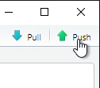
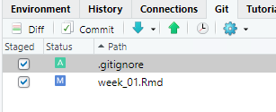
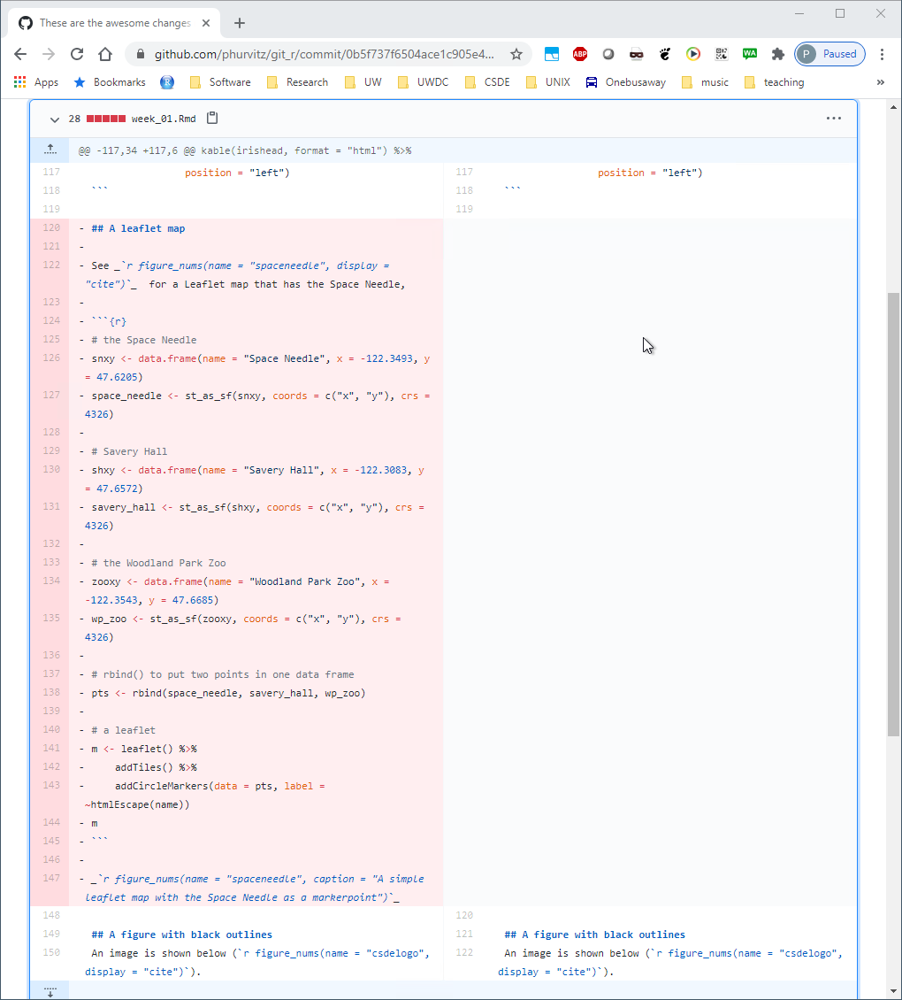

# Week 5 {#week5}


<style>
.und {
  text-decoration: underline;
}
</style>

<h2>Topics: Human Fertility Database (age-specific rates and summary indicators); Git</h2>

This week we will be covering two topics:

* [Human Fertility Database (age-specific rates and summary indicators)](#hmdrevisit)
* [Git](#git)

Download [template.Rmd.txt](files/template.Rmd.txt) as a template for this lesson. Save in in your working folder for the course, renamed to `week_05.Rmd` (with no `.txt` extension). Make any necessary changes to the YAML header.

## Human Fertility Database (age-specific rates and summary indicators) {#hmdrevisit}
CSDE 533 will be looking more at the Human Fertility Database (HFD). This brief section will cover the HFD in a bit more detail than in [Week 2](#datasets002)

### Country code abbreviations
In order to download data using `HMDHFDplus::readHFDweb()` two key pieces of information are needed, the country abbreviation and the coded item name.

First, we should be able to deal with country abbreviations. The `HMDHFDplus` package has the function `getHFDcountries()` that returns the abbreviations shown at [Human Fertility Collection Country / area codes](https://www.fertilitydata.org/cgi-bin/country_codes.php). However, some of the country codes are not ISO standards. This next block of code will generate a tibble with the country abbreviations and country names used in the HFD (Table  1). This will help with formulating the download function.


```r
library(ISOcodes)
library(HMDHFDplus)

# HFD country codes
hfdcodes <- getHFDcountries() %>% tibble(ccode = .)

# ISO country codes
isocodes <- ISO_3166_1 %>% tibble() %>% select(ccode = Alpha_3, Name)

# join ISO codes with country names
hfdcodes %<>% left_join(isocodes, by = "ccode")

# there are some countries in the HFD that do not use standard 3 character ISO codes
hfdcodes %>% filter(is.na(Name))
```

```
## # A tibble: 8 x 2
##   ccode   Name 
##   <chr>   <chr>
## 1 FRATNP  <NA> 
## 2 DEUTNP  <NA> 
## 3 DEUTW   <NA> 
## 4 DEUTE   <NA> 
## 5 GBR_NP  <NA> 
## 6 GBRTENW <NA> 
## 7 GBR_SCO <NA> 
## 8 GBR_NIR <NA>
```

```r
# update those
hfdcodes %<>% 
    mutate(Name = 
        case_when(ccode == "FRATNP" ~  "France",
                  ccode == "DEUTNP" ~  "Germany",
                  ccode == "DEUTE" ~   "East Germany",
                  ccode == "DEUTW" ~   "West Germany",
                  ccode == "GBR_NP" ~  "United Kingdom", 
                  ccode == "GBRTENW" ~ "England and Wales",
                  ccode == "GBR_SCO" ~ "Scotland",
                  ccode == "GBR_NIR" ~ "Northern Ireland",
                  TRUE ~ Name)
    )
```

*Table  1: HFD countries: codes and names*


```r
hfdcodes %>% 
    kable() %>% 
    kable_styling(bootstrap_options =
                      c("striped", "hover", "condensed", "responsive"), 
                  font_size = 12,
                  full_width = F, position = "left")
```

<table class="table table-striped table-hover table-condensed table-responsive" style="font-size: 12px; width: auto !important; ">
 <thead>
  <tr>
   <th style="text-align:left;"> ccode </th>
   <th style="text-align:left;"> Name </th>
  </tr>
 </thead>
<tbody>
  <tr>
   <td style="text-align:left;"> AUT </td>
   <td style="text-align:left;"> Austria </td>
  </tr>
  <tr>
   <td style="text-align:left;"> BLR </td>
   <td style="text-align:left;"> Belarus </td>
  </tr>
  <tr>
   <td style="text-align:left;"> BGR </td>
   <td style="text-align:left;"> Bulgaria </td>
  </tr>
  <tr>
   <td style="text-align:left;"> CAN </td>
   <td style="text-align:left;"> Canada </td>
  </tr>
  <tr>
   <td style="text-align:left;"> CHL </td>
   <td style="text-align:left;"> Chile </td>
  </tr>
  <tr>
   <td style="text-align:left;"> HRV </td>
   <td style="text-align:left;"> Croatia </td>
  </tr>
  <tr>
   <td style="text-align:left;"> CZE </td>
   <td style="text-align:left;"> Czechia </td>
  </tr>
  <tr>
   <td style="text-align:left;"> DNK </td>
   <td style="text-align:left;"> Denmark </td>
  </tr>
  <tr>
   <td style="text-align:left;"> EST </td>
   <td style="text-align:left;"> Estonia </td>
  </tr>
  <tr>
   <td style="text-align:left;"> FIN </td>
   <td style="text-align:left;"> Finland </td>
  </tr>
  <tr>
   <td style="text-align:left;"> FRATNP </td>
   <td style="text-align:left;"> France </td>
  </tr>
  <tr>
   <td style="text-align:left;"> DEUTNP </td>
   <td style="text-align:left;"> Germany </td>
  </tr>
  <tr>
   <td style="text-align:left;"> DEUTW </td>
   <td style="text-align:left;"> West Germany </td>
  </tr>
  <tr>
   <td style="text-align:left;"> DEUTE </td>
   <td style="text-align:left;"> East Germany </td>
  </tr>
  <tr>
   <td style="text-align:left;"> HUN </td>
   <td style="text-align:left;"> Hungary </td>
  </tr>
  <tr>
   <td style="text-align:left;"> ISL </td>
   <td style="text-align:left;"> Iceland </td>
  </tr>
  <tr>
   <td style="text-align:left;"> ITA </td>
   <td style="text-align:left;"> Italy </td>
  </tr>
  <tr>
   <td style="text-align:left;"> JPN </td>
   <td style="text-align:left;"> Japan </td>
  </tr>
  <tr>
   <td style="text-align:left;"> LTU </td>
   <td style="text-align:left;"> Lithuania </td>
  </tr>
  <tr>
   <td style="text-align:left;"> NLD </td>
   <td style="text-align:left;"> Netherlands </td>
  </tr>
  <tr>
   <td style="text-align:left;"> NOR </td>
   <td style="text-align:left;"> Norway </td>
  </tr>
  <tr>
   <td style="text-align:left;"> POL </td>
   <td style="text-align:left;"> Poland </td>
  </tr>
  <tr>
   <td style="text-align:left;"> PRT </td>
   <td style="text-align:left;"> Portugal </td>
  </tr>
  <tr>
   <td style="text-align:left;"> KOR </td>
   <td style="text-align:left;"> Korea, Republic of </td>
  </tr>
  <tr>
   <td style="text-align:left;"> RUS </td>
   <td style="text-align:left;"> Russian Federation </td>
  </tr>
  <tr>
   <td style="text-align:left;"> SVK </td>
   <td style="text-align:left;"> Slovakia </td>
  </tr>
  <tr>
   <td style="text-align:left;"> SVN </td>
   <td style="text-align:left;"> Slovenia </td>
  </tr>
  <tr>
   <td style="text-align:left;"> ESP </td>
   <td style="text-align:left;"> Spain </td>
  </tr>
  <tr>
   <td style="text-align:left;"> SWE </td>
   <td style="text-align:left;"> Sweden </td>
  </tr>
  <tr>
   <td style="text-align:left;"> CHE </td>
   <td style="text-align:left;"> Switzerland </td>
  </tr>
  <tr>
   <td style="text-align:left;"> TWN </td>
   <td style="text-align:left;"> Taiwan, Province of China </td>
  </tr>
  <tr>
   <td style="text-align:left;"> UKR </td>
   <td style="text-align:left;"> Ukraine </td>
  </tr>
  <tr>
   <td style="text-align:left;"> GBR_NP </td>
   <td style="text-align:left;"> United Kingdom </td>
  </tr>
  <tr>
   <td style="text-align:left;"> GBRTENW </td>
   <td style="text-align:left;"> England and Wales </td>
  </tr>
  <tr>
   <td style="text-align:left;"> GBR_SCO </td>
   <td style="text-align:left;"> Scotland </td>
  </tr>
  <tr>
   <td style="text-align:left;"> GBR_NIR </td>
   <td style="text-align:left;"> Northern Ireland </td>
  </tr>
  <tr>
   <td style="text-align:left;"> USA </td>
   <td style="text-align:left;"> United States </td>
  </tr>
</tbody>
</table>

### HFD items
To download data using `HMDHFDplus::readHFDweb()`, it is necessary to specify the item name. For example at thee HFD page [Unites States of America](https://www.humanfertility.org/cgi-bin/country.php?country=USA&tab=si), the first item listed is total number of live births for all birth orders combined between 1933 and 2019; the URL is **www.humanfertility.org/cgi-bin/getfile.plx?f=USA\20210422\USA<span class="und">totbirthsRR</span>.txt** (where the item name is underlined).

Using Ben's HFD code as a template, we can download the same item for several countries.

First, we create a generic function to download HFD data for a country and an item:


```r
# a function to read HFD for one country and one item
read_hfd_country <- function(CNTRY, item) {
  HMDHFDplus::readHFDweb(
    # the country from the function call
    CNTRY = CNTRY,
    # the item to download
    item = item,
    # the username from this key's record
    username = keyring::key_list("human-mortality-database")$username,
    # the password for this key's record
    password = keyring::key_get(
      service = "human-mortality-database",
      username = keyring::key_list("human-mortality-database")$username
    )
  )
}
```

We then create a function to download an item for a set of countries


```r
# Download a data set iteratively for all named countries using purrr::map()
read_hfd_countries_item <- function(countries, item){
    countries %>%
        # Returns a list of data.frames, adding a column for country code to each
        # the map() function performs a run of Ben's read_hmd_country() 
        #   function for each listed country
        purrr::map_dfr(function(ccode) {
            # the item to read is 1 x 1 death rates
            read_hfd_country(ccode, item) %>%
                # this adds the column "country" storing the country ISO code
                dplyr::mutate(ccode = ccode)
        }) %>%
        # Phil added this to make it a tibble
        tibble() %>% 
        # and add country name
        left_join(hfdcodes, by = "ccode")
}
```

Finally, run the function to download one item for a set of countries:


```r
CNTRIES <- hfdcodes %>% 
    filter(Name %in% c("United States", "Lithuania", "Japan")) %>% 
    pull(ccode)

totbirthsRR_USA_LTU_JPN <- read_hfd_countries_item(countries = CNTRIES, item = "totbirthsRR")
```

Let's make a graph from that (Figure  1).


```r
totbirthsRR_USA_LTU_JPN %>% 
    mutate(TotalM = Total / 1000000) %>% 
    ggplot( 
       mapping = aes(x = Year, y = TotalM)) +
    geom_line() +
    facet_wrap(~Name, ncol = 1, scales = "free_y") +
    ylab("live births") +
    xlab("year")
```


\    
*Figure  1: Live births x 1 million: Japan, Lithuania, USA (note non-standardized Y scale)*

## Git {#git}

This section is a brief introduction to [Git](https://git-scm.com/), the free and open source version control system for text-based files. Much of the material in this lesson is derived from the [Software Carpentry Git tutorial](https://swcarpentry.github.io/git-novice/).

### Why use version control?
Version control is simply having control over various versions of your documents. In the context of code-based research using text files such as `.R`, `.Rmd`, `.tex`, `.sql`, `.do`, at the simplest level, version control means having the ability to track changes to your files. In more advanced levels, you should be able to revert to previous versions, collaborate with others and know who did what and when, or to merge together edits made by more than one person

We covered one form of version control in a previous assignment and in the section of this document on [File systems](#file-systems). The version control system was simply keeping copies of existing files and naming new files according to a temporal sequence, with date being the suggested method of nomenclature.

While keeping backup, dated copies of files is not necessarily a bad approach, it suffers from a few major limitations, including:

1. because it relies on saving different versions of a file, it can lead to a proliferation of files
1. it is not often easy to know what changes were made from version to version

Jorge Cham's ([Piled Higher and Deeper](http://www.phdcomics.com)) comic points out what happens to a typical graduate student's "final" version:

[](http://www.phdcomics.com)

### Why use Git?
Version controls systems have been in use since the early 1980s. Commonly used applications are RCS (Revision Control System), CVS (Concurrent Versions System), SVN (Subversion).  However, some of these require centralized servers, are limited in their capabilities, and are not free.

Git has multiple advantages:

* free
* supports complex work flows with branching, merging, etc., allowing multiple collaborators to work on the same set of files at the same time
* does not require a centralized server (version control can be managed completely within a single computer)
    * it is possible to use online repositories, such as Github.com
* can be used within RStudio
* has a large community of users (i.e., free advice)

### Limitations of version control systems
Although version control systems are quite useful, there are some potential drawbacks.

1. requires learning yet another somewhat-complicated system
1. requires mindfulness
    * recorded changes are best performed interactively
    * can only "undo" changes that were committed
1. designed for text files; cannot deal with binary files, e.g., Word or other formats

### A brief Git tutorial
Here we will be using the basic functions of Git while building up an Rmd file.

#### Setting up Git in RStudio
We will be working on CSDE Terminal Server 4 (see [Getting started on Terminal Server 4](#getting-started-on-terminal-server-4)). 

Start RStudio and open a web browser.

#### Creating a repository
Using the web browser, go to [Github.com](http://github.com) and create a repository named `git_r`.


Make the repository public and add a README file.


Switch back to RStudio and select `File > New Project` and in the choice of project types, select `Version Control`. This will streamline the process of linking the RStudio project with Github.


Choose `Git` as the type of version control.


Enter the complete URL of your new Git repository. The project directly name should automatically be set as the base name pf the URL. If not, enter `git_r`.


Because we need to define where on the local file system the project files will be stored, click `Browse` and navigate to your `H:` drive (note that this is your UDrive).


After you have specified the repository URL, project directory name, and parent directory of the project directory, click `Create Project`.


#### Tracking changes
One of the files we will change is [week_01.Rmd](files/week_01.Rmd), so download this to the main folder of your project.

The first file we will make changes to is `README.md`.

Add some text explaining what purpose the repository serves.


Save the changes to the README.md file. If you do not see updates in the Git tab, click the `Refresh listing` button. You may need to do this frequently if your file changes are frequent. Note the status of files will only change when the files are saved.


You should see a blue "M" next to the README.md file. Click the check box for `Staged` to prepare to commit the changes to the file and prepare to push to the remote server.


Click `Commit` and a new window will open. Any deletions are shown with a light red background. Additions are shown with a light green background, and text that has not changed will have a white background.

Enter some explanatory text in the `Commit message` panel. This message will help identify historical commits. The explanatory text should succinctly describe any changes you have made.

The idea is to make commits each time you have substantially changed your code. If you wait too long between commits, the number of changes in a single commit may be unmanageable. But if commits are made too frequently, the number of commits may become unmanageable. Think of this similarly to how often you might make a new version of a document.


Next, we will perform an initial pull/push. It is recommended in multi-user environments to perform a pull from the online repository before pushing. This lets you download to your local file system any files that have been updated by others.

In the Git tab, click the `Pull` icon.


Since no changes have been made to the online files, we see the message "Already up to date".


Next, click the `Push` icon to upload any changed files.



At some point in the process of establishing the connection to Github, you may get some popups asking you to sign in. If this happens, proceed with the authorization.


When the authorization is completed, the push will proceed. Your screen will look different, but the last line of text here shows a truncated version of the unique hash (identifier) of the push transaction. This unique hash will allow you to download previous versions of the file in case you made commits and pushes that caused unintended consequences.


If you refresh the page for your repository, you should see the updates you made to the README.md file. This is the basic process for updating files, committing changes, and pushing to Github.


Perform the same steps (click `Staged` then `Commit` for week_01.Rmd). Because this is a new file that was not in the Github repository, when it is committed, it will show in all green since all of the text has been added. 


Repeat the pull/push cycle and then refresh your browser to show that the file was added to the online Github repository.


If you click the file name you will see the contents.


Let's make some changes to this file. Back in RStudio, add to the list of packages to load at line 51.

```
library(htmltools) # popup on Leaflet map
```

Change the description at line 122 to read 

```
... for a Leaflet map that has the Space Needle, Savery Hall, and the Woodland Park Zoo.
```

and change the code chunk to add two additional points and text popups for the point markers. The chunk should contain the following code:

```
# the Space Needle
snxy <- data.frame(name = "Space Needle", x = -122.3493, y = 47.6205)
space_needle <- st_as_sf(snxy, coords = c("x", "y"), crs = 4326)

# Savery Hall
shxy <- data.frame(name = "Savery Hall", x = -122.3083, y = 47.6572)
savery_hall <- st_as_sf(shxy, coords = c("x", "y"), crs = 4326)

# the Woodland Park Zoo
zooxy <- data.frame(name = "Woodland Park Zoo", x = -122.3543, y = 47.6685)
wp_zoo <- st_as_sf(zooxy, coords = c("x", "y"), crs = 4326)

# rbind() to put two points in one data frame
pts <- rbind(space_needle, savery_hall, wp_zoo)

# a leaflet
m <- leaflet() %>% 
    addTiles() %>% 
    addCircleMarkers(data = pts, label = ~htmlEscape(name))
m
```

Save the edits to the file and then tap the "knit" button or enter at the console prompt `rmarkdown::render("week_01.Rmd")` to generate the HTML file. You should see that now there are three point markers, and if you hover over any of the markers you will see the name popup.


#### Git bash shell

Another interface you can use is the Git bash shell. To open the shell, click `Tools > Shell`. 

 

All of the GUI commands we have used in RStudio are available in the shell. In fact, very little of the functionality of Git is available within RStudio. To take full advantage of Git, it is necessary to use the shell. There are a number of excellent tutorials on the use of the shell. For now because this is an introductory lesson, we will focus mainly on the RStudio interface,

The shell should be set to the project folder; if not you can enter e.g., `cd /H/git_r` (note that this corresponds to the Windows folder `H:\git_r`).

At the prompt, enter `git status`. This will show the status of all files, in this case showing that `week_01.Rmd` has been modified, and that there are some files that are not being tracked.


#### Ignoring specific files
Sometimes we are not interested in particular files being committed or pushed to the repository. For version control, we are interested in managing the code that is used to create outputs rather than the outputs themselves, with the idea being that if you have the code, you can recreate any outputs.

So there are files that can be ignored, which are specified in the `.gitignore` file. Open the file and add the line `*.html`. This tells Git not to bother managing HTML files (under the assumption that these are the output of rendering Rmd files).


Save the `.gitignore` file and re-run `git status` at the shell (by tapping the up arrow key on your keyboard and tapping Enter). You should see that the HTML file does not show up in the list of changed or untracked files.


Add the line `*.Rproj` to the `.gitignore` file--this file should not be necessary in the repository.

Likewise, if you refresh the Git tab in RStudio, the HTML file is no longer listed.


We will perform a few more tasks with the shell. Enter `add .gitignore` and `add week_01.Rmd`. This is the equivalent of clicking the `Staged` check box in RStudio.


Refreshing the Git tab in RStudio will show that these two files are staged. This demonstrates that the RStudio Git environment is up to date with any changes made using the Git shell, and vice versa.




#### Exploring file change history
Click `Commit` to prepare to commit the changes (addition of `.gitignore` and the changes to `week_01.Rmd`).

As previously mentioned, deleted lines are shown in light red, added lines in light green, and unchanged lines with no highlighting. Click the entry for `week_01.Rmd` and the changes are apparent. Line numbers on the far left are the original line numbers. The next column to the right shows updated line numbers.

This allows you to compare the currently saved version against the previous version of the file.


Committing changes with the shell is done by entering 

`
git commit -m "somecomment"
`

This has the same effect as clicking `Commit` in RStudio and entering the comment.

Note that if we have not made some initial user configurations, Git will print some informative text about your identity. To avoid this and to tag future commits, use the `git config --global` commands, e.g., 

`
git config --global user.name "My Full Name"
git config --global user.email "myemailaddress@mydomain"
`


Once the commit is performed, either with the RStudio GUI or with the shell, you can verify that no files are listed to be possibly staged.


Perform another pull/push cycle and then refresh your web browser. Click on the commit comment.


You will see the changes to the two files in the last commit/push. The `.gitignore` file has all of its lines in green, indicating they are all new with respect to the repository. The file `week_01.Rmd` shows the same changes on Github as we saw in the local view before pushing the commit to the server.


#### Restoring a previous version
What good are all of these tracked changes if we cannot revert to a previous version of a file? Here we will make some intentional bad edits to a file, commit and push, but then retrieve a previous version of the file. Any version can be recovered. Note that this does not mean you can recover any and all edits to a file. It only means you can recover what changed between commits. For example, if I made a commit/push at noon, then made a lot of changes and saved the file multiple times before 5 PM and then made a commit/push, there would only be two versions of the file available in Git, the one committed at noon, and the one committed at 5 PM. For this reason it is worth making commit/push cycles every time you thing you might want to revert to a previous version.

The intentional bad change to `week_01.Rmd` is the complete removal of the code that produces the Leaflet map. See the following image.


Perform the standard cycle: stage, commit (with a snarky comment), pull, and push.


You should see the large swath of deleted lines


Back in the Github, find and click the file name.


The file contents will show the most recent saved version (missing the Leaflet map lines). Click on the `History` link, which will show all of the commits.


Click the commit where you followed the questionable advice from your advisor.


The missing lines are evident. What we would like to do is to go back to the version before the large deletion of lines.



Identify the previous commit and click the clipboard icon to the left of the first characters of the commit hash. This will copy the hash, which is necessary for restoring that version.


Back in the shell, enter

```
git show *****
```

where ***** is the hash. This will display encoded instructions for changes made to the file. Now enter

```
git show *****:week_01.Rmd
```

where `*****` is the hash.


This applies the changes to the file for the commit represented by the hash. You will see the text that was present at that commit, which includes the deleted Leaflet map.


To restore this previous version to a new file, enter

```
git show *****:week_01.Rmd > week_01_someadditionaldescription.Rmd
```

This prints the contents of the previously committed file and redirects the output to the named file after the `>` sign.


If you open that file, you will see the restored text.


#### Conclusion
This was a brief introduction to the main functionality of Git with RStudio and Github. If you expect to perform even a modest amount of coding, you could benefit from Git as a way to keep track of your work, collaborate with others, and avoid programming disasters due to inadvertent deletion of overwriting of files.

<hr>
<<<<<<< HEAD
Rendered at <tt>2022-03-11 16:05:12</tt>
=======
Rendered at <tt>2022-03-04 00:44:14</tt>
>>>>>>> 30102f5ff2370c3a3ecdf20f2626c3c01ac56fe8

## Source code
File is at CSDE-TS1: R:/Project/CSDE502/2022/csde502-winter-2022-main/05-week05.Rmd.

### R code used in this document

```r
pacman::p_load(ISOcodes, tidyverse, magrittr, knitr, kableExtra, readstata13, HMDHFDplus, captioner)

figure_nums <- captioner(prefix = "Figure")
table_nums <- captioner(prefix = "Table")

# path to this file name
if (!interactive()) {
    fnamepath <- current_input(dir = TRUE)
    fnamestr <- paste0(Sys.getenv("COMPUTERNAME"), ": ", fnamepath)
} else {
    fnamepath <- ""
}
library(ISOcodes)
library(HMDHFDplus)

# HFD country codes
hfdcodes <- getHFDcountries() %>% tibble(ccode = .)

# ISO country codes
isocodes <- ISO_3166_1 %>% tibble() %>% select(ccode = Alpha_3, Name)

# join ISO codes with country names
hfdcodes %<>% left_join(isocodes, by = "ccode")

# there are some countries in the HFD that do not use standard 3 character ISO codes
hfdcodes %>% filter(is.na(Name))

# update those
hfdcodes %<>% 
    mutate(Name = 
        case_when(ccode == "FRATNP" ~  "France",
                  ccode == "DEUTNP" ~  "Germany",
                  ccode == "DEUTE" ~   "East Germany",
                  ccode == "DEUTW" ~   "West Germany",
                  ccode == "GBR_NP" ~  "United Kingdom", 
                  ccode == "GBRTENW" ~ "England and Wales",
                  ccode == "GBR_SCO" ~ "Scotland",
                  ccode == "GBR_NIR" ~ "Northern Ireland",
                  TRUE ~ Name)
    )
hfdcodes %>% 
    kable() %>% 
    kable_styling(bootstrap_options =
                      c("striped", "hover", "condensed", "responsive"), 
                  font_size = 12,
                  full_width = F, position = "left")
# a function to read HFD for one country and one item
read_hfd_country <- function(CNTRY, item) {
  HMDHFDplus::readHFDweb(
    # the country from the function call
    CNTRY = CNTRY,
    # the item to download
    item = item,
    # the username from this key's record
    username = keyring::key_list("human-mortality-database")$username,
    # the password for this key's record
    password = keyring::key_get(
      service = "human-mortality-database",
      username = keyring::key_list("human-mortality-database")$username
    )
  )
}
# Download a data set iteratively for all named countries using purrr::map()
read_hfd_countries_item <- function(countries, item){
    countries %>%
        # Returns a list of data.frames, adding a column for country code to each
        # the map() function performs a run of Ben's read_hmd_country() 
        #   function for each listed country
        purrr::map_dfr(function(ccode) {
            # the item to read is 1 x 1 death rates
            read_hfd_country(ccode, item) %>%
                # this adds the column "country" storing the country ISO code
                dplyr::mutate(ccode = ccode)
        }) %>%
        # Phil added this to make it a tibble
        tibble() %>% 
        # and add country name
        left_join(hfdcodes, by = "ccode")
}
CNTRIES <- hfdcodes %>% 
    filter(Name %in% c("United States", "Lithuania", "Japan")) %>% 
    pull(ccode)

totbirthsRR_USA_LTU_JPN <- read_hfd_countries_item(countries = CNTRIES, item = "totbirthsRR")
totbirthsRR_USA_LTU_JPN %>% 
    mutate(TotalM = Total / 1000000) %>% 
    ggplot( 
       mapping = aes(x = Year, y = TotalM)) +
    geom_line() +
    facet_wrap(~Name, ncol = 1, scales = "free_y") +
    ylab("live births") +
    xlab("year")
cat(readLines(fnamepath), sep = '\n')
```

### Complete Rmd code

```r
cat(readLines(fnamepath), sep = '\n')
```

````
# Week 5 {#week5}

```{r, echo=FALSE, warning=FALSE, message=FALSE}
pacman::p_load(ISOcodes, tidyverse, magrittr, knitr, kableExtra, readstata13, HMDHFDplus, captioner)

figure_nums <- captioner(prefix = "Figure")
table_nums <- captioner(prefix = "Table")

# path to this file name
if (!interactive()) {
    fnamepath <- current_input(dir = TRUE)
    fnamestr <- paste0(Sys.getenv("COMPUTERNAME"), ": ", fnamepath)
} else {
    fnamepath <- ""
}
```

<style>
.und {
  text-decoration: underline;
}
</style>

<h2>Topics: Human Fertility Database (age-specific rates and summary indicators); Git</h2>

This week we will be covering two topics:

* [Human Fertility Database (age-specific rates and summary indicators)](#hmdrevisit)
* [Git](#git)

Download [template.Rmd.txt](files/template.Rmd.txt) as a template for this lesson. Save in in your working folder for the course, renamed to `week_05.Rmd` (with no `.txt` extension). Make any necessary changes to the YAML header.

## Human Fertility Database (age-specific rates and summary indicators) {#hmdrevisit}
CSDE 533 will be looking more at the Human Fertility Database (HFD). This brief section will cover the HFD in a bit more detail than in [Week 2](#datasets002)

### Country code abbreviations
In order to download data using `HMDHFDplus::readHFDweb()` two key pieces of information are needed, the country abbreviation and the coded item name.

First, we should be able to deal with country abbreviations. The `HMDHFDplus` package has the function `getHFDcountries()` that returns the abbreviations shown at [Human Fertility Collection Country / area codes](https://www.fertilitydata.org/cgi-bin/country_codes.php). However, some of the country codes are not ISO standards. This next block of code will generate a tibble with the country abbreviations and country names used in the HFD (`r table_nums(name = "hfdcountries", display = "cite")`). This will help with formulating the download function.

```{r}
library(ISOcodes)
library(HMDHFDplus)

# HFD country codes
hfdcodes <- getHFDcountries() %>% tibble(ccode = .)

# ISO country codes
isocodes <- ISO_3166_1 %>% tibble() %>% select(ccode = Alpha_3, Name)

# join ISO codes with country names
hfdcodes %<>% left_join(isocodes, by = "ccode")

# there are some countries in the HFD that do not use standard 3 character ISO codes
hfdcodes %>% filter(is.na(Name))

# update those
hfdcodes %<>% 
    mutate(Name = 
        case_when(ccode == "FRATNP" ~  "France",
                  ccode == "DEUTNP" ~  "Germany",
                  ccode == "DEUTE" ~   "East Germany",
                  ccode == "DEUTW" ~   "West Germany",
                  ccode == "GBR_NP" ~  "United Kingdom", 
                  ccode == "GBRTENW" ~ "England and Wales",
                  ccode == "GBR_SCO" ~ "Scotland",
                  ccode == "GBR_NIR" ~ "Northern Ireland",
                  TRUE ~ Name)
    )
```

*`r table_nums(name = "hfdcountries", caption = "HFD countries: codes and names")`*

```{r}
hfdcodes %>% 
    kable() %>% 
    kable_styling(bootstrap_options =
                      c("striped", "hover", "condensed", "responsive"), 
                  font_size = 12,
                  full_width = F, position = "left")
```

### HFD items
To download data using `HMDHFDplus::readHFDweb()`, it is necessary to specify the item name. For example at thee HFD page [Unites States of America](https://www.humanfertility.org/cgi-bin/country.php?country=USA&tab=si), the first item listed is total number of live births for all birth orders combined between 1933 and 2019; the URL is **www.humanfertility.org/cgi-bin/getfile.plx?f=USA\20210422\USA<span class="und">totbirthsRR</span>.txt** (where the item name is underlined).

Using Ben's HFD code as a template, we can download the same item for several countries.

First, we create a generic function to download HFD data for a country and an item:

```{r}
# a function to read HFD for one country and one item
read_hfd_country <- function(CNTRY, item) {
  HMDHFDplus::readHFDweb(
    # the country from the function call
    CNTRY = CNTRY,
    # the item to download
    item = item,
    # the username from this key's record
    username = keyring::key_list("human-mortality-database")$username,
    # the password for this key's record
    password = keyring::key_get(
      service = "human-mortality-database",
      username = keyring::key_list("human-mortality-database")$username
    )
  )
}
```

We then create a function to download an item for a set of countries

```{r}
# Download a data set iteratively for all named countries using purrr::map()
read_hfd_countries_item <- function(countries, item){
    countries %>%
        # Returns a list of data.frames, adding a column for country code to each
        # the map() function performs a run of Ben's read_hmd_country() 
        #   function for each listed country
        purrr::map_dfr(function(ccode) {
            # the item to read is 1 x 1 death rates
            read_hfd_country(ccode, item) %>%
                # this adds the column "country" storing the country ISO code
                dplyr::mutate(ccode = ccode)
        }) %>%
        # Phil added this to make it a tibble
        tibble() %>% 
        # and add country name
        left_join(hfdcodes, by = "ccode")
}
```

Finally, run the function to download one item for a set of countries:

```{r}
CNTRIES <- hfdcodes %>% 
    filter(Name %in% c("United States", "Lithuania", "Japan")) %>% 
    pull(ccode)

totbirthsRR_USA_LTU_JPN <- read_hfd_countries_item(countries = CNTRIES, item = "totbirthsRR")
```

Let's make a graph from that (`r figure_nums(name = "livebirths", display = "cite")`).

```{r}
totbirthsRR_USA_LTU_JPN %>% 
    mutate(TotalM = Total / 1000000) %>% 
    ggplot( 
       mapping = aes(x = Year, y = TotalM)) +
    geom_line() +
    facet_wrap(~Name, ncol = 1, scales = "free_y") +
    ylab("live births") +
    xlab("year")
```
\    
*`r figure_nums(name = "livebirths", caption = "Live births x 1 million: Japan, Lithuania, USA (note non-standardized Y scale)")`*

## Git {#git}

This section is a brief introduction to [Git](https://git-scm.com/), the free and open source version control system for text-based files. Much of the material in this lesson is derived from the [Software Carpentry Git tutorial](https://swcarpentry.github.io/git-novice/).

### Why use version control?
Version control is simply having control over various versions of your documents. In the context of code-based research using text files such as `.R`, `.Rmd`, `.tex`, `.sql`, `.do`, at the simplest level, version control means having the ability to track changes to your files. In more advanced levels, you should be able to revert to previous versions, collaborate with others and know who did what and when, or to merge together edits made by more than one person

We covered one form of version control in a previous assignment and in the section of this document on [File systems](#file-systems). The version control system was simply keeping copies of existing files and naming new files according to a temporal sequence, with date being the suggested method of nomenclature.

While keeping backup, dated copies of files is not necessarily a bad approach, it suffers from a few major limitations, including:

1. because it relies on saving different versions of a file, it can lead to a proliferation of files
1. it is not often easy to know what changes were made from version to version

Jorge Cham's ([Piled Higher and Deeper](http://www.phdcomics.com)) comic points out what happens to a typical graduate student's "final" version:

[](http://www.phdcomics.com)

### Why use Git?
Version controls systems have been in use since the early 1980s. Commonly used applications are RCS (Revision Control System), CVS (Concurrent Versions System), SVN (Subversion).  However, some of these require centralized servers, are limited in their capabilities, and are not free.

Git has multiple advantages:

* free
* supports complex work flows with branching, merging, etc., allowing multiple collaborators to work on the same set of files at the same time
* does not require a centralized server (version control can be managed completely within a single computer)
    * it is possible to use online repositories, such as Github.com
* can be used within RStudio
* has a large community of users (i.e., free advice)

### Limitations of version control systems
Although version control systems are quite useful, there are some potential drawbacks.

1. requires learning yet another somewhat-complicated system
1. requires mindfulness
    * recorded changes are best performed interactively
    * can only "undo" changes that were committed
1. designed for text files; cannot deal with binary files, e.g., Word or other formats

### A brief Git tutorial
Here we will be using the basic functions of Git while building up an Rmd file.

#### Setting up Git in RStudio
We will be working on CSDE Terminal Server 4 (see [Getting started on Terminal Server 4](#getting-started-on-terminal-server-4)). 

Start RStudio and open a web browser.

#### Creating a repository
Using the web browser, go to [Github.com](http://github.com) and create a repository named `git_r`.


Make the repository public and add a README file.


Switch back to RStudio and select `File > New Project` and in the choice of project types, select `Version Control`. This will streamline the process of linking the RStudio project with Github.


Choose `Git` as the type of version control.


Enter the complete URL of your new Git repository. The project directly name should automatically be set as the base name pf the URL. If not, enter `git_r`.


Because we need to define where on the local file system the project files will be stored, click `Browse` and navigate to your `H:` drive (note that this is your UDrive).


After you have specified the repository URL, project directory name, and parent directory of the project directory, click `Create Project`.


#### Tracking changes
One of the files we will change is [week_01.Rmd](files/week_01.Rmd), so download this to the main folder of your project.

The first file we will make changes to is `README.md`.

Add some text explaining what purpose the repository serves.


Save the changes to the README.md file. If you do not see updates in the Git tab, click the `Refresh listing` button. You may need to do this frequently if your file changes are frequent. Note the status of files will only change when the files are saved.


You should see a blue "M" next to the README.md file. Click the check box for `Staged` to prepare to commit the changes to the file and prepare to push to the remote server.


Click `Commit` and a new window will open. Any deletions are shown with a light red background. Additions are shown with a light green background, and text that has not changed will have a white background.

Enter some explanatory text in the `Commit message` panel. This message will help identify historical commits. The explanatory text should succinctly describe any changes you have made.

The idea is to make commits each time you have substantially changed your code. If you wait too long between commits, the number of changes in a single commit may be unmanageable. But if commits are made too frequently, the number of commits may become unmanageable. Think of this similarly to how often you might make a new version of a document.


Next, we will perform an initial pull/push. It is recommended in multi-user environments to perform a pull from the online repository before pushing. This lets you download to your local file system any files that have been updated by others.

In the Git tab, click the `Pull` icon.


Since no changes have been made to the online files, we see the message "Already up to date".


Next, click the `Push` icon to upload any changed files.


At some point in the process of establishing the connection to Github, you may get some popups asking you to sign in. If this happens, proceed with the authorization.


When the authorization is completed, the push will proceed. Your screen will look different, but the last line of text here shows a truncated version of the unique hash (identifier) of the push transaction. This unique hash will allow you to download previous versions of the file in case you made commits and pushes that caused unintended consequences.


If you refresh the page for your repository, you should see the updates you made to the README.md file. This is the basic process for updating files, committing changes, and pushing to Github.


Perform the same steps (click `Staged` then `Commit` for week_01.Rmd). Because this is a new file that was not in the Github repository, when it is committed, it will show in all green since all of the text has been added. 


Repeat the pull/push cycle and then refresh your browser to show that the file was added to the online Github repository.


If you click the file name you will see the contents.


Let's make some changes to this file. Back in RStudio, add to the list of packages to load at line 51.

```
library(htmltools) # popup on Leaflet map
```

Change the description at line 122 to read 

```
... for a Leaflet map that has the Space Needle, Savery Hall, and the Woodland Park Zoo.
```

and change the code chunk to add two additional points and text popups for the point markers. The chunk should contain the following code:

```
# the Space Needle
snxy <- data.frame(name = "Space Needle", x = -122.3493, y = 47.6205)
space_needle <- st_as_sf(snxy, coords = c("x", "y"), crs = 4326)

# Savery Hall
shxy <- data.frame(name = "Savery Hall", x = -122.3083, y = 47.6572)
savery_hall <- st_as_sf(shxy, coords = c("x", "y"), crs = 4326)

# the Woodland Park Zoo
zooxy <- data.frame(name = "Woodland Park Zoo", x = -122.3543, y = 47.6685)
wp_zoo <- st_as_sf(zooxy, coords = c("x", "y"), crs = 4326)

# rbind() to put two points in one data frame
pts <- rbind(space_needle, savery_hall, wp_zoo)

# a leaflet
m <- leaflet() %>% 
    addTiles() %>% 
    addCircleMarkers(data = pts, label = ~htmlEscape(name))
m
```

Save the edits to the file and then tap the "knit" button or enter at the console prompt `rmarkdown::render("week_01.Rmd")` to generate the HTML file. You should see that now there are three point markers, and if you hover over any of the markers you will see the name popup.


#### Git bash shell

Another interface you can use is the Git bash shell. To open the shell, click `Tools > Shell`. 

 

All of the GUI commands we have used in RStudio are available in the shell. In fact, very little of the functionality of Git is available within RStudio. To take full advantage of Git, it is necessary to use the shell. There are a number of excellent tutorials on the use of the shell. For now because this is an introductory lesson, we will focus mainly on the RStudio interface,

The shell should be set to the project folder; if not you can enter e.g., `cd /H/git_r` (note that this corresponds to the Windows folder `H:\git_r`).

At the prompt, enter `git status`. This will show the status of all files, in this case showing that `week_01.Rmd` has been modified, and that there are some files that are not being tracked.


#### Ignoring specific files
Sometimes we are not interested in particular files being committed or pushed to the repository. For version control, we are interested in managing the code that is used to create outputs rather than the outputs themselves, with the idea being that if you have the code, you can recreate any outputs.

So there are files that can be ignored, which are specified in the `.gitignore` file. Open the file and add the line `*.html`. This tells Git not to bother managing HTML files (under the assumption that these are the output of rendering Rmd files).


Save the `.gitignore` file and re-run `git status` at the shell (by tapping the up arrow key on your keyboard and tapping Enter). You should see that the HTML file does not show up in the list of changed or untracked files.


Add the line `*.Rproj` to the `.gitignore` file--this file should not be necessary in the repository.

Likewise, if you refresh the Git tab in RStudio, the HTML file is no longer listed.


We will perform a few more tasks with the shell. Enter `add .gitignore` and `add week_01.Rmd`. This is the equivalent of clicking the `Staged` check box in RStudio.


Refreshing the Git tab in RStudio will show that these two files are staged. This demonstrates that the RStudio Git environment is up to date with any changes made using the Git shell, and vice versa.


#### Exploring file change history
Click `Commit` to prepare to commit the changes (addition of `.gitignore` and the changes to `week_01.Rmd`).

As previously mentioned, deleted lines are shown in light red, added lines in light green, and unchanged lines with no highlighting. Click the entry for `week_01.Rmd` and the changes are apparent. Line numbers on the far left are the original line numbers. The next column to the right shows updated line numbers.

This allows you to compare the currently saved version against the previous version of the file.


Committing changes with the shell is done by entering 

`
git commit -m "somecomment"
`

This has the same effect as clicking `Commit` in RStudio and entering the comment.

Note that if we have not made some initial user configurations, Git will print some informative text about your identity. To avoid this and to tag future commits, use the `git config --global` commands, e.g., 

`
git config --global user.name "My Full Name"
git config --global user.email "myemailaddress@mydomain"
`


Once the commit is performed, either with the RStudio GUI or with the shell, you can verify that no files are listed to be possibly staged.


Perform another pull/push cycle and then refresh your web browser. Click on the commit comment.


You will see the changes to the two files in the last commit/push. The `.gitignore` file has all of its lines in green, indicating they are all new with respect to the repository. The file `week_01.Rmd` shows the same changes on Github as we saw in the local view before pushing the commit to the server.


#### Restoring a previous version
What good are all of these tracked changes if we cannot revert to a previous version of a file? Here we will make some intentional bad edits to a file, commit and push, but then retrieve a previous version of the file. Any version can be recovered. Note that this does not mean you can recover any and all edits to a file. It only means you can recover what changed between commits. For example, if I made a commit/push at noon, then made a lot of changes and saved the file multiple times before 5 PM and then made a commit/push, there would only be two versions of the file available in Git, the one committed at noon, and the one committed at 5 PM. For this reason it is worth making commit/push cycles every time you thing you might want to revert to a previous version.

The intentional bad change to `week_01.Rmd` is the complete removal of the code that produces the Leaflet map. See the following image.


Perform the standard cycle: stage, commit (with a snarky comment), pull, and push.


You should see the large swath of deleted lines


Back in the Github, find and click the file name.


The file contents will show the most recent saved version (missing the Leaflet map lines). Click on the `History` link, which will show all of the commits.


Click the commit where you followed the questionable advice from your advisor.


The missing lines are evident. What we would like to do is to go back to the version before the large deletion of lines.


Identify the previous commit and click the clipboard icon to the left of the first characters of the commit hash. This will copy the hash, which is necessary for restoring that version.


Back in the shell, enter

```
git show *****
```

where ***** is the hash. This will display encoded instructions for changes made to the file. Now enter

```
git show *****:week_01.Rmd
```

where `*****` is the hash.


This applies the changes to the file for the commit represented by the hash. You will see the text that was present at that commit, which includes the deleted Leaflet map.


To restore this previous version to a new file, enter

```
git show *****:week_01.Rmd > week_01_someadditionaldescription.Rmd
```

This prints the contents of the previously committed file and redirects the output to the named file after the `>` sign.


If you open that file, you will see the restored text.


#### Conclusion
This was a brief introduction to the main functionality of Git with RStudio and Github. If you expect to perform even a modest amount of coding, you could benefit from Git as a way to keep track of your work, collaborate with others, and avoid programming disasters due to inadvertent deletion of overwriting of files.

<hr>
Rendered at <tt>`r Sys.time()`</tt>

## Source code
File is at `r fnamestr`.

### R code used in this document
```{r ref.label=knitr::all_labels(), echo=TRUE, eval=FALSE}
```

### Complete Rmd code
```{r comment=''}
cat(readLines(fnamepath), sep = '\n')
```
````
