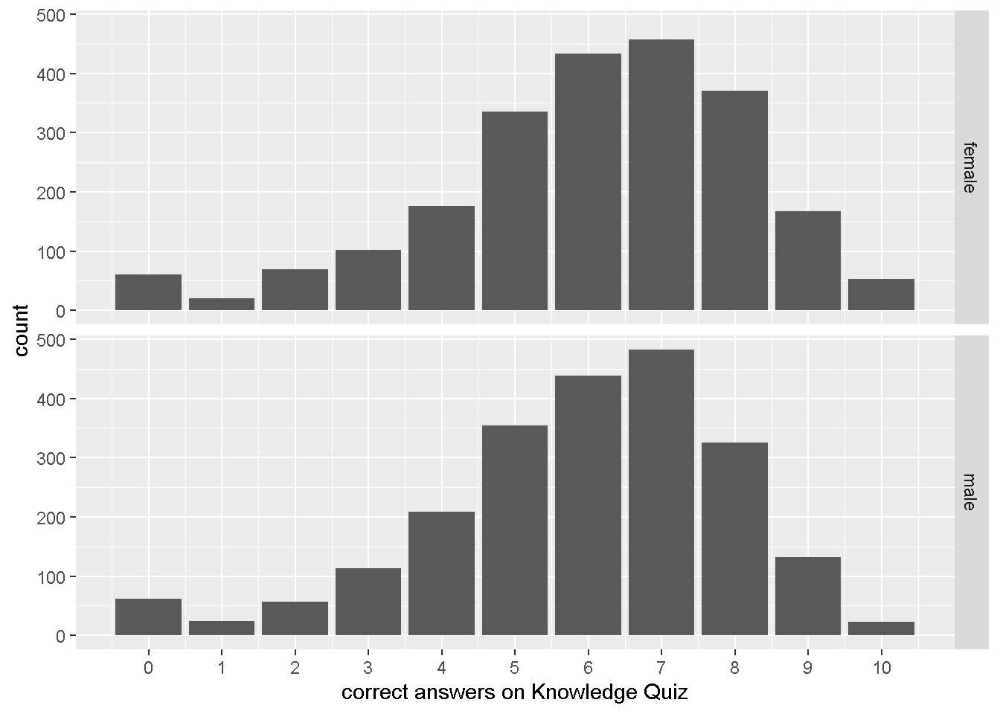

# Week 8 {#week8}


<h2>Topic: Add Health data: variable creation and scale scoring</h2>
This week's lesson will provide more background on variable creation and scale scoring. The scale scoring exercise will be used to create a single variable that represents how well respondents did overall on a subset of questions.

## Scale scoring
We will be using data from the Knowledge Quiz. Download or open [21600-0001-Codebook_Questionnaire.pdf](http://staff.washington.edu/phurvitz/csde502_winter_2021/data/metadata/Wave1_Comprehensive_Codebook/21600-0001-Codebook_Questionnaire.pdf) in a new window or tab and go to page 203, or search for the string `H1KQ1A`.

We will be using the file `AHwave1_v1.dta`, which is downloaded and read in the following code chunk, along with presentation of the column names, labels, and values.


```r
dat <- haven::read_dta("http://staff.washington.edu/phurvitz/csde502_winter_2021/data/AHwave1_v1.dta")

metadata <- bind_cols(
    # variable name
    varname = colnames(dat),
    # label
    varlabel = lapply(dat, function(x) attributes(x)$label) %>% 
        unlist(),
    # values
    varvalues = lapply(dat, function(x) attributes(x)$labels) %>% 
        # names the variable label vector
        lapply(., function(x) names(x)) %>% 
        # as character
        as.character() %>% 
        # remove the c() construction
        str_remove_all("^c\\(|\\)$")
)

DT::datatable(metadata)
```

```{=html}
<div id="htmlwidget-1d17f685820425b79922" style="width:100%;height:auto;" class="datatables html-widget"></div>
<script type="application/json" data-for="htmlwidget-1d17f685820425b79922">{"x":{"filter":"none","vertical":false,"data":[["1","2","3","4","5","6","7","8","9","10","11","12","13","14","15","16","17","18","19","20","21","22","23","24","25","26","27","28","29","30","31","32","33","34","35","36","37","38","39","40","41","42","43","44","45","46","47","48","49","50","51","52","53","54","55","56","57","58","59","60","61","62","63","64","65","66","67","68","69","70","71","72","73","74","75","76","77","78","79","80","81","82","83","84","85","86","87","88","89","90","91","92","93","94","95","96","97","98","99","100","101","102","103"],["aid","imonth","iday","iyear","bio_sex","h1gi1m","h1gi1y","h1gi4","h1gi5a","h1gi5b","h1gi5c","h1gi5d","h1gi5e","h1gi5f","h1gi6a","h1gi6b","h1gi6c","h1gi6d","h1gi6e","h1gi7a","h1gi7b","h1gi7c","h1gi7d","h1gi7e","h1gi7f","h1gi7g","h1gi8","h1gi9","h1gh1","h1fs1","h1fs2","h1fs3","h1fs4","h1fs5","h1fs6","h1fs7","h1fs8","h1fs9","h1fs10","h1fs11","h1fs12","h1fs13","h1fs14","h1fs15","h1fs16","h1fs17","h1fs18","h1fs19","h1hr2a","h1hr3a","h1hr4a","h1hr5a","h1hr6a","h1hr7a","h1hr8a","h1hr2b","h1hr3b","h1hr4b","h1hr5b","h1hr6b","h1hr7b","h1hr8b","h1hr2c","h1hr3c","h1hr4c","h1hr5c","h1hr6c","h1hr7c","h1hr8c","h1hr2d","h1hr3d","h1hr4d","h1hr5d","h1hr6d","h1hr7d","h1hr8d","h1hr2e","h1hr3e","h1hr4e","h1hr5e","h1hr6e","h1hr7e","h1hr8e","h1kq1a","h1kq1b","h1kq2a","h1kq2b","h1kq3a","h1kq3b","h1kq4a","h1kq4b","h1kq5a","h1kq5b","h1kq6a","h1kq6b","h1kq7a","h1kq7b","h1kq8a","h1kq8b","h1kq9a","h1kq9b","h1kq10a","h1kq10b"],["RESPONDENT IDENTIFIER","MONTH OF INTERVIEW-W1","DAY OF INTERVIEW-W1","YEAR OF INTERVIEW-W1","BIOLOGICAL SEX-W1","S1Q1 BIRTH MONTH-W1","S1Q1 BIRTH YEAR-W1","S1Q4 ARE YOU OF HISPANIC ORIGIN-W1","S1Q5A HISPANIC-MEXICAN-W1","S1Q5B HISPANIC-CHICANO-W1","S1Q5C HISPANIC-CUBAN-W1","S1Q5D HISPANIC-PUERTO RICAN-W1","S1Q5E HISPANIC-CENTRAL/SO AMER-W1","S1Q5F HISPANIC-OTHER-W1","S1Q6A RACE-WHITE-W1","S1Q6B RACE-AFRICAN AMERICAN-W1","S1Q6C RACE-AMERICAN INDIAN-W1","S1Q6D RACE-ASIAN-W1","S1Q6E RACE-OTHER-W1","S1Q7A ASIAN-CHINESE-W1","S1Q7B ASIAN-FILIPINO-W1","S1Q7C ASIAN-JAPANESE-W1","S1Q7D ASIAN-ASIAN INDIAN-W1","S1Q7E ASIAN-KOREAN-W1","S1Q7F ASIAN-VIETNAMESE-W1","S1Q7G ASIAN-OTHER-W1","S1Q8 RACE-SINGLE CATEGORY-W1","S1Q9 RACE-INTERVIEWER OBSERVATION-W1","S3Q1 GENERAL HEALTH-W1","S10Q1 BOTHERED BY THINGS-W1","S10Q2 POOR APPETITE-W1","S10Q3 HAD THE BLUES-W1","S10Q4 JUST AS GOOD AS OTHER PEOPLE-W1","S10Q5 TROUBLE KEEPING MIND FOCUSED-W1","S10Q6 FELT DEPRESSED-W1","S10Q7 TOO TIRED TO DO THINGS-W1","S10Q8 HOPEFUL ABOUT THE FUTURE-W1","S10Q9 LIFE HAD BEEN A FAILURE-W1","S10Q10 FEARFUL-W1","S10Q11 HAPPY-W1","S10Q12 TALKED LESS THAN USUAL-W1","S10Q13 FELT LONELY-W1","S10Q14 PEOPLE UNFRIENDLY TO YOU-W1","S10Q15 ENJOYED LIFE-W1","S10Q16 FELT SAD-W1","S10Q17 FELT PEOPLE DISLIKE YOU-W1","S10Q18 HARD TO START DOING THINGS-W1","S10Q19 LIFE NOT WORTH LIVING-W1","S11Q2A HH MEMBER 1-GENDER-W1","S11Q3A HH MEMBER 1-RELATION TO YOU-W1","S11Q4A HH MEMBER 1-OFFSPRING-W1","S11Q5A HH MEMBER 1-SIBLING-W1","S11Q6A HH MEMBER 1-PARENT-W1","S11Q7A HH MEMBER 1-AGE-W1","S11Q8A HH MEMBER 1-APPROXIMATE AGE-W1","S11Q2B HH MEMBER 2-GENDER-W1","S11Q3B HH MEMBER 2-RELATION TO YOU-W1","S11Q4B HH MEMBER 2-OFFSPRING-W1","S11Q5B HH MEMBER 2-SIBLING-W1","S11Q6B HH MEMBER 2-PARENT-W1","S11Q7B HH MEMBER 2-AGE-W1","S11Q8B HH MEMBER 2-APPROXIMATE AGE-W1","S11Q2C HH MEMBER 3-GENDER-W1","S11Q3C HH MEMBER 3-RELATION TO YOU-W1","S11Q4C HH MEMBER 3-OFFSPRING-W1","S11Q5C HH MEMBER 3-SIBLING-W1","S11Q6C HH MEMBER 3-PARENT-W1","S11Q7C HH MEMBER 3-AGE-W1","S11Q8C HH MEMBER 3-APPROXIMATE AGE-W1","S11Q2D HH MEMBER 4-GENDER-W1","S11Q3D HH MEMBER 4-RELATION TO YOU-W1","S11Q4D HH MEMBER 4-OFFSPRING-W1","S11Q5D HH MEMBER 4-SIBLING-W1","S11Q6D HH MEMBER 4-PARENT-W1","S11Q7D HH MEMBER 4-AGE-W1","S11Q8D HH MEMBER 4-APPROXIMATE AGE-W1","S11Q2E HH MEMBER 5-GENDER-W1","S11Q3E HH MEMBER 5-RELATION TO YOU-W1","S11Q4E HH MEMBER 5-OFFSPRING-W1","S11Q5E HH MEMBER 5-SIBLING-W1","S11Q6E HH MEMBER 5-PARENT-W1","S11Q7E HH MEMBER 5-AGE-W1","S11Q8E HH MEMBER 5-APPROXIMATE AGE-W1","S19Q1A SPERM DIES W/I 6 HOURS-W1","S19Q1B CONFIDENT 1A IS CORRECT-W1","S19Q2A CONDOM-MAN SHOULD W/D IMMED-W1","S19Q2B CONFIDENT 2A IS CORRECT-W1","S19Q3A WOMAN OVULATES 14 DAYS AFT PD-W1","S19Q3B CONFIDENT 3A IS CORRECT-W1","S19Q4A LAMBSKIN IS BETTER THAN LATEX-W1","S19Q4B CONFIDENT 4A IS CORRECT-W1","S19Q5A CONDOM SHOULD FIT TIGHTLY-W1","S19Q5B CONFIDENT 5A IS CORRECT-W1","S19Q6A VASELINE CANBE USED W/ CONDOMS-W1","S19Q6B CONFIDENT 6A IS CORRECT-W1","S19Q7A MOST FERTILE BEFORE PERIOD-W1","S19Q7B CONFIDENT 7A IS CORRECT-W1","S19Q8A PREGN POSSIBLE W/ OUTSIDE EJAC-W1","S19Q8B CONFIDENT 8A IS CORRECT-W1","S19Q9A ONLY PENIS TIP NEEDS COVERAGE-W1","S19Q9B CONFIDENT 9A IS CORRECT-W1","S19Q10A MOST FERTILE DURING PERIOD-W1","S19Q10B CONFIDENT 10A IS CORRECT-W1"],["NULL","\"(1) January\", \"(4) April\", \"(5) May\", \"(6) June\", \"(7) July\", \"(8) August\", \"(9) September\", \"(10) October\", \"(11) November\", \"(12) December\"","NULL","\"(94) 1994\", \"(95) 1995\"","\"(1) Male\", \"(2) Female\", \"(6) Refused\"","\"(1) January\", \"(2) February\", \"(3) March\", \"(4) April\", \"(5) May\", \"(6) June\", \"(7) July\", \"(8) August\", \"(9) September\", \"(10) October\", \"(11) November\", \"(12) December\", \"(96) Refused\"","\"(74) 1974\", \"(75) 1975\", \"(76) 1976\", \"(77) 1977\", \"(78) 1978\", \"(79) 1979\", \"(80) 1980\", \"(81) 1981\", \"(82) 1982\", \"(83) 1983\", \"(96) Refused\"","\"(0) No\", \"(1) Yes\", \"(6) Refused (skip to Q.6)\", \"(8) Don't know (skip to Q.6)\"","\"(0) Not marked\", \"(1) Marked\", \"(7) Legitimate skip (not Hispanic)\", \"(8) Don't know\"","\"(0) Not marked\", \"(1) Marked\", \"(7) Legitimate skip (not Hispanic)\", \"(8) Don't know\"","\"(0) Not marked\", \"(1) Marked\", \"(7) Legitimate skip (not Hispanic)\", \"(8) Don't know\"","\"(0) Not marked\", \"(1) Marked\", \"(7) Legitimate skip (not Hispanic)\", \"(8) Don't know\"","\"(0) Not marked\", \"(1) Marked\", \"(7) Legitimate skip (not Hispanic)\", \"(8) Don't know\"","\"(0) Not marked\", \"(1) Marked\", \"(7) Legitimate skip (not Hispanic)\", \"(8) Don't know\"","\"(0) Not marked\", \"(1) Marked\", \"(6) Refused\", \"(8) Don't know\"","\"(0) Not marked\", \"(1) Marked\", \"(6) Refused\", \"(8) Don't know\"","\"(0) Not marked\", \"(1) Marked\", \"(6) Refused\", \"(8) Don't know\"","\"(0) Not marked (skip to Q.8)\", \"(1) Marked (If Asian/Pacific Islander among R's answer ask Q\", \"(6) Refused (skip to Q.8)\", \"(8) Don't know (skip to Q.8)\"","\"(0) Not marked\", \"(1) Marked\", \"(6) Refused\", \"(8) Don't know\"","\"(0) Not marked\", \"(1) Marked\", \"(7) Legitimate skip (not Asian/Pacific Islander)\", \"(8) Don't know\"","\"(0) Not marked\", \"(1) Marked\", \"(7) Legitimate skip (not Asian/Pacific Islander)\", \"(8) Don't know\"","\"(0) Not marked\", \"(1) Marked\", \"(7) Legitimate skip (not Asian/Pacific Islander)\", \"(8) Don't know\"","\"(0) Not marked\", \"(1) Marked\", \"(7) Legitimate skip (not Asian/Pacific Islander)\", \"(8) Don't know\"","\"(0) Not marked\", \"(1) Marked\", \"(7) Legitimate skip (not Asian/Pacific Islander)\", \"(8) Don't know\"","\"(0) Not marked\", \"(1) Marked\", \"(7) Legitimate skip (not Asian/Pacific Islander)\", \"(8) Don't know\"","\"(0) Not marked\", \"(1) Marked\", \"(7) Legitimate skip (not Asian/Pacific Islander)\", \"(8) Don't know\"","\"(1) White\", \"(2) Black/African American\", \"(3) American Indian/Native American\", \"(4) Asian/Pacific Islander\", \"(5) Other\", \"(6) Refused\", \"(7) Legitimate skip (only one race marked in Q.6)\", \"(8) Don't know\", \"(9) Not applicable\"","\"(1) White\", \"(2) Black/African American\", \"(3) American Indian/Native American\", \"(4) Asian/Pacific Islander\", \"(5) Other\", \"(6) Refused\", \"(8) Don't know\", \"(9) Not applicable\"","\"(1) Excellent\", \"(2) Very good\", \"(3) Good\", \"(4) Fair\", \"(5) Poor\", \"(6) Refused\", \"(8) Don't know\"","\"(0) Never/rarely\", \"(1) Sometimes\", \"(2) A lot of the time\", \"(3) Most/all of the time\", \"(6) Refused\", \"(8) Don't know\"","\"(0) Never/rarely\", \"(1) Sometimes\", \"(2) A lot of the time\", \"(3) Most/all of the time\", \"(6) Refused\", \"(8) Don't know\"","\"(0) Never/rarely\", \"(1) Sometimes\", \"(2) A lot of the time\", \"(3) Most/all of the time\", \"(6) Refused\", \"(8) Don't know\"","\"(0) Never/rarely\", \"(1) Sometimes\", \"(2) A lot of the time\", \"(3) Most/all of the time\", \"(6) Refused\", \"(8) Don't know\"","\"(0) Never/rarely\", \"(1) Sometimes\", \"(2) A lot of the time\", \"(3) Most/all of the time\", \"(6) Refused\", \"(8) Don't know\"","\"(0) Never/rarely\", \"(1) Sometimes\", \"(2) A lot of the time\", \"(3) Most/all of the time\", \"(6) Refused\", \"(8) Don't know\"","\"(0) Never/rarely\", \"(1) Sometimes\", \"(2) A lot of the time\", \"(3) Most/all of the time\", \"(6) Refused\", \"(8) Don't know\"","\"(0) Never/rarely\", \"(1) Sometimes\", \"(2) A lot of the time\", \"(3) Most/all of the time\", \"(6) Refused\", \"(8) Don't know\"","\"(0) Never/rarely\", \"(1) Sometimes\", \"(2) A lot of the time\", \"(3) Most/all of the time\", \"(6) Refused\", \"(8) Don't know\"","\"(0) Never/rarely\", \"(1) Sometimes\", \"(2) A lot of the time\", \"(3) Most/all of the time\", \"(6) Refused\", \"(8) Don't know\"","\"(0) Never/rarely\", \"(1) Sometimes\", \"(2) A lot of the time\", \"(3) Most/all of the time\", \"(6) Refused\", \"(8) Don't know\"","\"(0) Never/rarely\", \"(1) Sometimes\", \"(2) A lot of the time\", \"(3) Most/all of the time\", \"(6) Refused\", \"(8) Don't know\"","\"(0) Never/rarely\", \"(1) Sometimes\", \"(2) A lot of the time\", \"(3) Most/all of the time\", \"(6) Refused\", \"(8) Don't know\"","\"(0) Never/rarely\", \"(1) Sometimes\", \"(2) A lot of the time\", \"(3) Most/all of the time\", \"(6) Refused\", \"(8) Don't know\"","\"(0) Never/rarely\", \"(1) Sometimes\", \"(2) A lot of the time\", \"(3) Most/all of the time\", \"(6) Refused\", \"(8) Don't know\"","\"(0) Never/rarely\", \"(1) Sometimes\", \"(2) A lot of the time\", \"(3) Most/all of the time\", \"(6) Refused\", \"(8) Don't know\"","\"(0) Never/rarely\", \"(1) Sometimes\", \"(2) A lot of the time\", \"(3) Most/all of the time\", \"(6) Refused\", \"(8) Don't know\"","\"(0) Never/rarely\", \"(1) Sometimes\", \"(2) A lot of the time\", \"(3) Most/all of the time\", \"(6) Refused\", \"(8) Don't know\"","\"(0) Never/rarely\", \"(1) Sometimes\", \"(2) A lot of the time\", \"(3) Most/all of the time\", \"(6) Refused\", \"(8) Don't know\"","\"(1) Male\", \"(2) Female\", \"(6) Refused\", \"(7) Legitimate skip (respondent lives alone)\", \"(8) Don't know\"","\"(1) Wife/husband\", \"(2) Partner\", \"(3) Son\", \"(4) Daughter\", \"(5) Brother\", \"(6) Brother's wife\", \"(7) Brother's partner\", \"(8) Sister\", \"(9) Sister's husband\", \"(11) Father\", \"(12) Father's wife\", \"(13) Father's partner\", \"(14) Mother\", \"(15) Mother's husband\", \"(16) Mother's partner\", \"(18) Mother-in-law\", \"(19) Grandfather\", \"(20) Grandmother\", \"(21) Great-grandfather\", \"(22) Great-grandmother\", \"(23) Uncle\", \"(24) Aunt\", \"(25) Cousin\", \"(26) Nephew\", \"(27) Niece\", \"(28) Other relative\", \"(29) Other non-relative\", \n\"(96) Refused (skip to Q.7)\", \"(97) Legitimate skip (respondent lives alone)\", \"(98) Don't know (skip to Q.7)\"","\"(1) Biological son\", \"(7) Biological daughter\", \"(97) Legitimate skip (not a son/daughter)\"","\"(1) Full brother\", \"(2) Half-brother\", \"(3) Step brother\", \"(4) Adoptive brother\", \"(5) Foster brother\", \"(6) Other\", \"(7) Full sister\", \"(8) Half-sister\", \"(9) Step sister\", \"(10) Adoptive sister\", \"(97) Legitimate skip (not a brother/sister)\"","\"(1) Biological father\", \"(2) Stepfather\", \"(3) Adoptive father\", \"(4) Step/adoptive father\", \"(5) Foster father\", \"(6) Other\", \"(7) Biological mother\", \"(8) Step mother\", \"(9) Adoptive mother\", \"(10) Step/adoptive mother\", \"(11) Foster mother\", \"(12) Other\", \"(97) Legitimate skip (not a mother/father)\"","\"(0) Less than 1y/o\", \"(996) Refused (skip to Q.9)\", \"(997) Legitimate skip (respondent lives alone)\", \"(998) Don't know\"","\"(997) Legitimate skip (age given)\", \"(998) Don't know\"","\"(1) Male\", \"(2) Female\", \"(6) Refused\", \"(7) Legitimate skip (R live with 1/fewer persons)\", \"(8) Don't know\"","\"(1) Wife/husband\", \"(2) Partner\", \"(3) Son\", \"(4) Daughter\", \"(5) Brother\", \"(6) Brother's wife\", \"(7) Brother's partner\", \"(8) Sister\", \"(9) Sister's husband\", \"(11) Father\", \"(12) Father's wife\", \"(13) Father's partner\", \"(14) Mother\", \"(15) Mother's husband\", \"(16) Mother's partner\", \"(17) Father-in-law\", \"(19) Grandfather\", \"(20) Grandmother\", \"(21) Great-grandfather\", \"(22) Great-grandmother\", \"(23) Uncle\", \"(24) Aunt\", \"(25) Cousin\", \"(26) Nephew\", \"(27) Niece\", \"(28) Other relative\", \"(29) Other non-relative\", \n\"(96) Refused (skip to Q.7)\", \"(97) Legitimate skip (R live with 1/fewer persons)\", \"(98) Don't know (skip to Q.7)\"","\"(1) Biological son\", \"(2) Step son\", \"(7) Biological daughter\", \"(8) Step daughter\", \"(12) Other\", \"(97) Legitimate skip (not a son/daughter)\"","\"(1) Full brother\", \"(2) Half-brother\", \"(3) Step brother\", \"(4) Adoptive brother\", \"(5) Foster brother\", \"(6) Other\", \"(7) Full sister\", \"(8) Half-sister\", \"(9) Step sister\", \"(10) Adoptive sister\", \"(11) Foster sister\", \"(12) Other\", \"(97) Legitimate skip (not a brother/sister)\", \"(98) Don't know\"","\"(1) Biological father\", \"(2) Stepfather\", \"(3) Adoptive father\", \"(4) Step/adoptive father\", \"(5) Foster father\", \"(6) Other\", \"(7) Biological mother\", \"(8) Step mother\", \"(9) Adoptive mother\", \"(10) Step/adoptive mother\", \"(11) Foster mother\", \"(12) Other\", \"(97) Legitimate skip (not a mother/father)\"","\"(0) Less than a year\", \"(996) Refused (skip to Q.9)\", \"(997) Legitimate skip (R live with 1/fewer persons)\", \"(998) Don't know\"","\"(997) Legitimate skip (age given)\", \"(998) Don't know\"","\"(1) Male\", \"(2) Female\", \"(6) Refused\", \"(7) Legitimate skip (R live with 2/fewer persons)\", \"(8) Don't know\"","\"(1) Wife/husband\", \"(2) Partner\", \"(3) Son\", \"(4) Daughter\", \"(5) Brother\", \"(6) Brother's wife\", \"(7) Brother's partner\", \"(8) Sister\", \"(9) Sister's husband\", \"(10) Sister's partner\", \"(11) Father\", \"(12) Father's wife\", \"(13) Father's partner\", \"(14) Mother\", \"(15) Mother's husband\", \"(16) Mother's partner\", \"(17) Father-in-law\", \"(18) Mother-in-law\", \"(19) Grandfather\", \"(20) Grandmother\", \"(21) Great-grandfather\", \"(22) Great-grandmother\", \"(23) Uncle\", \"(24) Aunt\", \"(25) Cousin\", \"(26) Nephew\", \n\"(27) Niece\", \"(28) Other relative\", \"(29) Other non-relative\", \"(96) Refused (skip to Q.7)\", \"(97) Legitimate skip (R live with 2/fewer persons)\", \"(98) Don't know (skip to Q.7)\"","\"(1) Biological son\", \"(6) Other\", \"(7) Biological daughter\", \"(8) Step daughter\", \"(97) Legitimate skip (not son/daughter)\"","\"(1) Full brother\", \"(2) Half-brother\", \"(3) Step brother\", \"(4) Adoptive brother\", \"(5) Foster brother\", \"(6) Other\", \"(7) Full sister\", \"(8) Half-sister\", \"(9) Step sister\", \"(10) Adoptive sister\", \"(11) Foster sister\", \"(12) Other\", \"(97) Legitimate skip (not a brother/sister)\"","\"(1) Biological father\", \"(2) Stepfather\", \"(3) Adoptive father\", \"(4) Step/adoptive father\", \"(5) Foster father\", \"(6) Other\", \"(7) Biological mother\", \"(8) Step mother\", \"(9) Adoptive mother\", \"(11) Foster mother\", \"(97) Legitimate skip (not a father/mother)\"","\"(0) Less than 1y/o\", \"(996) Refused (skip to Q.9)\", \"(997) Legitimate skip (R live with 2/fewer persons)\", \"(998) Don't know\", \"(999) Not applicable\"","\"(997) Legitimate skip (age given)\", \"(998) Don't know\"","\"(1) Male\", \"(2) Female\", \"(6) Refused\", \"(7) Legitimate skip (R live with 3/fewer persons)\", \"(8) Don't know\"","\"(1) Wife/husband\", \"(2) Partner\", \"(3) Son\", \"(4) Daughter\", \"(5) Brother\", \"(6) Brother's wife\", \"(7) Brother's partner\", \"(8) Sister\", \"(9) Sister's husband\", \"(10) Sister's partner\", \"(11) Father\", \"(12) Father's wife\", \"(13) Father's partner\", \"(14) Mother\", \"(15) Mother's husband\", \"(16) Mother's partner\", \"(18) Mother-in-law\", \"(19) Grandfather\", \"(20) Grandmother\", \"(21) Great-grandfather\", \"(22) Great-grandmother\", \"(23) Uncle\", \"(24) Aunt\", \"(25) Cousin\", \"(26) Nephew\", \"(27) Niece\", \n\"(28) Other relative\", \"(29) Other non-relative\", \"(96) Refused (skip to Q.7)\", \"(97) Legitimate skip (R live with 3/fewer persons)\", \"(98) Don't know (skip to Q.7)\"","\"(1) Biological son\", \"(7) Biological daughter\", \"(8) Step daughter\", \"(97) Legitimate skip (not a son/daughter)\"","\"(1) Full brother\", \"(2) Half-brother\", \"(3) Step brother\", \"(4) Adoptive brother\", \"(5) Foster brother\", \"(6) Other\", \"(7) Full sister\", \"(8) Half-sister\", \"(9) Step sister\", \"(10) Adoptive sister\", \"(11) Foster sister\", \"(12) Other\", \"(97) Legitimate skip (not a brother/sister)\"","\"(1) Biological father\", \"(2) Stepfather\", \"(3) Adoptive father\", \"(4) Step/adoptive father\", \"(7) Biological mother\", \"(8) Step mother\", \"(9) Adoptive mother\", \"(10) Step/adoptive mother\", \"(97) Legitimate skip (not a father/mother)\"","\"(0) Less than 1y/o\", \"(996) Refused (skip to Q.9)\", \"(997) Legitimate skip (R live with 3/fewer persons)\", \"(998) Don't know\", \"(999) Not applicable (skip to Q.9)\"","\"(997) Legitimate skip (age given)\", \"(998) Don't know\"","\"(1) Male\", \"(2) Female\", \"(6) Refused\", \"(7) Legitimate skip (R live with 4/fewer persons)\", \"(8) Don't know\"","\"(2) Partner\", \"(3) Son\", \"(4) Daughter\", \"(5) Brother\", \"(6) Brother's wife\", \"(7) Brother's partner\", \"(8) Sister\", \"(9) Sister's husband\", \"(10) Sister's partner\", \"(11) Father\", \"(13) Father's partner\", \"(14) Mother\", \"(15) Mother's husband\", \"(16) Mother's partner\", \"(17) Father-in-law\", \"(19) Grandfather\", \"(20) Grandmother\", \"(22) Great-grandmother\", \"(23) Uncle\", \"(24) Aunt\", \"(25) Cousin\", \"(26) Nephew\", \"(27) Niece\", \"(28) Other relative\", \"(29) Other non-relative\", \"(96) Refused (skip to Q.7)\", \n\"(97) Legitimate skip (R live with 4/fewer persons)\", \"(98) Don't know (skip to Q.7)\"","\"(1) Biological son\", \"(7) Biological daughter\", \"(97) Legitimate skip (not a son/daughter)\"","\"(1) Full brother\", \"(2) Half-brother\", \"(3) Step brother\", \"(4) Adoptive brother\", \"(5) Foster brother\", \"(7) Full sister\", \"(8) Half-sister\", \"(9) Step sister\", \"(10) Adoptive sister\", \"(11) Foster sister\", \"(12) Other\", \"(97) Legitimate skip (not a brother/sister)\"","\"(1) Biological father\", \"(2) Stepfather\", \"(3) Adoptive father\", \"(4) Step/adoptive father\", \"(7) Biological mother\", \"(8) Step mother\", \"(9) Adoptive mother\", \"(97) Legitimate skip (not a father/mother)\"","\"(0) Less than 1y/o\", \"(996) Refused (skip to Q.9)\", \"(997) Legitimate skip (R live with 4/fewer persons)\", \"(998) Don't know\"","\"(0) Less than a year\", \"(997) Legitimate skip (age given)\", \"(998) Don't know\"","\"(1) True\", \"(2) False &lt;the correct answer&gt;\", \"(6) Refused\", \"(7) Legitimate skip (less than 15)\", \"(8) Don't know\", \"(9) Not applicable\"","\"(1) Very\", \"(2) Moderately\", \"(3) Slightly\", \"(4) Not at all\", \"(6) Refused\", \"(7) Legitimate skip (less than 15)\", \"(8) Don't know\", \"(9) Not applicable\"","\"(1) True &lt;the correct answer&gt;\", \"(2) False\", \"(6) Refused\", \"(7) Legitimate skip (less than 15)\", \"(8) Don't know\", \"(9) Not applicable\"","\"(1) Very\", \"(2) Moderately\", \"(3) Slightly\", \"(4) Not at all\", \"(6) Refused\", \"(7) Legitimate skip (less than 15)\", \"(8) Don't know\", \"(9) Not applicable\"","\"(1) True\", \"(2) False &lt;the correct answer&gt;\", \"(6) Refused\", \"(7) Legitimate skip (less than 15)\", \"(8) Don't know\", \"(9) Not applicable\"","\"(1) Very\", \"(2) Moderately\", \"(3) Slightly\", \"(4) Not at all\", \"(6) Refused\", \"(7) Legitimate skip (less than 15)\", \"(8) Don't know\", \"(9) Not applicable\"","\"(1) True\", \"(2) False &lt;the correct answer&gt;\", \"(6) Refused\", \"(7) Legitimate skip (less than 15)\", \"(8) Don't know\", \"(9) Not applicable\"","\"(1) Very\", \"(2) Moderately\", \"(3) Slightly\", \"(4) Not at all\", \"(6) Refused\", \"(7) Legitimate skip (less than 15)\", \"(8) Don't know\", \"(9) Not applicable\"","\"(1) True\", \"(2) False &lt;the correct answer&gt;\", \"(6) Refused\", \"(7) Legitimate skip (less than 15)\", \"(8) Don't know\", \"(9) Not applicable\"","\"(1) Very\", \"(2) Moderately\", \"(3) Slightly\", \"(4) Not at all\", \"(6) Refused\", \"(7) Legitimate skip (less than 15)\", \"(8) Don't know\", \"(9) Not applicable\"","\"(1) True\", \"(2) False &lt;the correct answer&gt;\", \"(6) Refused\", \"(7) Legitimate skip (less than 15)\", \"(8) Don't know\", \"(9) Not applicable\"","\"(1) Very\", \"(2) Moderately\", \"(3) Slightly\", \"(4) Not at all\", \"(6) Refused\", \"(7) Legitimate skip (less than 15)\", \"(8) Don't know\", \"(9) Not applicable\"","\"(1) True\", \"(2) False &lt;the correct answer&gt;\", \"(6) Refused\", \"(7) Legitimate skip (less than 15)\", \"(8) Don't know\", \"(9) Not applicable\"","\"(1) Very\", \"(2) Moderately\", \"(3) Slightly\", \"(4) Not at all\", \"(6) Refused\", \"(7) Legitimate skip (less than 15)\", \"(8) Don't know\", \"(9) Not applicable\"","\"(1) True &lt;the correct answer&gt;\", \"(2) False\", \"(6) Refused\", \"(7) Legitimate skip (less than 15)\", \"(8) Don't know\", \"(9) Not applicable\"","\"(1) Very\", \"(2) Moderately\", \"(3) Slightly\", \"(4) Not at all\", \"(6) Refused\", \"(7) Legitimate skip (less than 15)\", \"(8) Don't know\", \"(9) Not applicable\"","\"(1) True\", \"(2) False &lt;the correct answer&gt;\", \"(6) Refused\", \"(7) Legitimate skip (less than 15)\", \"(8) Don't know\", \"(9) Not applicable\"","\"(1) Very\", \"(2) Moderately\", \"(3) Slightly\", \"(4) Not at all\", \"(6) Refused\", \"(7) Legitimate skip (less than 15)\", \"(8) Don't know\", \"(9) Not applicable\"","\"(1) True\", \"(2) False &lt;the correct answer&gt;\", \"(6) Refused\", \"(7) Legitimate skip (less than 15)\", \"(8) Don't know\", \"(9) Not applicable\"","\"(1) Very\", \"(2) Moderately\", \"(3) Slightly\", \"(4) Not at all\", \"(6) Refused\", \"(7) Legitimate skip (less than 15)\", \"(8) Don't know\", \"(9) Not applicable\""]],"container":"<table class=\"display\">\n  <thead>\n    <tr>\n      <th> <\/th>\n      <th>varname<\/th>\n      <th>varlabel<\/th>\n      <th>varvalues<\/th>\n    <\/tr>\n  <\/thead>\n<\/table>","options":{"order":[],"autoWidth":false,"orderClasses":false,"columnDefs":[{"orderable":false,"targets":0}]}},"evals":[],"jsHooks":[]}</script>
```

Questions `H1KQ1A`, `H1KQ2A`, ..., `H1KQ10A` are factual questions about contraception that are administered to participants $\ge$ age 15. We will be creating a single score that sums up all the correct answers across these questions for each participant $\ge$ age 15. Because the set of questions is paired, with question "a" being the factual portion and "b" being the level of confidence, we want only those questions with column names ending with "a".

### Selecting specific columns
There are several ways of selecting the desired columns into a new data frame. Here is brute force approach:


```r
# create a data frame of some columns and age >= 15
mydat_bruteforce <- dat %>% 
    # drop those under 15 y
    filter(h1kq1a != 7) %>% 
    # get answers
    select(
        aid, # subject ID
        h1kq1a,
        h1kq2a,
        h1kq3a,
        h1kq4a,
        h1kq5a,
        h1kq6a,
        h1kq7a,
        h1kq8a,
        h1kq9a,
        h1kq10a
    )
```

Although there were only 10 columns with this name pattern, what if there had been 30 or 50? You would not want to have to enter each column name separately. Not only would this be tedious, there would always be the possibility of making a keyboarding mistake.

Instead of the brute force approach, we can use the `matches()` function with a regular expression. The regular expression here is `^h1kq.*a$`, which translates to "at the start of the string, match `h1kq`, then any number of any characters, then `a` followed by the end of the string".


```r
mydat <- dat %>% 
    filter(h1kq1a != 7) %>% 
    select(
        aid,
        matches("h1kq.*a")
    )
```

We check that both processes yielded the same result:


```r
identical(mydat_bruteforce, mydat)
```

```
## [1] TRUE
```

### Comparing participant answers to correct answers

Now that we have a data frame limited to the participants in the correct age range and only the questions we want, we need to set up tests for whether the questions were answered correctly or not. From the metadata we can see that for some questions, the correct answer was `(1) true` and for some, the correct answer was `(2) false`.

We can scan through the questions in the metadata to create a vector of correct answers:


```r
# the correct answers
correct <- c(2, 1, 2, 2, 2, 2, 2, 1, 2, 2) 
# make a named vector of the answers using the selected column names
names(correct) <- str_subset(string = names(mydat),
                             pattern = "h1kq.*a")
```

What we now need to do is compare this vector to a vector constructed of the answers in `mydat`. There are a few approaches that could be taken. A brute force approach could use a loop to iterate over each record in the answers, and for each record to iterate over each answer:


```r
# time this
t0 <- Sys.time()

# make an output
ans_loop <- NULL

# iterate over rows
#testing:
#for(i in 1:3){ 
for(i in 1:nrow(mydat)){
    # init a vector
    Q <- NULL
    # iterate over columns, ignoring the first "aid" column
    for(j in 2:ncol(mydat)){
        # get the value of the answer
        ans_subj <- mydat[i, j]
        # get the correct answer
        ans_actual <- correct[j - 1]
        # compare
        cmp <- ans_actual == ans_subj
        # append
        Q <- c(Q, cmp)
    }
    # append
    ans_loop <- rbind(ans_loop, Q)
}

# package it up nicely
ans_loop %<>% data.frame()
colnames(ans_loop) <- names(correct)
row.names(ans_loop) <- NULL

# timing
t1 <- Sys.time()
runtime_loop <- difftime(t1, t0, units = "secs") %>% as.numeric() %>% round(1)
```

It took 21.1 s to run. This low performance is because the algorithm is visiting every cell and comparing one-by-on with a rotating value for the correct answer from the vector of correct answers. Each object is required to be handled separately in RAM as the process continues.

Another approach uses `plyr::adply()`, which runs a function over a set of rows. The [`plyr`](https://www.rdocumentation.org/packages/plyr/) package contains a set of tools for splitting data, applying functions, and recombining.


```r
# time this
t0 <- Sys.time()

ans_adply <- mydat %>% 
    select(-1) %>% 
    plyr::adply(.margins = 1, 
                function(x) x == correct)

t1 <- Sys.time()
runtime_adply <- difftime(t1, t0, units = "secs") %>% as.numeric() %>% round(1)
```

The `adply()` version takes far less coding, but still took 20.2 s to run.

Yet another different approach compares the data frame of participant answers to the vector of correct answers. The correct answers vector will get recycled until all values have been processed. The problem with this method is that the comparison runs down columns rather than across rows. 

This demonstrates the problem. Table \@ref(tab:pat1vector) shows a pattern of "correct" values, and Table \@ref(tab:d1dataframe) shows a table of responses


```r
# make a pattern to match against
pat1 <- c(1, 2, 3, 4)
names(pat1) <- paste("question", 1:4, sep="_")

pat1 %>% 
    t() %>% 
    data.frame() %>% 
    kable(caption = 'A pattern of "correct" values') %>% 
    kable_styling(full_width = FALSE, position = "left")
```

<table class="table" style="width: auto !important; ">
<caption>(\#tab:pat1vector)A pattern of "correct" values</caption>
 <thead>
  <tr>
   <th style="text-align:right;"> question_1 </th>
   <th style="text-align:right;"> question_2 </th>
   <th style="text-align:right;"> question_3 </th>
   <th style="text-align:right;"> question_4 </th>
  </tr>
 </thead>
<tbody>
  <tr>
   <td style="text-align:right;"> 1 </td>
   <td style="text-align:right;"> 2 </td>
   <td style="text-align:right;"> 3 </td>
   <td style="text-align:right;"> 4 </td>
  </tr>
</tbody>
</table>


```r
# make a data frame to process
d1 <- cbind(rep(1, 3), rep(2, 3), rep(3,3), rep(4, 3)) %>% 
    data.frame()
names(d1) <- names(pat1)

d1 %>% 
    kable(caption = "A table of responses") %>% 
    kable_styling(full_width = FALSE, position = "left")
```

<table class="table" style="width: auto !important; ">
<caption>(\#tab:d1dataframe)A table of responses</caption>
 <thead>
  <tr>
   <th style="text-align:right;"> question_1 </th>
   <th style="text-align:right;"> question_2 </th>
   <th style="text-align:right;"> question_3 </th>
   <th style="text-align:right;"> question_4 </th>
  </tr>
 </thead>
<tbody>
  <tr>
   <td style="text-align:right;"> 1 </td>
   <td style="text-align:right;"> 2 </td>
   <td style="text-align:right;"> 3 </td>
   <td style="text-align:right;"> 4 </td>
  </tr>
  <tr>
   <td style="text-align:right;"> 1 </td>
   <td style="text-align:right;"> 2 </td>
   <td style="text-align:right;"> 3 </td>
   <td style="text-align:right;"> 4 </td>
  </tr>
  <tr>
   <td style="text-align:right;"> 1 </td>
   <td style="text-align:right;"> 2 </td>
   <td style="text-align:right;"> 3 </td>
   <td style="text-align:right;"> 4 </td>
  </tr>
</tbody>
</table>

The pattern matches the first row of data (Table \@ref(tab:patmatchonerow))


```r
(pat1 == d1[1,]) %>% 
    kable(caption = "Matches for the first row") %>% 
    kable_styling(full_width = FALSE, position = "left")    
```

<table class="table" style="width: auto !important; ">
<caption>(\#tab:patmatchonerow)Matches for the first row</caption>
 <thead>
  <tr>
   <th style="text-align:left;"> question_1 </th>
   <th style="text-align:left;"> question_2 </th>
   <th style="text-align:left;"> question_3 </th>
   <th style="text-align:left;"> question_4 </th>
  </tr>
 </thead>
<tbody>
  <tr>
   <td style="text-align:left;"> TRUE </td>
   <td style="text-align:left;"> TRUE </td>
   <td style="text-align:left;"> TRUE </td>
   <td style="text-align:left;"> TRUE </td>
  </tr>
</tbody>
</table>

The patterns do not match the overall table as might be expected (\@ref(tab:patmatchdfbad)). 


```r
(d1 == pat1) %>% 
    kable(caption = "Unexpected pattern matches") %>% 
    kable_styling(full_width = FALSE, position = "left")
```

<table class="table" style="width: auto !important; ">
<caption>(\#tab:patmatchdfbad)Unexpected pattern matches</caption>
 <thead>
  <tr>
   <th style="text-align:left;"> question_1 </th>
   <th style="text-align:left;"> question_2 </th>
   <th style="text-align:left;"> question_3 </th>
   <th style="text-align:left;"> question_4 </th>
  </tr>
 </thead>
<tbody>
  <tr>
   <td style="text-align:left;"> TRUE </td>
   <td style="text-align:left;"> FALSE </td>
   <td style="text-align:left;"> TRUE </td>
   <td style="text-align:left;"> FALSE </td>
  </tr>
  <tr>
   <td style="text-align:left;"> FALSE </td>
   <td style="text-align:left;"> FALSE </td>
   <td style="text-align:left;"> FALSE </td>
   <td style="text-align:left;"> FALSE </td>
  </tr>
  <tr>
   <td style="text-align:left;"> FALSE </td>
   <td style="text-align:left;"> TRUE </td>
   <td style="text-align:left;"> FALSE </td>
   <td style="text-align:left;"> TRUE </td>
  </tr>
</tbody>
</table>

In order to match the pattern to each row, a transpose is required. The following code performs the transpose, pattern match, and re-transpose, with results in \@ref(tab:patmatchdfgood)


```r
# transpose, check for matching and transpose back
(d1 %>% t() == pat1) %>% 
    t() %>% 
    kable(caption = "Expected pattern matches") %>% 
    kable_styling(full_width = FALSE, position = "left")    
```

<table class="table" style="width: auto !important; ">
<caption>(\#tab:patmatchdfgood)Expected pattern matches</caption>
 <thead>
  <tr>
   <th style="text-align:left;"> question_1 </th>
   <th style="text-align:left;"> question_2 </th>
   <th style="text-align:left;"> question_3 </th>
   <th style="text-align:left;"> question_4 </th>
  </tr>
 </thead>
<tbody>
  <tr>
   <td style="text-align:left;"> TRUE </td>
   <td style="text-align:left;"> TRUE </td>
   <td style="text-align:left;"> TRUE </td>
   <td style="text-align:left;"> TRUE </td>
  </tr>
  <tr>
   <td style="text-align:left;"> TRUE </td>
   <td style="text-align:left;"> TRUE </td>
   <td style="text-align:left;"> TRUE </td>
   <td style="text-align:left;"> TRUE </td>
  </tr>
  <tr>
   <td style="text-align:left;"> TRUE </td>
   <td style="text-align:left;"> TRUE </td>
   <td style="text-align:left;"> TRUE </td>
   <td style="text-align:left;"> TRUE </td>
  </tr>
</tbody>
</table>

So the trick is to use a transpose (`t()`) to swap rows and columns. Then `unlist()` will enforce the correct ordering. After running the comparison, the data are transposed again to recreate the original structure.


```r
# time this
t0 <- Sys.time()
# transpose and compare
ans_unlist <- mydat %>%
    select(-1) %>% 
    t(.) %>% 
    unlist(.) == correct

# re-transpose and make a data frame
ans_unlist %<>% 
    t(.) %>% 
    data.frame()

# column names
colnames(ans_unlist) <- names(correct)

t1 <- Sys.time()
runtime_unlist <- difftime(t1, t0, units = "secs") %>% as.numeric() %>% round(2)
```

This method took 0.01 s to complete.

Yet another method similarly uses the double transpose method.


```r
# time this
t0 <- Sys.time()
# strip the ID column and transpose
z <- mydat %>% 
    select(-1) %>% 
    t() 

# compare, transpose, and make a data frame
ans_tranpose <- (z == correct) %>% 
    t(.) %>% 
    data.frame()

t1 <- Sys.time()
runtime_transpose <- difftime(t1, t0, units = "secs") %>% as.numeric() %>% round(2)
```

This method took 0 s to complete.

The final and most direct method uses `base::sweep()`, which can be used to compare a vector against all rows or columns in a data frame. In order to use this function, the data frame needs to have the same number of rows (or columns) as the comparison vector. So any additional rows or columns need to be stripped. Because we may have additional columns (e.g., `aid`), those must be removed before running `sweep()`, then added back in again. Additionally, the result of `sweep()` is a matrix, so it needs to be converted to a data frame for greater functionality.


```r
t0 <- Sys.time()
ans_sweep <- mydat %>%
    # drop the aid column
    select(-aid) %>% 
    # run the sweep
    sweep(x = ., MARGIN = 2, STATS = correct, FUN = "==") %>% 
    # convert to data frame
    data.frame()
t1 <- Sys.time()
runtime_sweep <- difftime(t1, t0, units = "secs") %>% as.numeric() %>% round(3)
```

The `sweep()` method took 0.01 s.

We should check that the methods all gave identical answers.


```r
Vectorize(identical, 'x')(list(ans_loop, ans_adply, ans_tranpose, ans_unlist), ans_loop)
```

```
## [1] TRUE TRUE TRUE TRUE
```

### Scoring across columns{#scoring-across-columns}
Now that we have a data frame indicating for each participant whether they answered each question correctly, we can total the number of correct answers for each participant. The `rowSums()` function allows sums across rows. Because the logical values are automatically converted to numerical values (TRUE = 1; FALSE = 0), the sums provide the total number of correct answers per participant. Also because the data frame only consists of answers 1 .. 10, we can use an unqualified `rowSums()`, otherwise it would be necessary to specify which columns would be included by either position or column name.

We also bring the subject identifier (`aid`) back in and reorder the columns with `select()`. Note that after the specified `aid` and total `h1kqNa_sum` columns, we can use `everything()` to select the remainder of the columns.


```r
ans_loop %<>%
    # calculate the rowSums
    mutate(h1kqNa_sum = rowSums(.)) %>% 
    # bring the ID back in
    mutate(aid = mydat$aid) %>% 
    # reorder columns
    select(aid, h1kqNa_sum, everything())
```

To show differences in total score by sex, we can join the main data back using the `aid` identifier and create a simple graph. Figure \@ref(fig:hist) shows that more females than males had overall higher counts of correct scores on the Knowledge Quiz. 


```r
ans_loop %<>% 
    left_join(dat, by = "aid") %>% 
    mutate(
        sex = case_when(
            bio_sex == 1 ~ 'male',
            bio_sex == 2 ~ 'female'
        )
    )

ggplot(data = ans_loop, mapping = aes(x = h1kqNa_sum))+
    geom_histogram(stat = "count") +
    facet_grid(sex ~ .) + 
    xlab("correct answers on Knowledge Quiz") +
    scale_x_continuous(breaks=0:10)
```

```
## Warning: Ignoring unknown parameters: binwidth, bins, pad
```

<div class="figure">

<p class="caption">(\#fig:hist)Histogram of count of correct answers on Knowledge Quiz stratified by sex of respondent</p>
</div>


## Reordering values
Sometimes variables are provided in the reverse order of what you might want. For example, the answers pertaining to confidence in the Knowledge Quiz are in this specific order:


```r
attributes(dat$h1kq1b)$labels %>% t() %>% t() %>% data.frame()
```

```
##                                    .
## (1) Very                           1
## (2) Moderately                     2
## (3) Slightly                       3
## (4) Not at all                     4
## (6) Refused                        6
## (7) Legitimate skip (less than 15) 7
## (8) Don't know                     8
## (9) Not applicable                 9
```

To come up with a scale score for these, it would be better to have `Very` valued as a `4` and `Not at all` as a `1` so that row-wise sums would yield higher values for those who were more confident in many answers. One could use the existing values, but then the interpretation of an overall confidence score might be difficult, with the most confidence for the lowest overall score.

Changing these values is quite straightforward. The `case_when()` function can be used:


```r
# for comparison, make a backup data frame
datbak <- dat2 <- dat

# reassign values
dat %<>% 
    mutate(h1kq1b = 
               case_when(
                   # main changes
                   h1kq1b == 4 ~ 1,
                   h1kq1b == 3 ~ 2,
                   h1kq1b == 2 ~ 3,
                   h1kq1b == 1 ~ 4,
                   # anything that is not in the above list gets its original value
                   TRUE ~ as.numeric(h1kq1b))
               )
```

It is a bit more awkward to deal with multiple columns. One might be tempted to use a brute force method by copy/paste/edit but using the `mutate_at()` function can help through the use of regular expression pattern matching for column names. The same function will be performed on multiple columns. Here we use a similar regular expression to find the columns representing confidence in answers to the Knowledge Quiz (`h1kq.*b`). The use of the dot (`.`) is shorthand for "the current object" which in this case is the specified column.


```r
dat2 %<>% 
    mutate_at(.vars = vars(matches("h1kq.*b")),
              funs(
                  case_when(
                      . == 4 ~ 1,
                      . == 3 ~ 2,
                      . == 2 ~ 3,
                      . == 1 ~ 4,
                      TRUE ~ as.numeric(.)
                  )
              )
    )
```

For the sake of comparison to show that the single bit of code acted on multiple columns:


```r
orig1 <- table(datbak$h1kq1b) %>% data.frame()

mod1 <- table(dat2$h1kq1b) %>% data.frame()

orig2 <- table(datbak$h1kq2b) %>% data.frame()

mod2 <- table(dat2$h1kq2b) %>% data.frame()

cbind(orig1, mod1, orig2, mod2) %>% 
    kable() %>% 
    kable_styling(full_width = FALSE, position = "left") %>% 
    add_header_above(rep(c("original" = 2, "modified" = 2), 2)) %>% 
    add_header_above(c("h1kq1b" = 4, "h1kq2b" = 4))
```

<table class="table" style="width: auto !important; ">
 <thead>
<tr>
<th style="border-bottom:hidden;padding-bottom:0; padding-left:3px;padding-right:3px;text-align: center; " colspan="4"><div style="border-bottom: 1px solid #ddd; padding-bottom: 5px; ">h1kq1b</div></th>
<th style="border-bottom:hidden;padding-bottom:0; padding-left:3px;padding-right:3px;text-align: center; " colspan="4"><div style="border-bottom: 1px solid #ddd; padding-bottom: 5px; ">h1kq2b</div></th>
</tr>
<tr>
<th style="border-bottom:hidden;padding-bottom:0; padding-left:3px;padding-right:3px;text-align: center; " colspan="2"><div style="border-bottom: 1px solid #ddd; padding-bottom: 5px; ">original</div></th>
<th style="border-bottom:hidden;padding-bottom:0; padding-left:3px;padding-right:3px;text-align: center; " colspan="2"><div style="border-bottom: 1px solid #ddd; padding-bottom: 5px; ">modified</div></th>
<th style="border-bottom:hidden;padding-bottom:0; padding-left:3px;padding-right:3px;text-align: center; " colspan="2"><div style="border-bottom: 1px solid #ddd; padding-bottom: 5px; ">original</div></th>
<th style="border-bottom:hidden;padding-bottom:0; padding-left:3px;padding-right:3px;text-align: center; " colspan="2"><div style="border-bottom: 1px solid #ddd; padding-bottom: 5px; ">modified</div></th>
</tr>
  <tr>
   <th style="text-align:left;"> Var1 </th>
   <th style="text-align:right;"> Freq </th>
   <th style="text-align:left;"> Var1 </th>
   <th style="text-align:right;"> Freq </th>
   <th style="text-align:left;"> Var1 </th>
   <th style="text-align:right;"> Freq </th>
   <th style="text-align:left;"> Var1 </th>
   <th style="text-align:right;"> Freq </th>
  </tr>
 </thead>
<tbody>
  <tr>
   <td style="text-align:left;"> 1 </td>
   <td style="text-align:right;"> 1070 </td>
   <td style="text-align:left;"> 1 </td>
   <td style="text-align:right;"> 373 </td>
   <td style="text-align:left;"> 1 </td>
   <td style="text-align:right;"> 1658 </td>
   <td style="text-align:left;"> 1 </td>
   <td style="text-align:right;"> 289 </td>
  </tr>
  <tr>
   <td style="text-align:left;"> 2 </td>
   <td style="text-align:right;"> 1723 </td>
   <td style="text-align:left;"> 2 </td>
   <td style="text-align:right;"> 1109 </td>
   <td style="text-align:left;"> 2 </td>
   <td style="text-align:right;"> 1542 </td>
   <td style="text-align:left;"> 2 </td>
   <td style="text-align:right;"> 800 </td>
  </tr>
  <tr>
   <td style="text-align:left;"> 3 </td>
   <td style="text-align:right;"> 1109 </td>
   <td style="text-align:left;"> 3 </td>
   <td style="text-align:right;"> 1723 </td>
   <td style="text-align:left;"> 3 </td>
   <td style="text-align:right;"> 800 </td>
   <td style="text-align:left;"> 3 </td>
   <td style="text-align:right;"> 1542 </td>
  </tr>
  <tr>
   <td style="text-align:left;"> 4 </td>
   <td style="text-align:right;"> 373 </td>
   <td style="text-align:left;"> 4 </td>
   <td style="text-align:right;"> 1070 </td>
   <td style="text-align:left;"> 4 </td>
   <td style="text-align:right;"> 289 </td>
   <td style="text-align:left;"> 4 </td>
   <td style="text-align:right;"> 1658 </td>
  </tr>
  <tr>
   <td style="text-align:left;"> 6 </td>
   <td style="text-align:right;"> 27 </td>
   <td style="text-align:left;"> 6 </td>
   <td style="text-align:right;"> 27 </td>
   <td style="text-align:left;"> 6 </td>
   <td style="text-align:right;"> 32 </td>
   <td style="text-align:left;"> 6 </td>
   <td style="text-align:right;"> 32 </td>
  </tr>
  <tr>
   <td style="text-align:left;"> 7 </td>
   <td style="text-align:right;"> 2039 </td>
   <td style="text-align:left;"> 7 </td>
   <td style="text-align:right;"> 2039 </td>
   <td style="text-align:left;"> 7 </td>
   <td style="text-align:right;"> 2039 </td>
   <td style="text-align:left;"> 7 </td>
   <td style="text-align:right;"> 2039 </td>
  </tr>
  <tr>
   <td style="text-align:left;"> 8 </td>
   <td style="text-align:right;"> 162 </td>
   <td style="text-align:left;"> 8 </td>
   <td style="text-align:right;"> 162 </td>
   <td style="text-align:left;"> 8 </td>
   <td style="text-align:right;"> 143 </td>
   <td style="text-align:left;"> 8 </td>
   <td style="text-align:right;"> 143 </td>
  </tr>
  <tr>
   <td style="text-align:left;"> 9 </td>
   <td style="text-align:right;"> 1 </td>
   <td style="text-align:left;"> 9 </td>
   <td style="text-align:right;"> 1 </td>
   <td style="text-align:left;"> 9 </td>
   <td style="text-align:right;"> 1 </td>
   <td style="text-align:left;"> 9 </td>
   <td style="text-align:right;"> 1 </td>
  </tr>
</tbody>
</table>

```r
# too many unique combinations!
# dat2 %>% 
#     group_by_at(vars(matches("h1kq.*b"))) %>% 
#     dplyr::summarise(n = n())
```

Now that the values are reordered, they can be used in multiple-column scale scoring as demonstrated above.

<hr>
Rendered at <tt>2022-01-14 01:33:28</tt>

<h4>Source code for this document</h4>
[08-week08.Rmd](08-week08.Rmd)


```r
cat(readLines(con = "08-week08.Rmd"), sep = '\n')
```

````
# Week 8 {#week8}

```{r, echo=FALSE, warning=FALSE, message=FALSE}
library(tidyverse)
library(magrittr)
library(knitr)
library(kableExtra)
library(haven)
library(pdftools)
library(curl)
library(ggplot2)
```

<h2>Topic: Add Health data: variable creation and scale scoring</h2>
This week's lesson will provide more background on variable creation and scale scoring. The scale scoring exercise will be used to create a single variable that represents how well respondents did overall on a subset of questions.

## Scale scoring
We will be using data from the Knowledge Quiz. Download or open [21600-0001-Codebook_Questionnaire.pdf](http://staff.washington.edu/phurvitz/csde502_winter_2021/data/metadata/Wave1_Comprehensive_Codebook/21600-0001-Codebook_Questionnaire.pdf) in a new window or tab and go to page 203, or search for the string `H1KQ1A`.

We will be using the file `AHwave1_v1.dta`, which is downloaded and read in the following code chunk, along with presentation of the column names, labels, and values.

```{r}
dat <- haven::read_dta("http://staff.washington.edu/phurvitz/csde502_winter_2021/data/AHwave1_v1.dta")

metadata <- bind_cols(
    # variable name
    varname = colnames(dat),
    # label
    varlabel = lapply(dat, function(x) attributes(x)$label) %>% 
        unlist(),
    # values
    varvalues = lapply(dat, function(x) attributes(x)$labels) %>% 
        # names the variable label vector
        lapply(., function(x) names(x)) %>% 
        # as character
        as.character() %>% 
        # remove the c() construction
        str_remove_all("^c\\(|\\)$")
)

DT::datatable(metadata)
```

Questions `H1KQ1A`, `H1KQ2A`, ..., `H1KQ10A` are factual questions about contraception that are administered to participants $\ge$ age 15. We will be creating a single score that sums up all the correct answers across these questions for each participant $\ge$ age 15. Because the set of questions is paired, with question "a" being the factual portion and "b" being the level of confidence, we want only those questions with column names ending with "a".

### Selecting specific columns
There are several ways of selecting the desired columns into a new data frame. Here is brute force approach:

```{r}
# create a data frame of some columns and age >= 15
mydat_bruteforce <- dat %>% 
    # drop those under 15 y
    filter(h1kq1a != 7) %>% 
    # get answers
    select(
        aid, # subject ID
        h1kq1a,
        h1kq2a,
        h1kq3a,
        h1kq4a,
        h1kq5a,
        h1kq6a,
        h1kq7a,
        h1kq8a,
        h1kq9a,
        h1kq10a
    )
```

Although there were only 10 columns with this name pattern, what if there had been 30 or 50? You would not want to have to enter each column name separately. Not only would this be tedious, there would always be the possibility of making a keyboarding mistake.

Instead of the brute force approach, we can use the `matches()` function with a regular expression. The regular expression here is `^h1kq.*a$`, which translates to "at the start of the string, match `h1kq`, then any number of any characters, then `a` followed by the end of the string".

```{r}
mydat <- dat %>% 
    filter(h1kq1a != 7) %>% 
    select(
        aid,
        matches("h1kq.*a")
    )
```

We check that both processes yielded the same result:

```{r}
identical(mydat_bruteforce, mydat)
```

### Comparing participant answers to correct answers

Now that we have a data frame limited to the participants in the correct age range and only the questions we want, we need to set up tests for whether the questions were answered correctly or not. From the metadata we can see that for some questions, the correct answer was `(1) true` and for some, the correct answer was `(2) false`.

We can scan through the questions in the metadata to create a vector of correct answers:

```{r}
# the correct answers
correct <- c(2, 1, 2, 2, 2, 2, 2, 1, 2, 2) 
# make a named vector of the answers using the selected column names
names(correct) <- str_subset(string = names(mydat),
                             pattern = "h1kq.*a")
```

What we now need to do is compare this vector to a vector constructed of the answers in `mydat`. There are a few approaches that could be taken. A brute force approach could use a loop to iterate over each record in the answers, and for each record to iterate over each answer:

```{r}
# time this
t0 <- Sys.time()

# make an output
ans_loop <- NULL

# iterate over rows
#testing:
#for(i in 1:3){ 
for(i in 1:nrow(mydat)){
    # init a vector
    Q <- NULL
    # iterate over columns, ignoring the first "aid" column
    for(j in 2:ncol(mydat)){
        # get the value of the answer
        ans_subj <- mydat[i, j]
        # get the correct answer
        ans_actual <- correct[j - 1]
        # compare
        cmp <- ans_actual == ans_subj
        # append
        Q <- c(Q, cmp)
    }
    # append
    ans_loop <- rbind(ans_loop, Q)
}

# package it up nicely
ans_loop %<>% data.frame()
colnames(ans_loop) <- names(correct)
row.names(ans_loop) <- NULL

# timing
t1 <- Sys.time()
runtime_loop <- difftime(t1, t0, units = "secs") %>% as.numeric() %>% round(1)
```

It took `r runtime_loop` s to run. This low performance is because the algorithm is visiting every cell and comparing one-by-on with a rotating value for the correct answer from the vector of correct answers. Each object is required to be handled separately in RAM as the process continues.

Another approach uses `plyr::adply()`, which runs a function over a set of rows. The [`plyr`](https://www.rdocumentation.org/packages/plyr/) package contains a set of tools for splitting data, applying functions, and recombining.

```{r}
# time this
t0 <- Sys.time()

ans_adply <- mydat %>% 
    select(-1) %>% 
    plyr::adply(.margins = 1, 
                function(x) x == correct)

t1 <- Sys.time()
runtime_adply <- difftime(t1, t0, units = "secs") %>% as.numeric() %>% round(1)
```

The `adply()` version takes far less coding, but still took `r runtime_adply` s to run.

Yet another different approach compares the data frame of participant answers to the vector of correct answers. The correct answers vector will get recycled until all values have been processed. The problem with this method is that the comparison runs down columns rather than across rows. 

This demonstrates the problem. Table \@ref(tab:pat1vector) shows a pattern of "correct" values, and Table \@ref(tab:d1dataframe) shows a table of responses

```{r pat1vector}
# make a pattern to match against
pat1 <- c(1, 2, 3, 4)
names(pat1) <- paste("question", 1:4, sep="_")

pat1 %>% 
    t() %>% 
    data.frame() %>% 
    kable(caption = 'A pattern of "correct" values') %>% 
    kable_styling(full_width = FALSE, position = "left")
```

```{r d1dataframe}
# make a data frame to process
d1 <- cbind(rep(1, 3), rep(2, 3), rep(3,3), rep(4, 3)) %>% 
    data.frame()
names(d1) <- names(pat1)

d1 %>% 
    kable(caption = "A table of responses") %>% 
    kable_styling(full_width = FALSE, position = "left")
```

The pattern matches the first row of data (Table \@ref(tab:patmatchonerow))

```{r patmatchonerow}
(pat1 == d1[1,]) %>% 
    kable(caption = "Matches for the first row") %>% 
    kable_styling(full_width = FALSE, position = "left")    
```

The patterns do not match the overall table as might be expected (\@ref(tab:patmatchdfbad)). 

```{r patmatchdfbad}
(d1 == pat1) %>% 
    kable(caption = "Unexpected pattern matches") %>% 
    kable_styling(full_width = FALSE, position = "left")
```

In order to match the pattern to each row, a transpose is required. The following code performs the transpose, pattern match, and re-transpose, with results in \@ref(tab:patmatchdfgood)

```{r patmatchdfgood}
# transpose, check for matching and transpose back
(d1 %>% t() == pat1) %>% 
    t() %>% 
    kable(caption = "Expected pattern matches") %>% 
    kable_styling(full_width = FALSE, position = "left")    
```

So the trick is to use a transpose (`t()`) to swap rows and columns. Then `unlist()` will enforce the correct ordering. After running the comparison, the data are transposed again to recreate the original structure.

```{r}
# time this
t0 <- Sys.time()
# transpose and compare
ans_unlist <- mydat %>%
    select(-1) %>% 
    t(.) %>% 
    unlist(.) == correct

# re-transpose and make a data frame
ans_unlist %<>% 
    t(.) %>% 
    data.frame()

# column names
colnames(ans_unlist) <- names(correct)

t1 <- Sys.time()
runtime_unlist <- difftime(t1, t0, units = "secs") %>% as.numeric() %>% round(2)
```

This method took `r runtime_unlist` s to complete.

Yet another method similarly uses the double transpose method.

```{r}
# time this
t0 <- Sys.time()
# strip the ID column and transpose
z <- mydat %>% 
    select(-1) %>% 
    t() 

# compare, transpose, and make a data frame
ans_tranpose <- (z == correct) %>% 
    t(.) %>% 
    data.frame()

t1 <- Sys.time()
runtime_transpose <- difftime(t1, t0, units = "secs") %>% as.numeric() %>% round(2)
```

This method took `r runtime_transpose` s to complete.

The final and most direct method uses `base::sweep()`, which can be used to compare a vector against all rows or columns in a data frame. In order to use this function, the data frame needs to have the same number of rows (or columns) as the comparison vector. So any additional rows or columns need to be stripped. Because we may have additional columns (e.g., `aid`), those must be removed before running `sweep()`, then added back in again. Additionally, the result of `sweep()` is a matrix, so it needs to be converted to a data frame for greater functionality.

```{r}
t0 <- Sys.time()
ans_sweep <- mydat %>%
    # drop the aid column
    select(-aid) %>% 
    # run the sweep
    sweep(x = ., MARGIN = 2, STATS = correct, FUN = "==") %>% 
    # convert to data frame
    data.frame()
t1 <- Sys.time()
runtime_sweep <- difftime(t1, t0, units = "secs") %>% as.numeric() %>% round(3)
```

The `sweep()` method took `r runtime_sweep` s.

We should check that the methods all gave identical answers.

```{r}
Vectorize(identical, 'x')(list(ans_loop, ans_adply, ans_tranpose, ans_unlist), ans_loop)
```

### Scoring across columns{#scoring-across-columns}
Now that we have a data frame indicating for each participant whether they answered each question correctly, we can total the number of correct answers for each participant. The `rowSums()` function allows sums across rows. Because the logical values are automatically converted to numerical values (TRUE = 1; FALSE = 0), the sums provide the total number of correct answers per participant. Also because the data frame only consists of answers 1 .. 10, we can use an unqualified `rowSums()`, otherwise it would be necessary to specify which columns would be included by either position or column name.

We also bring the subject identifier (`aid`) back in and reorder the columns with `select()`. Note that after the specified `aid` and total `h1kqNa_sum` columns, we can use `everything()` to select the remainder of the columns.

```{r}
ans_loop %<>%
    # calculate the rowSums
    mutate(h1kqNa_sum = rowSums(.)) %>% 
    # bring the ID back in
    mutate(aid = mydat$aid) %>% 
    # reorder columns
    select(aid, h1kqNa_sum, everything())
```

To show differences in total score by sex, we can join the main data back using the `aid` identifier and create a simple graph. Figure \@ref(fig:hist) shows that more females than males had overall higher counts of correct scores on the Knowledge Quiz. 

```{r hist, fig.cap="Histogram of count of correct answers on Knowledge Quiz stratified by sex of respondent"}
ans_loop %<>% 
    left_join(dat, by = "aid") %>% 
    mutate(
        sex = case_when(
            bio_sex == 1 ~ 'male',
            bio_sex == 2 ~ 'female'
        )
    )

ggplot(data = ans_loop, mapping = aes(x = h1kqNa_sum))+
    geom_histogram(stat = "count") +
    facet_grid(sex ~ .) + 
    xlab("correct answers on Knowledge Quiz") +
    scale_x_continuous(breaks=0:10)
```


## Reordering values
Sometimes variables are provided in the reverse order of what you might want. For example, the answers pertaining to confidence in the Knowledge Quiz are in this specific order:

```{r}
attributes(dat$h1kq1b)$labels %>% t() %>% t() %>% data.frame()
```

To come up with a scale score for these, it would be better to have `Very` valued as a `4` and `Not at all` as a `1` so that row-wise sums would yield higher values for those who were more confident in many answers. One could use the existing values, but then the interpretation of an overall confidence score might be difficult, with the most confidence for the lowest overall score.

Changing these values is quite straightforward. The `case_when()` function can be used:

```{r}
# for comparison, make a backup data frame
datbak <- dat2 <- dat

# reassign values
dat %<>% 
    mutate(h1kq1b = 
               case_when(
                   # main changes
                   h1kq1b == 4 ~ 1,
                   h1kq1b == 3 ~ 2,
                   h1kq1b == 2 ~ 3,
                   h1kq1b == 1 ~ 4,
                   # anything that is not in the above list gets its original value
                   TRUE ~ as.numeric(h1kq1b))
               )
```

It is a bit more awkward to deal with multiple columns. One might be tempted to use a brute force method by copy/paste/edit but using the `mutate_at()` function can help through the use of regular expression pattern matching for column names. The same function will be performed on multiple columns. Here we use a similar regular expression to find the columns representing confidence in answers to the Knowledge Quiz (`h1kq.*b`). The use of the dot (`.`) is shorthand for "the current object" which in this case is the specified column.

```{r, warning=FALSE}
dat2 %<>% 
    mutate_at(.vars = vars(matches("h1kq.*b")),
              funs(
                  case_when(
                      . == 4 ~ 1,
                      . == 3 ~ 2,
                      . == 2 ~ 3,
                      . == 1 ~ 4,
                      TRUE ~ as.numeric(.)
                  )
              )
    )
```

For the sake of comparison to show that the single bit of code acted on multiple columns:

```{r}
orig1 <- table(datbak$h1kq1b) %>% data.frame()

mod1 <- table(dat2$h1kq1b) %>% data.frame()

orig2 <- table(datbak$h1kq2b) %>% data.frame()

mod2 <- table(dat2$h1kq2b) %>% data.frame()

cbind(orig1, mod1, orig2, mod2) %>% 
    kable() %>% 
    kable_styling(full_width = FALSE, position = "left") %>% 
    add_header_above(rep(c("original" = 2, "modified" = 2), 2)) %>% 
    add_header_above(c("h1kq1b" = 4, "h1kq2b" = 4))

# too many unique combinations!
# dat2 %>% 
#     group_by_at(vars(matches("h1kq.*b"))) %>% 
#     dplyr::summarise(n = n())
```

Now that the values are reordered, they can be used in multiple-column scale scoring as demonstrated above.

<hr>
Rendered at <tt>`r Sys.time()`</tt>

<h4>Source code for this document</h4>
[08-week08.Rmd](08-week08.Rmd)

```{r comment=''}
cat(readLines(con = "08-week08.Rmd"), sep = '\n')
```
````
