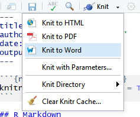
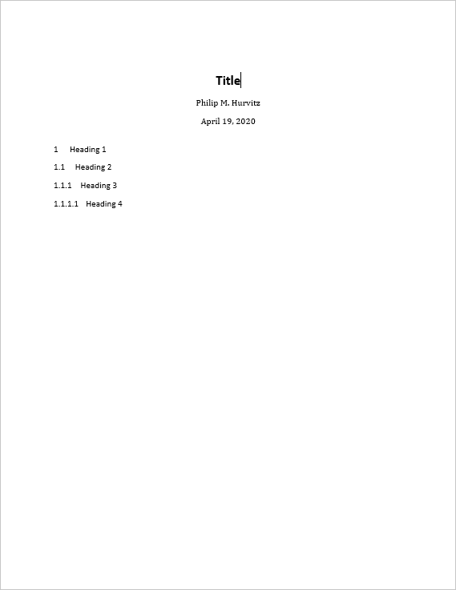

# Week 10 {#week10}


<h2>Topic: Odds and ends</h2>
This week's lesson will cover a additional R odds and ends.

## R Markdown to Microsoft Word
Microsoft Word ("Word"), is used widely to document research. Because of its advanced word processing and "track changes" capabilities, it is commonly used for preparation of manuscripts. Using R to generate output for Word is often a tedious process (e.g., create CSV files $\rightarrow$ paste the contents $\rightarrow$ convert to table; export R graphics with `png()` or `ggsave()` $\rightarrow$ insert the file).  

RMarkdown can be used to generate Word documents. This should be thought of as a one-way operation. That is to say, when a team works on a manuscript using Word, the typical work flow is that the lead author creates the first draft. Other authors make changes to the document using tracked changes. When the manuscript circulates over all authors, the lead author decides which changes to accept and which to reject, resulting in a new version. The process continues until the group of authors agrees that the manuscript is ready for publication.

Unfortunately there is no backwards path to take an existing Word docx and regenerate an Rmd (e.g., after you and your colleagues made a lot of changes to the Word docx). Nevertheless using this method could save you some "busy work" time in Word, as well as to provide a common stylistic template for your R outputs if you will be generating Word documents.

To export to a Word document, the following work flow should be followed:

1. Create a bare-bones Rmd file that contains all of the elements you want in your output, but little actual content.
1. Render the Rmd file to a Word docx file.
1. Open the docx file in Word and make any stylistic changes __using Word styles__ (see the workshop  [Microsoft Word for the Social Sciences](https://csde.washington.edu/workshop/microsoft-word-for-the-social-sciences/))
1. Use the style-edited docx file as a template in the Rmd file.
1. Write your complete Rmd file with the content you want to have placed in the Word docx file and then render. The output docx file will have the same stylistic configuration as the template docx.

A more detailed work flow:

To use Word output, first make a minimal RMarkdown document with Word output. 

 

Save the Rmd file and knit to to Word.

 

The output document will have the elements from the Rmd file.

 

The important part of this is that the Word document will have a number of styles. Make any changes to the styles or margins. This will become the template for the output containing the actual scientific content. ___Do not add, remove, or rename any styles in this document!___ Save a copy of the document with any stylistic changes. 

For example, here are some changes to the header styles:

 

Presumably, all of the styles in the output docx can be modified:


After you have made any changes, save the file as a "template":


In the YAML header of the Rmd file with your scientific content, this construction, in which you specify the path name to the template document.

```
output:
  word_document:  
    reference_docx: "template.docx"
```

When the Rmd file is rendered to a Word document, the stylistic changes will be applied to the output. For example, just changing the head matter of the previous document and re-rendering shows that the heading styles were applied as defined.


Although this overall functionality is somewhat limited, if you do have some Rmd code that generates some scientific content, and you want to output to a Word document with predefined formats, this will save you some busy work of reformatting.

## R Markdown output 
There are two different basic output formats available, document and presentation. As of this writing, the list of specific output types includes:

* `beamer_presentation`
* `context_document`
* `github_document`
* `html_document`
* `ioslides_presentation`
* `latex_document`
* `md_document`
* `odt_document`
* `pdf_document`
* `powerpoint_presentation`
* `rtf_document`
* `slidy_presentation`
* `word_document`

Various packages can also specify their own output types, e.g., `bookdown::html_document2` or `tufte::tufte_html.

### R Markdown rendering to specific formats
Rendering R Markdown files is done at the R console using the `rmarkdown::render()` function, e.g., 

```
rmarkdown::render(input = "input_filename.Rmd")
```

or by clicking the `Knit` control in RSTudio.

If the YAML header specifies multiple output formats, the first listed format will be used for the output if  other options are not specified in the `render()` function call. For example, for this header, the default output format is `bookdown::html_document2`

```
---
title: "A Document"
author: "Jane Doe"
date: "2021-01-23"
output: 
    bookdown::html_document2: default
    pdf_document: default
    html_document: default
    word_document: default
---
```

The RStudio interface will present the listed choices in the `Knit` pick list in the GUI, so the desired output format can be selected interactively:


Other supported outputs can be created, including those that are not listed in the YAML header by specifying the output format in the `render()` function, e.g. to create a [Slidy](https://www.w3.org/Talks/Tools/Slidy2/#(1)) presentation: 

```
rmarkdown::render(input = "input_filename.Rmd", output_format = "slidy_presentation")
```

To render a PDF file, use e.g., 

```
rmarkdown::render(input = "input_filename.Rmd", output_format = "pdf_document")
```

Using code rather than the RStudio GUI allows more flexible automation; you could have an R script that runs the `render()` function as part of a multi-step workflow. For example, if you had a continuous data collection process, the work flow could be coded and run with [cron](https://www.rdocumentation.org/packages/cronR) to generate a new PDF (or other file type) file on a daily basis.

### Testing `output_type()`
Because different output formats support (or do not support) different features, a test can be made for the output format to determine which code to run, using `is_html_output()` and `is_latex_output()`. Any R code within the Rmd file can be run or not run based on these tests. For a working example, download and render the file [output_type_test](files/output_type_test.Rmd). Using a single source, the [output rendered as HTML](files/output_type_test.html) appears as


whereas the [PDF output](files/output_type_test.pdf) is rendered as


There appears to be no similar test for MS Word output, so for creating Word documents from Rmd files, it is suggested to create the Rmd from scratch with the intention of creating only Word output.

## Advantages and disadvantages of PDF
Portable document format (PDF) has a number of advantages:

1. Document formatting is maintained. Font face and positioning of elements is consistent. When some other formats are shared (e.g., MS Word), formatting is inconsistent. 
1. The format is widely used and able to be created from a variety of different proprietary and open software applications.
1. Files are often parsimonious in size. When large images are embedded, the file sizes can grow, but there are often options for down-sampling images for smaller file size.
1. Files can be protected with passwords.
1. Files are supported across all operating systems (Windows, Mac, Linux, UNIX).
1. Multiple different elements can be included (text, images, tables).
1. The format has stood the test of time, having been introduced 1993. The standard was opened in 2008, allowing developers to create PDF outputs. This has led to PDF being the standard for fixed-format documents. 

The disadvantages:
1. Direct editing of PDF files is not straightforward (usually requires dedicated software), and often results in undesired layout changes. Therefore this is not a good format for collaborative editing.
1. Copy-and-paste from PDF often results in missing or extra spaces or strange characters.
1. R functions that produce HTML output cannot be used in PDF outputs.

## Bibliography in R Markdown
The `pandoc` engine that performs document conversion can generate bibliographies. See [Bibliographies and Citations](https://rmarkdown.rstudio.com/authoring_bibliographies_and_citations.html) for detailed information.

For this exercise, we will be using ${B\kern-0.1emi\kern-0.017emb}\kern-0.15em\TeX$ formatted references.

The YAML header needs to be formatted to include the bibliography file, which should either have a complete path name or be located in the same directory as the Rmd file. Similarly, any CSL (Citation Style Language) file should be specified. CSL files can be obtained from the [Zotero Style Repository
](https://www.zotero.org/styles)

The YAML header would include something of the form:

```
---
title: "My glorious, shiny dissertation"
output: 
    bookdown::html_document2
bibliography: myreferences_20200121.bib
csl: biomed-central.csl
---
```

When citations are made to references, the corresponding record will be automatically added to the end of the document.

For examples of syntax for both APA-like and AMA-like references and bibliographies, see the files 

* APA: [HTML](files/bibliography.html); [Rmd](files/bibliography.Rmd)
* AMA: [HTML](files/bibliography_ama.html); [Rmd](files/bibliography_ama.Rmd)

<hr>
Rendered at <tt>2022-02-18 14:26:27</tt>

<h4>Source code for this document</h4>
[10-week10.Rmd](10-week10.Rmd)


```r
cat(readLines(con = "10-week10.Rmd"), sep = "\n")
```

```
Warning in readLines(con = "10-week10.Rmd"): incomplete final line found on '10-
week10.Rmd'
```

````
# Week 10 {#week10}

```{r, echo=FALSE, warning=FALSE, message=FALSE}
library(tidyverse)
library(magrittr)
library(knitr)
library(kableExtra)
library(haven)
library(curl)
library(ggplot2)

# URL home
urlhome <- ""
```

<h2>Topic: Odds and ends</h2>
This week's lesson will cover a additional R odds and ends.

## R Markdown to Microsoft Word
Microsoft Word ("Word"), is used widely to document research. Because of its advanced word processing and "track changes" capabilities, it is commonly used for preparation of manuscripts. Using R to generate output for Word is often a tedious process (e.g., create CSV files $\rightarrow$ paste the contents $\rightarrow$ convert to table; export R graphics with `png()` or `ggsave()` $\rightarrow$ insert the file).  

RMarkdown can be used to generate Word documents. This should be thought of as a one-way operation. That is to say, when a team works on a manuscript using Word, the typical work flow is that the lead author creates the first draft. Other authors make changes to the document using tracked changes. When the manuscript circulates over all authors, the lead author decides which changes to accept and which to reject, resulting in a new version. The process continues until the group of authors agrees that the manuscript is ready for publication.

Unfortunately there is no backwards path to take an existing Word docx and regenerate an Rmd (e.g., after you and your colleagues made a lot of changes to the Word docx). Nevertheless using this method could save you some "busy work" time in Word, as well as to provide a common stylistic template for your R outputs if you will be generating Word documents.

To export to a Word document, the following work flow should be followed:

1. Create a bare-bones Rmd file that contains all of the elements you want in your output, but little actual content.
1. Render the Rmd file to a Word docx file.
1. Open the docx file in Word and make any stylistic changes __using Word styles__ (see the workshop  [Microsoft Word for the Social Sciences](https://csde.washington.edu/workshop/microsoft-word-for-the-social-sciences/))
1. Use the style-edited docx file as a template in the Rmd file.
1. Write your complete Rmd file with the content you want to have placed in the Word docx file and then render. The output docx file will have the same stylistic configuration as the template docx.

A more detailed work flow:

To use Word output, first make a minimal RMarkdown document with Word output. 

 

Save the Rmd file and knit to to Word.

 

The output document will have the elements from the Rmd file.

 

The important part of this is that the Word document will have a number of styles. Make any changes to the styles or margins. This will become the template for the output containing the actual scientific content. ___Do not add, remove, or rename any styles in this document!___ Save a copy of the document with any stylistic changes. 

For example, here are some changes to the header styles:

 

Presumably, all of the styles in the output docx can be modified:


After you have made any changes, save the file as a "template":


In the YAML header of the Rmd file with your scientific content, this construction, in which you specify the path name to the template document.

```
output:
  word_document:  
    reference_docx: "template.docx"
```

When the Rmd file is rendered to a Word document, the stylistic changes will be applied to the output. For example, just changing the head matter of the previous document and re-rendering shows that the heading styles were applied as defined.


Although this overall functionality is somewhat limited, if you do have some Rmd code that generates some scientific content, and you want to output to a Word document with predefined formats, this will save you some busy work of reformatting.

## R Markdown output 
There are two different basic output formats available, document and presentation. As of this writing, the list of specific output types includes:

* `beamer_presentation`
* `context_document`
* `github_document`
* `html_document`
* `ioslides_presentation`
* `latex_document`
* `md_document`
* `odt_document`
* `pdf_document`
* `powerpoint_presentation`
* `rtf_document`
* `slidy_presentation`
* `word_document`

Various packages can also specify their own output types, e.g., `bookdown::html_document2` or `tufte::tufte_html.

### R Markdown rendering to specific formats
Rendering R Markdown files is done at the R console using the `rmarkdown::render()` function, e.g., 

```
rmarkdown::render(input = "input_filename.Rmd")
```

or by clicking the `Knit` control in RSTudio.

If the YAML header specifies multiple output formats, the first listed format will be used for the output if  other options are not specified in the `render()` function call. For example, for this header, the default output format is `bookdown::html_document2`

```
---
title: "A Document"
author: "Jane Doe"
date: "2021-01-23"
output: 
    bookdown::html_document2: default
    pdf_document: default
    html_document: default
    word_document: default
---
```

The RStudio interface will present the listed choices in the `Knit` pick list in the GUI, so the desired output format can be selected interactively:


Other supported outputs can be created, including those that are not listed in the YAML header by specifying the output format in the `render()` function, e.g. to create a [Slidy](https://www.w3.org/Talks/Tools/Slidy2/#(1)) presentation: 

```
rmarkdown::render(input = "input_filename.Rmd", output_format = "slidy_presentation")
```

To render a PDF file, use e.g., 

```
rmarkdown::render(input = "input_filename.Rmd", output_format = "pdf_document")
```

Using code rather than the RStudio GUI allows more flexible automation; you could have an R script that runs the `render()` function as part of a multi-step workflow. For example, if you had a continuous data collection process, the work flow could be coded and run with [cron](https://www.rdocumentation.org/packages/cronR) to generate a new PDF (or other file type) file on a daily basis.

### Testing `output_type()`
Because different output formats support (or do not support) different features, a test can be made for the output format to determine which code to run, using `is_html_output()` and `is_latex_output()`. Any R code within the Rmd file can be run or not run based on these tests. For a working example, download and render the file [output_type_test](files/output_type_test.Rmd). Using a single source, the [output rendered as HTML](files/output_type_test.html) appears as


whereas the [PDF output](files/output_type_test.pdf) is rendered as


There appears to be no similar test for MS Word output, so for creating Word documents from Rmd files, it is suggested to create the Rmd from scratch with the intention of creating only Word output.

## Advantages and disadvantages of PDF
Portable document format (PDF) has a number of advantages:

1. Document formatting is maintained. Font face and positioning of elements is consistent. When some other formats are shared (e.g., MS Word), formatting is inconsistent. 
1. The format is widely used and able to be created from a variety of different proprietary and open software applications.
1. Files are often parsimonious in size. When large images are embedded, the file sizes can grow, but there are often options for down-sampling images for smaller file size.
1. Files can be protected with passwords.
1. Files are supported across all operating systems (Windows, Mac, Linux, UNIX).
1. Multiple different elements can be included (text, images, tables).
1. The format has stood the test of time, having been introduced 1993. The standard was opened in 2008, allowing developers to create PDF outputs. This has led to PDF being the standard for fixed-format documents. 

The disadvantages:
1. Direct editing of PDF files is not straightforward (usually requires dedicated software), and often results in undesired layout changes. Therefore this is not a good format for collaborative editing.
1. Copy-and-paste from PDF often results in missing or extra spaces or strange characters.
1. R functions that produce HTML output cannot be used in PDF outputs.

## Bibliography in R Markdown
The `pandoc` engine that performs document conversion can generate bibliographies. See [Bibliographies and Citations](https://rmarkdown.rstudio.com/authoring_bibliographies_and_citations.html) for detailed information.

For this exercise, we will be using ${B\kern-0.1emi\kern-0.017emb}\kern-0.15em\TeX$ formatted references.

The YAML header needs to be formatted to include the bibliography file, which should either have a complete path name or be located in the same directory as the Rmd file. Similarly, any CSL (Citation Style Language) file should be specified. CSL files can be obtained from the [Zotero Style Repository
](https://www.zotero.org/styles)

The YAML header would include something of the form:

```
---
title: "My glorious, shiny dissertation"
output: 
    bookdown::html_document2
bibliography: myreferences_20200121.bib
csl: biomed-central.csl
---
```

When citations are made to references, the corresponding record will be automatically added to the end of the document.

For examples of syntax for both APA-like and AMA-like references and bibliographies, see the files 

* APA: [HTML](files/bibliography.html); [Rmd](files/bibliography.Rmd)
* AMA: [HTML](files/bibliography_ama.html); [Rmd](files/bibliography_ama.Rmd)

<hr>
Rendered at <tt>`r Sys.time()`</tt>

<h4>Source code for this document</h4>
[10-week10.Rmd](10-week10.Rmd)

```{r comment=''}
cat(readLines(con = "10-week10.Rmd"), sep = "\n")
```
````
